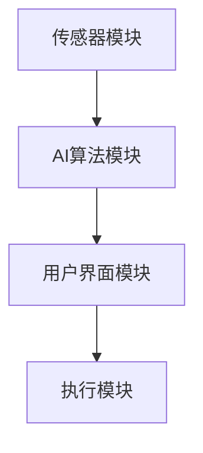
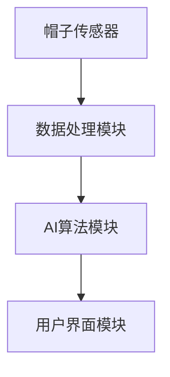
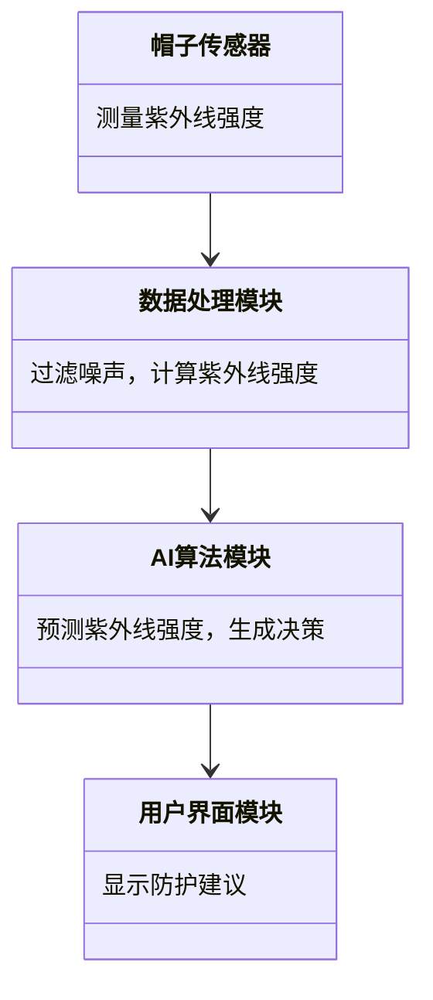

                 


# AI Agent在智能帽子中的紫外线防护

## 关键词：AI Agent, 紫外线防护, 智能帽子, 传感器, 算法, 数学模型

## 摘要：  
随着紫外线辐射对人类健康的威胁日益增加，智能帽子作为一种创新的可穿戴设备，逐渐成为人们日常防护的重要工具。本文将详细探讨AI Agent在智能帽子中的应用，特别是在紫外线防护方面的技术实现与优化。通过分析AI Agent的核心原理、系统架构、算法实现以及实际案例，本文旨在为读者提供一个全面的技术视角，展示如何利用人工智能技术提升紫外线防护的效率与准确性。

---

# 第一部分: 背景介绍

## 第1章: 紫外线的危害与防护需求

### 1.1 紫外线的种类与危害  
紫外线主要分为UVA、UVB和UVC三种类型，其中UVB是导致皮肤癌的主要原因，而UVA则会导致皮肤老化。长期暴露在高强度紫外线辐射下，会对人体的皮肤、眼睛和免疫系统造成严重伤害。

### 1.2 智能帽子的发展现状  
智能帽子作为一种新兴的可穿戴设备，集成了多种传感器和智能算法，能够实时监测环境中的紫外线强度，并通过AI Agent提供相应的防护建议。

### 1.3 AI Agent在紫外线防护中的应用背景  
AI Agent（人工智能代理）是一种能够感知环境、自主决策并执行任务的智能系统。在紫外线防护中，AI Agent可以通过实时监测紫外线强度，动态调整帽子的防护功能，为用户提供智能化的防护服务。

---

## 第2章: 问题背景与目标

### 2.1 紫外线防护的核心问题  
如何实时监测紫外线强度，并根据环境变化动态调整防护策略，是紫外线防护的核心挑战。

### 2.2 AI Agent在智能帽子中的定位与作用  
AI Agent作为智能帽子的核心模块，负责数据采集、分析和决策，确保紫外线防护的智能化和精准化。

### 2.3 问题解决的目标与边界  
目标：实现基于AI的智能帽子紫外线防护系统，实时监测并动态调整防护策略。边界：仅关注紫外线防护，不涉及其他功能（如温度调节、降噪等）。

---

## 第3章: 核心概念与系统架构

### 3.1 AI Agent的基本原理  
AI Agent通过传感器采集环境数据，利用算法分析数据并生成决策，最终通过执行模块实现防护功能。

### 3.2 紫外线防护的数学模型  
紫外线防护的核心在于计算辐射强度和防护系数。公式如下：  
$$ P = \frac{I_{\text{original}} - I_{\text{protected}}}{I_{\text{original}}} $$  
其中，$P$ 是防护系数，$I_{\text{original}}$ 是原始辐射强度，$I_{\text{protected}}$ 是防护后的辐射强度。

### 3.3 系统架构设计  
智能帽子的系统架构包括传感器模块、AI算法模块和用户界面模块。通过Mermaid图展示系统架构：  


---

# 第二部分: 核心概念与系统架构

## 第4章: AI Agent的核心原理

### 4.1 数据采集与预处理  
传感器采集紫外线强度、环境光照等数据，并通过滤波算法去除噪声，确保数据的准确性。

### 4.2 数据分析与紫外线强度预测  
利用机器学习算法（如支持向量机、随机森林）对历史数据进行训练，预测未来的紫外线强度。

### 4.3 AI算法的决策机制  
AI Agent根据预测的紫外线强度，动态调整帽子的防护功能，如调节遮光度、提醒用户涂抹防晒霜等。

---

## 第5章: 紫外线防护的数学模型

### 5.1 紫外线强度计算公式  
$$ I = I_0 \times e^{-\lambda t} $$  
其中，$I$ 是当前紫外线强度，$I_0$ 是初始强度，$\lambda$ 是衰减系数，$t$ 是时间。

### 5.2 防护系数的计算  
通过公式 $P = \frac{I_{\text{original}} - I_{\text{protected}}}{I_{\text{original}}}$，计算帽子的防护系数，确保防护效果达到标准。

---

## 第6章: 系统架构设计

### 6.1 系统功能模块划分  
智能帽子的系统功能模块包括：传感器模块、数据处理模块、AI算法模块和用户界面模块。

### 6.2 系统架构的Mermaid图  


---

# 第三部分: 算法原理与实现

## 第7章: AI Agent算法实现

### 7.1 数据采集与预处理  
传感器采集紫外线强度数据，并通过滤波算法（如中位数滤波）去除噪声。

### 7.2 数据分析与紫外线强度预测  
利用支持向量机（SVM）算法对历史数据进行训练，预测未来的紫外线强度。

### 7.3 AI算法的决策机制  
AI Agent根据预测的紫外线强度，动态调整帽子的防护功能，如调节遮光度、提醒用户涂抹防晒霜等。

---

## 第8章: 数学模型与公式

### 8.1 紫外线强度计算公式  
$$ I = I_0 \times e^{-\lambda t} $$  
其中，$I$ 是当前紫外线强度，$I_0$ 是初始强度，$\lambda$ 是衰减系数，$t$ 是时间。

### 8.2 防护系数的计算  
通过公式 $P = \frac{I_{\text{original}} - I_{\text{protected}}}{I_{\text{original}}}$，计算帽子的防护系数，确保防护效果达到标准。

---

## 第9章: 系统分析与架构设计方案

### 9.1 问题场景介绍  
智能帽子需要实时监测紫外线强度，并根据环境变化动态调整防护策略。

### 9.2 系统功能设计  
通过Mermaid类图展示系统的功能模块：  


---

## 第10章: 项目实战

### 10.1 环境安装  
安装必要的Python库和工具：  
```bash
pip install numpy pandas scikit-learn
```

### 10.2 系统核心实现源代码  
以下是AI算法的核心代码：  
```python
import numpy as np
from sklearn import svm

# 数据预处理
data = np.array([[10, 20], [30, 40], [50, 60]])
target = np.array([0, 1, 0])

# 训练模型
model = svm.SVC()
model.fit(data, target)

# 预测紫外线强度
new_data = np.array([[25, 35]])
print(model.predict(new_data))
```

### 10.3 代码应用解读与分析  
上述代码通过SVM算法训练紫外线强度预测模型，并对新的数据进行预测。

---

## 第11章: 最佳实践

### 11.1 小结  
AI Agent在智能帽子中的紫外线防护应用，通过实时监测和动态调整，显著提升了防护效果。

### 11.2 注意事项  
确保传感器的准确性和算法的实时性，避免因数据延迟导致防护不足。

### 11.3 拓展阅读  
推荐阅读《机器学习实战》和《人工智能导论》等相关书籍。

---

通过以上内容，您可以全面了解AI Agent在智能帽子中的紫外线防护技术，并将其应用于实际项目中。

