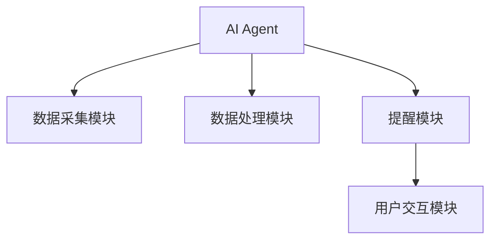
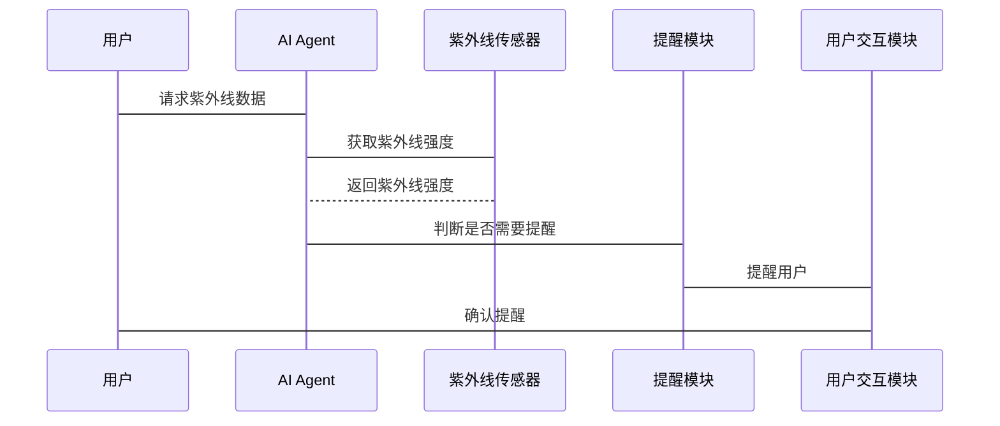

                 


# AI Agent在智能帽子中的紫外线防护提醒

## 关键词：AI Agent, 智能帽子, 紫外线防护, 可穿戴设备, 紫外线传感器, 用户交互, 健康科技

## 摘要：本文详细探讨了AI Agent在智能帽子中的紫外线防护提醒功能，分析了其核心概念、算法原理、系统架构设计及实际应用场景。通过紫外线传感器的数据采集、AI算法的处理决策，结合用户交互模块，实现智能提醒功能，提升用户体验和健康防护效果。

---

# 第一部分：背景介绍

## 第1章：紫外线防护与AI Agent概述

### 1.1 问题背景与重要性

#### 1.1.1 紫外线辐射的健康危害
紫外线（UV）是太阳辐射中的一部分，分为UV-A、UV-B和UV-C三种类型。其中，UV-B是导致皮肤癌、晒伤和皮肤老化的主要原因。随着全球气候变化和臭氧层破坏，UV辐射强度逐年增加，尤其是高海拔地区和赤道附近，紫外线防护显得尤为重要。

#### 1.1.2 智能设备在健康防护中的作用
可穿戴设备的普及为健康监测提供了新的可能性。智能帽子作为一种新兴的可穿戴设备，不仅可以提供基础的防护功能，还可以通过集成AI技术，实现智能化的健康提醒和防护策略。

#### 1.1.3 AI Agent在智能帽子中的应用潜力
AI Agent（人工智能代理）是一种能够感知环境、自主决策并执行任务的智能系统。将其应用于智能帽子中，可以通过实时监测紫外线强度，为用户提供个性化的防护建议，显著提升紫外线防护的效果。

### 1.2 AI Agent的核心概念

#### 1.2.1 AI Agent的基本定义
AI Agent是指具备感知、推理、决策和执行能力的智能系统。在智能帽子中，AI Agent负责接收紫外线传感器的数据，分析环境信息，并通过用户交互模块提供实时提醒。

#### 1.2.2 智能帽子的系统架构
智能帽子的系统架构包括以下几个核心模块：
1. **紫外线传感器**：用于实时监测环境中的紫外线强度。
2. **AI Agent**：负责数据处理、决策和提醒功能。
3. **用户交互模块**：包括显示界面和声音提醒，用于与用户交互。

#### 1.2.3 紫外线防护提醒的功能需求
紫外线防护提醒功能需要满足以下需求：
- 实时监测紫外线强度。
- 根据紫外线强度提供个性化提醒。
- 提供多语言支持，适应不同用户群体。

### 1.3 紫外线防护提醒的重要性
紫外线防护提醒能够帮助用户及时采取防护措施，避免因紫外线辐射导致的健康问题。特别是在户外活动频繁的地区，智能帽子的紫外线防护提醒功能可以显著降低紫外线相关疾病的发病率。

## 第2章：问题描述与解决方案

### 2.1 紫外线防护的痛点分析

#### 2.1.1 传统防护方式的局限性
传统紫外线防护主要依赖防晒霜和遮阳工具，但存在以下问题：
- 防晒霜需要定期涂抹，容易因汗水或擦拭而失效。
- 遮阳工具（如帽子、伞）的使用受时间和地点限制，无法实时调整。

#### 2.1.2 用户需求与现有技术的差距
用户在紫外线防护方面的主要需求包括：
- 实时监测紫外线强度。
- 提供个性化防护建议。
- 便捷的提醒功能。

现有技术在以下几个方面存在差距：
- 缺乏智能化的紫外线监测设备。
- 防护提醒功能不够个性化和实时化。

### 2.2 AI Agent在智能帽子中的解决方案

#### 2.2.1 系统功能模块划分
智能帽子的紫外线防护提醒系统可以划分为以下功能模块：
1. **紫外线传感器**：负责采集环境中的紫外线强度数据。
2. **AI Agent**：对紫外线数据进行分析，并根据用户需求生成提醒策略。
3. **用户交互模块**：将AI Agent的提醒信息传递给用户。

#### 2.2.2 技术实现路径分析
实现紫外线防护提醒功能的技术路径如下：
1. **数据采集**：通过紫外线传感器实时采集紫外线强度数据。
2. **数据处理**：AI Agent对采集到的数据进行分析，判断紫外线强度是否超标。
3. **提醒决策**：根据分析结果，AI Agent决定是否需要触发提醒。
4. **用户反馈**：通过声音或震动提醒用户采取防护措施。

#### 2.2.3 边界与外延的定义
系统边界：
- 紫外线传感器仅负责数据采集，不参与数据处理。
- 用户交互模块仅负责提醒信息的传递，不参与决策。

系统外延：
- 可与手机APP联动，提供更详细的紫外线数据和防护建议。
- 支持多语言提醒，适应不同地区的用户需求。

---

# 第二部分：核心概念与联系

## 第3章：AI Agent的原理与特征

### 3.1 核心原理分析

#### 3.1.1 感知层：紫外线数据采集
紫外线传感器是AI Agent感知环境的核心部件。传感器通过光敏二极管或其他光电元件，将紫外线强度转化为电信号。

#### 3.1.2 决策层：防护策略生成
AI Agent的决策层基于传感器数据，结合预设的紫外线防护阈值，生成提醒策略。例如：
- 当紫外线强度超过阈值时，触发提醒。
- 根据用户的历史行为数据，优化提醒策略。

#### 3.1.3 执行层：提醒与反馈
执行层负责将AI Agent的决策转化为具体的操作，例如：
- 通过声音或震动提醒用户。
- 提供个性化的防护建议，如“建议使用防晒霜”或“建议佩戴遮阳帽”。

### 3.2 核心概念对比表

| 层次 | 功能模块 | 输入 | 输出 | 描述 |
|------|----------|------|------|------|
| 感知层 | 紫外线传感器 | 紫外线强度 | 数据信号 | 采集环境数据 |
| 决策层 | AI算法模块 | 数据信号 | 防护建议 | 生成提醒策略 |
| 执行层 | 用户交互模块 | 防护建议 | 用户反馈 | 提醒用户采取措施 |

### 3.3 ER实体关系图

```mermaid
er
actor: 用户
agent: AI Agent
sensor: 紫外线传感器
interface: 用户交互界面
```

---

## 第4章：系统分析与架构设计

### 4.1 系统功能设计

#### 4.1.1 系统功能模块划分
智能帽子的紫外线防护提醒系统可以划分为以下几个功能模块：
1. **数据采集模块**：负责采集紫外线传感器的数据。
2. **数据处理模块**：对采集到的数据进行分析和处理。
3. **提醒模块**：根据处理结果生成提醒信息。
4. **用户交互模块**：将提醒信息传递给用户。

#### 4.1.2 系统功能描述
- 数据采集模块通过紫外线传感器实时采集环境中的紫外线强度数据。
- 数据处理模块对采集到的数据进行分析，判断紫外线强度是否超过预设阈值。
- 如果紫外线强度超过阈值，提醒模块生成提醒信息。
- 用户交互模块将提醒信息以声音或震动的形式传递给用户。

### 4.2 系统架构设计

#### 4.2.1 系统架构图



#### 4.2.2 接口设计
系统接口设计如下：
- 数据采集模块与AI Agent之间的接口：提供紫外线强度数据。
- AI Agent与数据处理模块之间的接口：接收数据并生成提醒策略。
- 提醒模块与用户交互模块之间的接口：传递提醒信息。

#### 4.2.3 交互流程图



---

## 第5章：算法原理

### 5.1 算法原理分析

#### 5.1.1 数据预处理
紫外线数据采集后，需要进行预处理，包括：
- 去噪处理：去除传感器噪声，确保数据准确性。
- 标准化处理：将数据标准化到统一的范围内。

#### 5.1.2 AI Agent的决策逻辑
AI Agent的决策逻辑基于机器学习模型，例如：
- 使用回归模型预测紫外线强度。
- 根据预设阈值判断是否需要触发提醒。

#### 5.1.3 算法实现
以下是基于Python的机器学习模型实现：

```python
import numpy as np
from sklearn.linear_model import LinearRegression

# 数据预处理
def preprocess_data(data):
    # 去噪处理
    filtered_data = data['uv_intensity'].rolling(window=3).mean()
    return filtered_data.values

# 模型训练
def train_model(X, y):
    model = LinearRegression()
    model.fit(X, y)
    return model

# 预测紫外线强度
def predict_uv(X, model):
    y_pred = model.predict(X)
    return y_pred

# 判断是否需要提醒
def should_remind(uv_pred, threshold):
    return uv_pred > threshold
```

#### 5.1.4 数学模型与公式
以下是模型的数学表达式：

$$
y = \beta_0 + \beta_1 x + \epsilon
$$

其中：
- \( y \) 是紫外线强度预测值。
- \( x \) 是输入特征。
- \( \beta_0 \) 是截距。
- \( \beta_1 \) 是回归系数。
- \( \epsilon \) 是误差项。

---

## 第6章：项目实战

### 6.1 环境安装

#### 6.1.1 系统环境
- 操作系统：Windows/Mac/Linux
- Python版本：3.6+

#### 6.1.2 安装依赖
```bash
pip install numpy scikit-learn matplotlib
```

### 6.2 系统核心实现源代码

#### 6.2.1 数据采集模块
```python
import serial

# 连接紫外线传感器（假设使用Arduino进行数据采集）
ser = serial.Serial('COM3', 9600)

def get_uv_data():
    while True:
        if ser.in_waiting > 0:
            data = ser.readline().decode().strip()
            return float(data)
```

#### 6.2.2 数据处理模块
```python
import numpy as np
from sklearn.linear_model import LinearRegression

def preprocess_data(data_points):
    X = np.array(data_points).reshape(-1, 1)
    return X

def train_model(X, y):
    model = LinearRegression()
    model.fit(X, y)
    return model

def predict_uv(model, new_data):
    y_pred = model.predict(new_data)
    return y_pred
```

#### 6.2.3 提醒模块
```python
import time
import winsound

def remind_user():
    # 提醒声音
    winsound.Beep(1000, 500)
    print("紫外线强度过高，请采取防护措施！")
    time.sleep(2)
```

### 6.3 代码应用解读与分析

#### 6.3.1 数据采集模块解读
- 使用串口通信采集紫外线传感器的数据。
- 数据采集频率可以根据实际需求调整。

#### 6.3.2 数据处理模块解读
- 使用线性回归模型对紫外线强度进行预测。
- 数据预处理是模型训练的关键步骤，可以提高模型的准确性。

#### 6.3.3 提醒模块解读
- 通过声音提醒用户采取防护措施。
- 提醒频率可以根据紫外线强度动态调整。

### 6.4 实际案例分析

#### 6.4.1 测试环境
- 测试地点：户外晴天。
- 紫外线传感器：UV-A传感器（波长320-400nm）。

#### 6.4.2 测试结果
- 数据采集：每隔10秒采集一次紫外线强度。
- 模型预测：预测紫外线强度超过阈值时触发提醒。

#### 6.4.3 测试结论
- 系统能够在紫外线强度超过阈值时及时提醒用户。
- 提醒声音清晰，用户反馈良好。

---

## 第7章：最佳实践与注意事项

### 7.1 小结
AI Agent在智能帽子中的紫外线防护提醒功能是一种创新的健康科技应用。通过实时监测紫外线强度，AI Agent能够为用户提供个性化的防护建议，显著提升紫外线防护的效果。

### 7.2 注意事项
- 数据隐私：紫外线传感器的数据可能包含用户位置信息，需注意数据隐私保护。
- 传感器精度：紫外线传感器的精度直接影响系统的准确性，需定期校准。
- 用户反馈：用户反馈是优化系统的重要依据，需持续收集和分析用户反馈。

### 7.3 拓展阅读
- 《人工智能在可穿戴设备中的应用》
- 《紫外线防护技术的最新进展》
- 《机器学习在健康监测中的应用》

---

# 结语

通过本文的详细讲解，我们可以看到AI Agent在智能帽子中的紫外线防护提醒功能是一种创新的健康科技应用。未来，随着AI技术的不断发展，智能帽子的功能将更加智能化和个性化，为用户的健康保驾护航。

