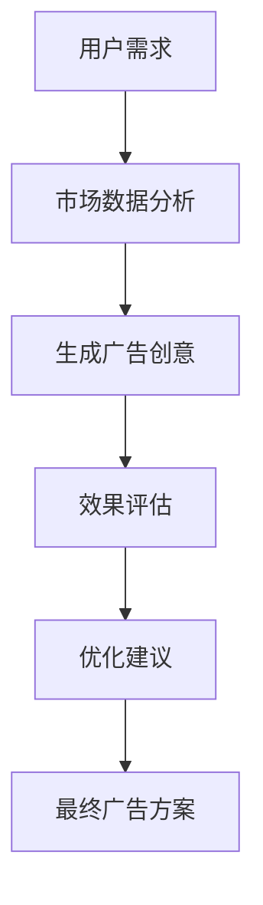
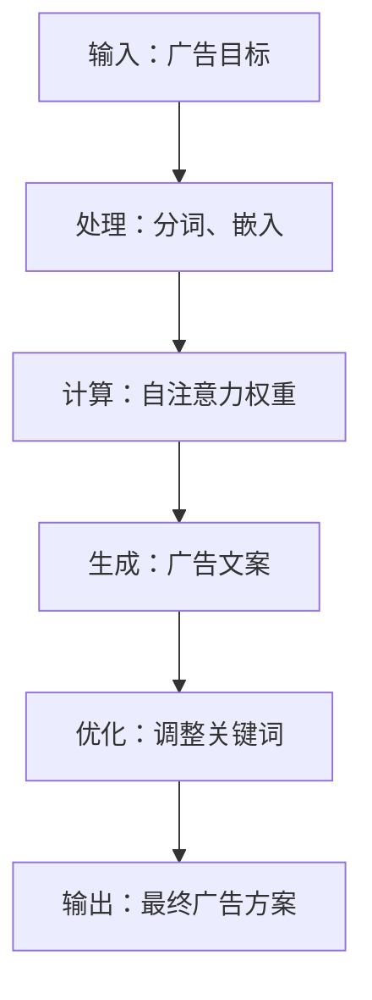
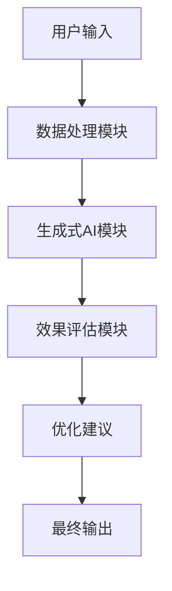
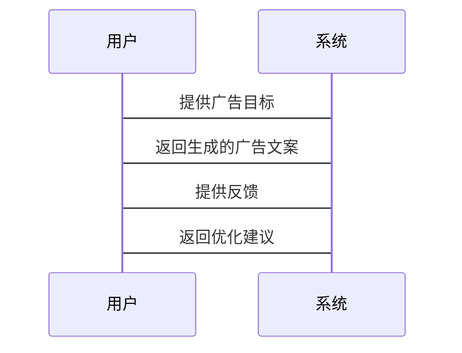

                 


# AI Agent在智能广告创意中的应用

## 关键词：AI Agent，智能广告，广告创意，生成式AI，自然语言处理

## 摘要：AI Agent通过自然语言处理和生成式AI技术，能够自动生成和优化广告创意内容，提高广告效率和效果。本文详细探讨了AI Agent在广告创意中的应用，从背景介绍、核心概念、算法原理到系统设计和项目实战，全面分析了其在智能广告领域的潜力和实际应用。

---

# 《AI Agent在智能广告创意中的应用》

## 第一部分：背景介绍

### 第1章：AI Agent与广告创意的结合

#### 1.1 AI Agent的基本概念

- **1.1.1 AI Agent的定义**  
  AI Agent（人工智能代理）是一种能够感知环境、执行任务并做出决策的智能系统。它通过算法和数据处理，模拟人类的思考和行动过程。

- **1.1.2 AI Agent的核心特征**  
  - 智能性：能够理解输入的信息并生成有意义的输出。  
  - 自适应性：根据环境变化调整行为。  
  - 学习能力：通过数据和反馈不断优化性能。  

- **1.1.3 AI Agent与传统广告的区别**  
  传统广告依赖人工创意，而AI Agent能够自动化生成和优化广告内容，提高效率和精准度。

#### 1.2 广告创意的基本概念

- **1.2.1 广告创意的定义**  
  广告创意是通过文字、图像、视频等形式传递产品或服务的核心信息，吸引目标受众注意并促使其采取行动。

- **1.2.2 广告创意的生成过程**  
  通常包括需求分析、创意构思、素材制作和效果评估等阶段。

- **1.2.3 广告创意的核心要素**  
  - 目标受众：广告针对的用户群体。  
  - 品牌信息：产品或服务的核心卖点。  
  - 创意形式：文字、图片、视频等表现形式。  

#### 1.3 AI Agent与广告创意的结合

- **1.3.1 AI Agent在广告创意中的应用**  
  AI Agent能够分析用户需求，生成符合品牌调性的广告文案，并优化广告素材，以提高点击率和转化率。

- **1.3.2 AI Agent的优势**  
  - 高效性：快速生成大量创意内容。  
  - 精准性：基于数据分析，优化广告效果。  
  - 可扩展性：适用于多种广告形式和场景。  

---

## 第二部分：核心概念与联系

### 第2章：AI Agent的核心原理

#### 2.1 AI Agent的原理

- **感知与理解**：AI Agent通过自然语言处理技术（NLP）分析用户需求和市场趋势。  
- **决策与生成**：基于生成式AI（Generative AI）技术，生成广告创意内容。  
- **优化与反馈**：通过机器学习模型不断优化生成的广告内容，提升效果。

#### 2.2 广告创意生成机制

- **输入分析**：AI Agent接收广告目标、品牌信息和受众特征等输入。  
- **内容生成**：利用生成式AI生成多个广告创意方案。  
- **效果评估**：通过A/B测试评估不同创意的效果，选择最优方案。  

#### 2.3 AI Agent与广告创意的关系

| 属性       | AI Agent                     | 广告创意                     |
|------------|------------------------------|------------------------------|
| 输入       | 用户需求、市场数据           | 创意灵感、品牌信息           |
| 输出       | 自动生成广告文案、优化建议   | 手工创作的广告内容           |
| 优化       | 基于数据反馈持续改进         | 需要人工调整和优化           |

#### 2.4 AI Agent在广告创意中的流程图



---

## 第三部分：算法原理讲解

### 第3章：生成式AI的算法原理

#### 3.1 生成式AI的算法概述

生成式AI主要基于Transformer模型，通过自注意力机制（Self-attention）捕捉输入数据中的语义信息，并生成连贯的文字内容。

#### 3.2 Transformer模型的结构

- **自注意力机制**：计算输入序列中每个词与其他词的相关性，生成注意力权重。  
  $$ \text{Attention}(Q, K, V) = \text{softmax}\left(\frac{QK^T}{\sqrt{d_k}}\right)V $$  
  其中，\( Q \)、\( K \)、\( V \)分别为查询、键、值向量。

- **前馈网络**：对每个位置的特征进行非线性变换，输出最终的生成结果。

#### 3.3 广告创意生成的算法流程



#### 3.4 代码实现示例

```python
import torch
import torch.nn as nn

class Transformer(nn.Module):
    def __init__(self, d_model, nhead, d_hid, dropout):
        super().__init__()
        self.encoder = nn.Embedding(d_model, d_model)
        self.transformer = nn.Transformer(d_model=d_model, nhead=nhead, d_hid=d_hid, dropout=dropout)
        self.decoder = nn.Linear(d_model, d_model)
        self.output = nn.Linear(d_model, 1)  # 生成广告文案

    def forward(self, x):
        x = self.encoder(x)
        x = self.transformer(x)
        x = self.decoder(x)
        x = self.output(x)
        return x

# 示例输入
input_seq = torch.tensor([[1, 2, 3, 4]], dtype=torch.long)
model = Transformer(d_model=512, nhead=8, d_hid=1024, dropout=0.1)
output = model(input_seq)
print(output)
```

---

## 第四部分：数学公式推导

### 第4章：生成式AI的数学模型

#### 4.1 自注意力机制的数学推导

- **查询（Query）**：Q矩阵，形状为 \( (N, d_k) \)。  
- **键（Key）**：K矩阵，形状为 \( (N, d_k) \)。  
- **值（Value）**：V矩阵，形状为 \( (N, d_v) \)。  

注意力权重计算公式：

$$
\text{Attention}(Q, K, V) = \text{softmax}\left(\frac{QK^T}{\sqrt{d_k}}\right)V
$$

其中，\( \text{softmax} \) 是归一化指数函数，确保权重之和为1。

#### 4.2 生成式AI的损失函数

交叉熵损失函数用于训练生成式AI模型：

$$
\mathcal{L} = -\sum_{i=1}^{N} \sum_{j=1}^{M} y_{ij} \log(p_{ij})
$$

其中，\( y_{ij} \) 是真实标签，\( p_{ij} \) 是模型生成的概率。

---

## 第五部分：系统分析与架构设计方案

### 第5章：智能广告创意生成系统设计

#### 5.1 项目介绍

智能广告创意生成系统基于AI Agent技术，旨在通过自动化生成和优化广告内容，提升广告投放效果。

#### 5.2 系统功能设计

- **用户输入**：广告目标、品牌信息、受众特征。  
- **数据处理**：对输入数据进行清洗和特征提取。  
- **广告生成**：利用生成式AI生成广告文案。  
- **效果评估**：通过A/B测试评估广告效果。  
- **优化建议**：基于测试结果优化广告内容。  

#### 5.3 系统架构设计



#### 5.4 接口设计

- **输入接口**：接收广告目标和品牌信息。  
- **输出接口**：输出生成的广告文案和优化建议。  

#### 5.5 交互设计



---

## 第六部分：项目实战

### 第6章：AI Agent广告创意生成系统实现

#### 6.1 环境安装

- Python 3.8+
- PyTorch
- Transformers库

#### 6.2 核心代码实现

```python
from transformers import AutoTokenizer, AutoModelForCausalLM

model_name = 'gpt2'
tokenizer = AutoTokenizer.from_pretrained(model_name)
model = AutoModelForCausalLM.from_pretrained(model_name)

def generate_advertisement(prompt):
    inputs = tokenizer.encode(prompt, return_tensors='pt')
    outputs = model.generate(inputs, max_length=50, do_sample=True)
    return tokenizer.decode(outputs[0], skip_special_tokens=True)

# 示例
prompt = "Generate an ad for a new smartphone with target audience: young adults."
print(generate_advertisement(prompt))
```

#### 6.3 案例分析

输入：生成适合年轻用户的智能手机广告。  
输出：  
"Discover the latest smartphone designed for young adults. Capture every moment with stunning cameras and powerful performance.upgrade your lifestyle today!"

#### 6.4 项目小结

通过代码实现，展示了AI Agent在广告创意生成中的强大能力。实际应用中，可进一步优化模型和提升生成效果。

---

## 第七部分：总结与展望

### 第7章：总结与注意事项

#### 7.1 总结

AI Agent通过自然语言处理和生成式AI技术，能够高效生成和优化广告创意内容，显著提升广告效率和效果。

#### 7.2 小结

本文详细探讨了AI Agent在智能广告创意中的应用，从背景介绍到系统设计，全面分析了其在广告领域的潜力和实际应用。

#### 7.3 注意事项

- 数据隐私：确保用户数据的安全性。  
- 模型优化：持续改进生成模型，提高创意质量。  
- 人机协同：结合人工审核，确保广告内容的合规性。  

#### 7.4 拓展阅读

- 《生成式AI：原理与应用》  
- 《自然语言处理在广告中的应用》  
- 《智能广告系统设计与实现》  

---

通过以上步骤，我们系统地探讨了AI Agent在智能广告创意中的应用，从理论到实践，全面解析了其在广告领域的潜力和价值。希望本文能够为读者提供深入的见解和实际指导。

