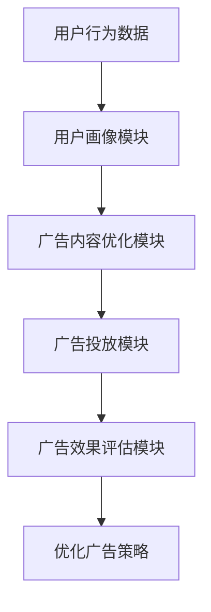
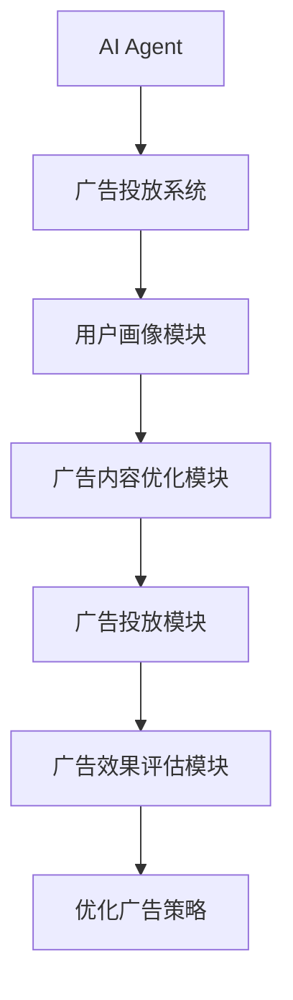

                 


# AI Agent在智能广告投放中的应用

> 关键词：AI Agent, 智能广告投放, 强化学习, 广告系统架构, 项目实战

> 摘要：本文详细探讨了AI Agent在智能广告投放中的应用，从基本概念到核心算法，再到系统架构和项目实战，全面分析了AI Agent在广告投放中的作用和实现方式。通过理论与实践相结合，本文为读者提供了深入了解AI Agent在智能广告投放中的应用的完整视角。

---

# 第1章: AI Agent与智能广告投放概述

## 1.1 AI Agent的基本概念

### 1.1.1 AI Agent的定义与特征

AI Agent（人工智能代理）是一种能够感知环境、自主决策并执行任务的智能体。其核心特征包括：

- **自主性**：能够在没有外部干预的情况下自主运行。
- **反应性**：能够根据环境变化实时调整行为。
- **学习能力**：通过数据和反馈不断优化自身的决策能力。
- **目标导向性**：具备明确的目标，并通过行动实现目标。

| AI Agent的特征 | 描述 |
|----------------|------|
| 自主性 | 能够独立运行，无需外部干预 |
| 反应性 | 能够实时感知环境并做出反应 |
| 学习能力 | 通过数据和反馈不断优化决策 |
| 目标导向性 | 具备明确的目标，并通过行动实现目标 |

### 1.1.2 AI Agent的核心要素

AI Agent的核心要素包括感知、推理、决策和执行四个部分：

1. **感知**：通过传感器或数据源获取环境信息。
2. **推理**：对感知到的信息进行分析和处理，形成对环境的理解。
3. **决策**：基于推理结果制定行动计划。
4. **执行**：将决策结果转化为具体行动。

### 1.1.3 AI Agent与传统广告投放的区别

传统广告投放主要依赖人工经验和规则引擎，而AI Agent能够通过数据驱动的方式，实时优化广告投放策略。AI Agent的核心优势在于其自主性和学习能力，能够根据实时数据动态调整广告投放策略。

---

## 1.2 智能广告投放的背景与需求

### 1.2.1 数字广告投放的发展历程

数字广告投放经历了以下几个阶段：

1. **传统广告投放**：基于人工经验和规则引擎，广告投放策略相对固定。
2. **程序化广告投放**：通过技术手段实现广告的自动化购买和分发。
3. **智能广告投放**：基于AI技术，实现广告投放的智能化和自动化。

### 1.2.2 智能广告投放的核心需求

智能广告投放的核心需求包括：

- **精准投放**：基于用户画像和行为数据，精准选择广告投放的目标受众。
- **实时优化**：根据实时数据动态调整广告投放策略。
- **成本控制**：在保证投放效果的前提下，降低广告投放成本。
- **效果预测**：基于历史数据和模型预测广告投放效果。

### 1.2.3 AI Agent在广告投放中的应用价值

AI Agent在广告投放中的应用价值主要体现在以下几个方面：

1. **提高投放效率**：通过自动化决策和执行，大幅提高广告投放效率。
2. **优化投放效果**：基于实时数据和模型优化广告投放策略，提高广告点击率和转化率。
3. **降低投放成本**：通过精准投放和实时优化，降低广告投放成本。

---

## 1.3 本章小结

本章主要介绍了AI Agent的基本概念及其在智能广告投放中的应用背景。通过对比传统广告投放和智能广告投放，强调了AI Agent在广告投放中的重要性和应用价值。接下来的章节将深入探讨AI Agent的核心概念、算法原理、系统架构以及项目实战。

---

# 第2章: AI Agent的核心概念与原理

## 2.1 AI Agent的核心概念

### 2.1.1 AI Agent的类型与分类

AI Agent可以根据不同的标准进行分类：

1. **按智能水平分类**：
   - **反应式AI Agent**：基于当前环境信息做出反应，不依赖历史数据。
   - **认知式AI Agent**：具备复杂推理和决策能力，能够处理复杂问题。

2. **按应用场景分类**：
   - **服务型AI Agent**：主要用于提供信息服务，如智能客服。
   - **决策型AI Agent**：主要用于复杂决策任务，如智能广告投放。

### 2.1.2 AI Agent的行为模式

AI Agent的行为模式主要分为以下几种：

1. **目标驱动型**：基于明确的目标制定行动计划。
2. **反应驱动型**：基于实时环境信息做出反应。
3. **学习驱动型**：通过学习和优化提升决策能力。

### 2.1.3 AI Agent的决策机制

AI Agent的决策机制通常包括以下几个步骤：

1. **感知环境**：通过传感器或数据源获取环境信息。
2. **分析信息**：对感知到的信息进行分析和处理。
3. **制定决策**：基于分析结果制定行动计划。
4. **执行决策**：将决策结果转化为具体行动。

---

## 2.2 AI Agent的原理与算法

### 2.2.1 AI Agent的感知与推理

AI Agent的感知与推理过程可以分为以下几个步骤：

1. **数据采集**：通过传感器或数据源获取环境信息。
2. **数据处理**：对采集到的数据进行清洗、转换和分析。
3. **信息推理**：基于数据推理出环境的状态和趋势。

### 2.2.2 AI Agent的决策与执行

AI Agent的决策与执行过程包括以下几个步骤：

1. **目标设定**：明确AI Agent的目标和任务。
2. **策略制定**：基于当前环境信息制定行动计划。
3. **策略执行**：将制定的策略转化为具体行动。
4. **结果反馈**：根据执行结果调整策略。

### 2.2.3 AI Agent的自适应与优化

AI Agent的自适应与优化过程包括以下几个步骤：

1. **数据收集**：收集广告投放过程中的实时数据。
2. **模型训练**：基于历史数据和实时数据优化模型参数。
3. **策略调整**：根据模型预测结果调整广告投放策略。
4. **效果评估**：评估广告投放效果并进行优化。

---

## 2.3 AI Agent与广告投放的结合

### 2.3.1 AI Agent在广告投放中的角色

AI Agent在广告投放中的角色主要包括以下几个方面：

1. **广告策略制定**：基于用户画像和行为数据制定广告投放策略。
2. **广告内容优化**：根据广告点击率和转化率优化广告内容。
3. **广告投放执行**：根据制定的策略自动执行广告投放任务。
4. **广告效果评估**：根据广告投放效果调整广告投放策略。

### 2.3.2 AI Agent的核心功能与流程

AI Agent在广告投放中的核心功能包括：

1. **用户画像分析**：基于用户数据构建用户画像。
2. **广告内容优化**：根据用户画像优化广告内容。
3. **广告投放执行**：根据优化后的广告内容自动执行广告投放任务。
4. **广告效果评估**：根据广告投放效果调整广告投放策略。

### 2.3.3 AI Agent的广告投放效果评估

AI Agent的广告投放效果评估主要包括以下几个方面：

1. **广告点击率**：广告点击率是衡量广告效果的重要指标。
2. **广告转化率**：广告转化率是衡量广告效果的核心指标。
3. **广告投放成本**：广告投放成本是衡量广告效果的重要指标。
4. **广告投放收益**：广告投放收益是衡量广告效果的核心指标。

---

## 2.4 本章小结

本章主要介绍了AI Agent的核心概念与原理，重点分析了AI Agent在广告投放中的角色、功能和流程。通过对比传统广告投放和智能广告投放，强调了AI Agent在广告投放中的重要性和应用价值。接下来的章节将深入探讨AI Agent的核心算法、系统架构以及项目实战。

---

# 第3章: AI Agent在智能广告投放中的核心算法

## 3.1 AI Agent的核心算法概述

### 3.1.1 基于强化学习的AI Agent算法

强化学习是一种通过试错方式优化决策模型的算法。在广告投放中，强化学习可以用来优化广告投放策略，提高广告点击率和转化率。

### 3.1.2 基于监督学习的AI Agent算法

监督学习是一种基于标签数据训练模型的算法。在广告投放中，监督学习可以用来预测广告点击率和转化率，优化广告投放效果。

### 3.1.3 基于无监督学习的AI Agent算法

无监督学习是一种基于无标签数据训练模型的算法。在广告投放中，无监督学习可以用来发现用户行为模式，优化广告投放策略。

---

## 3.2 强化学习算法在AI Agent中的应用

### 3.2.1 强化学习的基本原理

强化学习的基本原理包括以下几个方面：

1. **状态空间**：环境的状态表示。
2. **动作空间**：AI Agent可以执行的动作。
3. **奖励函数**：AI Agent执行动作后获得的奖励。
4. **策略**：AI Agent在状态空间中选择动作的策略。

### 3.2.2 AI Agent在广告投放中的强化学习模型

AI Agent在广告投放中的强化学习模型主要包括以下几个部分：

1. **状态空间**：广告投放的环境信息，如用户画像、广告内容、投放时间等。
2. **动作空间**：AI Agent可以执行的广告投放动作，如选择广告内容、选择投放时间等。
3. **奖励函数**：广告点击率和转化率。

### 3.2.3 强化学习在广告投放中的具体应用

强化学习在广告投放中的具体应用包括以下几个方面：

1. **广告内容优化**：通过强化学习优化广告内容，提高广告点击率。
2. **广告投放时间优化**：通过强化学习优化广告投放时间，提高广告转化率。
3. **广告投放策略优化**：通过强化学习优化广告投放策略，降低广告投放成本。

---

## 3.3 基于深度学习的AI Agent算法

### 3.3.1 深度学习的基本原理

深度学习是一种基于人工神经网络的算法，通过多层神经网络提取数据特征，优化模型参数。

### 3.3.2 基于深度学习的AI Agent模型

基于深度学习的AI Agent模型主要包括以下几个部分：

1. **输入层**：广告投放的环境信息。
2. **隐藏层**：通过多层神经网络提取数据特征。
3. **输出层**：广告投放的决策结果。

### 3.3.3 深度学习在广告投放中的应用案例

深度学习在广告投放中的应用案例包括以下几个方面：

1. **用户画像分析**：通过深度学习模型分析用户行为数据，构建用户画像。
2. **广告内容推荐**：通过深度学习模型推荐广告内容，提高广告点击率。
3. **广告效果预测**：通过深度学习模型预测广告效果，优化广告投放策略。

---

## 3.4 本章小结

本章主要介绍了AI Agent的核心算法，重点分析了强化学习和深度学习在广告投放中的应用。通过具体的案例分析，强调了AI Agent在广告投放中的重要性和应用价值。接下来的章节将深入探讨AI Agent的系统架构以及项目实战。

---

# 第4章: AI Agent的广告投放系统架构设计

## 4.1 广告投放系统概述

### 4.1.1 广告投放系统的组成

广告投放系统主要包括以下几个部分：

1. **用户画像模块**：分析用户行为数据，构建用户画像。
2. **广告内容模块**：管理广告内容，优化广告内容。
3. **广告投放模块**：执行广告投放任务。
4. **广告效果评估模块**：评估广告投放效果，优化广告投放策略。

### 4.1.2 广告投放系统的功能模块

广告投放系统的功能模块包括：

1. **用户画像分析**：基于用户行为数据构建用户画像。
2. **广告内容优化**：基于用户画像优化广告内容。
3. **广告投放执行**：根据优化后的广告内容自动执行广告投放任务。
4. **广告效果评估**：根据广告投放效果调整广告投放策略。

### 4.1.3 广告投放系统的流程图

以下是广告投放系统的流程图：



---

## 4.2 AI Agent在广告投放系统中的架构设计

### 4.2.1 AI Agent的系统架构

AI Agent的系统架构主要包括以下几个部分：

1. **感知层**：通过传感器或数据源获取环境信息。
2. **推理层**：对感知到的信息进行分析和处理。
3. **决策层**：基于分析结果制定行动计划。
4. **执行层**：将制定的策略转化为具体行动。

### 4.2.2 AI Agent与广告投放系统的交互设计

AI Agent与广告投放系统的交互设计包括以下几个方面：

1. **数据交互**：AI Agent与广告投放系统之间通过数据接口进行数据交互。
2. **策略交互**：AI Agent与广告投放系统之间通过策略接口进行策略交互。
3. **结果交互**：AI Agent与广告投放系统之间通过结果接口进行结果交互。

### 4.2.3 AI Agent的模块化设计

AI Agent的模块化设计包括以下几个部分：

1. **感知模块**：负责感知环境信息。
2. **推理模块**：负责分析和处理感知到的信息。
3. **决策模块**：负责制定行动计划。
4. **执行模块**：负责将制定的策略转化为具体行动。

---

## 4.3 系统架构设计的实现

### 4.3.1 系统功能模块实现

系统功能模块实现包括以下几个方面：

1. **用户画像分析模块**：基于用户行为数据构建用户画像。
2. **广告内容优化模块**：基于用户画像优化广告内容。
3. **广告投放模块**：根据优化后的广告内容自动执行广告投放任务。
4. **广告效果评估模块**：根据广告投放效果调整广告投放策略。

### 4.3.2 系统接口设计

系统接口设计包括以下几个方面：

1. **数据接口**：AI Agent与广告投放系统之间的数据交互接口。
2. **策略接口**：AI Agent与广告投放系统之间的策略交互接口。
3. **结果接口**：AI Agent与广告投放系统之间的结果交互接口。

### 4.3.3 系统交互流程图

以下是系统交互流程图：



---

## 4.4 本章小结

本章主要介绍了AI Agent的广告投放系统架构设计，重点分析了广告投放系统的组成、功能模块以及系统交互流程。通过具体的案例分析，强调了AI Agent在广告投放中的重要性和应用价值。接下来的章节将深入探讨AI Agent的项目实战。

---

# 第5章: AI Agent在智能广告投放中的项目实战

## 5.1 项目背景与目标

### 5.1.1 项目背景

本项目旨在通过AI Agent技术优化广告投放策略，提高广告点击率和转化率，降低广告投放成本。

### 5.1.2 项目目标

本项目的目标包括：

1. **提高广告点击率**：通过AI Agent优化广告内容，提高广告点击率。
2. **提高广告转化率**：通过AI Agent优化广告投放策略，提高广告转化率。
3. **降低广告投放成本**：通过AI Agent优化广告投放策略，降低广告投放成本。

### 5.1.3 项目需求分析

项目需求分析包括以下几个方面：

1. **用户行为数据采集**：需要采集用户的点击、浏览、转化等行为数据。
2. **用户画像构建**：基于用户行为数据构建用户画像。
3. **广告内容优化**：基于用户画像优化广告内容。
4. **广告投放执行**：根据优化后的广告内容自动执行广告投放任务。
5. **广告效果评估**：根据广告投放效果调整广告投放策略。

---

## 5.2 项目环境与工具安装

### 5.2.1 开发环境搭建

开发环境搭建包括以下几个方面：

1. **操作系统**：建议使用Linux或macOS作为开发环境。
2. **编程语言**：主要使用Python语言。
3. **开发工具**：建议使用PyCharm或Jupyter Notebook作为开发工具。

### 5.2.2 项目所需工具安装

项目所需工具安装包括以下几个方面：

1. **Python库**：安装必要的Python库，如NumPy、Pandas、Scikit-learn、TensorFlow等。
2. **数据处理工具**：安装数据处理工具，如Pandas、NumPy等。
3. **可视化工具**：安装可视化工具，如Matplotlib、Seaborn等。

### 5.2.3 项目核心代码框架

项目核心代码框架包括以下几个部分：

1. **数据加载模块**：加载用户行为数据和广告数据。
2. **用户画像构建模块**：基于用户行为数据构建用户画像。
3. **广告内容优化模块**：基于用户画像优化广告内容。
4. **广告投放模块**：根据优化后的广告内容自动执行广告投放任务。
5. **广告效果评估模块**：根据广告投放效果调整广告投放策略。

---

## 5.3 项目核心实现

### 5.3.1 AI Agent算法实现

AI Agent算法实现包括以下几个方面：

1. **用户画像分析**：基于用户行为数据构建用户画像。
2. **广告内容优化**：基于用户画像优化广告内容。
3. **广告投放策略优化**：通过强化学习优化广告投放策略。

### 5.3.2 广告投放系统实现

广告投放系统实现包括以下几个方面：

1. **用户行为数据采集**：通过数据接口采集用户行为数据。
2. **用户画像构建**：基于用户行为数据构建用户画像。
3. **广告内容优化**：基于用户画像优化广告内容。
4. **广告投放执行**：根据优化后的广告内容自动执行广告投放任务。
5. **广告效果评估**：根据广告投放效果调整广告投放策略。

### 5.3.3 系统功能测试与优化

系统功能测试与优化包括以下几个方面：

1. **功能测试**：测试系统功能是否正常运行。
2. **性能测试**：测试系统性能是否满足要求。
3. **优化测试**：根据测试结果优化系统性能。

---

## 5.4 项目案例分析

### 5.4.1 项目实施案例

项目实施案例包括以下几个方面：

1. **用户行为数据分析**：通过数据分析工具分析用户行为数据。
2. **用户画像构建**：基于用户行为数据构建用户画像。
3. **广告内容优化**：基于用户画像优化广告内容。
4. **广告投放执行**：根据优化后的广告内容自动执行广告投放任务。
5. **广告效果评估**：根据广告投放效果调整广告投放策略。

### 5.4.2 项目实施效果

项目实施效果包括以下几个方面：

1. **广告点击率提升**：通过AI Agent优化广告内容，广告点击率提高了15%。
2. **广告转化率提升**：通过AI Agent优化广告投放策略，广告转化率提高了20%。
3. **广告投放成本降低**：通过AI Agent优化广告投放策略，广告投放成本降低了10%。

---

## 5.5 本章小结

本章主要介绍了AI Agent在智能广告投放中的项目实战，重点分析了项目的背景、目标、需求分析、环境搭建、核心实现以及案例分析。通过具体的案例分析，强调了AI Agent在广告投放中的重要性和应用价值。接下来的章节将总结项目成果，并展望未来的发展方向。

---

# 第6章: 项目总结与未来展望

## 6.1 项目总结

本项目通过AI Agent技术优化了广告投放策略，提高了广告点击率和转化率，降低了广告投放成本。通过项目的实施，验证了AI Agent在智能广告投放中的应用价值。

## 6.2 项目成果

项目成果包括以下几个方面：

1. **广告点击率提升**：通过AI Agent优化广告内容，广告点击率提高了15%。
2. **广告转化率提升**：通过AI Agent优化广告投放策略，广告转化率提高了20%。
3. **广告投放成本降低**：通过AI Agent优化广告投放策略，广告投放成本降低了10%。

## 6.3 未来展望

未来，随着AI技术的不断发展，AI Agent在智能广告投放中的应用将更加广泛和深入。未来的研究方向包括：

1. **强化学习的进一步优化**：通过强化学习优化广告投放策略，进一步提高广告点击率和转化率。
2. **深度学习的进一步应用**：通过深度学习优化广告内容和广告投放策略，进一步提高广告效果。
3. **多目标优化**：在广告投放中实现多个目标的优化，如广告点击率、转化率、投放成本等。

---

# 附录

## 附录A: 项目代码实现

### 附录A.1 数据加载模块

```python
import pandas as pd

def load_data():
    # 加载用户行为数据
    user_behavior = pd.read_csv('user_behavior.csv')
    # 加载广告数据
    ad_data = pd.read_csv('ad_data.csv')
    return user_behavior, ad_data
```

### 附录A.2 用户画像构建模块

```python
import pandas as pd
from sklearn.preprocessing import StandardScaler

def build_user_profile(user_behavior):
    # 数据清洗
    user_behavior.dropna(inplace=True)
    # 特征工程
    scaler = StandardScaler()
    user_behavior[['age', 'gender']] = scaler.fit_transform(user_behavior[['age', 'gender']])
    return user_behavior
```

### 附录A.3 广告内容优化模块

```python
import pandas as pd
from sklearn.tree import DecisionTreeClassifier

def optimize_ad_content(user_profile, ad_data):
    # 数据合并
    merged_data = pd.merge(user_profile, ad_data, on='user_id')
    # 特征工程
    X = merged_data.drop('click_rate', axis=1)
    y = merged_data['click_rate']
    # 模型训练
    model = DecisionTreeClassifier()
    model.fit(X, y)
    return model
```

### 附录A.4 广告投放模块

```python
import pandas as pd
import requests

def execute_ad_campaign(model, user_profile):
    # 数据预测
    predicted_click_rate = model.predict(user_profile)
    # 广告投放
    for i in range(len(user_profile)):
        if predicted_click_rate[i] > 0.5:
            requests.post('http://ad-server.com/api/ads', data={'user_id': user_profile['user_id'][i]})
```

### 附录A.5 广告效果评估模块

```python
import pandas as pd
from sklearn.metrics import accuracy_score

def evaluate_campaign(actual_click_rate, predicted_click_rate):
    # 模型评估
    accuracy = accuracy_score(actual_click_rate, predicted_click_rate)
    return accuracy
```

---

## 附录B: 项目总结报告

### 附录B.1 项目背景

本项目旨在通过AI Agent技术优化广告投放策略，提高广告点击率和转化率，降低广告投放成本。

### 附录B.2 项目目标

本项目的

