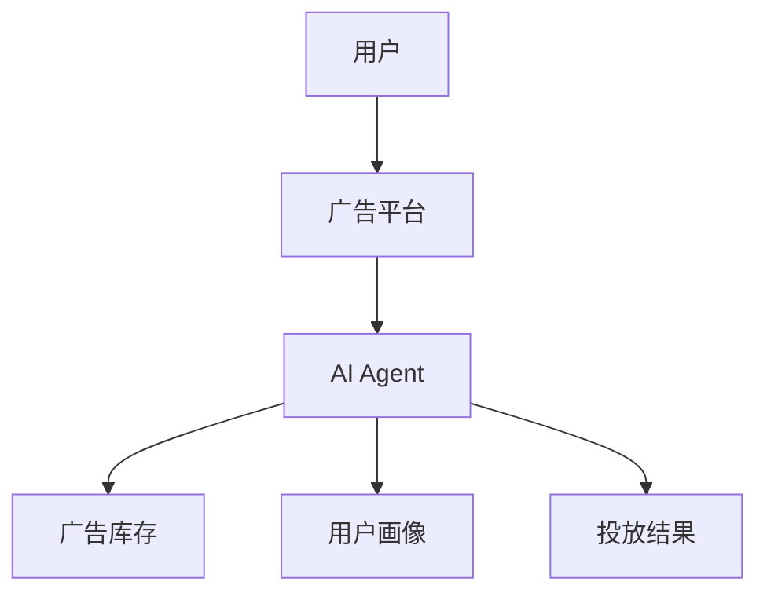
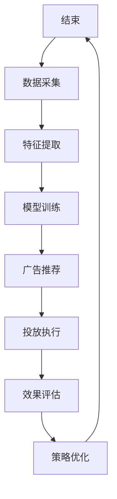
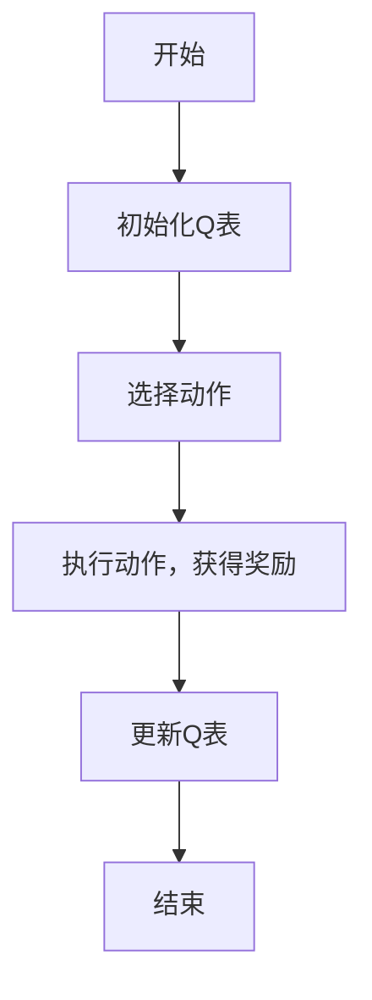
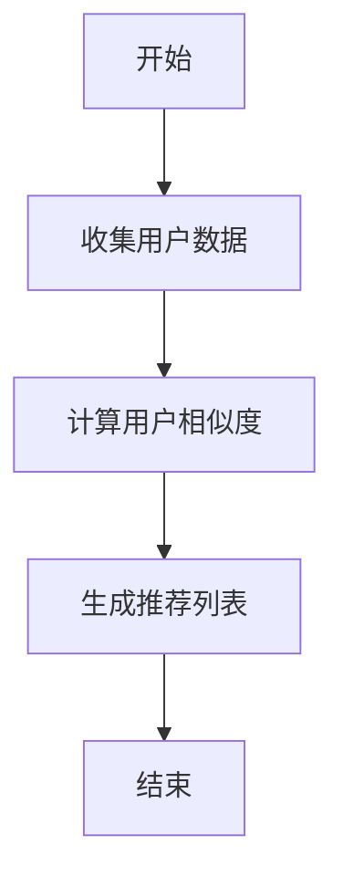
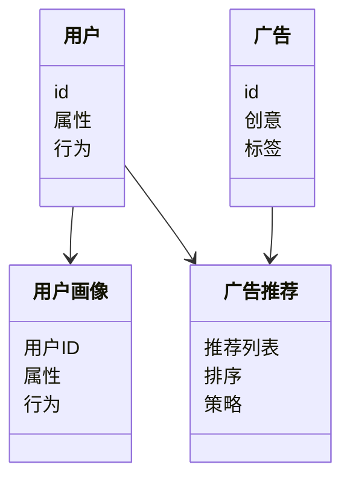
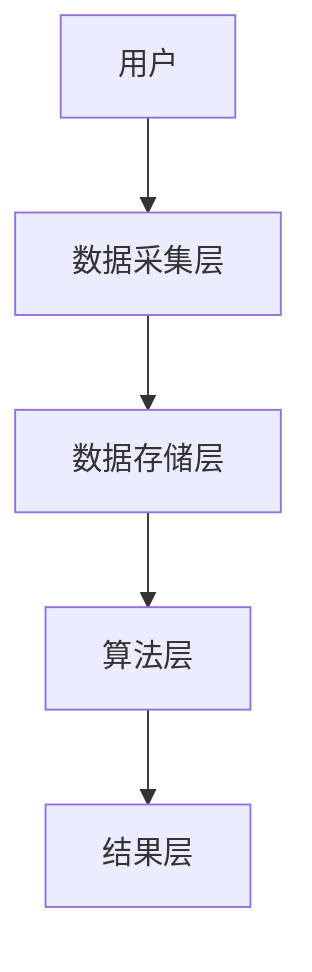
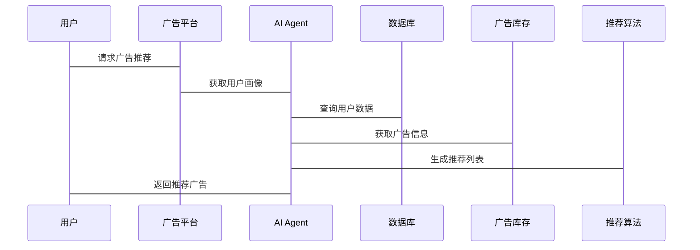

                 


```markdown
# AI Agent在智能广告投放中的应用

> 关键词：AI Agent, 智能广告投放, 强化学习, 推荐算法, 广告优化, 用户画像

> 摘要：本文详细探讨AI Agent在智能广告投放中的应用，从概念、原理、系统架构到实际案例，全面解析如何利用AI技术提升广告投放效率和精准度。文章涵盖背景介绍、核心概念、算法原理、系统设计、项目实战及最佳实践，为读者提供全面的指导。

---

## 第1章: AI Agent与智能广告投放概述

### 1.1 AI Agent的基本概念

#### 1.1.1 AI Agent的定义
AI Agent（人工智能代理）是一种能够感知环境、做出决策并执行动作的智能实体，用于优化特定目标的实现。在广告投放中，AI Agent能够自动分析数据、选择最佳广告策略并执行投放。

#### 1.1.2 AI Agent的核心特征
- **自主性**：无需人工干预，自动完成任务。
- **反应性**：实时感知环境变化并做出反应。
- **目标导向**：专注于实现预设目标，如提高点击率或转化率。

#### 1.1.3 AI Agent与传统广告投放的区别
| 特性       | 传统广告投放             | AI Agent广告投放             |
|------------|--------------------------|-----------------------------|
| 决策方式   | 人工决策为主             | 自动化决策为主               |
| 精准度     | 受人工经验限制           | 高度精准，基于大数据分析     |
| 效率       | 较低，依赖人工操作       | 高效，自动化处理大量数据     |

### 1.2 智能广告投放的背景与现状

#### 1.2.1 数字广告行业的演变
从传统媒体广告到数字广告，再到智能广告，广告投放逐渐从人工决策向自动化、智能化转变。

#### 1.2.2 AI技术在广告投放中的应用现状
AI Agent广泛应用于广告定位、创意生成、效果优化等领域，显著提升了广告投放的效率和效果。

#### 1.2.3 当前广告投放的主要挑战
- **数据孤岛**：数据分散，难以整合分析。
- **算法复杂性**：需要处理大量非结构化数据，算法实现难度大。
- **实时性要求**：需要快速响应市场变化。

### 1.3 AI Agent在广告投放中的优势

#### 1.3.1 提高投放效率
通过自动化处理，AI Agent能够快速筛选出最优广告策略，节省大量时间。

#### 1.3.2 增强广告精准度
基于用户画像和行为分析，AI Agent能够精准定位目标用户，提高广告点击率和转化率。

#### 1.3.3 实现自动化决策
AI Agent能够实时监控市场变化，动态调整广告策略，确保广告投放效果最大化。

## 第2章: AI Agent的核心概念与原理

### 2.1 AI Agent的核心概念

#### 2.1.1 感知层
AI Agent通过收集用户数据、市场趋势等信息，构建用户画像和广告库存。

#### 2.1.2 决策层
基于感知层的数据，AI Agent利用强化学习、推荐算法等技术，制定最优的广告投放策略。

#### 2.1.3 执行层
AI Agent根据决策层的策略，执行广告投放操作，并实时监控和调整策略。

### 2.2 AI Agent与广告投放的关联

#### 2.2.1 广告投放的业务流程
1. 数据采集：收集用户行为、市场趋势等数据。
2. 数据分析：通过机器学习模型分析数据，生成用户画像。
3. 广告推荐：基于用户画像和广告策略，推荐最优广告。
4. 投放执行：自动执行广告投放，并实时监控效果。
5. 效果评估：分析广告效果，优化投放策略。

#### 2.2.2 AI Agent在广告投放中的角色
- **数据分析师**：通过机器学习模型分析数据，生成用户画像。
- **策略制定者**：根据数据分析结果，制定广告投放策略。
- **执行者**：自动执行广告投放，并实时调整策略。

### 2.3 AI Agent的属性特征对比

| 特性       | 传统广告投放             | AI Agent广告投放             |
|------------|--------------------------|-----------------------------|
| 决策方式   | 人工决策为主             | 自动化决策为主               |
| 精准度     | 受人工经验限制           | 高度精准，基于大数据分析     |
| 效率       | 较低，依赖人工操作       | 高效，自动化处理大量数据     |

## 第3章: AI Agent的实体关系与架构

### 3.1 ER实体关系图

```mermaid
er
actor: 用户
goal: 广告投放目标
action: 广告投放行为
result: 投放结果
```

### 3.2 系统架构设计



### 3.3 算法流程图



## 第4章: AI Agent的算法原理

### 4.1 强化学习算法

#### 4.1.1 Q-learning算法

```python
class QLearning:
    def __init__(self, actions, epsilon=0.1, alpha=0.1):
        self.actions = actions
        self.epsilon = epsilon
        self.alpha = alpha
        self.q_table = {}

    def get_q(self, state):
        if state not in self.q_table:
            self.q_table[state] = 0
        return self.q_table[state]

    def update_q(self, state, action, reward):
        current_q = self.get_q(state)
        next_q = max(self.get_q((state, action)), default=0)
        new_q = current_q + self.alpha * (reward + next_q - current_q)
        self.q_table[(state, action)] = new_q
```

#### 4.1.2 算法流程



#### 4.1.3 数学模型

$$ Q(s, a) = Q(s, a) + \alpha \times (r + \max Q(s', a') - Q(s, a)) $$

其中，$Q(s, a)$ 是当前状态下动作 $a$ 的Q值，$\alpha$ 是学习率，$r$ 是奖励，$s'$ 是下一个状态。

### 4.2 推荐算法

#### 4.2.1 基于协同过滤的推荐算法

```python
def collaborative_filtering(user, items, user_items):
    similar_users = find_similar_users(user, items, user_items)
    recommended_items = get_top_k_items(similar_users, items, user_items)
    return recommended_items
```

#### 4.2.2 算法流程



#### 4.2.3 数学模型

$$ sim(u, v) = \frac{\sum_{i} (u_i - \bar{u})(v_i - \bar{v})}{\sqrt{\sum_{i} (u_i - \bar{u})^2} \times \sqrt{\sum_{i} (v_i - \bar{v})^2}} $$

其中，$sim(u, v)$ 是用户 $u$ 和用户 $v$ 的相似度，$\bar{u}$ 和 $\bar{v}$ 是用户的平均评分。

## 第5章: 系统分析与架构设计

### 5.1 问题场景介绍

- **目标**：提高广告投放的精准度和效率。
- **用户**：广告主、投放平台、最终用户。
- **需求**：实时监控市场变化，动态调整广告策略。

### 5.2 系统功能设计



### 5.3 系统架构设计



### 5.4 接口设计

- **数据接口**：用户提供数据，系统进行处理。
- **广告接口**：广告平台提供广告库存，系统进行推荐。
- **结果接口**：系统返回广告推荐结果，用户进行投放。

### 5.5 交互流程图



## 第6章: 项目实战

### 6.1 环境搭建

- **工具安装**：Python、Pandas、NumPy、Scikit-learn、TensorFlow、Mermaid。
- **依赖安装**：pip install numpy pandas scikit-learn tensorflow。

### 6.2 核心代码实现

#### 6.2.1 数据预处理

```python
import pandas as pd

def preprocess_data(data):
    # 假设data是包含用户行为和广告点击数据的DataFrame
    # 这里进行数据清洗和特征提取
    data['timestamp'] = pd.to_datetime(data['timestamp'])
    data = data.dropna()
    return data
```

#### 6.2.2 模型训练

```python
from sklearn.model

