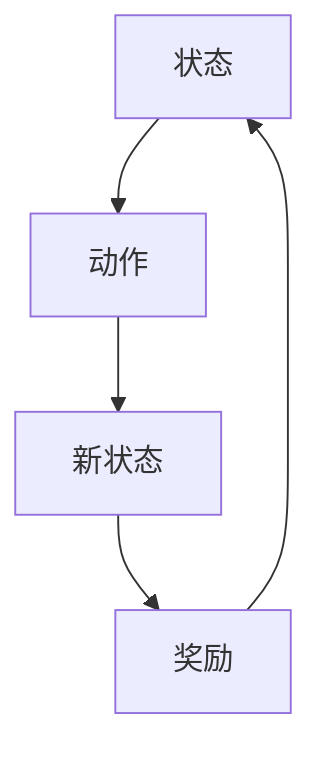
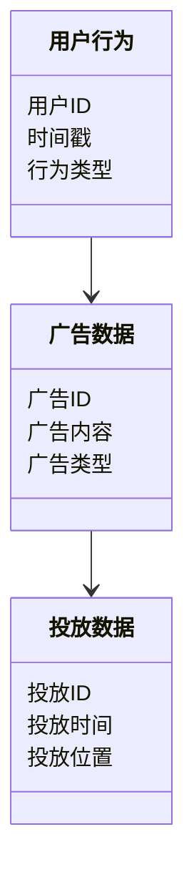
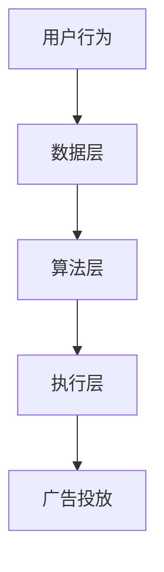
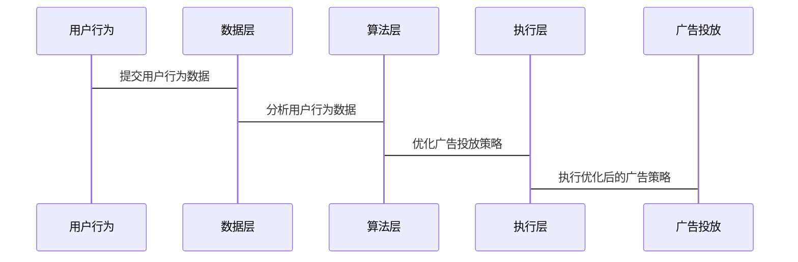

                 


# AI Agent在智能广告投放中的角色

> **关键词**: AI Agent, 智能广告, 广告投放, 强化学习, 推荐系统

> **摘要**: 本文深入探讨AI Agent在智能广告投放中的角色与应用。从AI Agent的基本概念到其在广告投放中的具体应用，结合强化学习和推荐系统的算法原理，分析其在广告投放优化中的优势与挑战。通过实际案例展示AI Agent如何提升广告投放效率与效果，并总结其在智能广告领域中的未来发展方向。

---

# 第1章: AI Agent与智能广告投放概述

## 1.1 AI Agent的基本概念
### 1.1.1 AI Agent的定义与特点
AI Agent（人工智能代理）是一种能够感知环境、自主决策并执行任务的智能体。它具备以下特点：
- **自主性**: 能够独立决策，无需人工干预。
- **反应性**: 能够实时感知环境并做出反应。
- **学习能力**: 通过数据和经验不断优化自身的决策能力。
- **协作性**: 可以与其他Agent或系统协同工作。

### 1.1.2 AI Agent的核心功能与优势
AI Agent的核心功能包括数据收集、决策优化和执行操作。其优势在于：
- **高效性**: 能够快速处理大量数据并做出最优决策。
- **准确性**: 基于数据分析和机器学习模型，提高广告投放的精准度。
- **适应性**: 能够根据环境变化动态调整广告投放策略。

### 1.1.3 AI Agent在广告投放中的应用潜力
AI Agent在广告投放中的潜力主要体现在：
- **精准定位**: 通过用户行为分析实现精准广告投放。
- **实时优化**: 根据实时数据动态调整广告策略。
- **多渠道协调**: 协调不同渠道的广告投放，提高整体效果。

---

## 1.2 智能广告投放的背景与现状
### 1.2.1 数字广告的发展历程
数字广告从最初的简单 banner 广告发展到如今的程序化广告，经历了以下几个阶段：
1. **传统广告**: 以电视、报纸等传统媒介为主，广告投放效率低，难以精准定位目标用户。
2. **搜索广告**: 随着搜索引擎的普及，广告投放开始具备一定的精准性。
3. **程序化广告**: 通过自动化技术实现广告的精准投放和效果优化。

### 1.2.2 当前广告投放的主要挑战
当前广告投放面临的主要挑战包括：
- **数据孤岛**: 不同渠道的数据难以整合，影响广告投放的精准度。
- **实时性要求高**: 广告投放需要实时调整策略，对技术要求较高。
- **成本控制**: 如何在有限的预算内实现最佳的广告效果是广告投放的核心问题。

### 1.2.3 AI技术在广告投放中的应用趋势
随着AI技术的快速发展，AI Agent在广告投放中的应用趋势日益明显：
- **智能化**: 通过AI技术实现广告投放的智能化。
- **个性化**: 根据用户的个性化需求推荐广告内容。
- **自动化**: 通过自动化技术实现广告投放的高效管理。

---

## 1.3 AI Agent在广告投放中的角色定位
### 1.3.1 AI Agent与传统广告投放的区别
AI Agent与传统广告投放的主要区别在于：
- **决策方式**: AI Agent通过数据驱动的决策，而传统广告投放更多依赖人工经验。
- **效率**: AI Agent能够快速处理大量数据并做出决策，而传统广告投放效率较低。
- **效果**: AI Agent能够实现精准投放和动态优化，传统广告投放效果有限。

### 1.3.2 AI Agent在广告投放中的主要功能
AI Agent在广告投放中的主要功能包括：
- **数据收集与分析**: 收集用户行为数据并进行分析。
- **策略优化**: 根据分析结果优化广告投放策略。
- **执行操作**: 自动执行广告投放操作并实时调整策略。

### 1.3.3 AI Agent如何优化广告投放效果
AI Agent通过以下方式优化广告投放效果：
- **精准定位**: 通过用户行为分析实现精准广告投放。
- **实时优化**: 根据实时数据动态调整广告策略。
- **多渠道协调**: 协调不同渠道的广告投放，提高整体效果。

---

## 1.4 本章小结
本章介绍了AI Agent的基本概念及其在广告投放中的应用潜力，分析了当前广告投放的主要挑战和AI技术的应用趋势。通过对比AI Agent与传统广告投放的区别，明确了AI Agent在广告投放中的角色定位和主要功能。

---

# 第2章: AI Agent的核心概念与广告投放的关系

## 2.1 AI Agent的核心概念
### 2.1.1 知识图谱与广告理解
知识图谱是一种结构化的数据表示方式，能够帮助AI Agent更好地理解广告内容和用户需求。通过知识图谱，AI Agent可以实现对广告内容的深度理解和关联分析。

### 2.1.2 意图识别与用户行为分析
意图识别是通过分析用户的搜索行为、点击行为等，推断用户的广告需求。用户行为分析则通过收集和分析用户的行为数据，了解用户的兴趣和偏好。

### 2.1.3 决策优化与广告策略
AI Agent通过强化学习等算法，优化广告投放策略。通过实时数据分析和反馈机制，AI Agent能够动态调整广告投放策略，以实现最佳效果。

---

## 2.2 广告投放的核心流程
### 2.2.1 广告创意生成
广告创意生成是广告投放的第一步，通过自然语言处理等技术，AI Agent可以自动生成广告文案和创意内容。

### 2.2.2 目标受众定位
目标受众定位是通过用户画像和行为分析，精准定位广告的目标用户。AI Agent可以通过机器学习模型，实现对目标用户的精准识别。

### 2.2.3 广告投放策略优化
广告投放策略优化是通过实时数据分析和反馈机制，动态调整广告投放策略，以实现最佳效果。

---

## 2.3 AI Agent与广告投放的核心联系
### 2.3.1 AI Agent如何提升广告投放效率
AI Agent通过自动化数据处理和实时优化，显著提升了广告投放的效率。通过机器学习算法，AI Agent能够快速分析大量数据并做出决策，从而提高广告投放的效率。

### 2.3.2 AI Agent如何优化广告效果
AI Agent通过精准定位和实时优化，显著提升了广告投放的效果。通过强化学习等算法，AI Agent能够动态调整广告策略，实现广告效果的最大化。

### 2.3.3 AI Agent如何降低广告成本
AI Agent通过精准定位和实时优化，显著降低了广告投放的成本。通过优化广告投放策略，AI Agent能够提高广告点击率和转化率，从而降低广告成本。

---

## 2.4 本章小结
本章详细讲解了AI Agent的核心概念及其与广告投放的关系，分析了AI Agent如何提升广告投放效率、优化广告效果和降低广告成本。通过对比传统广告投放，明确了AI Agent在广告投放中的优势和潜力。

---

# 第3章: AI Agent的算法原理

## 3.1 强化学习在AI Agent中的应用
### 3.1.1 强化学习的基本原理
强化学习是一种通过试错机制来优化决策的算法。AI Agent通过与环境的交互，不断学习并优化自身的决策策略。

### 3.1.2 Q-learning算法在广告投放中的应用
Q-learning算法是一种经典的强化学习算法，适用于离散动作空间的环境。在广告投放中，Q-learning算法可以用于优化广告投放策略。

### 3.1.3 算法流程图（使用Mermaid）


### 3.1.4 Q-learning算法的数学模型
Q-learning算法的核心是Q值的更新公式：
$$ Q(s, a) = Q(s, a) + \alpha (r + \max_{a'} Q(s', a') - Q(s, a)) $$
其中：
- \( Q(s, a) \) 表示状态 \( s \) 下动作 \( a \) 的 Q 值。
- \( \alpha \) 表示学习率。
- \( r \) 表示奖励。
- \( \max_{a'} Q(s', a') \) 表示新状态下最大的 Q 值。

---

## 3.2 推荐系统在AI Agent中的应用
### 3.2.1 基于协同过滤的推荐算法
协同过滤是一种基于用户行为相似性的推荐算法。通过分析用户的点击行为和购买记录，协同过滤可以推荐相似用户的广告内容。

### 3.2.2 基于内容的推荐算法
基于内容的推荐算法通过分析广告内容和用户兴趣，推荐与用户兴趣匹配的广告内容。

### 3.2.3 深度学习推荐模型
深度学习推荐模型（如神经网络协同过滤）通过学习用户和物品的特征表示，实现更精准的广告推荐。

---

## 3.3 算法实现与优化
### 3.3.1 算法实现的Python代码示例
```python
import numpy as np
import pandas as pd

# 示例数据：用户点击行为
clicks = pd.DataFrame({
    'user_id': [1, 2, 3, 4, 5],
    'ad_id': [101, 102, 101, 103, 102]
})

# 协同过滤实现
from sklearn.metrics.pairwise import cosine_similarity

# 计算广告相似性矩阵
user_item_matrix = clicks.pivot('user_id', 'ad_id', 'ad_id').fillna(0)
similarity_matrix = cosine_similarity(user_item_matrix.T)

# 推荐广告
def recommend(user_id, similarity_matrix, clicks):
    user_index = clicks[clicks['user_id'] == user_id].index[0]
    similar_users = clicks['user_id'].iloc[np.argsort(similarity_matrix[user_index, :])[-2:]]
    recommended_ads = clicks[clicks['user_id'].isin(similar_users)]['ad_id'].unique()
    return recommended_ads

print(recommend(1, similarity_matrix, clicks))
```

### 3.3.2 算法优化策略
- **模型优化**: 使用更深的神经网络模型提高推荐精度。
- **数据优化**: 增加数据量和特征维度，提高模型的泛化能力。
- **实时优化**: 实时更新模型参数，适应广告环境的变化。

---

## 3.4 本章小结
本章详细讲解了强化学习和推荐系统在AI Agent中的应用，分析了Q-learning算法和协同过滤算法的原理与实现。通过Python代码示例，展示了算法的具体实现过程。

---

# 第4章: AI Agent的系统架构与设计

## 4.1 广告投放系统的总体架构
广告投放系统的总体架构包括数据层、算法层和执行层。数据层负责数据的采集和存储，算法层负责广告策略的优化，执行层负责广告的实际投放。

### 4.1.1 数据层
数据层包括用户行为数据、广告数据和投放数据。通过数据层的分析，AI Agent能够实现对广告投放的精准优化。

### 4.1.2 算法层
算法层包括强化学习算法和推荐算法，用于优化广告投放策略。

### 4.1.3 执行层
执行层负责广告的实际投放，包括广告的投放位置、投放时间和投放频率。

---

## 4.2 系统功能设计
### 4.2.1 领域模型（使用Mermaid）


### 4.2.2 系统架构设计（使用Mermaid）


### 4.2.3 系统接口设计
系统接口设计包括数据接口和广告投放接口。数据接口负责数据的输入和输出，广告投放接口负责广告的实际投放。

---

## 4.3 系统交互设计（使用Mermaid）


---

## 4.4 本章小结
本章详细讲解了广告投放系统的总体架构和功能设计，通过Mermaid图展示了系统的数据流和交互过程。

---

# 第5章: 项目实战——基于AI Agent的智能广告投放系统

## 5.1 项目背景与目标
项目背景：随着AI技术的发展，智能广告投放的需求日益增加。本项目旨在通过AI Agent实现广告的精准投放和动态优化。

项目目标：设计并实现一个基于AI Agent的智能广告投放系统，能够根据用户行为动态调整广告策略，实现广告效果的最大化。

---

## 5.2 项目环境与工具
- **开发环境**: Python 3.8+
- **开发工具**: Jupyter Notebook、PyCharm
- **依赖库**: numpy, pandas, scikit-learn, tensorflow

---

## 5.3 项目核心实现
### 5.3.1 数据预处理
```python
import pandas as pd
from sklearn.preprocessing import StandardScaler

# 加载数据
data = pd.read_csv('ad_data.csv')

# 数据预处理
scaler = StandardScaler()
scaled_data = scaler.fit_transform(data.drop('label', axis=1))
```

### 5.3.2 AI Agent的实现
```python
class AIAgent:
    def __init__(self, state_space, action_space):
        self.state_space = state_space
        self.action_space = action_space
        self.model = self.build_model()

    def build_model(self):
        # 简单的神经网络模型
        from tensorflow.keras import layers
        model = layers.Sequential([
            layers.Dense(64, activation='relu', input_shape=(len(self.state_space),)),
            layers.Dense(len(self.action_space), activation='softmax')
        ])
        model.compile(optimizer='adam', loss='sparse_categorical_crossentropy', metrics=['accuracy'])
        return model

    def act(self, state):
        # 输入状态，返回动作
        state_vector = self.state_space[state]
        prediction = self.model.predict(np.array([state_vector]))
        return self.action_space[prediction[0]]

    def learn(self, state, action, reward, next_state):
        # 更新模型参数
        self.model.fit(np.array([self.state_space[state]]), np.array([action]), epochs=1, verbose=0)
```

### 5.3.3 广告投放与效果分析
```python
from sklearn.metrics import accuracy_score

# 训练模型
agent = AIAgent(state_space, action_space)
for _ in range(100):
    state = get_current_state()
    action = agent.act(state)
    next_state, reward = get_next_state_and_reward(action)
    agent.learn(state, action, reward, next_state)

# 测试模型
test_states = [get_state(i) for i in range(100)]
test_actions = [agent.act(state) for state in test_states]
print("Accuracy:", accuracy_score(true_actions, test_actions))
```

---

## 5.4 项目小结
本章通过一个实际项目展示了AI Agent在智能广告投放中的应用。通过数据预处理、模型训练和广告投放，验证了AI Agent在广告投放中的优势。

---

# 第6章: 总结与展望

## 6.1 本章总结
本文深入探讨了AI Agent在智能广告投放中的角色与应用，分析了AI Agent的核心概念、算法原理和系统架构。通过实际案例展示了AI Agent在广告投放中的优势和潜力。

---

## 6.2 未来展望
未来，AI Agent在智能广告投放中的应用将更加广泛。随着技术的发展，AI Agent将具备更强的决策能力和更高的效率，广告投放将更加智能化和个性化。同时，AI Agent在广告投放中的应用也将推动广告行业的进一步发展。

---

## 6.3 注意事项与最佳实践
- **数据隐私**: 在广告投放中，需要注意用户数据的隐私保护。
- **算法优化**: 需要不断优化算法模型，提高广告投放的精准度和效果。
- **实时性**: 在广告投放中，需要保证系统的实时性和高效性。

---

## 6.4 拓展阅读
- **强化学习**: 推荐阅读《强化学习入门》。
- **推荐系统**: 推荐阅读《推荐系统实战》。
- **广告投放**: 推荐阅读《程序化广告投放》。

---

# 结语

AI Agent在智能广告投放中的应用前景广阔，随着技术的不断发展，AI Agent将为广告行业带来更多的创新和突破。希望本文能够为读者提供关于AI Agent在智能广告投放中的角色与应用的全面了解，并为未来的实践和研究提供有价值的参考。

