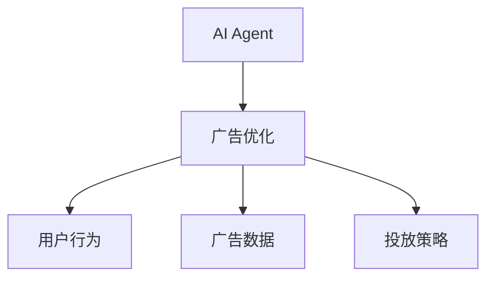

                 


# AI Agent在智能广告投放优化中的应用

## 关键词
AI Agent，智能广告，广告优化，强化学习，广告投放，实时竞价

## 摘要
本文系统地探讨了AI Agent在智能广告投放优化中的应用，从基础概念到高级算法，再到实际项目应用，全面分析了AI Agent如何通过智能决策和优化策略提升广告投放效果。文章通过详细的技术分析和实际案例，展示了AI Agent在广告优化中的巨大潜力和实际价值。

---

# 第一部分: AI Agent与智能广告投放优化的背景与概念

## 第1章: AI Agent的基本概念与广告投放优化的背景

### 1.1 AI Agent的核心概念
#### 1.1.1 AI Agent的定义与特点
- AI Agent的定义：AI Agent是一种能够感知环境、自主决策并执行任务的智能实体。
- 核心特点：
  - 智能性：基于数据和模型进行决策。
  - 自主性：无需人工干预，自动执行任务。
  - 适应性：能够根据环境变化调整策略。

#### 1.1.2 AI Agent与传统算法的区别
- 传统算法：基于规则或预定义的逻辑进行处理，缺乏灵活性。
- AI Agent：具备学习和自适应能力，能够动态优化策略。

### 1.2 广告投放优化的背景与挑战
#### 1.2.1 广告投放的基本流程
- 广告投放的定义：通过广告平台将广告内容推送给目标用户，以实现商业目标。
- 广告投放的基本流程：
  1. 确定目标受众。
  2. 选择广告位和投放策略。
  3. 监测广告效果并优化投放。

#### 1.2.2 广告投放优化的挑战
- 广告投放中的主要问题：
  - 用户需求多样，难以精准匹配。
  - 广告效果受多种因素影响，难以预测。
  - 实时决策需要快速响应，计算复杂。

#### 1.2.3 AI技术在广告优化中的应用潜力
- AI Agent能够通过学习用户行为和市场数据，优化广告投放策略，提高转化率和点击率。

### 1.3 AI Agent在广告优化中的结合
#### 1.3.1 AI Agent与广告优化的结合点
- AI Agent的核心能力与广告优化需求的匹配：
  - 数据分析能力：处理海量用户行为数据。
  - 自主决策能力：实时调整投放策略。
  - 优化能力：基于反馈不断改进策略。

#### 1.3.2 AI Agent广告优化的边界与外延
- AI Agent广告优化的适用范围：
  - 线上广告投放。
  - 用户行为预测与分析。
  - 实时竞价广告系统。
- AI Agent广告优化的边界：
  - 不适用于完全无数据的场景。
  - 依赖于高质量的数据输入。

## 第2章: AI Agent与广告优化的核心概念与联系

### 2.1 核心概念原理
#### 2.1.1 AI Agent的决策机制
- 基于状态的决策：AI Agent根据当前状态（如用户行为、广告效果）选择最优动作。
- 基于策略的决策：通过策略函数直接映射输入到输出。
- 基于强化学习的决策：通过奖励机制不断优化策略。

#### 2.1.2 广告优化的数学模型
- 广告效果的评价指标：
  - 点击率（CTR）。
  - 转化率（CVR）。
  - 每点击成本（CPC）。
- 广告投放的数学模型：
  - 用户点击广告的概率模型。
  - 广告效果的多变量回归模型。
- 广告优化的目标函数：
  - 最大化点击率和转化率。
  - 最小化成本。

### 2.2 核心概念属性特征对比表
| 概念       | 属性特征               |
|------------|------------------------|
| AI Agent   | 智能性、自主性、适应性 |
| 广告优化   | 数据驱动、实时性、精准性 |

### 2.3 实体关系图


---

# 第三部分: AI Agent与广告优化的核心概念与联系

## 第3章: AI Agent与广告优化的核心概念与联系

### 3.1 核心概念原理
#### 3.1.1 AI Agent的决策机制
- 基于状态的决策：
  - 用户行为数据（点击、停留时间等）作为输入。
  - AI Agent根据状态选择最优广告内容。
- 基于策略的决策：
  - 策略函数直接映射输入到输出。
  - 策略函数通过训练数据优化。
- 基于强化学习的决策：
  - 通过奖励机制不断优化策略。
  - 强化学习的核心是通过试错不断改进策略。

#### 3.1.2 广告优化的数学模型
- 广告效果的评价指标：
  - 点击率（CTR）：广告被点击的概率。
  - 转化率（CVR）：广告点击后转化为实际行动的概率。
  - 每点击成本（CPC）：每次点击广告的成本。
- 广告投放的数学模型：
  - 用户点击广告的概率模型：通过逻辑回归或神经网络建模。
  - 广告效果的多变量回归模型：考虑多个变量（如用户特征、时间、位置）对广告效果的影响。
- 广告优化的目标函数：
  - 最大化点击率和转化率：目标函数为广告效果的优化目标。
  - 最小化成本：目标函数为广告投放的成本最小化。

### 3.2 核心概念属性特征对比表
| 概念       | 属性特征               |
|------------|------------------------|
| AI Agent   | 智能性、自主性、适应性 |
| 广告优化   | 数据驱动、实时性、精准性 |

### 3.3 实体关系图


### 3.4 AI Agent与广告优化的结合点
- AI Agent的核心能力与广告优化需求的匹配：
  - 数据分析能力：处理海量用户行为数据。
  - 自主决策能力：实时调整投放策略。
  - 优化能力：基于反馈不断改进策略。

### 3.5 AI Agent广告优化的边界与外延
- AI Agent广告优化的适用范围：
  - 线上广告投放。
  - 用户行为预测与分析。
  - 实时竞价广告系统。
- AI Agent广告优化的边界：
  - 不适用于完全无数据的场景。
  - 依赖于高质量的数据输入。

---

# 第四部分: AI Agent与广告优化的系统架构设计

## 第4章: AI Agent与广告优化的系统架构设计

### 4.1 系统架构概述
#### 4.1.1 系统功能设计
- 广告投放优化系统的核心功能：
  - 用户行为分析。
  - 广告效果预测。
  - 投放策略优化。
- 领域模型：
  ```mermaid
  classDiagram
      class AI Agent {
          感知环境
          决策
          执行
      }
      class 广告优化 {
          用户行为分析
          广告效果预测
          投放策略优化
      }
      AI Agent --> 广告优化
  ```

#### 4.1.2 系统架构设计
- 系统架构图：
  ```mermaid
  graph TD
      A[AI Agent] --> B[广告优化系统]
      B --> C[用户行为数据]
      B --> D[广告数据]
      B --> E[投放策略]
  ```

### 4.2 系统实现细节
#### 4.2.1 系统接口设计
- 系统接口：
  - 用户行为数据接口。
  - 广告数据接口。
  - 投放策略接口。

#### 4.2.2 系统交互设计
- 系统交互流程：
  ```mermaid
  sequenceDiagram
      用户 --> 平台: 提供用户行为数据
      平台 --> AI Agent: 分析用户行为
      AI Agent --> 平台: 生成优化策略
      平台 --> 广告系统: 执行优化策略
  ```

### 4.3 代码实现示例
#### 4.3.1 环境安装
```bash
pip install numpy pandas scikit-learn
```

#### 4.3.2 核心代码实现
```python
import numpy as np
import pandas as pd
from sklearn.model import Model

class AIAgent:
    def __init__(self):
        self.model = Model()

    def perceive_environment(self, data):
        # 分析用户行为数据
        return self.model.predict(data)

    def decide_action(self, prediction):
        # 根据预测结果决定广告投放策略
        return "投放广告A" if prediction > 0.5 else "不投放"

# 使用示例
agent = AIAgent()
user_behavior = pd.DataFrame({
    '特征1': [1, 0, 1],
    '特征2': [0, 1, 0]
})
action = agent.decide_action(agent.perceive_environment(user_behavior))
print(action)
```

---

# 第五部分: AI Agent与广告优化的高级应用

## 第5章: AI Agent与广告优化的高级应用

### 5.1 多目标优化
#### 5.1.1 多目标优化的定义
- 多目标优化：在广告优化中，同时优化多个目标（如点击率和转化率）。

#### 5.1.2 多目标优化的实现
- 使用多目标强化学习框架。
- 通过加权目标函数平衡多个目标。

### 5.2 实时竞价广告系统
#### 5.2.1 实时竞价广告系统的定义
- 实时竞价广告系统：广告位实时拍卖，系统实时决策出价策略。

#### 5.2.2 实时竞价广告系统的实现
- 使用强化学习优化实时出价策略。

### 5.3 个性化推荐
#### 5.3.1 个性化推荐的定义
- 个性化推荐：基于用户特征和行为，推荐个性化广告内容。

#### 5.3.2 个性化推荐的实现
- 使用深度学习模型（如协同过滤、神经网络）进行推荐。

### 5.4 A/B测试
#### 5.4.1 A/B测试的定义
- A/B测试：将用户分成两组，分别展示不同广告策略，比较效果。

#### 5.4.2 A/B测试的实现
- 使用AI Agent自动优化测试策略。

---

# 第六部分: AI Agent与广告优化的最佳实践

## 第6章: AI Agent与广告优化的最佳实践

### 6.1 小结
- AI Agent在广告优化中的巨大潜力。
- AI Agent的核心能力：自主决策、实时优化。

### 6.2 最佳实践 tips
1. 数据质量：确保输入数据的准确性和完整性。
2. 算法选择：根据具体场景选择合适的AI Agent算法。
3. 实时性：确保系统能够实时响应和调整策略。
4. 监测与反馈：持续监测广告效果，及时调整策略。

### 6.3 注意事项
- 数据隐私：遵守数据隐私法规，保护用户隐私。
- 系统稳定性：确保系统稳定运行，避免因故障导致广告策略中断。

### 6.4 拓展阅读
- 推荐书籍：《强化学习入门》。
- 推荐论文：《基于强化学习的广告优化研究》。

---

# 第七部分: 未来发展

## 第7章: 未来发展

### 7.1 未来趋势
- 多目标优化：优化多个广告效果指标。
- 实时竞价广告系统：更智能的实时出价策略。
- 个性化推荐：基于AI Agent的个性化广告推荐。

### 7.2 未解决的问题
- 数据隐私：如何在保护用户隐私的前提下进行广告优化。
- 算法可解释性：如何让广告优化策略更透明、可解释。
- 系统稳定性：如何保证广告优化系统的高可用性。

---

# 总结

通过本文的系统分析，我们可以看到AI Agent在智能广告投放优化中的巨大潜力。随着技术的不断进步，AI Agent将能够更精准地分析用户行为，优化广告策略，提升广告效果。未来，随着AI技术的进一步发展，AI Agent在广告优化中的应用将更加广泛和深入。

