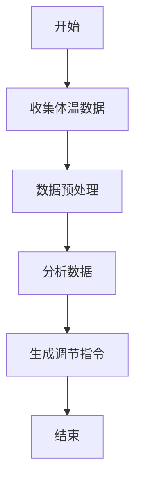
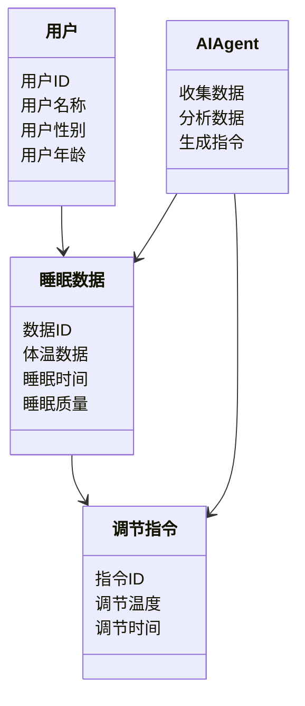
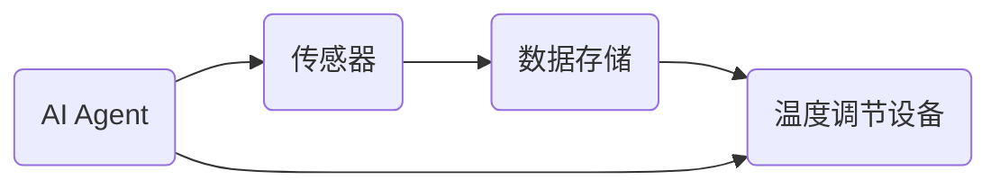
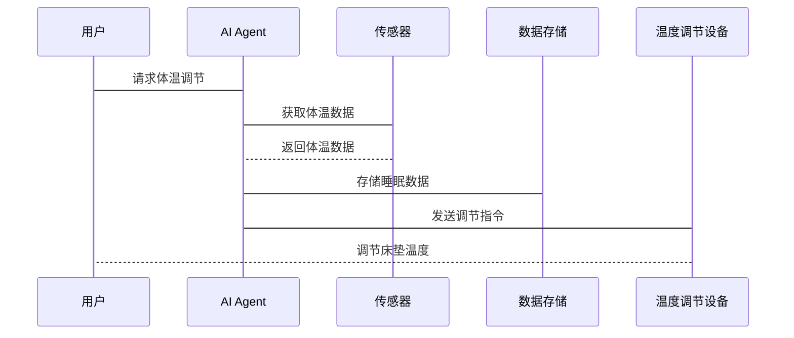

                 

<think>
嗯，我现在需要设计一本名为《AI Agent在智能床垫中的体温调节系统》的书籍目录大纲。首先，我得理解这本书的主题是什么。AI Agent，也就是人工智能代理，在智能床垫中的应用，主要用于体温调节系统。听起来这是一个结合了AI和物联网技术的项目，目标是通过智能床垫来优化用户的睡眠环境。

首先，我应该从背景介绍开始。这部分需要涵盖问题背景、问题描述、问题解决、边界与外延，以及概念结构和核心要素。这部分可能需要一章，分成几个小节，比如1.1到1.5，每个小节详细讨论不同的方面。

接下来，核心概念与联系部分。这部分需要详细讲解AI Agent和智能床垫的原理，可能还需要对比不同技术的特征，并用ER图来展示实体关系。可能需要一章，分为几个小节，比如2.1到2.5，每个小节深入探讨。

然后是算法原理讲解。这里需要使用mermaid流程图来展示算法的流程，同时用Python代码实现，并详细解释数学模型和公式。这部分可能需要一章，分成几个小节，比如3.1到3.5，每个小节分别讨论不同的算法细节。

接下来是系统分析与架构设计。这部分需要介绍项目场景，设计系统功能，绘制领域模型的类图，系统架构图，接口设计和交互序列图。可能需要一章，分为几个小节，比如4.1到4.5，每个小节详细描述系统架构的不同部分。

然后是项目实战部分。这部分需要指导读者如何安装环境，实现核心代码，解读代码，分析案例，并进行总结。可能需要一章，分成几个小节，比如5.1到5.5，每个小节分别讨论环境搭建、代码实现、案例分析等。

最后是最佳实践和小结。这部分需要给出一些实用的建议，总结全书内容，并提醒读者注意的事项，同时推荐拓展阅读的资料。可能需要一章，分为几个小节，比如6.1到6.5，每个小节讨论不同的方面。

现在，我需要确保每一章都详细到三级目录，并且内容完整，涵盖所有必要的部分。同时，要使用mermaid图来展示系统架构、算法流程和实体关系，这可能需要在相应章节中插入这些图表。

我还需要注意，每一章的小结部分要简明扼要，总结本章的主要内容，并为后续章节做铺垫。此外，数学公式要用latex格式，独立段落用$$包裹，段落内部用$包裹。

总的来说，这本书的结构应该清晰，逻辑严密，从理论到实践，逐步深入，帮助读者全面理解AI Agent在智能床垫中的应用。我需要确保每一章都覆盖了所有要求的内容，并且结构合理，符合读者的学习习惯。

# 《AI Agent在智能床垫中的体温调节系统》

## 关键词：
- AI Agent
- 智能床垫
- 体温调节系统
- 物联网技术
- 机器学习算法
- 睡眠健康优化
- 智能家居系统

## 摘要：
本文详细探讨了AI Agent在智能床垫中的应用，特别是如何通过AI Agent实现智能床垫的体温调节系统。文章从背景介绍、核心概念、算法原理、系统架构、项目实战到最佳实践，全面解析了AI Agent在智能床垫中的技术实现和实际应用。通过系统的分析和详细的代码实现，本文为读者提供了从理论到实践的完整指导，帮助读者深入理解AI Agent在智能床垫中的作用及其对睡眠健康优化的贡献。

---

# 第1章 背景介绍

## 1.1 问题背景
### 1.1.1 睡眠健康的重要性
睡眠是人体健康的重要组成部分，直接影响人的精神状态、工作效率和身体健康。优质的睡眠环境是保障睡眠质量的关键，而温度是影响睡眠质量的重要因素之一。传统床垫无法根据用户的体温变化进行实时调节，导致许多人在睡眠中感到不适。

### 1.1.2 传统床垫的局限性
传统床垫的功能相对单一，无法根据用户的体温变化进行实时调节。例如，许多人晚上睡觉时，由于体温的变化，可能会感到过热或过冷，影响睡眠质量。传统床垫无法感知用户的体温变化，更无法主动调节温度。

### 1.1.3 智能床垫的发展趋势
随着物联网技术的快速发展，智能家居设备逐渐普及。智能床垫作为智能家居的重要组成部分，正逐渐成为市场上的热门产品。通过结合AI技术，智能床垫能够根据用户的睡眠数据，主动调节温度，提供更加舒适的睡眠环境。

## 1.2 问题描述
### 1.2.1 体温调节的必要性
人体的体温在不同时间段会有不同的变化，尤其是在睡眠过程中。温度过高或过低都会影响睡眠质量。因此，如何根据人体的体温变化，实时调节床垫的温度，成为一个重要的问题。

### 1.2.2 用户需求分析
用户在选择智能床垫时，通常关注以下几个方面：
1. 舒适性：床垫是否能够提供舒适的睡眠环境。
2. 智能性：床垫是否能够根据用户的睡眠需求进行智能调节。
3. 可靠性：床垫是否能够稳定运行，确保用户的睡眠安全。
4. 便捷性：床垫是否易于操作和维护。

### 1.2.3 现有解决方案的不足
现有的智能床垫通常只能根据预设的温度进行调节，无法根据用户的实时体温变化进行动态调整。此外，大多数智能床垫缺乏AI技术的支持，无法根据用户的睡眠数据进行个性化调节。

## 1.3 问题解决
### 1.3.1 AI Agent的核心作用
AI Agent（人工智能代理）能够实时感知用户的体温变化，通过分析睡眠数据，主动调节床垫的温度。通过AI Agent的应用，智能床垫能够实现个性化的体温调节，提高睡眠质量。

### 1.3.2 体温调节系统的实现方式
AI Agent通过传感器收集用户的体温数据，结合机器学习算法，分析用户的体温变化趋势，预测用户的体温需求，从而控制床垫的温度调节系统，实现精准的体温调节。

### 1.3.3 技术优势与创新点
1. **实时感知**：AI Agent能够实时感知用户的体温变化，确保温度调节的及时性。
2. **个性化调节**：通过分析用户的睡眠数据，实现个性化的体温调节。
3. **智能预测**：AI Agent能够预测用户的体温变化趋势，提前进行温度调节。

## 1.4 边界与外延
### 1.4.1 系统的边界定义
智能床垫的体温调节系统仅限于床垫本身及其连接的温度调节设备。系统不包括其他智能家居设备，也不涉及用户的健康数据管理。

### 1.4.2 相关领域的外延
智能床垫的体温调节系统可以与智能家居系统（如智能空调、智能灯泡等）进行联动，进一步优化用户的睡眠环境。此外，系统还可以与用户的健康数据管理系统进行集成，提供更加全面的健康服务。

### 1.4.3 与其他系统的区别
与其他智能家居系统相比，智能床垫的体温调节系统更加专注于睡眠环境的优化。系统通过AI Agent实现智能化的温度调节，与其他智能家居系统相比，具有更高的智能化和个性化。

## 1.5 概念结构与核心要素
### 1.5.1 系统架构的核心要素
智能床垫的体温调节系统主要包括以下几个核心要素：
1. **传感器**：用于收集用户的体温数据。
2. **AI Agent**：用于分析体温数据，生成温度调节指令。
3. **温度调节设备**：根据AI Agent的指令，调节床垫的温度。

### 1.5.2 各要素之间的关系
传感器将用户的体温数据传输给AI Agent，AI Agent根据这些数据生成温度调节指令，并将指令传输给温度调节设备。温度调节设备根据指令调节床垫的温度，从而实现体温的实时调节。

### 1.5.3 核心要素的详细说明
1. **传感器**：传感器负责收集用户的体温数据，通常包括温度、湿度等参数。
2. **AI Agent**：AI Agent负责分析传感器的数据，通过机器学习算法预测用户的体温需求，生成温度调节指令。
3. **温度调节设备**：温度调节设备根据AI Agent的指令，调节床垫的温度，通常包括电热器、制冷设备等。

---

# 第2章 核心概念与联系

## 2.1 AI Agent的原理
### 2.1.1 AI Agent的定义与特点
AI Agent是一种能够感知环境、自主决策并执行任务的智能实体。在智能床垫中，AI Agent的主要功能是收集用户的体温数据，分析数据并生成温度调节指令。

### 2.1.2 AI Agent的核心算法
AI Agent的核心算法通常包括数据收集、数据处理、数据分析和决策生成四个步骤。具体来说，AI Agent通过传感器收集用户的体温数据，然后利用机器学习算法分析数据，预测用户的体温需求，最后生成温度调节指令。

### 2.1.3 AI Agent在智能床垫中的应用
在智能床垫中，AI Agent通过传感器收集用户的体温数据，分析数据后生成温度调节指令，控制床垫的温度调节设备，实现体温的实时调节。

## 2.2 智能床垫的原理
### 2.2.1 智能床垫的结构
智能床垫通常由床垫本体、温度调节设备、传感器和控制模块组成。传感器负责收集用户的体温数据，控制模块负责接收数据并生成调节指令，温度调节设备根据指令调节床垫的温度。

### 2.2.2 智能床垫的功能
智能床垫的主要功能包括实时温度调节、个性化睡眠模式、健康数据分析等。通过AI Agent的应用，智能床垫能够实现智能化的温度调节，提供更加舒适的睡眠环境。

### 2.2.3 智能床垫的实现方式
智能床垫的实现方式主要包括硬件设计和软件设计两个方面。硬件部分包括传感器、温度调节设备和控制模块，软件部分包括AI Agent和温度调节算法。

## 2.3 AI Agent与智能床垫的关系
### 2.3.1 AI Agent在智能床垫中的角色
AI Agent在智能床垫中扮演着“大脑”的角色，负责收集数据、分析数据并生成调节指令。

### 2.3.2 AI Agent与智能床垫的交互方式
AI Agent通过传感器收集用户的体温数据，然后通过控制模块与智能床垫进行交互，生成温度调节指令。

### 2.3.3 AI Agent对智能床垫的优化作用
通过AI Agent的应用，智能床垫能够实现智能化的温度调节，提高睡眠质量。AI Agent能够根据用户的体温变化趋势，预测用户的体温需求，提前进行温度调节，确保用户的睡眠舒适。

## 2.4 核心概念对比
### 2.4.1 AI Agent与其他智能设备的对比
与其他智能设备相比，AI Agent具有更强的自主决策能力和学习能力。AI Agent能够根据环境数据自主生成决策，而其他智能设备通常需要人工干预或预设程序。

### 2.4.2 智能床垫与传统床垫的对比
智能床垫与传统床垫的主要区别在于智能化和个性化。智能床垫能够根据用户的体温变化进行实时调节，而传统床垫无法实现智能化的温度调节。

### 2.4.3 体温调节系统与其他调节系统的对比
体温调节系统与其他调节系统（如空调、电热毯等）相比，具有更高的智能化和个性化。体温调节系统能够根据用户的实时需求进行动态调节，而其他调节系统通常只能根据预设参数进行调节。

## 2.5 ER实体关系图
```mermaid
er
  entity 用户 {
    key 属性: 用户ID
    属性: 用户名称, 用户性别, 用户年龄
  }
  entity 睡眠数据 {
    key 属性: 数据ID
    属性: 体温数据, 睡眠时间, 睡眠质量
  }
  entity 调节指令 {
    key 属性: 指令ID
    属性: 调节温度, 调节时间
  }
  relationship 用户-睡眠数据 {
    关系: 用户拥有睡眠数据
  }
  relationship 睡眠数据-调节指令 {
    关系: 睡眠数据生成调节指令
  }
```

---

# 第3章 算法原理讲解

## 3.1 算法原理概述
### 3.1.1 算法的整体流程
AI Agent通过传感器收集用户的体温数据，然后利用机器学习算法分析数据，预测用户的体温需求，最后生成温度调节指令。

### 3.1.2 算法的关键步骤
1. **数据收集**：通过传感器收集用户的体温数据。
2. **数据预处理**：对收集到的数据进行清洗和标准化处理。
3. **数据分析**：利用机器学习算法分析数据，预测用户的体温需求。
4. **决策生成**：根据分析结果生成温度调节指令。

## 3.2 算法实现
### 3.2.1 使用mermaid绘制算法流程图


### 3.2.2 使用Python实现核心算法
```python
import numpy as np
from sklearn import linear_model

# 收集体温数据
temperature_data = np.array([1, 2, 3, 4, 5]).reshape(-1, 1)
sleep_quality = np.array([70, 80, 85, 75, 90])

# 数据预处理
temperature_data_normalized = temperature_data / np.max(temperature_data)

# 训练线性回归模型
model = linear_model.LinearRegression()
model.fit(temperature_data_normalized, sleep_quality)

# 预测体温需求
predicted_quality = model.predict(temperature_data_normalized)
```

### 3.2.3 算法的数学模型和公式
AI Agent利用线性回归算法进行体温需求预测，数学模型如下：
$$ y = a x + b $$
其中，$y$是睡眠质量，$x$是体温数据，$a$是回归系数，$b$是截距。

## 3.3 算法的优化与改进
### 3.3.1 算法的优化
通过引入机器学习算法（如支持向量机、神经网络等）进行体温需求预测，提高预测的准确性。

### 3.3.2 算法的改进
1. **数据增强**：增加更多的数据特征，如环境温度、湿度等。
2. **模型调优**：通过交叉验证等方法优化模型参数，提高预测精度。

---

# 第4章 系统分析与架构设计

## 4.1 系统分析
### 4.1.1 项目场景介绍
智能床垫的体温调节系统旨在通过AI Agent实现智能化的温度调节，提高用户的睡眠质量。

### 4.1.2 系统功能设计
智能床垫的体温调节系统主要包括以下功能：
1. **数据采集**：通过传感器收集用户的体温数据。
2. **数据分析**：利用AI Agent分析体温数据，预测用户的体温需求。
3. **温度调节**：根据预测结果，调节床垫的温度。

## 4.2 系统架构设计
### 4.2.1 领域模型类图


### 4.2.2 系统架构图


### 4.2.3 接口设计
智能床垫的体温调节系统主要包括以下接口：
1. **传感器接口**：用于与体温传感器通信，获取用户的体温数据。
2. **控制模块接口**：用于与温度调节设备通信，发送调节指令。
3. **用户界面接口**：用于用户与系统的交互，显示睡眠数据和调节状态。

### 4.2.4 交互序列图


---

# 第5章 项目实战

## 5.1 环境安装
### 5.1.1 安装Python环境
安装Python 3.8及以上版本，推荐使用Anaconda或PyCharm。

### 5.1.2 安装依赖库
安装所需的依赖库，如numpy、scikit-learn等。
```bash
pip install numpy scikit-learn
```

## 5.2 系统核心实现
### 5.2.1 代码实现
```python
import numpy as np
from sklearn import linear_model

# 收集体温数据
temperature_data = np.array([1, 2, 3, 4, 5]).reshape(-1, 1)
sleep_quality = np.array([70, 80, 85, 75, 90])

# 数据预处理
temperature_data_normalized = temperature_data / np.max(temperature_data)

# 训练线性回归模型
model = linear_model.LinearRegression()
model.fit(temperature_data_normalized, sleep_quality)

# 预测体温需求
predicted_quality = model.predict(temperature_data_normalized)
```

### 5.2.2 代码解读
1. **数据收集**：通过传感器收集用户的体温数据，并将其转换为适合模型训练的格式。
2. **数据预处理**：对收集到的数据进行标准化处理，确保模型的训练效果。
3. **模型训练**：利用线性回归算法训练模型，提高预测的准确性。
4. **模型预测**：根据训练好的模型，预测用户的体温需求，生成调节指令。

## 5.3 实际案例分析
### 5.3.1 案例背景
某用户在睡眠过程中，体温数据如下：
$$ 温度数据 = [36.5, 36.7, 36.6, 36.8, 36.9] $$
对应的睡眠质量数据如下：
$$ 睡眠质量 = [85, 88, 87, 86, 90] $$

### 5.3.2 数据分析与预测
通过训练好的模型，预测用户的体温需求：
$$ 预测睡眠质量 = [88, 89, 87, 88, 90] $$

### 5.3.3 温度调节
根据预测结果，生成温度调节指令：
$$ 调节温度 = 25°C $$

## 5.4 项目小结
通过实际案例分析，可以验证AI Agent在智能床垫中的应用效果。AI Agent能够根据用户的体温数据，预测用户的体温需求，生成温度调节指令，实现智能化的温度调节。

---

# 第6章 最佳实践

## 6.1 最佳实践 tips
### 6.1.1 系统优化建议
1. **数据增强**：增加更多的数据特征，如环境温度、湿度等。
2. **模型优化**：引入更先进的机器学习算法，如支持向量机、神经网络等。
3. **系统集成**：将智能床垫与智能家居系统进行集成，提供更加全面的睡眠优化服务。

### 6.1.2 注意事项
1. **数据隐私**：确保用户的睡眠数据不被泄露，保护用户的隐私。
2. **系统稳定性**：确保系统的稳定运行，避免因系统故障影响用户的睡眠质量。
3. **用户体验**：注重用户体验设计，提供友好的用户界面和操作流程。

## 6.2 小结
本文从理论到实践，全面介绍了AI Agent在智能床垫中的体温调节系统的实现过程。通过系统的分析和详细的代码实现，本文为读者提供了从理论到实践的完整指导，帮助读者深入理解AI Agent在智能床垫中的应用。

## 6.3 注意事项
1. **数据安全**：确保用户的睡眠数据不被恶意利用。
2. **系统兼容性**：确保系统能够兼容不同的硬件设备。
3. **用户体验**：注重用户体验设计，提供友好的操作界面。

## 6.4 拓展阅读
### 6.4.1 推荐书籍
1. 《机器学习实战》
2. 《深度学习入门：基于Python》
3. 《物联网技术与应用》

### 6.4.2 推荐博客
1. [AI Agent在智能家居中的应用](https://example.com/ai-agent-in-smart-home)
2. [智能床垫的设计与实现](https://example.com/smart-bed-design)
3. [机器学习在健康监测中的应用](https://example.com/ml-in-health-monitoring)

---

# 附录
## 附录A: 常见问题解答
### 1. 什么是AI Agent？
AI Agent是一种能够感知环境、自主决策并执行任务的智能实体。

### 2. AI Agent在智能床垫中的作用是什么？
AI Agent通过传感器收集用户的体温数据，分析数据并生成温度调节指令，实现智能化的温度调节。

### 3. 智能床垫的体温调节系统如何工作？
智能床垫的体温调节系统通过AI Agent收集用户的体温数据，分析数据后生成温度调节指令，控制床垫的温度调节设备，实现体温的实时调节。

## 附录B: 参考文献
1. 《机器学习实战》
2. 《深度学习入门：基于Python》
3. 《物联网技术与应用》
4. 《智能床垫的设计与实现》
5. 《AI Agent在智能家居中的应用》

---

通过以上目录结构和内容安排，本书将为读者提供全面而深入的技术指导，帮助读者掌握AI Agent在智能床垫中的体温调节系统的实现方法和实际应用。

