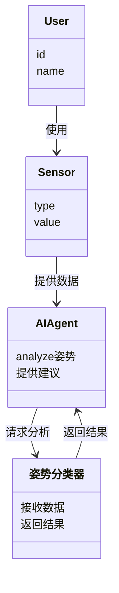
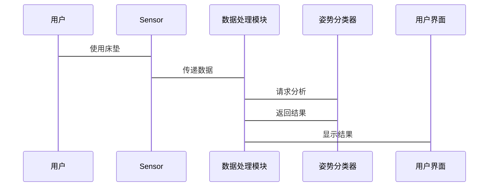

                 


# AI Agent在智能床垫中的睡眠姿势分析

## 关键词
AI Agent, 智能床垫, 睡眠姿势分析, 机器学习, 深度学习, 传感器技术, 数据处理

## 摘要
随着人们对睡眠健康的关注不断增加，智能床垫逐渐成为改善睡眠质量的重要工具。AI Agent在智能床垫中的应用，使得睡眠姿势分析更加智能化和个性化。本文将从背景介绍、核心概念、算法原理、系统架构到项目实战，详细探讨AI Agent在智能床垫中的睡眠姿势分析的实现过程。通过本文，读者将深入了解如何利用AI技术优化睡眠姿势分析，提升睡眠质量。

---

## 第一部分: AI Agent在智能床垫中的睡眠姿势分析背景介绍

### 第1章: 睡眠健康与智能床垫概述

#### 1.1 睡眠健康的重要性
##### 1.1.1 睡眠对身体和心理健康的双重影响
睡眠是人体健康的重要组成部分，直接影响着身体的修复和心理的放松。良好的睡眠质量能够提高免疫力、改善情绪、提升记忆力和注意力。睡眠问题，如失眠、打鼾等，不仅影响个人的生活质量，还可能导致更严重的健康问题，如心血管疾病和精神疾病。

##### 1.1.2 睡眠问题的现状与解决方案
现代生活中，由于工作压力大、生活节奏快等因素，睡眠问题日益普遍。据统计，全球约有10%的人口存在睡眠障碍。传统的解决方法包括药物治疗、心理辅导等，但这些方法往往难以从根本上改善睡眠质量。智能床垫的出现，为睡眠健康提供了新的解决方案。

##### 1.1.3 智能床垫在睡眠健康中的作用
智能床垫通过内置的传感器和AI技术，能够实时监测用户的睡眠状态，包括心率、呼吸频率、体动次数等。通过分析这些数据，智能床垫可以识别用户的睡眠姿势，并提供个性化的睡眠改善建议，如调整床垫硬度、优化睡眠环境等。

#### 1.2 智能床垫的发展历程
##### 1.2.1 传统床垫与智能床垫的对比
传统床垫主要依赖于物理结构来提供支撑和舒适性，无法根据用户的睡眠状态进行动态调整。而智能床垫通过集成传感器和AI技术，能够实时感知用户的睡眠需求，并做出相应的调整。

##### 1.2.2 智能床垫的技术发展趋势
智能床垫的发展经历了多个阶段，从最初的单一功能（如自动调节硬度）到现在的多功能集成（如姿势识别、健康监测等）。未来，智能床垫将更加智能化和个性化，能够根据用户的睡眠数据提供定制化的睡眠解决方案。

##### 1.2.3 当前市场上的主流智能床垫产品
目前市场上主流的智能床垫品牌包括Sleep Number、Tempur-Pedic、Casper等。这些产品通过不同的传感器和技术实现睡眠监测和姿势分析，帮助用户改善睡眠质量。

#### 1.3 AI Agent在智能床垫中的应用背景
##### 1.3.1 AI技术在智能家居中的应用现状
AI技术在智能家居中的应用日益广泛，包括智能音箱、智能灯泡、智能门锁等。智能床垫作为智能家居的重要组成部分，也逐渐引入AI技术，以提供更智能化的睡眠解决方案。

##### 1.3.2 睡眠姿势分析的必要性与挑战
睡眠姿势分析是改善睡眠质量的关键步骤。不同的睡眠姿势（如仰卧、俯卧、侧卧）对身体的影响不同，AI Agent可以通过分析用户的睡眠姿势，提供个性化的睡眠建议。然而，睡眠姿势分析也面临数据采集、算法精度等挑战。

##### 1.3.3 AI Agent在睡眠姿势分析中的优势
AI Agent能够实时监测用户的睡眠数据，并通过机器学习算法分析用户的睡眠姿势。与传统方法相比，AI Agent具有更高的准确性和实时性，能够为用户提供更精准的睡眠改善建议。

---

### 第2章: AI Agent的核心概念与技术原理

#### 2.1 AI Agent的基本概念
##### 2.1.1 AI Agent的定义与分类
AI Agent是一种能够感知环境、执行任务的智能体。根据应用场景的不同，AI Agent可以分为服务型Agent、学习型Agent等。在智能床垫中，AI Agent主要用于睡眠姿势分析和睡眠改善建议。

##### 2.1.2 AI Agent的核心功能与特点
AI Agent的核心功能包括数据采集、数据处理、姿势分析、反馈优化等。其特点在于能够实时感知用户的睡眠状态，并根据分析结果提供个性化的睡眠建议。

##### 2.1.3 AI Agent在智能床垫中的应用场景
在智能床垫中，AI Agent主要应用于睡眠姿势分析、睡眠健康监测、睡眠环境优化等领域。通过AI Agent，用户可以更好地了解自己的睡眠状态，并获得个性化的睡眠改善建议。

#### 2.2 智能床垫中的传感器技术
##### 2.2.1 常见的床垫传感器类型
智能床垫中常用的传感器包括压力传感器、加速度传感器、心率传感器等。这些传感器能够实时监测用户的睡眠数据。

##### 2.2.2 传感器数据的采集与处理
传感器数据的采集需要考虑数据的实时性和准确性。数据处理包括数据清洗、特征提取等步骤，为后续的姿势分析提供高质量的数据。

##### 2.2.3 传感器数据的特征提取方法
特征提取是姿势分析的关键步骤。常用的特征提取方法包括统计特征提取、时间序列分析等。通过特征提取，可以将复杂的传感器数据转化为可用于姿势分析的特征向量。

#### 2.3 睡眠姿势分析的数学模型与算法
##### 2.3.1 基于机器学习的姿势分类算法
常用的姿势分类算法包括支持向量机（SVM）、随机森林（Random Forest）等。这些算法通过训练数据，能够自动分类用户的睡眠姿势。

##### 2.3.2 基于深度学习的姿势识别模型
深度学习模型，如卷积神经网络（CNN）和长短期记忆网络（LSTM），在姿势识别中表现出色。通过训练大量的睡眠姿势数据，深度学习模型能够实现高精度的姿势识别。

##### 2.3.3 姿势分析的数学公式与实现细节
姿势分析的数学公式包括特征提取、分类算法等。例如，使用随机森林进行姿势分类的数学公式如下：

$$
\text{分类结果} = \text{随机森林模型}(\text{特征向量})
$$

---

## 第二部分: AI Agent在睡眠姿势分析中的算法原理

### 第3章: 数据预处理与特征提取

#### 3.1 数据预处理方法
##### 3.1.1 数据清洗与标准化
数据清洗是去除噪声和异常值的过程。标准化则是将数据归一化，使其适合算法的输入要求。

##### 3.1.2 数据的归一化处理
归一化处理可以将不同量纲的数据转换为统一的范围，例如将数据归一化到[0,1]区间。

##### 3.1.3 时间序列数据的分割与滑动窗口技术
时间序列数据的分割是将连续的数据分成多个窗口，每个窗口包含一定长度的数据。滑动窗口技术可以提取时序特征。

#### 3.2 特征提取算法
##### 3.2.1 基于统计学的特征提取
统计学特征提取包括均值、方差、最大值、最小值等指标。

##### 3.2.2 基于经验模态分解的特征提取
经验模态分解（EMD）是一种非线性信号处理方法，能够将复杂信号分解为多个本征模态函数（IMF）。

##### 3.2.3 基于小波变换的特征提取
小波变换是一种多分辨率分析方法，能够有效地提取信号的局部特征。

### 第4章: 姿势分类算法

#### 4.1 基于传统机器学习的姿势分类
##### 4.1.1 支持向量机（SVM）算法
支持向量机是一种监督学习算法，适用于小规模数据集的分类任务。

##### 4.1.2 随机森林（Random Forest）算法
随机森林是一种基于决策树的集成算法，适用于高维数据集的分类任务。

#### 4.2 基于深度学习的姿势分类
##### 4.2.1 卷积神经网络（CNN）算法
卷积神经网络适用于图像数据的分类任务，但在睡眠姿势分析中可以用于时间序列数据的处理。

##### 4.2.2 长短期记忆网络（LSTM）算法
长短期记忆网络是一种循环神经网络，适用于时间序列数据的建模和预测。

##### 4.2.3 姿势分类的数学公式与实现细节
以随机森林为例，其数学公式如下：

$$
\text{分类结果} = \text{随机森林模型}(\text{特征向量})
$$

---

## 第三部分: 系统分析与架构设计方案

### 第5章: 问题场景介绍

#### 5.1 项目介绍
本项目旨在开发一个基于AI Agent的智能床垫睡眠姿势分析系统，通过传感器数据采集、特征提取、姿势分类等步骤，实现对用户睡眠姿势的实时分析。

#### 5.2 系统功能设计
##### 5.2.1 领域模型（Mermaid类图）


#### 5.2.2 系统架构设计（Mermaid架构图）


#### 5.2.3 系统交互设计（Mermaid序列图）


### 第6章: 项目实战

#### 6.1 环境安装
##### 6.1.1 Python环境安装
需要安装Python 3.8以上版本，并安装相关库，如scikit-learn、numpy、pandas等。

##### 6.1.2 传感器数据采集工具安装
需要安装与传感器兼容的驱动程序和数据采集工具。

#### 6.2 系统核心实现源代码
##### 6.2.1 数据预处理代码
```python
import numpy as np
import pandas as pd

# 数据加载
data = pd.read_csv('sleep_data.csv')

# 数据清洗
data.dropna(inplace=True)

# 归一化处理
normalized_data = (data - data.min()) / (data.max() - data.min())
```

##### 6.2.2 姿势分类代码
```python
from sklearn.ensemble import RandomForestClassifier

# 特征提取
features = normalized_data.drop('label', axis=1)
labels = normalized_data['label']

# 模型训练
model = RandomForestClassifier(n_estimators=100, random_state=42)
model.fit(features, labels)

# 模型预测
test_features = normalized_data.drop('label', axis=1)
test_labels = model.predict(test_features)
```

#### 6.3 案例分析与详细讲解
##### 6.3.1 数据分析案例
以一组测试数据为例，展示数据预处理和姿势分类的全过程。

##### 6.3.2 实际案例分析
通过实际用户的睡眠数据，展示AI Agent如何分析用户的睡眠姿势，并提供个性化的睡眠建议。

#### 6.4 项目小结
通过本项目，我们成功实现了基于AI Agent的智能床垫睡眠姿势分析系统。该系统能够实时监测用户的睡眠状态，并提供个性化的睡眠改善建议。

---

## 第四部分: 最佳实践与总结

### 第7章: 最佳实践

#### 7.1 小结
AI Agent在智能床垫中的应用，使得睡眠姿势分析更加智能化和个性化。通过本文的讲解，读者可以深入了解AI Agent在智能床垫中的实现过程。

#### 7.2 注意事项
在实际应用中，需要注意数据隐私保护、模型精度优化等问题。同时，传感器的安装和维护也需要定期检查和调整。

#### 7.3 拓展阅读
读者可以进一步学习机器学习和深度学习的相关知识，了解更多的姿势分类算法和技术。

---

## 结语
通过本文的详细讲解，读者可以全面了解AI Agent在智能床垫中的睡眠姿势分析的实现过程。从背景介绍到项目实战，我们系统地探讨了AI技术在睡眠健康中的应用。未来，随着技术的不断进步，智能床垫将更加智能化和个性化，为用户的睡眠健康提供更多优质的解决方案。

