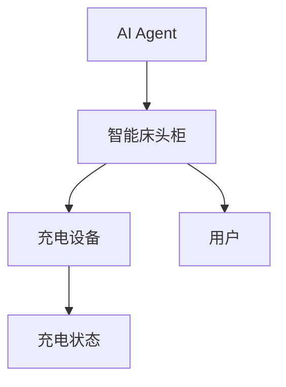
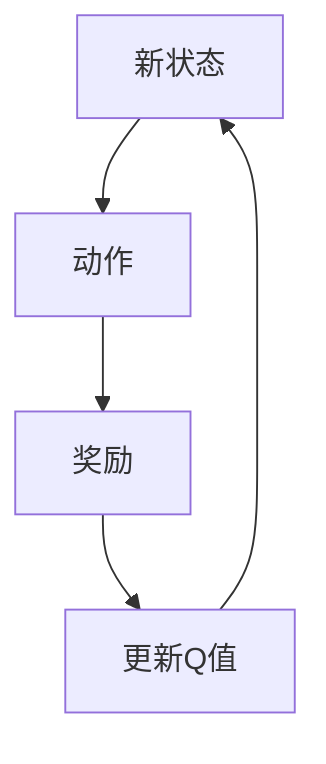
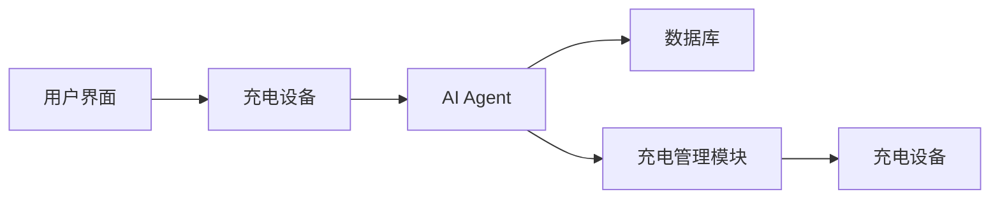

                 


# AI Agent在智能床头柜中的充电管理

> 关键词：AI Agent, 智能床头柜, 充电管理, 强化学习, 系统架构, 项目实战

> 摘要：本文深入探讨了AI Agent在智能床头柜中的充电管理应用，分析了充电管理的核心问题，详细介绍了AI Agent的工作原理及其在充电管理中的优化作用。通过系统设计、算法实现和项目实战，展示了如何利用AI技术提升智能床头柜的充电效率和用户体验。

---

## 第一部分: AI Agent在智能床头柜中的充电管理背景介绍

### 第1章: AI Agent的基本概念与背景

#### 1.1 AI Agent的定义与特点

- **AI Agent的定义**  
  AI Agent（人工智能代理）是一种智能实体，能够感知环境、自主决策并执行任务。它可以理解用户需求，优化资源配置，并通过学习提升性能。

- **AI Agent的核心特点**  
  - **自主性**：无需外部干预，自主决策。  
  - **反应性**：实时感知环境变化并做出响应。  
  - **学习性**：通过数据和经验不断优化行为。  
  - **协作性**：能够与其他系统或用户协同工作。  

- **AI Agent与传统自动化的区别**  
  AI Agent具备自主决策和学习能力，而传统自动化依赖预设规则，无法适应动态变化。

#### 1.2 智能床头柜的背景与发展

- **智能床头柜的功能概述**  
  智能床头柜不仅是一个家具，还集成了多种智能设备，如无线充电、智能家居控制和健康监测功能。

- **智能床头柜的发展历程**  
  从简单的床头柜到集成智能设备的多功能平台，智能床头柜经历了功能单一化到多功能化的演变。

- **智能床头柜的市场现状**  
  随着智能家居的普及，智能床头柜市场需求增长迅速，成为家庭智能化的重要组成部分。

#### 1.3 充电管理的现状与挑战

- **充电管理的基本概念**  
  充电管理是指对智能设备的充电过程进行监控、优化和管理，确保设备高效充电。

- **当前充电管理的主要问题**  
  - **资源浪费**：设备充电时间过长，导致能源浪费。  
  - **兼容性问题**：不同设备的充电需求差异大，管理复杂。  
  - **用户体验差**：充电过程缺乏智能化，用户操作繁琐。  

- **AI Agent在充电管理中的应用前景**  
  AI Agent能够实时优化充电策略，提高充电效率，改善用户体验。

---

### 第2章: AI Agent在智能床头柜中的充电管理问题背景

#### 2.1 问题背景分析

- **智能床头柜充电管理的核心问题**  
  - 如何优化充电顺序，减少等待时间。  
  - 如何动态调整充电功率，提高效率。  
  - 如何根据用户需求优先充电。  

- **用户需求与充电管理的关系**  
  用户需求多样化，AI Agent需要根据用户习惯和优先级调整充电策略。

- **系统设计的边界与外延**  
  - 边界：仅管理智能床头柜上的设备充电。  
  - 外延：与智能家居系统协同工作，扩展至家庭能源管理。  

#### 2.2 核心概念与问题描述

- **AI Agent在充电管理中的角色定位**  
  AI Agent作为智能床头柜的“管家”，负责协调设备充电，优化资源利用。

- **智能床头柜充电管理的系统架构**  
  包括感知模块、决策模块和执行模块，分别负责数据采集、策略制定和操作执行。

- **充电管理的核心功能与目标**  
  - **核心功能**：设备识别、充电优先级排序、动态功率调整。  
  - **目标**：提高充电效率，减少能源浪费，提升用户体验。  

#### 2.3 问题解决与边界分析

- **AI Agent如何优化充电管理**  
  - 通过学习用户充电习惯，优化充电顺序和功率分配。  
  - 实时监控设备状态，动态调整充电策略。  

- **系统设计的边界与限制**  
  - 系统仅管理床头柜上的设备，不涉及其他区域。  
  - 充电管理基于设备兼容性和用户权限。  

- **充电管理的外延与扩展**  
  未来可扩展至家庭能源管理，与其他智能家居设备协同工作。

---

### 第3章: 核心概念与联系

#### 3.1 AI Agent的核心原理

- **AI Agent的基本工作原理**  
  AI Agent通过感知环境数据，利用算法进行决策，并通过执行模块实现目标。

- **AI Agent的感知、决策与执行模块**  
  - **感知模块**：采集设备状态和用户需求。  
  - **决策模块**：基于数据制定充电策略。  
  - **执行模块**：控制充电设备执行决策。  

- **AI Agent的学习与自适应能力**  
  通过强化学习和反馈机制，AI Agent不断优化充电策略。

#### 3.2 AI Agent与智能床头柜的实体关系



#### 3.3 核心概念对比分析

- **AI Agent与传统充电管理的对比**

| 特性          | AI Agent充电管理 | 传统充电管理 |
|---------------|------------------|--------------|
| 决策方式      | 自主学习优化     | 预设规则     |
| 反应能力      | 实时响应         | 延迟响应     |
| 用户体验      | 高度个性化       | 统一化       |
| 能源效率      | 高               | 中等         |

- **不同充电管理方式的优缺点分析**

| 方式          | 优点             | 缺点           |
|---------------|------------------|---------------|
| AI Agent      | 高效、智能       | 需要前期部署   |
| 传统方法      | 简单易行         | 体验差         |

---

## 第4章: 算法原理

### 4.1 算法原理概述

- **AI Agent的核心算法**  
  使用强化学习（Reinforcement Learning）中的Q-learning算法，通过奖励机制优化充电策略。

- **Q-learning算法的工作原理**  
  AI Agent通过与环境交互，学习最优动作，更新Q值矩阵。

### 4.2 算法实现步骤



### 4.3 数学模型与公式

- **Q-learning的更新公式**  
  $$ Q(s, a) = Q(s, a) + \alpha (r + \gamma \max Q(s', a') - Q(s, a)) $$  
  其中，$\alpha$是学习率，$\gamma$是折扣因子。

---

## 第5章: 系统分析与架构设计

### 5.1 系统功能设计

- **用户管理模块**  
  支持用户注册、登录和权限管理。  
- **设备管理模块**  
  管理智能床头柜上的充电设备。  
- **充电策略模块**  
  根据用户需求和设备状态制定充电策略。  
- **监控与反馈模块**  
  实时监控充电状态并提供反馈。  

### 5.2 系统架构设计



---

## 第6章: 项目实战

### 6.1 环境安装

- **Python安装**  
  安装Python 3.8以上版本。  
- **TensorFlow安装**  
  使用pip安装：`pip install tensorflow`。  

### 6.2 核心代码实现

```python
import numpy as np
import tensorflow as tf

# 定义Q-learning模型
class AI-Agent:
    def __init__(self, state_space, action_space):
        self.state_space = state_space
        self.action_space = action_space
        self.q_table = np.zeros((state_space, action_space))
        self.learning_rate = 0.1
        self.discount_factor = 0.9

    def take_action(self, state):
        return np.argmax(self.q_table[state, :])

    def update_q_table(self, state, action, reward, next_state):
        self.q_table[state, action] += self.learning_rate * (reward + self.discount_factor * np.max(self.q_table[next_state, :]) - self.q_table[state, action])

# 初始化模型
state_space = 5  # 状态空间
action_space = 3  # 动作空间
agent = AI-Agent(state_space, action_space)
```

### 6.3 实际案例分析

- **案例1**：用户设备优先级调整。  
  用户有两个设备，优先级高的设备先充电。  
- **案例2**：动态功率调整。  
  根据设备兼容性，动态调整充电功率，减少等待时间。  

---

## 第7章: 最佳实践

### 7.1 小结

- AI Agent在智能床头柜中的充电管理，通过优化充电策略，提升了用户体验和能源效率。  

### 7.2 注意事项

- **数据隐私**  
  注意用户数据的隐私保护。  
- **系统稳定性**  
  确保系统在异常情况下的稳定性。  

### 7.3 拓展阅读

- 推荐书籍：《强化学习入门》、《AI系统设计》  
- 推荐论文：相关强化学习和系统设计论文。  

---

通过以上内容，我们可以看到AI Agent在智能床头柜中的充电管理不仅提升了用户体验，还优化了能源利用。未来，随着技术进步，AI Agent将在更多场景中发挥重要作用。

