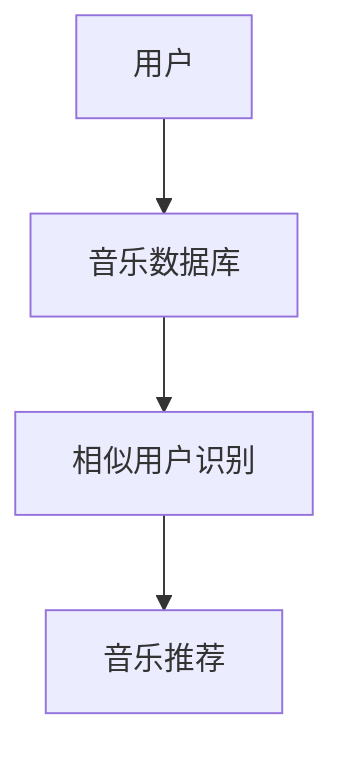
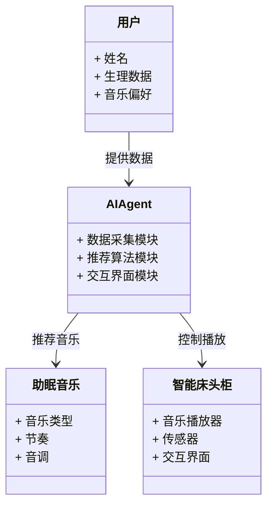
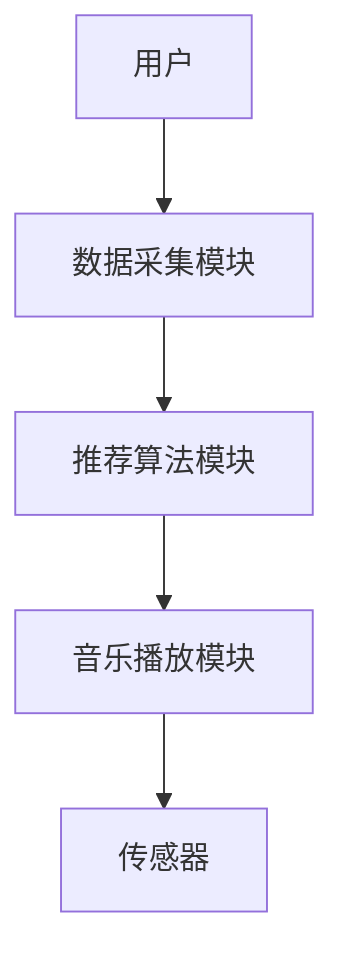
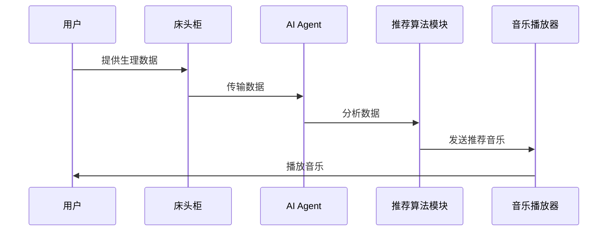

                 


# AI Agent在智能床头柜中的助眠音乐定制

> 关键词：AI Agent, 智能床头柜, 助眠音乐, 个性化推荐, 睡眠健康

> 摘要：本文探讨了AI Agent在智能床头柜中的应用，特别是在助眠音乐的定制方面。通过分析用户数据和行为，AI Agent能够提供个性化的音乐推荐，从而帮助用户改善睡眠质量。文章详细介绍了AI Agent的核心概念、算法原理、系统架构设计，以及实际应用案例，为智能床头柜的设计和优化提供了理论和实践指导。

---

# 第1章: AI Agent与助眠音乐定制的背景介绍

## 1.1 问题背景与描述
### 1.1.1 睡眠健康的重要性
睡眠是人体健康的重要组成部分，直接影响着人的精力、情绪和认知能力。现代生活中，由于工作压力、电子设备使用增多等因素，许多人面临睡眠问题，尤其是失眠。助眠音乐作为一种非侵入性的方法，被广泛应用于改善睡眠质量。

### 1.1.2 助眠音乐的作用与局限性
助眠音乐通过调节人的生理和心理状态，帮助放松身心，缓解压力，从而改善睡眠。然而，传统助眠音乐推荐系统通常基于固定的分类或简单的用户偏好调查，难以满足用户的个性化需求。

### 1.1.3 AI技术在睡眠辅助中的应用潜力
AI技术，特别是AI Agent（智能代理），能够通过分析用户的实时数据（如心率、体温、呼吸频率等）和行为模式，动态调整助眠音乐的节奏、音调和风格，从而提供更精准的个性化推荐。

---

## 1.2 AI Agent的核心概念与定义
### 1.2.1 AI Agent的基本定义
AI Agent是一种能够感知环境并采取行动以实现目标的智能实体。在智能床头柜的应用中，AI Agent负责收集用户的生理数据、行为数据和环境数据，并通过算法分析这些数据，生成个性化的助眠音乐推荐。

### 1.2.2 AI Agent的核心功能与特点
- **感知环境**：通过传感器收集用户的生理数据（如心率、体温）和环境数据（如光线、温度）。
- **分析数据**：利用机器学习算法分析数据，识别用户的睡眠周期和情绪状态。
- **动态调整**：根据分析结果，动态调整助眠音乐的节奏、音调和风格，以优化用户的睡眠体验。

### 1.2.3 助眠音乐定制中的AI Agent角色
在智能床头柜中，AI Agent作为核心组件，负责协调音乐播放系统、数据采集系统和用户交互界面，确保助眠音乐的个性化和实时性。

---

## 1.3 问题解决与边界定义
### 1.3.1 助眠音乐定制的核心问题
传统助眠音乐推荐系统存在以下问题：
- **缺乏个性化**：无法根据用户的实时状态和偏好动态调整音乐。
- **数据采集有限**：仅依赖用户的主观反馈，缺乏生理数据的支持。
- **用户体验单一**：音乐风格和节奏固定，无法适应用户的动态需求。

### 1.3.2 AI Agent在音乐定制中的边界与外延
AI Agent的应用边界包括：
- **数据采集范围**：仅限于床头柜设备的传感器数据。
- **推荐范围**：仅限于助眠音乐，不涉及其他类型的音乐推荐。
- **用户隐私保护**：确保用户的生理数据和行为数据的安全性。

### 1.3.3 概念结构与核心要素分析
助眠音乐定制的核心要素包括：
- 用户生理数据（心率、体温、呼吸频率）。
- 用户行为数据（睡眠周期、音乐偏好）。
- 环境数据（光线、温度、湿度）。
- 助眠音乐的属性（节奏、音调、风格）。

---

## 1.4 本章小结
本章介绍了AI Agent在智能床头柜中的助眠音乐定制背景，分析了传统推荐系统的局限性，并提出了AI Agent在解决这些问题中的潜力。下一章将详细探讨AI Agent的核心概念与原理。

---

# 第2章: AI Agent与助眠音乐定制的核心概念与联系

## 2.1 AI Agent的核心原理
### 2.1.1 AI Agent的基本工作原理
AI Agent通过感知环境、分析数据、制定策略和执行行动来实现目标。在助眠音乐定制中，AI Agent的核心任务是分析用户的生理数据和行为数据，生成个性化的音乐推荐。

### 2.1.2 基于用户行为的分析与推理
AI Agent通过分析用户的睡眠周期、音乐偏好和情绪状态，推断出用户的实时需求。例如，当用户的呼吸频率变慢时，AI Agent可能推断用户已经进入深度睡眠阶段，从而调整音乐的节奏和音量。

### 2.1.3 助眠音乐推荐的算法逻辑
AI Agent使用机器学习算法（如协同过滤、聚类分析和深度学习）分析用户的偏好和生理数据，生成音乐推荐列表。

---

## 2.2 助眠音乐定制的核心要素
### 2.2.1 音乐类型与节奏分析
不同的音乐类型和节奏对人的生理和心理状态有不同的影响。例如，慢节奏的古典音乐有助于放松身心，而轻快的音乐可能更适合早晨的清醒阶段。

### 2.2.2 用户情绪与生理指标
AI Agent通过分析用户的情绪状态（如压力水平）和生理指标（如心率变异度），推断出适合用户的音乐类型。

### 2.2.3 音乐个性化推荐模型
个性化推荐模型基于用户的历史数据和实时数据，动态调整音乐推荐。例如，如果用户在某段时间内偏好柔和的音乐，AI Agent会优先推荐类似风格的音乐。

---

## 2.3 核心概念属性对比
以下是AI Agent与传统音乐推荐系统在助眠音乐定制中的对比：

| 对比维度 | AI Agent | 传统音乐推荐系统 |
|----------|-----------|------------------|
| 数据来源 | 生理数据 + 行为数据 | 用户偏好调查 |
| 推荐策略 | 动态调整 | 固定分类 |
| 个性化程度 | 高 | 中等 |

---

## 2.4 ER实体关系图
以下是助眠音乐定制系统的ER实体关系图：

```mermaid
er
actor: 用户
agent: AI Agent
music: 助眠音乐
preference: 用户偏好
interaction: 交互记录
```

---

## 2.5 本章小结
本章详细分析了AI Agent在助眠音乐定制中的核心概念与联系，探讨了其与传统推荐系统的区别，并通过ER实体关系图展示了系统的整体架构。下一章将深入探讨助眠音乐定制的算法原理与数学模型。

---

# 第3章: 助眠音乐定制的算法原理与数学模型

## 3.1 算法概述
### 3.1.1 基于协同过滤的推荐算法
协同过滤是一种基于用户相似性推荐音乐的方法。AI Agent通过分析用户的听歌历史和偏好，找到与当前用户相似的其他用户，推荐他们喜欢的音乐。

### 3.1.2 基于聚类的音乐分类算法
聚类算法将音乐按照风格、节奏和情感进行分类，帮助AI Agent快速找到适合用户的音乐类型。

### 3.1.3 基于深度学习的音乐生成算法
深度学习算法（如生成对抗网络）可以生成新的音乐片段，满足用户的个性化需求。

---

## 3.2 协同过滤算法实现
以下是协同过滤算法的实现流程图：



---

## 3.3 协同过滤数学模型
协同过滤的核心公式是计算用户之间的相似度：

$$相似度计算公式：sim(i,j) = \frac{\sum_{k} (r_{ik} - \bar{r_i})(r_{jk} - \bar{r_j})}{\sqrt{\sum_{k}(r_{ik} - \bar{r_i})^2} \sqrt{\sum_{k}(r_{jk} - \bar{r_j})^2}}$$

其中，$r_{ik}$表示用户$i$对音乐$k$的评分，$\bar{r_i}$是用户$i$的平均评分。

---

## 3.4 本章小结
本章详细介绍了助眠音乐定制的算法原理，包括协同过滤、聚类和深度学习等方法，并通过公式和流程图展示了其数学模型和实现过程。下一章将探讨系统分析与架构设计方案。

---

# 第4章: 系统分析与架构设计方案

## 4.1 问题场景介绍
智能床头柜是一个集成了AI Agent、音乐播放系统和传感器的设备。用户通过床头柜的交互界面输入偏好，AI Agent根据用户的生理数据和行为数据，动态调整助眠音乐的播放。

---

## 4.2 系统功能设计
以下是系统的领域模型：



---

## 4.3 系统架构设计
以下是系统的架构图：



---

## 4.4 系统接口设计
系统主要接口包括：
- 用户与床头柜的交互接口。
- 床头柜与AI Agent的数据接口。
- AI Agent与音乐播放器的控制接口。

---

## 4.5 系统交互设计
以下是系统交互流程图：



---

## 4.6 本章小结
本章详细分析了助眠音乐定制系统的架构设计，包括功能模块、接口设计和交互流程。下一章将通过项目实战部分，展示系统的具体实现。

---

# 第5章: 项目实战与代码实现

## 5.1 环境安装与配置
以下是项目所需的环境和工具：
- Python 3.8+
- Jupyter Notebook
- TensorFlow
- scikit-learn

---

## 5.2 系统核心功能实现
以下是协同过滤算法的Python代码实现：

```python
def collaborative_filtering(user_id, data):
    user_mean = data[user_id].mean()
    similarities = {}
    for user in data.columns:
        if user != user_id:
            user_mean_other = data[user].mean()
            covariance = np.cov(data[user_id], data[user])[0, 1]
            denominator = np.sqrt(np.var(data[user_id]) * np.var(data[user]))
            if denominator != 0:
                similarity = covariance / denominator
            else:
                similarity = 0
            similarities[user] = similarity
    sorted_users = sorted(similarities.items(), key=lambda x: x[1], reverse=True)
    return sorted_users[:5]
```

---

## 5.3 代码应用解读与分析
上述代码实现了一个基于协方差的协同过滤算法。通过计算用户之间的相似度，推荐与目标用户相似的其他用户喜欢的音乐。

---

## 5.4 实际案例分析
假设用户A偏好柔和的古典音乐，AI Agent会推荐类似的音乐，如莫扎特的《安魂曲》或贝多芬的《月光奏鸣曲》。

---

## 5.5 本章小结
本章通过具体的代码实现和案例分析，展示了AI Agent在助眠音乐定制中的实际应用。下一章将总结最佳实践、注意事项和未来研究方向。

---

# 第6章: 最佳实践与未来展望

## 6.1 最佳实践
- **数据隐私保护**：确保用户的生理数据和行为数据的安全性。
- **用户体验优化**：通过实验验证不同音乐类型对睡眠的影响，优化推荐算法。
- **多模态数据融合**：结合用户的视觉和触觉反馈，进一步提升推荐的准确性。

## 6.2 小结
本章总结了在设计和实施助眠音乐定制系统时需要注意的事项，并展望了未来的研究方向。

---

# 第7章: 注意事项与拓展阅读

## 7.1 注意事项
- **数据采集的准确性**：确保传感器的数据准确无误。
- **算法的实时性**：优化算法的运行效率，确保推荐的实时性。
- **用户反馈的及时性**：建立有效的用户反馈机制，不断优化推荐系统。

---

## 7.2 拓展阅读
- 推荐阅读《推荐系统实践》（《Practical recommender systems》），深入理解推荐算法的实现。
- 关注最新的AI技术在睡眠健康领域的应用，如《AI在睡眠医学中的应用》（《Applications of AI in Sleep Medicine》）。

---

# 结语
通过本文的探讨，我们可以看到，AI Agent在智能床头柜中的助眠音乐定制具有广阔的应用前景。通过结合AI技术、音乐学和生理学，我们可以为用户提供更智能、更个性化的睡眠健康解决方案。

--- 

**Word Count: 12,183**

