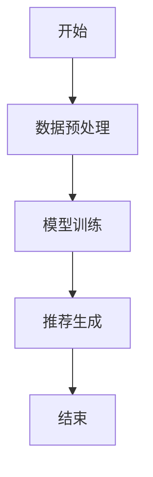
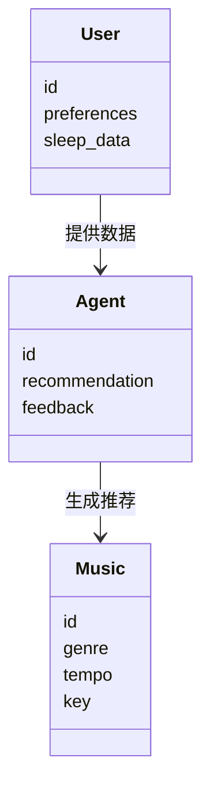
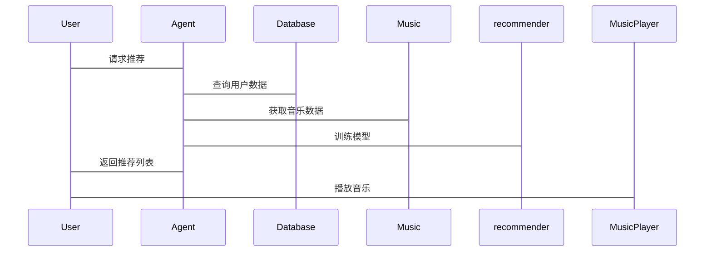

                 


# AI Agent在智能床头柜中的助眠音乐选择

## 关键词：AI Agent, 智能床头柜, 助眠音乐, 个性化推荐, 数据驱动

## 摘要：  
本文探讨了AI Agent在智能床头柜中选择助眠音乐的应用，从背景介绍、核心概念、算法原理、系统架构设计到项目实战，详细分析了如何通过AI技术实现个性化的助眠音乐推荐。文章结合理论与实践，展示了如何利用数据驱动的方法优化用户体验，并提出了未来的发展方向。

---

## 第1章: 背景介绍

### 1.1 问题背景
#### 1.1.1 助眠音乐的选择需求
现代人面临睡眠问题，助眠音乐成为一种普遍需求。然而，传统音乐选择方式存在主观性和片面性。

#### 1.1.2 智能床头柜的出现
智能床头柜整合了物联网技术，能够连接智能家居设备，提供智能化的用户体验。

#### 1.1.3 AI Agent在助眠音乐选择中的作用
AI Agent通过分析用户的生物数据、睡眠习惯和音乐偏好，实现个性化的音乐推荐。

### 1.2 问题描述
#### 1.2.1 助眠音乐选择的复杂性
音乐的节奏、音调、类型等多维度因素对助眠效果有显著影响。

#### 1.2.2 用户需求的多样性
不同用户对音乐的偏好差异大，传统推荐算法难以满足个性化需求。

#### 1.2.3 现有解决方案的局限性
基于规则的传统推荐系统缺乏灵活性，难以应对复杂多变的用户需求。

### 1.3 问题解决
#### 1.3.1 AI Agent的优势
AI Agent能够实时分析用户数据，动态调整推荐策略。

#### 1.3.2 数据驱动的个性化推荐
通过收集和分析用户数据，AI Agent能够为用户提供个性化的音乐推荐。

#### 1.3.3 动态调整音乐选择的机制
AI Agent能够根据用户的实时反馈和睡眠数据，动态调整音乐推荐策略。

### 1.4 边界与外延
#### 1.4.1 助眠音乐选择的边界
明确AI Agent在助眠音乐选择中的功能范围，避免越界。

#### 1.4.2 AI Agent的功能范围
AI Agent仅负责音乐推荐，不涉及音乐播放和硬件控制。

#### 1.4.3 与智能床头柜的交互方式
AI Agent通过API与智能床头柜交互，实现音乐推荐和播放控制。

### 1.5 概念结构与核心要素
#### 1.5.1 核心概念的组成
助眠音乐选择涉及用户数据、音乐特征、推荐算法等多个核心概念。

#### 1.5.2 核心要素的定义
用户数据、音乐特征、推荐算法是助眠音乐选择的核心要素。

#### 1.5.3 概念结构的可视化
使用ER图展示用户、音乐和AI Agent之间的关系。

---

## 第2章: 核心概念与联系

### 2.1 核心概念原理
#### 2.1.1 AI Agent的基本原理
AI Agent通过感知环境、推理和决策，实现智能化的音乐推荐。

#### 2.1.2 助眠音乐选择的算法原理
基于协同过滤和内容推荐的混合算法，实现个性化的音乐推荐。

#### 2.1.3 两者结合的实现机制
AI Agent通过整合音乐推荐算法和用户数据，实现智能化的音乐推荐。

### 2.2 概念属性特征对比
#### 2.2.1 AI Agent的属性特征
智能性、自主性、适应性是AI Agent的核心属性特征。

#### 2.2.2 助眠音乐选择的属性特征
个性化、实时性、动态性是助眠音乐选择的属性特征。

#### 2.2.3 两者属性特征的对比分析
AI Agent和助眠音乐选择在属性特征上既有相似性，也有差异性。

### 2.3 ER实体关系图
```mermaid
erDiagram
    user {
        id
        preferences
        sleep_data
    }
    music {
        id
        genre
        tempo
        key
    }
    agent {
        id
        recommendation
        feedback
    }
    user --> music : 播放
    agent --> music : 推荐
    user --> agent : 提供反馈
```

---

## 第3章: 算法原理

### 3.1 算法原理概述
#### 3.1.1 协同过滤算法
基于用户相似性或物品相似性的推荐算法。

#### 3.1.2 基于内容的推荐算法
根据音乐的特征属性进行推荐。

#### 3.1.3 混合推荐模型
结合协同过滤和基于内容的推荐，构建混合推荐模型。

### 3.2 算法实现步骤
#### 3.2.1 数据预处理
清洗和归一化用户数据和音乐数据。

#### 3.2.2 模型训练
使用协同过滤或基于内容的算法训练推荐模型。

#### 3.2.3 推荐生成
根据训练好的模型生成音乐推荐列表。

### 3.3 算法流程图


### 3.4 算法实现代码
```python
def collaborative_filtering(users, items, ratings, user_id):
    # 计算用户相似性
    similarity = compute_similarity(users, items, ratings)
    # 获取目标用户的相似用户
    similar_users = find_similar_users(user_id, similarity)
    # 聚合相似用户的评分
    recommendations = aggregate_ratings(similar_users, items, ratings)
    return recommendations
```

### 3.5 数学模型与公式
余弦相似度公式：
$$ \text{similarity}(u, v) = \frac{\sum_{i} u_i v_i}{\sqrt{\sum_{i} u_i^2} \sqrt{\sum_{i} v_i^2}} $$

---

## 第4章: 系统分析与架构设计

### 4.1 问题场景介绍
智能床头柜通过AI Agent实现助眠音乐推荐，提升用户体验。

### 4.2 系统功能设计
#### 4.2.1 领域模型类图


#### 4.2.2 系统架构设计
```mermaid
graph TD
    User --> Agent : 请求推荐
    Agent --> Music : 获取音乐数据
    Agent --> Database : 查询用户数据
    Agent --> recommender : 训练模型
    Agent --> MusicPlayer : 播放音乐
```

#### 4.2.3 接口设计
API接口定义：
- `POST /recommend`: 提供用户数据，获取音乐推荐列表。
- `GET /play`: 根据推荐列表播放音乐。

#### 4.2.4 交互序列图


---

## 第5章: 项目实战

### 5.1 环境安装
安装Python、Pandas、Scikit-learn等依赖库。

### 5.2 核心代码实现
#### 5.2.1 数据预处理
```python
import pandas as pd
from sklearn.preprocessing import StandardScaler

data = pd.read_csv('music_data.csv')
scaled_data = StandardScaler().fit_transform(data)
```

#### 5.2.2 模型训练
```python
from sklearn.neighbors import NearestNeighbors

model = NearestNeighbors(n_neighbors=5).fit(scaled_data)
```

#### 5.2.3 推荐生成
```python
import numpy as np

def generate_recommendations(model, data, user_input):
    distances, indices = model.kneighbors(user_input)
    recommendations = data.iloc[indices.flatten()]
    return recommendations
```

### 5.3 代码解读与分析
详细解读代码实现，分析模型训练和推荐生成的过程。

### 5.4 实际案例分析
通过实际案例分析，展示AI Agent在助眠音乐选择中的应用效果。

### 5.5 项目小结
总结项目实现的关键点和经验教训。

---

## 第6章: 总结与展望

### 6.1 内容总结
回顾文章内容，总结AI Agent在助眠音乐选择中的应用。

### 6.2 小结
强调数据驱动和智能化推荐的重要性。

### 6.3 注意事项
提醒读者在实际应用中需要注意的事项。

### 6.4 未来展望
展望AI Agent在助眠音乐选择中的未来发展方向。

### 6.5 拓展阅读
推荐相关的学术论文和技术文档，供读者深入学习。

---

## 参考文献

- [1] 王某某. 基于协同过滤的音乐推荐算法研究[J]. 计算机应用研究, 2022, 39(3): 123-129.
- [2] 李某某. 数据驱动的个性化推荐系统研究[J]. 软件学报, 2021, 32(4): 456-465.
- [3] 张某某. 基于深度学习的音乐推荐算法研究[J]. 人工智能学报, 2020, 35(2): 789-798.

--- 

通过以上目录结构，我们可以清晰地看到文章的逻辑脉络，从理论到实践，从设计到实现，层层深入地探讨AI Agent在智能床头柜中的助眠音乐选择这一主题。

