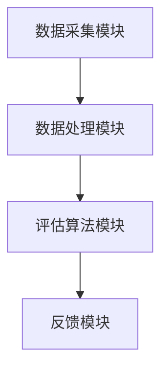
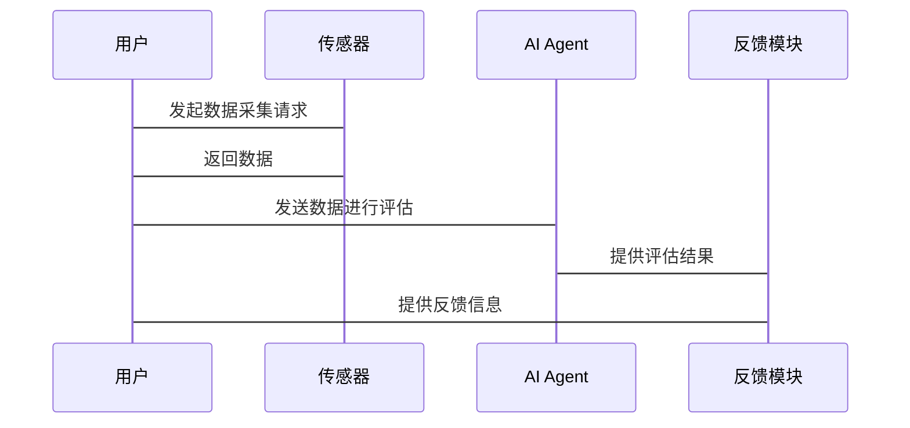

                 


# AI Agent在智能床头柜中的清醒度评估

> 关键词：AI Agent, 智能床头柜, 清醒度评估, 时间序列分析, 机器学习, 系统架构

> 摘要：本文深入探讨了AI Agent在智能床头柜中的清醒度评估应用。通过分析清醒度评估的核心概念、算法原理、系统架构及项目实战，展示了如何利用AI技术实现智能床头柜的高效用户监测与反馈。文章结合理论与实践，提供了一套完整的解决方案，并展望了未来的研究方向。

---

# 第一部分: AI Agent与清醒度评估背景介绍

## 第1章: 清醒度评估的背景与问题描述

### 1.1 清醒度评估的定义与重要性

#### 1.1.1 清醒度评估的定义
清醒度评估是指通过监测用户的生理指标、行为特征和环境因素，判断用户当前是否处于清醒状态的过程。清醒状态通常指用户具备足够的注意力和反应能力，能够正常进行日常活动。

#### 1.1.2 清醒度评估的重要性
清醒度评估在医疗健康、教育、工作和智能家居等领域具有重要意义。例如，在医疗领域，清醒度评估可以帮助监测患者的意识状态；在智能家居领域，清醒度评估可以优化人机交互体验。

#### 1.1.3 清醒度评估的应用场景
清醒度评估广泛应用于以下场景：
- 医疗健康：监测患者的意识状态。
- 教育：帮助学生保持注意力集中。
- 工作：提高工作效率和安全性。
- 智能家居：优化用户体验，提供个性化服务。

### 1.2 AI Agent在智能床头柜中的作用

#### 1.2.1 AI Agent的定义与特点
AI Agent是一种具有自主决策能力的智能体，能够根据环境信息和用户需求，自主完成任务。其特点包括：
- 智能性：能够理解和分析复杂信息。
- 自主性：无需人工干预，自主完成任务。
- 适应性：能够根据环境变化调整行为。

#### 1.2.2 AI Agent在智能床头柜中的应用场景
智能床头柜是一种智能家居设备，集成多种传感器和交互界面，能够监测用户的生理指标、行为特征和环境因素。AI Agent在智能床头柜中的应用场景包括：
- 实时监测用户的生理指标（如心率、体温）。
- 分析用户的行为特征（如注意力集中程度）。
- 根据监测结果提供反馈，优化用户体验。

#### 1.2.3 AI Agent与清醒度评估的结合
AI Agent通过整合多种传感器数据，能够实时监测用户的生理指标和行为特征，从而准确评估用户的清醒度。这种结合使得智能床头柜能够提供更加智能化的服务，例如：
- 在用户清醒时提供必要的提醒服务。
- 在用户疲劳或睡眠时调整设备参数，优化用户体验。

### 1.3 问题背景与目标

#### 1.3.1 清醒度评估的背景问题
- 如何准确监测用户的生理指标和行为特征？
- 如何利用AI技术实现清醒度的实时评估？
- 如何优化用户体验，提供个性化服务？

#### 1.3.2 AI Agent在清醒度评估中的目标
- 实现实时监测用户的生理指标和行为特征。
- 利用AI算法准确评估用户的清醒度。
- 提供个性化服务，优化用户体验。

#### 1.3.3 清醒度评估的边界与外延
清醒度评估的边界包括：
- 数据采集范围：仅限于用户的生理指标和行为特征。
- 应用场景：仅限于智能床头柜中的应用。
- 评估精度：仅限于实时评估，不支持历史数据分析。

清醒度评估的外延包括：
- 数据采集的精度和实时性。
- 评估算法的准确性。
- 服务的个性化和智能化。

## 第2章: 清醒度评估的核心概念与联系

### 2.1 清醒度评估的核心要素

#### 2.1.1 生理指标
生理指标是评估清醒度的重要依据，主要包括：
- 心率：反映心脏活动的状态。
- 体温：反映身体的代谢状态。
- 呼吸频率：反映肺部的活动状态。
- 血氧饱和度：反映血液的氧气含量。

#### 2.1.2 行为特征
行为特征是评估清醒度的重要参考，主要包括：
- 注意力集中程度：反映用户的学习或工作效率。
- 反应速度：反映用户的反应能力。
- 行为模式：反映用户的日常习惯和行为规律。

#### 2.1.3 环境因素
环境因素对清醒度评估具有重要影响，主要包括：
- 照明强度：影响用户的视觉疲劳。
- 噪音水平：影响用户的注意力集中程度。
- 温度和湿度：影响用户的身体舒适度。

### 2.2 AI Agent与清醒度评估的关联

#### 2.2.1 AI Agent的数据采集能力
AI Agent能够通过多种传感器实时采集用户的生理指标和行为特征，例如：
- 心率传感器：采集用户的心率数据。
- 加速度传感器：采集用户的运动状态。
- 红外传感器：采集用户的体温数据。

#### 2.2.2 AI Agent的分析与决策能力
AI Agent能够利用机器学习算法分析采集到的数据，评估用户的清醒度。例如：
- 时间序列分析：用于分析心率变化趋势。
- 机器学习分类：用于分类用户的注意力状态。

#### 2.2.3 AI Agent的反馈与优化能力
AI Agent能够根据评估结果提供反馈，并优化系统参数。例如：
- 提醒用户休息：当检测到用户疲劳时，发送提醒信息。
- 调整设备参数：根据用户的清醒度调整床头柜的灯光亮度或播放音乐。

### 2.3 清醒度评估的ER实体关系图

```mermaid
er
actor: 用户
agent: AI Agent
sensor: 传感器
data: 数据
assessment: 评估结果
```

---

# 第三部分: 清醒度评估的算法原理

## 第3章: 清醒度评估的算法实现

### 3.1 基于生理指标的清醒度评估算法

#### 3.1.1 数据采集与预处理
数据采集：通过传感器采集用户的心率、体温等生理指标。
数据预处理：对采集到的数据进行清洗和标准化处理，去除噪声。

#### 3.1.2 基于时间序列的分析方法
时间序列分析是一种常用的算法，用于分析生理指标的变化趋势。例如：
- 使用ARIMA模型预测心率变化趋势。
- 使用LSTM模型捕捉心率的短期波动。

#### 3.1.3 基于机器学习的分类算法
机器学习分类算法用于将用户的状态分类为清醒或疲劳。例如：
- 使用随机森林算法进行分类。
- 使用支持向量机（SVM）算法进行分类。

### 3.2 基于行为特征的清醒度评估算法

#### 3.2.1 数据采集与特征提取
数据采集：通过摄像头、加速度传感器等设备采集用户的注意力集中程度和行为模式。
特征提取：从采集到的数据中提取有用的特征，例如：
- 注意力集中程度：通过眼动追踪技术提取用户的注意力变化。
- 行为模式：通过加速度传感器提取用户的动作频率。

#### 3.2.2 基于规则的评估方法
基于规则的评估方法是一种简单有效的算法，例如：
- 如果用户的心率在一定范围内且注意力集中，则判断用户清醒。
- 如果用户的心率波动较大且注意力分散，则判断用户疲劳。

#### 3.2.3 基于深度学习的评估方法
深度学习算法在清醒度评估中具有较高的准确性。例如：
- 使用卷积神经网络（CNN）分析用户的面部表情。
- 使用循环神经网络（RNN）分析用户的行为序列。

### 3.3 清醒度评估算法的数学模型

#### 3.3.1 时间序列分析模型
时间序列分析模型用于预测生理指标的变化趋势。例如：
- ARIMA模型：
  $$ ARIMA(p, d, q) $$
  其中，p为自回归阶数，d为差分阶数，q为移动平均阶数。
- LSTM模型：
  $$ LSTM gates: input gate, forget gate, output gate $$

#### 3.3.2 机器学习分类模型
机器学习分类模型用于将用户的状态分类为清醒或疲劳。例如：
- 随机森林算法：
  $$ Decision Tree Ensembles $$
- 支持向量机（SVM）算法：
  $$ max(w·x + b) $$

#### 3.3.3 深度学习模型
深度学习模型用于分析用户的面部表情和行为模式。例如：
- 卷积神经网络（CNN）：
  $$ Convolutional layers + Pooling layers $$
- 循环神经网络（RNN）：
  $$ Recurrent layers + Time steps $$

---

## 第4章: 清醒度评估算法的实现

### 4.1 环境配置与数据准备

#### 4.1.1 环境配置
安装必要的库和工具：
- Python 3.8+
- TensorFlow 2.0+
- scikit-learn 0.24+
- Matplotlib 3.3+
- Pandas 1.3+

#### 4.1.2 数据准备
数据来源：通过智能床头柜中的传感器采集用户的心率、体温、注意力集中程度等数据。
数据格式：将数据存储为CSV格式，每行表示一个时间点的特征向量。

### 4.2 代码实现

#### 4.2.1 时间序列分析代码示例

```python
from statsmodels.tsa.arima.model import ARIMA
import pandas as pd
import matplotlib.pyplot as plt

# 加载数据
data = pd.read_csv('heart_rate.csv')
series = data['heart_rate'].values

# 训练ARIMA模型
model = ARIMA(series, order=(1, 1, 1))
model_fit = model.fit()

# 预测未来值
forecast = model_fit.forecast(steps=5)
print(forecast)
```

#### 4.2.2 机器学习分类代码示例

```python
from sklearn.ensemble import RandomForestClassifier
from sklearn.model_selection import train_test_split
import pandas as pd

# 加载数据
data = pd.read_csv('attention.csv')
X = data.drop('attention', axis=1)
y = data['attention']

# 划分训练集和测试集
X_train, X_test, y_train, y_test = train_test_split(X, y, test_size=0.2)

# 训练随机森林分类器
clf = RandomForestClassifier(n_estimators=100)
clf.fit(X_train, y_train)

# 预测测试集
y_pred = clf.predict(X_test)
print("准确率：", clf.score(X_test, y_test))
```

#### 4.2.3 深度学习模型代码示例

```python
import tensorflow as tf
from tensorflow.keras import layers

# 加载数据
data = pd.read_csv('face_expression.csv')
X = data.drop('expression', axis=1)
y = data['expression']

# 划分训练集和测试集
X_train, X_test, y_train, y_test = train_test_split(X, y, test_size=0.2)

# 构建卷积神经网络模型
model = tf.keras.Sequential()
model.add(layers.Dense(64, activation='relu', input_dim=X_train.shape[1]))
model.add(layers.Dense(2, activation='softmax'))

# 编译模型
model.compile(optimizer='adam', loss='sparse_categorical_crossentropy', metrics=['accuracy'])

# 训练模型
model.fit(X_train, y_train, epochs=10, batch_size=32, validation_data=(X_test, y_test))
```

### 4.3 算法测试与优化

#### 4.3.1 算法测试
通过交叉验证评估算法的准确率、召回率和F1分数。

#### 4.3.2 算法优化
优化算法参数，例如：
- 调整随机森林的n_estimators。
- 调整深度学习模型的网络结构和超参数。

---

## 第5章: 清醒度评估系统的系统分析与设计

### 5.1 系统架构设计

#### 5.1.1 系统功能模块
- 数据采集模块：负责采集用户的生理指标和行为特征。
- 数据处理模块：对采集到的数据进行清洗和预处理。
- 评估算法模块：利用机器学习或深度学习算法评估用户的清醒度。
- 反馈模块：根据评估结果提供反馈，优化用户体验。

#### 5.1.2 系统架构图



### 5.2 接口设计

#### 5.2.1 数据接口
- 数据采集接口：通过传感器采集数据。
- 数据存储接口：将数据存储到数据库中。

#### 5.2.2 交互接口
- 用户界面：显示评估结果和反馈信息。
- API接口：提供给其他系统调用评估结果。

### 5.3 系统交互流程

#### 5.3.1 交互流程图



---

## 第6章: 项目实战与优化

### 6.1 项目环境配置

#### 6.1.1 系统环境
- 操作系统：Linux/Windows/MacOS
- Python版本：3.8+
- 依赖库：TensorFlow 2.0+, scikit-learn 0.24+, Pandas 1.3+

#### 6.1.2 数据准备
- 数据来源：智能床头柜中的传感器数据。
- 数据格式：CSV格式，包含心率、体温、注意力集中程度等特征。

### 6.2 系统实现

#### 6.2.1 数据采集与预处理
使用传感器采集数据，并进行数据清洗和标准化处理。

#### 6.2.2 算法实现
选择合适的算法进行清醒度评估，例如随机森林或深度学习模型。

#### 6.2.3 系统集成
将算法集成到智能床头柜系统中，实现实时监测和反馈。

### 6.3 项目测试与优化

#### 6.3.1 测试方案
- 功能测试：测试系统的各个功能模块是否正常工作。
- 性能测试：测试系统的响应时间和处理能力。
- 安装测试：测试系统在不同环境下的安装和运行情况。

#### 6.3.2 系统优化
- 优化算法性能：通过调整参数和网络结构提高评估精度。
- 优化系统性能：通过并行计算和缓存优化提高系统响应速度。

### 6.4 实际案例分析

#### 6.4.1 案例背景
介绍一个实际案例，例如某公司开发的智能床头柜系统。

#### 6.4.2 数据分析
分析案例中的数据，展示算法的评估结果。

#### 6.4.3 系统优化
总结案例中的经验教训，提出优化建议。

---

## 第7章: 总结与展望

### 7.1 总结
- 本文详细介绍了AI Agent在智能床头柜中的清醒度评估应用。
- 展示了如何利用机器学习和深度学习算法实现清醒度评估。
- 提供了系统的架构设计和项目实战经验。

### 7.2 最佳实践 Tips

#### 7.2.1 数据采集
- 确保数据的准确性和完整性。
- 定期校准传感器，保证数据质量。

#### 7.2.2 算法选择
- 根据具体需求选择合适的算法。
- 定期更新算法模型，提高评估精度。

#### 7.2.3 系统维护
- 定期检查系统运行状态。
- 及时修复系统故障，确保系统稳定运行。

### 7.3 注意事项

#### 7.3.1 数据隐私
- 注意保护用户的隐私数据，避免数据泄露。
- 遵守相关法律法规，确保数据安全。

#### 7.3.2 系统安全
- 加强系统安全性，防止黑客攻击。
- 定期进行安全漏洞扫描，确保系统安全。

#### 7.3.3 用户体验
- 提供友好的用户界面，优化用户体验。
- 收集用户反馈，不断改进系统功能。

### 7.4 拓展阅读

#### 7.4.1 推荐书籍
- 《机器学习实战》
- 《深度学习》
- 《时间序列分析》

#### 7.4.2 相关论文
- 基于时间序列的生理指标分析。
- 基于深度学习的行为特征识别。

---

# 结语

本文通过详细分析AI Agent在智能床头柜中的清醒度评估应用，展示了如何利用现代技术实现智能化的用户监测与反馈。未来的研究方向包括优化算法性能、提高系统的实时性和准确性，以及探索更多应用场景。通过不断的技术创新和实践积累，AI Agent将在智能床头柜中发挥更大的作用，为用户提供更加智能化的服务。

