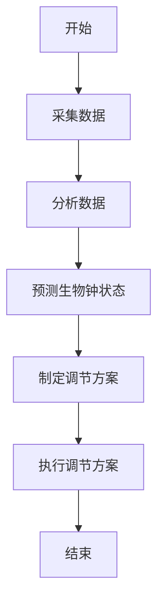
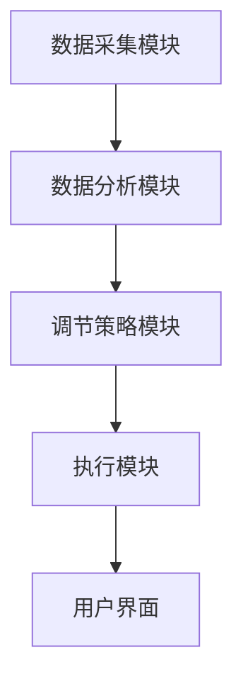

                 


# AI Agent在智能床头柜中的生物钟调节

> 关键词：AI Agent, 生物钟调节, 智能床头柜, 健康监测, 算法实现

> 摘要：本文探讨了AI Agent在智能床头柜中的生物钟调节应用，分析了生物钟调节的重要性，详细讲解了AI Agent的核心算法与实现，包括基于机器学习和强化学习的生物钟预测与调节模型。文章还介绍了系统的架构设计、项目实战案例，以及AI Agent在生物钟调节中的优化策略和实际应用效果。

---

## 第1章: 背景与问题背景

### 1.1 生物钟调节的重要性

#### 1.1.1 生物钟的基本概念与功能
生物钟是人体内的一种生理节律，主要由大脑中的视交叉上核控制，负责调节睡眠、觉醒、体温、激素分泌等多种生理功能。生物钟的正常运转对人的健康至关重要，紊乱可能导致失眠、疲劳、免疫力下降等问题。

#### 1.1.2 现代生活方式对生物钟的影响
现代社会的快节奏和电子设备的普及，导致许多人出现生物钟紊乱。不规律的作息时间、频繁的夜班工作、蓝光屏幕的使用等因素，均可能破坏生物钟的正常运转。

#### 1.1.3 生物钟紊乱的健康风险
生物钟紊乱与多种疾病相关，如失眠、抑郁症、糖尿病、心血管疾病等。研究表明，长期紊乱的生物钟可能增加患癌风险，尤其是乳腺癌和前列腺癌。

### 1.2 智能床头柜的应用场景

#### 1.2.1 智能床头柜的功能概述
智能床头柜是一种结合物联网技术的家居设备，能够通过传感器和AI技术，实时监测用户的生理数据和环境数据，提供智能化的服务。

#### 1.2.2 生物钟调节在智能床头柜中的作用
智能床头柜可以通过监测用户的睡眠质量和作息规律，结合AI算法，为用户提供个性化的生物钟调节方案。

#### 1.2.3 用户需求与痛点分析
用户对生物钟调节的需求主要集中在改善睡眠质量、提升精力和健康状况。然而，现有的调节方法往往缺乏个性化和实时性，难以满足用户的多样化需求。

### 1.3 AI Agent在生物钟调节中的优势

#### 1.3.1 AI Agent的基本概念
AI Agent是一种智能代理系统，能够感知环境、分析数据，并根据目标做出决策和行动。在生物钟调节中，AI Agent可以实时分析用户的生理数据和环境数据，制定个性化的调节策略。

#### 1.3.2 AI Agent在生物钟调节中的独特价值
AI Agent能够通过机器学习和强化学习，不断优化生物钟调节算法，提供更加精准和个性化的调节方案。

#### 1.3.3 AI Agent与其他调节方法的对比
与传统的生物钟调节方法相比，AI Agent具有实时性、个性化和自适应性等优势，能够更好地满足用户的多样化需求。

### 1.4 本章小结
生物钟调节的重要性不言而喻，智能床头柜的应用场景为AI Agent提供了广阔的应用空间。AI Agent凭借其智能性和适应性，能够有效解决传统调节方法的不足，为用户提供更优质的生物钟调节服务。

---

## 第2章: 生物钟调节的核心概念与原理

### 2.1 生物钟的调节机制

#### 2.1.1 人体生物钟的运行原理
人体生物钟通过基因调控和环境信号（如光照）进行调节。主要的调控机制包括光周期调节、温度调节和激素调节。

#### 2.1.2 环境因素对生物钟的影响
光照、温度和饮食等环境因素均会影响生物钟的运转。例如，蓝光会抑制褪黑激素的分泌，影响睡眠质量。

#### 2.1.3 生物钟调节的生理学基础
生物钟调节涉及多种生理机制，如褪黑激素的分泌、体温调节和激素平衡。这些机制相互作用，维持生物钟的正常运转。

### 2.2 AI Agent在生物钟调节中的作用

#### 2.2.1 AI Agent的核心功能
AI Agent在生物钟调节中的功能包括数据采集、分析、决策和执行。例如，通过传感器采集用户的睡眠数据，分析用户的作息规律，制定调节方案。

#### 2.2.2 AI Agent与床头柜硬件的交互
AI Agent通过床头柜的传感器获取用户的生理数据和环境数据，如心率、体温、光照强度等，并通过床头柜的反馈机制进行实时调节。

#### 2.2.3 AI Agent的数据采集与分析
AI Agent通过采集用户的生理数据和环境数据，利用机器学习算法进行分析，识别用户的生物钟状态，并制定调节方案。

### 2.3 生物钟调节的数学模型

#### 2.3.1 生物钟调节的基本数学模型
生物钟调节的数学模型通常基于微分方程，描述生物钟的振荡特性。例如，使用Hormander方程描述生物钟的周期性变化。

#### 2.3.2 AI Agent算法的数学表达
AI Agent的算法通常基于机器学习和强化学习。例如，使用神经网络模型预测生物钟状态，通过强化学习优化调节策略。

#### 2.3.3 生物钟调节的优化目标与约束条件
优化目标包括最小化生物钟紊乱的程度、最大化用户的健康状况。约束条件包括数据采集的实时性、调节方案的可行性等。

### 2.4 本章小结
本章详细介绍了生物钟调节的核心概念和原理，分析了AI Agent在生物钟调节中的作用和优势。数学模型的建立为后续的算法实现奠定了基础。

---

## 第3章: AI Agent的核心算法与实现

### 3.1 AI Agent的核心算法

#### 3.1.1 基于机器学习的生物钟预测模型
基于机器学习的生物钟预测模型通常使用神经网络，通过历史数据预测用户的生物钟状态。例如，使用LSTM网络进行时间序列预测。

#### 3.1.2 基于强化学习的调节策略
基于强化学习的调节策略通过不断试错，优化生物钟调节的策略。例如，使用Q-learning算法，通过奖励机制优化调节方案。

#### 3.1.3 多目标优化的生物钟调节算法
多目标优化算法通过综合考虑多个目标（如睡眠质量、精力水平）进行优化。例如，使用遗传算法进行多目标优化。

### 3.2 算法实现的数学模型

#### 3.2.1 生物钟预测的回归模型
生物钟预测的回归模型通常使用线性回归或非线性回归模型。例如，使用多元线性回归模型预测用户的睡眠质量。

#### 3.2.2 基于强化学习的策略优化
基于强化学习的策略优化通常使用Q-learning算法。例如，定义状态、动作和奖励，通过不断更新Q值表优化调节策略。

#### 3.2.3 生物钟调节的数学表达
生物钟调节的数学表达通常涉及多个变量和约束条件。例如，使用拉格朗日乘数法进行多目标优化。

### 3.3 算法实现的流程图
以下是生物钟调节算法的流程图：



### 3.4 本章小结
本章详细介绍了AI Agent的核心算法，包括基于机器学习和强化学习的生物钟预测与调节模型。通过数学模型和流程图的展示，为后续的系统实现提供了理论基础。

---

## 第4章: 系统架构设计与实现

### 4.1 系统架构设计

#### 4.1.1 功能模块划分
系统的功能模块包括数据采集模块、数据分析模块、调节策略模块和执行模块。例如，数据采集模块负责采集用户的生理数据和环境数据。

#### 4.1.2 系统架构图
以下是系统的架构图：



#### 4.1.3 系统交互设计
系统的交互设计通过用户界面实现，用户可以通过界面查看生物钟状态和调节方案。例如，用户可以通过界面设置调节目标和偏好。

### 4.2 系统实现

#### 4.2.1 环境搭建
系统的实现需要搭建硬件和软件环境。例如，使用树莓派作为硬件平台，Python作为编程语言。

#### 4.2.2 核心代码实现
以下是生物钟调节算法的核心代码示例：

```python
import numpy as np
import tensorflow as tf

# 数据预处理
data = np.loadtxt('data.csv', delimiter=',')
x = data[:, :-1]
y = data[:, -1]

# 构建神经网络模型
model = tf.keras.Sequential([
    tf.keras.layers.Dense(64, activation='relu'),
    tf.keras.layers.Dense(1, activation='sigmoid')
])

model.compile(optimizer='adam', loss='binary_crossentropy', metrics=['accuracy'])

# 训练模型
model.fit(x, y, epochs=100, batch_size=32)
```

#### 4.2.3 功能实现分析
系统的功能实现包括数据采集、分析、预测和调节。例如，通过神经网络模型预测用户的生物钟状态，并通过强化学习优化调节策略。

### 4.3 本章小结
本章详细介绍了系统的架构设计与实现，包括功能模块划分、系统架构图和核心代码实现。系统的实现为生物钟调节提供了技术支撑。

---

## 第5章: 项目实战与案例分析

### 5.1 项目实战

#### 5.1.1 环境搭建
项目实战需要搭建硬件和软件环境，例如使用树莓派和Python。

#### 5.1.2 核心代码实现
以下是项目的核心代码示例：

```python
import numpy as np
import tensorflow as tf

# 数据预处理
data = np.loadtxt('data.csv', delimiter=',')
x = data[:, :-1]
y = data[:, -1]

# 构建神经网络模型
model = tf.keras.Sequential([
    tf.keras.layers.Dense(64, activation='relu'),
    tf.keras.layers.Dense(1, activation='sigmoid')
])

model.compile(optimizer='adam', loss='binary_crossentropy', metrics=['accuracy'])

# 训练模型
model.fit(x, y, epochs=100, batch_size=32)
```

#### 5.1.3 功能实现分析
项目的功能实现包括数据采集、分析、预测和调节。例如，通过神经网络模型预测用户的生物钟状态，并通过强化学习优化调节策略。

### 5.2 案例分析

#### 5.2.1 案例背景
案例分析以一名长期失眠的用户为例，通过AI Agent调节其生物钟，改善其睡眠质量。

#### 5.2.2 数据分析与处理
通过分析用户的生理数据和环境数据，制定个性化的调节方案。

#### 5.2.3 调节效果评估
通过对比调节前后的数据，评估调节方案的有效性。例如，用户的睡眠质量显著提高，精力水平提升。

### 5.3 本章小结
本章通过项目实战和案例分析，展示了AI Agent在生物钟调节中的实际应用。案例分析证明了调节方案的有效性和可行性。

---

## 第6章: 总结与展望

### 6.1 总结
本文详细探讨了AI Agent在智能床头柜中的生物钟调节应用，分析了生物钟调节的重要性，详细讲解了AI Agent的核心算法与实现，包括基于机器学习和强化学习的生物钟预测与调节模型。

### 6.2 未来展望
未来的研究方向包括进一步优化AI Agent算法、扩展应用场景、提升系统的实时性和个性化水平。例如，研究基于深度学习的生物钟预测模型，探索AI Agent在其他健康领域的应用。

### 6.3 注意事项
在实际应用中，需要注意数据隐私和用户安全问题。同时，应定期更新算法和系统，以适应用户需求和环境变化。

### 6.4 拓展阅读
建议读者进一步阅读相关领域的最新研究成果，例如《生物钟调节的机器学习方法》和《强化学习在健康监测中的应用》。

---

## 关键词索引
AI Agent, 生物钟调节, 智能床头柜, 健康监测, 算法实现

