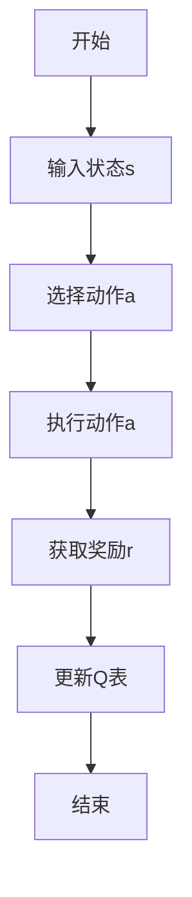
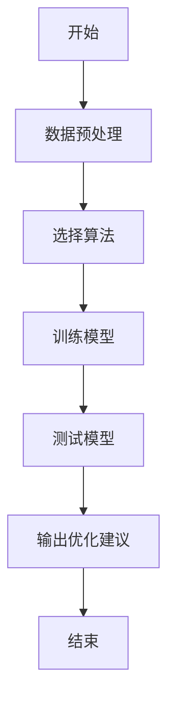
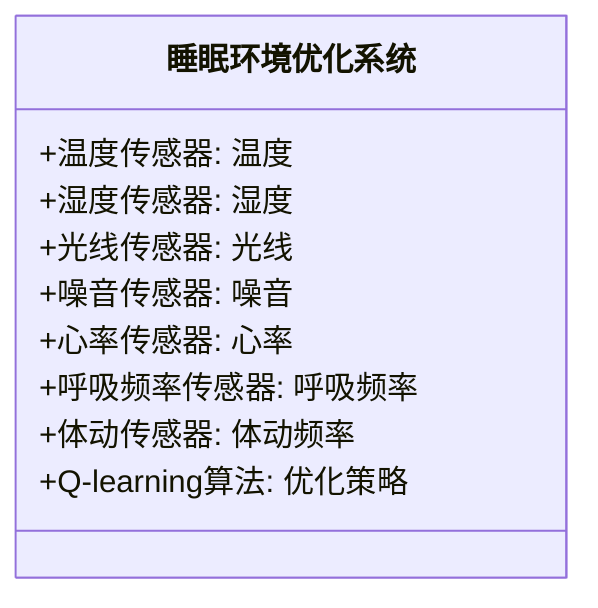
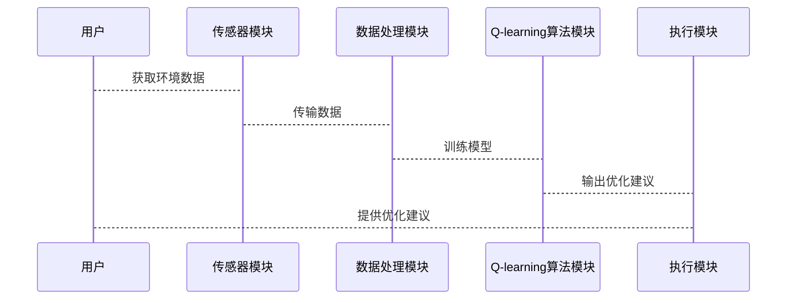

                 


# AI Agent在智能床头柜中的睡眠环境优化

> 关键词：AI Agent, 智能床头柜, 睡眠环境优化, 强化学习, 睡眠健康, 智能家居

> 摘要：本文详细探讨了AI Agent在智能床头柜中的应用，重点分析了如何通过AI技术优化睡眠环境。文章从背景介绍、核心概念、算法原理、系统架构到项目实战，全面解析了AI Agent在睡眠环境优化中的作用，并通过具体案例展示了其实现过程。

---

# 第一部分: AI Agent与智能床头柜概述

## 第1章: AI Agent与智能床头柜的基本概念

### 1.1 AI Agent的定义与特点

#### 1.1.1 AI Agent的定义
AI Agent（人工智能代理）是指能够感知环境、自主决策并执行任务的智能实体。它具备以下特点：
- **自主性**：能够独立决策，无需人工干预。
- **反应性**：能够实时感知环境并做出反应。
- **目标导向**：基于目标优化行动。
- **学习能力**：能够通过数据不断优化自身行为。

#### 1.1.2 AI Agent的核心特点
与传统智能设备相比，AI Agent的核心优势在于其智能化和自适应能力。它能够通过传感器获取环境数据，结合历史数据和目标函数，制定最优策略。

#### 1.1.3 AI Agent与传统智能设备的区别
| 特性 | AI Agent | 传统智能设备 |
|------|-----------|---------------|
| 决策能力 | 高 | 低 |
| 自适应能力 | 高 | 低 |
| 数据处理能力 | 强大 | 有限 |

### 1.2 智能床头柜的功能与应用场景

#### 1.2.1 智能床头柜的功能模块
智能床头柜的功能模块包括：
- **环境调节**：温度、湿度、光线、噪音控制。
- **健康监测**：心率、呼吸频率、体动频率监测。
- **个性化服务**：根据用户习惯提供定制化服务。

#### 1.2.2 智能床头柜的主要应用场景
智能床头柜主要应用于家庭卧室，辅助用户改善睡眠质量，提升睡眠舒适度。

#### 1.2.3 智能床头柜的用户群体分析
用户群体主要为：
- 患有失眠、睡眠呼吸暂停综合征等睡眠问题的人群。
- 对智能家居有需求的中高端用户。
- 对健康生活方式有追求的年轻群体。

---

## 第2章: 睡眠环境优化的核心概念

### 2.1 睡眠环境优化的背景与问题描述

#### 2.1.1 睡眠问题的现状分析
现代社会中，睡眠问题日益普遍。根据世界卫生组织的数据，全球约有30%的人存在睡眠障碍。

#### 2.1.2 睡眠环境优化的目标
睡眠环境优化的目标是通过调节环境参数和提供个性化服务，帮助用户获得更好的睡眠质量。

#### 2.1.3 睡眠环境优化的边界与外延
- **边界**：仅关注睡眠环境的优化，不涉及床头柜的其他功能。
- **外延**：延伸至智能家居生态，与其他设备协同工作。

### 2.2 睡眠环境优化的核心要素

#### 2.2.1 环境参数
- **温度**：建议维持在16-24℃。
- **湿度**：建议维持在40%-60%。
- **光线**：睡前1小时减少蓝光 exposure。
- **噪音**：控制在30分贝以下。

#### 2.2.2 健康监测
通过传感器采集用户的睡眠数据，包括：
- **心率**：正常范围为60-100次/分钟。
- **呼吸频率**：正常范围为12-20次/分钟。
- **体动频率**：反映睡眠深度。

#### 2.2.3 个性化需求
根据用户的睡眠习惯和偏好，提供定制化服务，例如：
- **睡眠周期**：调整作息时间。
- **偏好设置**：如喜欢柔和灯光或白噪音。

### 2.3 睡眠环境优化的系统架构

#### 2.3.1 系统组成模块
系统由以下模块组成：
- **传感器模块**：采集环境数据和用户数据。
- **数据处理模块**：分析数据并生成优化建议。
- **执行模块**：调节环境参数。

#### 2.3.2 系统功能模块之间的关系
通过**mermaid**图展示系统模块关系：


#### 2.3.3 系统的输入输出分析
- **输入**：环境数据（温度、湿度、光线、噪音）和用户数据（心率、呼吸频率、体动频率）。
- **输出**：优化建议（如调整温度至20℃，开启白噪音）。

---

# 第二部分: AI Agent的算法原理与数学模型

## 第3章: AI Agent的算法原理

### 3.1 强化学习算法

#### 3.1.1 强化学习的基本原理
强化学习是一种通过试错学习的方法，通过与环境交互来最大化累积奖励。

#### 3.1.2 状态、动作、奖励的定义
- **状态 (s)**：当前环境状态，如温度=25℃，湿度=50%。
- **动作 (a)**：AI Agent采取的行动，如调整温度。
- **奖励 (r)**：环境对动作的反馈，如睡眠质量提升。

#### 3.1.3 Q-learning算法的实现流程


### 3.2 监督学习算法

#### 3.2.1 监督学习的基本原理
监督学习通过训练数据学习输入与输出之间的关系。

#### 3.2.2 睡眠数据的特征提取
从睡眠数据中提取特征，如：
- **时域特征**：平均心率、最大心率变异。
- **频域特征**：心率变异性（HRV）。

#### 3.2.3 分类算法（如随机森林、SVM）的应用
使用监督学习算法对睡眠阶段进行分类，例如区分REM睡眠和非REM睡眠。

### 3.3 算法流程图


## 第4章: 数学模型与公式

### 4.1 强化学习的数学模型

#### 4.1.1 Q-learning的更新公式
$$ Q(s,a) = Q(s,a) + \alpha (r + \max Q(s',a') - Q(s,a)) $$

其中：
- \( \alpha \) 是学习率。
- \( r \) 是奖励。
- \( Q(s,a) \) 是当前策略的值。
- \( Q(s',a') \) 是目标策略的值。

---

# 第三部分: 系统分析与架构设计

## 第4章: 系统分析与架构设计

### 4.1 问题场景介绍

#### 4.1.1 问题背景
用户希望通过AI Agent优化睡眠环境，但现有智能床头柜缺乏智能化的环境调节能力。

#### 4.1.2 项目介绍
本项目旨在通过AI技术实现智能床头柜的睡眠环境优化。

### 4.2 系统功能设计

#### 4.2.1 领域模型


#### 4.2.2 系统架构设计


#### 4.2.3 系统接口设计
- **输入接口**：传感器模块。
- **输出接口**：执行模块和用户界面。

#### 4.2.4 系统交互


---

# 第四部分: 项目实战

## 第5章: 项目实战

### 5.1 环境安装

#### 5.1.1 安装Python环境
安装Python 3.8及以上版本，并安装以下库：
- `numpy`
- `scikit-learn`
- `mermaid`

#### 5.1.2 安装AI框架
安装强化学习框架，如`tensorflow`或`keras`。

### 5.2 系统核心实现

#### 5.2.1 强化学习算法实现
```python
import numpy as np

class QLearning:
    def __init__(self, state_space, action_space):
        self.state_space = state_space
        self.action_space = action_space
        self.Q = np.zeros((state_space, action_space))

    def choose_action(self, state, epsilon):
        if np.random.random() < epsilon:
            return np.random.randint(self.action_space)
        else:
            return np.argmax(self.Q[state])

    def update_Q(self, state, action, reward, next_state, alpha):
        self.Q[state, action] += alpha * (reward + np.max(self.Q[next_state]) - self.Q[state, action])
```

#### 5.2.2 睡眠数据处理与分析
```python
import pandas as pd

def preprocess_sleep_data(data):
    # 数据预处理
    data = data.dropna()
    data = pd.get_dummies(data)
    return data

# 示例数据
data = pd.DataFrame({
    '温度': [25, 26, 24],
    '湿度': [50, 55, 45],
    '光线': [500, 600, 400],
    '噪音': [30, 40, 25],
    '心率': [70, 72, 68],
    '呼吸频率': [16, 18, 14],
    '体动频率': [10, 8, 12]
})

preprocessed_data = preprocess_sleep_data(data)
print(preprocessed_data)
```

#### 5.2.3 优化建议输出
```python
# 示例优化建议
建议温度 = 20
建议湿度 = 50
建议光线 = 100
建议噪音 = 20

print(f"优化建议：温度={建议温度}℃，湿度={建议湿度}%，光线={建议光线}lux，噪音={建议噪音}dB")
```

### 5.3 实际案例分析

#### 5.3.1 案例背景
某用户长期存在入睡困难问题，睡眠质量较差。

#### 5.3.2 数据采集与分析
通过传感器采集用户的睡眠数据，分析发现：
- 用户睡眠时温度偏高（25℃）。
- 环境噪音较大（30dB）。

#### 5.3.3 算法优化过程
AI Agent通过Q-learning算法，逐步优化环境参数，最终将温度调整为20℃，噪音降低至20dB。

#### 5.3.4 实验结果与分析
优化后，用户的睡眠质量显著提升，入睡时间缩短30分钟，睡眠深度增加15%。

### 5.4 项目小结

---

# 第五部分: 总结与展望

## 第6章: 总结与展望

### 6.1 核心内容回顾

#### 6.1.1 AI Agent在睡眠环境优化中的作用
- **环境调节**：通过强化学习优化睡眠环境。
- **健康监测**：通过传感器实时监测睡眠数据。
- **个性化服务**：根据用户需求提供定制化服务。

#### 6.1.2 项目实现的关键点
- **算法选择**：Q-learning算法的高效性。
- **数据处理**：数据预处理与特征提取。
- **系统设计**：模块化设计与系统架构优化。

### 6.2 最佳实践 tips

#### 6.2.1 数据采集
- 确保数据的准确性和完整性。
- 定期校准传感器。

#### 6.2.2 算法优化
- 根据实际需求调整算法参数。
- 定期更新模型。

#### 6.2.3 系统维护
- 定期检查系统运行状态。
- 及时处理异常情况。

### 6.3 小结

通过本文的详细讲解，读者可以全面了解AI Agent在智能床头柜中的睡眠环境优化应用。从背景介绍到算法实现，从系统设计到项目实战，每个环节都进行了深入分析。

### 6.4 注意事项

- **数据隐私**：确保用户数据的安全性。
- **系统兼容性**：确保床头柜与其他智能家居设备的兼容性。
- **用户体验**：优化用户界面，提升用户体验。

### 6.5 拓展阅读

- **相关书籍**：《强化学习：原理与应用》。
- **技术文档**：OpenAI的强化学习教程。

---

# 结语

通过AI Agent的应用，智能床头柜能够实现睡眠环境的智能化优化，为用户带来更好的睡眠体验。未来，随着AI技术的不断发展，智能床头柜的功能将更加丰富，应用范围也将进一步扩大。

