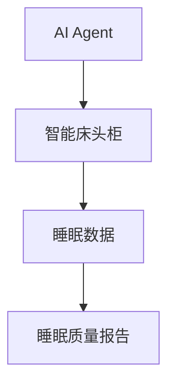
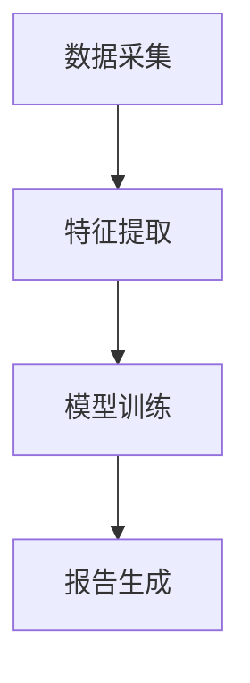
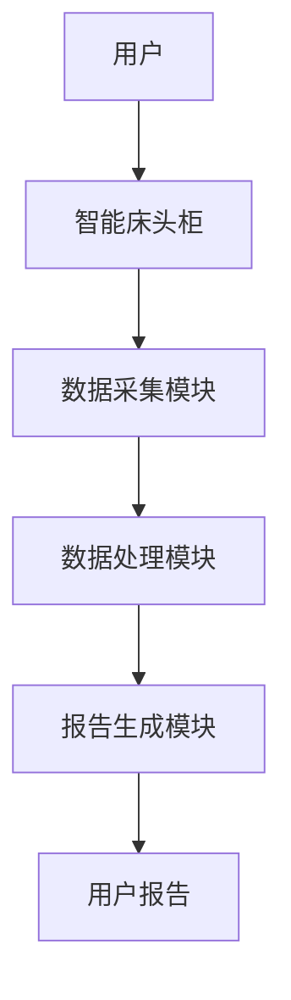

                 


# AI Agent在智能床头柜中的睡眠质量报告

## 关键词：AI Agent, 智能床头柜, 睡眠质量, 数据分析, 算法原理, 系统架构

## 摘要：  
本文探讨了AI Agent在智能床头柜中的应用，重点分析了其在睡眠质量报告生成中的作用。通过详细阐述AI Agent的核心概念、算法原理、系统架构，以及实际项目实现，展示了如何利用AI技术提升睡眠健康监测的智能化水平。

---

# 第一部分: AI Agent与智能床头柜概述

## 第1章: AI Agent在智能床头柜中的应用背景

### 1.1 AI Agent的基本概念

#### 1.1.1 什么是AI Agent  
AI Agent（人工智能代理）是指能够感知环境、执行任务并做出决策的智能实体。它能够通过传感器获取数据，利用算法进行分析，并根据结果采取相应行动。

#### 1.1.2 AI Agent的核心特点  
- **自主性**：能够自主决策和行动。  
- **反应性**：能实时感知环境变化并做出反应。  
- **学习能力**：通过数据不断优化自身算法。  
- **交互性**：能够与用户和其他设备进行交互。  

#### 1.1.3 AI Agent的应用场景  
AI Agent广泛应用于智能家居、医疗健康、自动驾驶等领域。在智能床头柜中，AI Agent主要用于睡眠监测和报告生成。

### 1.2 智能床头柜的功能与价值

#### 1.2.1 智能床头柜的定义  
智能床头柜是一种结合了物联网技术的家具，能够通过传感器和AI技术监测用户的睡眠状态，并提供相应的反馈和建议。

#### 1.2.2 智能床头柜的功能模块  
- **数据采集模块**：收集用户的睡眠数据，如心率、呼吸频率、体动次数等。  
- **数据分析模块**：对收集到的数据进行分析，评估睡眠质量。  
- **报告生成模块**：根据分析结果生成睡眠质量报告，并提供改善建议。  

#### 1.2.3 智能床头柜的用户价值  
- 提供个性化的睡眠改善建议。  
- 实时监测睡眠状态，帮助用户更好地了解自己的健康状况。  
- 与智能家居系统联动，实现更智能化的家居体验。  

### 1.3 睡眠质量报告的重要性

#### 1.3.1 睡眠质量对健康的影响  
睡眠是人体健康的重要组成部分，直接影响到精力、免疫力和心理健康。通过睡眠质量报告，用户可以更好地了解自己的睡眠状况，并采取相应的改善措施。

#### 1.3.2 睡眠监测的技术发展  
随着技术的进步，睡眠监测设备逐渐从简单的数据记录发展到智能分析和报告生成。AI技术的应用使得睡眠监测更加精准和个性化。

#### 1.3.3 睡眠质量报告的市场需求  
随着人们对健康的关注增加，市场对睡眠质量报告的需求也在不断增加。智能床头柜作为智能家居的一部分，能够满足用户对健康监测的多样化需求。

---

## 第2章: AI Agent在智能床头柜中的核心概念

### 2.1 AI Agent的核心原理

#### 2.1.1 数据采集与处理  
AI Agent通过床头柜上的传感器采集用户的睡眠数据，如心率、呼吸频率、体动次数等。这些数据需要经过预处理，去除噪声，提取有用的特征。

#### 2.1.2 数据分析与特征提取  
通过机器学习算法对数据进行分析，提取影响睡眠质量的关键特征。例如，可以通过统计分析确定睡眠中断的次数，通过时间序列分析预测睡眠周期。

#### 2.1.3 AI算法模型的应用  
AI Agent利用训练好的模型对数据进行分类和预测。例如，可以使用支持向量机（SVM）或随机森林（Random Forest）模型来预测用户的睡眠阶段。

### 2.2 睡眠质量报告的生成流程

#### 2.2.1 数据采集模块  
数据采集模块负责收集用户的睡眠数据，包括心率、呼吸频率、体动次数等。

#### 2.2.2 数据分析模块  
数据分析模块对采集到的数据进行分析，提取影响睡眠质量的关键特征。例如，可以通过统计分析确定睡眠中断的次数，通过时间序列分析预测睡眠周期。

#### 2.2.3 报告生成模块  
报告生成模块根据分析结果生成睡眠质量报告，并提供改善建议。例如，可以建议用户调整睡姿、减少咖啡因摄入等。

### 2.3 AI Agent与智能床头柜的实体关系图



---

## 第3章: AI Agent的算法原理与实现

### 3.1 数据采集与特征提取

#### 3.1.1 数据采集流程  
1. 传感器采集睡眠数据。  
2. 数据预处理：去除噪声，提取有用特征。  
3. 特征提取：通过统计分析和时间序列分析提取关键特征。

#### 3.1.2 特征提取方法  
- **统计分析**：计算睡眠中断次数、平均心率等。  
- **时间序列分析**：识别睡眠周期和阶段。  

#### 3.1.3 数据预处理技术  
- 去除噪声：使用滤波算法。  
- 数据归一化：将数据标准化，便于模型训练。  

### 3.2 睡眠质量分析算法

#### 3.2.1 算法原理概述  
AI Agent通过训练好的模型对睡眠数据进行分类和预测。例如，可以使用支持向量机（SVM）或随机森林（Random Forest）模型来预测用户的睡眠阶段。

#### 3.2.2 算法流程图



#### 3.2.3 数学模型与公式  
睡眠质量评分公式：  
$$ 评分 = a \times 睡眠时间 + b \times 睡眠深度 + c \times 睡眠周期 $$  

睡眠阶段划分模型：  
$$ 阶段划分 = \text{max}(p_1, p_2, p_3) $$  

### 3.3 数学公式解释

#### 睡眠质量评分公式  
$$ 评分 = a \times 睡眠时间 + b \times 睡眠深度 + c \times 睡眠周期 $$  
其中，$a$、$b$、$c$是权重系数，睡眠时间、睡眠深度和睡眠周期是关键特征。

#### 睡眠阶段划分模型  
$$ 阶段划分 = \text{max}(p_1, p_2, p_3) $$  
其中，$p_1$、$p_2$、$p_3$是睡眠阶段的预测概率，取值范围为0到1。

---

## 第4章: 系统架构与设计

### 4.1 系统功能设计

#### 4.1.1 数据采集模块  
- 负责采集用户的睡眠数据，如心率、呼吸频率、体动次数等。  
- 使用传感器技术，如心率传感器、加速度传感器等。

#### 4.1.2 数据处理模块  
- 对采集到的数据进行预处理，去除噪声，提取有用特征。  
- 使用统计分析和时间序列分析提取关键特征。

#### 4.1.3 报告生成模块  
- 根据分析结果生成睡眠质量报告，并提供改善建议。  
- 使用自然语言生成技术，将结果以用户友好的方式呈现。

### 4.2 系统架构设计



#### 数据采集模块  
- 传感器采集睡眠数据。  
- 数据预处理：去除噪声，提取有用特征。

#### 数据处理模块  
- 使用统计分析和时间序列分析提取关键特征。  
- 训练模型，预测睡眠阶段和评分。

#### 报告生成模块  
- 根据分析结果生成睡眠质量报告。  
- 提供改善建议，如调整睡姿、减少咖啡因摄入等。

---

## 第5章: 项目实战

### 5.1 环境安装

#### 5.1.1 系统需求  
- 操作系统：Windows/Mac/Linux  
- 硬件需求：智能床头柜、传感器、计算机  

#### 5.1.2 软件安装  
- Python 3.8以上  
- 数据处理库：Pandas、NumPy  
- 可视化库：Matplotlib  
- 机器学习库：Scikit-learn  

### 5.2 核心代码实现

#### 5.2.1 数据采集模块  
```python
import pandas as pd
import numpy as np

def collect_data(sensor_data):
    # 传感器数据格式：字典，包含心率、呼吸频率、体动次数等
    df = pd.DataFrame(sensor_data)
    return df
```

#### 5.2.2 数据处理模块  
```python
def preprocess_data(df):
    # 数据预处理：去除噪声，提取有用特征
    df['heart_rate'] = df['heart_rate'].fillna(df['heart_rate'].mean())
    df['breathing_rate'] = df['breathing_rate'].apply(lambda x: x if x > 0 else 0)
    return df
```

#### 5.2.3 睡眠质量评分模块  
```python
from sklearn.linear_model import LinearRegression

def calculate_sleep_score(X_train, y_train, X_test):
    model = LinearRegression()
    model.fit(X_train, y_train)
    score = model.predict(X_test)
    return score
```

### 5.3 案例分析

#### 5.3.1 数据采集  
假设我们从传感器中采集了以下数据：  
- 心率：每分钟平均心率  
- 呼吸频率：每分钟呼吸次数  
- 体动次数：睡眠期间的体动次数  

#### 5.3.2 数据分析  
通过对数据进行分析，我们发现用户的睡眠中断次数较多，睡眠深度较浅。  

#### 5.3.3 报告生成  
根据分析结果，生成睡眠质量报告，并建议用户调整睡姿，减少咖啡因摄入，保持良好的作息习惯。

---

## 第6章: 最佳实践与小结

### 6.1 最佳实践

#### 6.1.1 数据采集  
- 确保数据的准确性和完整性。  
- 使用高精度传感器，减少噪声干扰。  

#### 6.1.2 数据处理  
- 合理选择数据预处理方法，确保特征提取的有效性。  
- 定期更新模型，提高预测精度。  

#### 6.1.3 报告生成  
- 提供个性化建议，增强用户体验。  
- 使用可视化技术，帮助用户更好地理解报告内容。  

### 6.2 小结

通过本文的介绍，我们了解了AI Agent在智能床头柜中的应用，包括数据采集、特征提取、模型训练和报告生成等环节。AI技术的应用使得睡眠质量监测更加智能化和个性化，能够为用户提供更精准的健康建议。

### 6.3 注意事项

- 数据隐私保护：确保用户数据的安全性，防止泄露。  
- 系统稳定性：确保系统的稳定运行，避免数据丢失或误报。  
- 用户体验：报告内容需要简洁明了，便于用户理解和应用。  

### 6.4 拓展阅读

- 《机器学习实战》  
- 《深度学习入门：基于Python的特征提取与模型训练》  
- 《智能健康监测系统的设计与实现》  

---

通过以上步骤，我们可以看到AI Agent在智能床头柜中的应用不仅提升了睡眠质量监测的精度，还为用户提供了个性化的健康建议。未来，随着技术的不断发展，AI Agent在智能床头柜中的应用将会更加广泛和深入，为用户的健康保驾护航。

