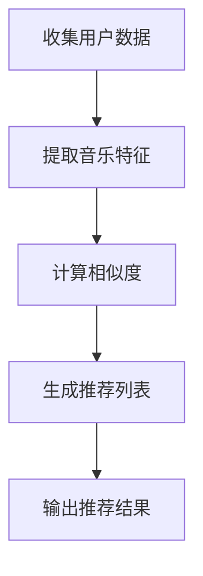
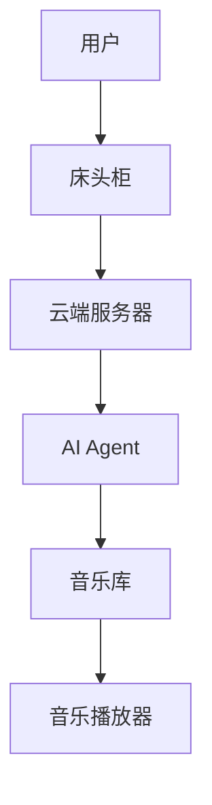
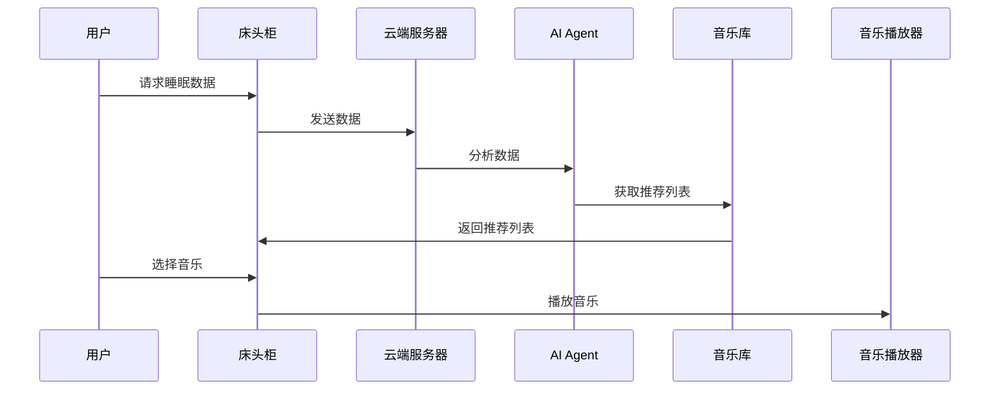

                 


```markdown
# AI Agent在智能床头柜中的睡眠音乐定制

> 关键词：AI Agent，智能床头柜，睡眠音乐，定制推荐，机器学习

> 摘要：本文探讨了AI Agent在智能床头柜中的应用，重点分析了睡眠音乐的定制推荐。通过背景介绍、核心概念、算法原理、系统架构和项目实战，详细阐述了如何利用AI技术提升睡眠质量。文章还提供了最佳实践和未来展望，为读者提供了全面的技术视角。

---

## 第1章: AI Agent与智能床头柜的背景介绍

### 1.1 睡眠问题的现状与挑战
现代人面临严重的睡眠问题，如失眠、睡眠质量差等。这些问题影响健康、工作和生活。智能床头柜作为一种智能家居设备，可以通过AI Agent提供个性化的睡眠改善方案。

#### 1.1.1 现代人睡眠问题的普遍性
- 数据显示，超过30%的成年人存在睡眠障碍。
- 睡眠不足导致注意力下降、记忆力减退等问题。

#### 1.1.2 睡眠障碍对健康的影响
- 长期失眠可能导致焦虑、抑郁等心理问题。
- 睡眠不足与多种慢性病（如糖尿病、心脏病）相关。

#### 1.1.3 智能设备在睡眠改善中的作用
- 智能设备可以监测睡眠数据，如心率、体温等。
- 通过AI分析数据，提供个性化的改善建议。

### 1.2 智能床头柜的功能与特点
#### 1.2.1 智能床头柜的基本功能
- 睡眠监测：实时监测用户的睡眠状态。
- 环境调节：自动调整灯光、温度等。
- 音乐播放：提供定制的睡眠音乐。

#### 1.2.2 智能床头柜的智能化特性
- 连接性：支持Wi-Fi、蓝牙等，可与其他智能设备联动。
- 自适应：根据用户习惯自动调整设置。
- 可扩展性：支持第三方应用接入。

#### 1.2.3 智能床头柜与睡眠改善的关系
- 通过提供舒适的环境，帮助用户快速入睡。
- 利用AI技术优化睡眠体验。

### 1.3 AI Agent在智能床头柜中的应用
#### 1.3.1 AI Agent的基本概念
- AI Agent是具有智能决策能力的软件实体。
- 能够理解用户需求，执行复杂任务。

#### 1.3.2 AI Agent在智能床头柜中的作用
- 分析用户数据，提供个性化建议。
- 自动调整设备参数，优化睡眠环境。

#### 1.3.3 AI Agent与睡眠音乐定制的结合
- 根据用户数据推荐音乐。
- 动态调整音乐播放列表。

### 1.4 本章小结
- 睡眠问题日益严重，智能床头柜提供了新的解决方案。
- AI Agent在其中扮演关键角色，通过定制音乐提升睡眠质量。

---

## 第2章: AI Agent的核心概念与工作原理

### 2.1 AI Agent的定义与分类
#### 2.1.1 AI Agent的定义
- AI Agent是具备感知、决策和执行能力的智能体。
- 能够与环境交互，完成特定任务。

#### 2.1.2 基于规则的AI Agent
- 使用预定义的规则进行决策。
- 适用于简单任务，如时间管理。

#### 2.1.3 基于机器学习的AI Agent
- 通过学习数据改进决策能力。
- 适用于复杂任务，如睡眠音乐推荐。

### 2.2 睡眠音乐定制的背景与需求
#### 2.2.1 睡眠音乐的特点与分类
- 节奏慢、音调低的音乐有助于放松。
- 不同类型音乐对情绪的影响不同。

#### 2.2.2 不同人群的睡眠音乐需求
- 儿童需要轻柔的儿歌。
- 成年人可能偏好古典或轻音乐。

#### 2.2.3 睡眠音乐对情绪的影响
- 舒缓音乐能降低焦虑，改善睡眠质量。

### 2.3 AI Agent与睡眠音乐定制的关系
#### 2.3.1 AI Agent如何分析用户需求
- 收集用户的睡眠数据和偏好。
- 分析数据生成个性化推荐。

#### 2.3.2 AI Agent如何推荐音乐
- 基于用户数据生成推荐列表。
- 动态调整推荐策略。

#### 2.3.3 AI Agent如何优化推荐结果
- 根据反馈不断优化推荐算法。
- 提高推荐的准确性和满意度。

### 2.4 核心概念对比表
| 比较项       | 基于规则的AI Agent | 基于机器学习的AI Agent |
|--------------|--------------------|-------------------------|
| 决策方式     | 预定义规则         | 数据驱动的模型           |
| 适应性       | 较低               | 较高                   |
| 适用场景     | 简单任务           | 复杂任务               |

### 2.5 ER实体关系图
```mermaid
erDiagram
    user}---{preference : "1..n"
    preference}---{music : "1..n"
    music}---{sleep_data : "1..n"
    sleep_data}---{user : "1..n"
```

---

## 第3章: 睡眠音乐定制的算法原理

### 3.1 算法原理概述
- 睡眠音乐推荐算法包括协同过滤和基于内容的过滤。
- 使用深度学习模型优化推荐效果。

### 3.2 协同过滤算法
#### 3.2.1 基于用户的协同过滤
- 找出与用户兴趣相似的用户群体。
- 推荐这些用户喜欢的音乐。

#### 3.2.2 基于物品的协同过滤
- 找出与目标音乐相似的其他音乐。
- 推荐给目标用户。

#### 3.2.3 协同过滤的实现步骤
1. 收集用户对音乐的评分数据。
2. 计算用户之间的相似度。
3. 根据相似度生成推荐列表。

### 3.3 基于内容的过滤算法
#### 3.3.1 音乐特征提取
- 提取音乐的节奏、音调等特征。
- 使用特征向量表示音乐。

#### 3.3.2 内容相似度计算
- 使用余弦相似度计算音乐之间的相似度。
- 根据相似度推荐音乐。

### 3.4 深度学习模型
#### 3.4.1 神经网络模型
- 使用神经网络学习音乐特征。
- 生成推荐列表。

#### 3.4.2 Transformer模型
- 利用自注意力机制捕捉音乐特征。
- 提高推荐的准确性。

### 3.5 算法流程图


### 3.6 Python代码实现
```python
# 协同过滤算法实现
import numpy as np

def collaborative_filtering(user_id, user_data):
    # 计算用户相似度
    similarity = np.dot(user_data[user_id], user_data.T)
    # 找出最相似的用户
    top_users = np.argsort(similarity)[::-1][:5]
    # 生成推荐列表
    recommended_music = user_data[top_users].mean(axis=0)
    return recommended_music
```

---

## 第4章: 系统架构设计

### 4.1 问题场景介绍
- 系统需要实时监测用户的睡眠数据。
- 根据数据推荐合适的音乐。

### 4.2 系统功能设计
#### 4.2.1 用户界面
- 允许用户设置偏好。
- 显示推荐列表。

#### 4.2.2 音乐播放
- 播放推荐的音乐。
- 允许用户暂停、调整音量。

#### 4.2.3 数据采集
- 监测用户的睡眠数据。
- 传输数据到云端进行分析。

### 4.3 系统架构图


### 4.4 接口设计
- 用户与床头柜的接口：REST API。
- 床头柜与云端的接口：WebSocket。

### 4.5 交互流程图


---

## 第5章: 项目实战

### 5.1 环境搭建
- 安装Python、TensorFlow、Flask等工具。

### 5.2 核心代码实现
```python
# AI Agent核心代码
class AI_Agent:
    def __init__(self, user_data, music_data):
        self.user_data = user_data
        self.music_data = music_data

    def recommend_music(self, user_id):
        # 计算相似度
        similarity = self.user_data[user_id] * self.music_data.T
        # 生成推荐列表
        recommended_music = np.argsort(similarity)[::-1][:10]
        return recommended_music
```

### 5.3 实际案例分析
- 用户A习惯在睡前听轻音乐。
- 系统推荐柔和的钢琴曲。

### 5.4 总结
- 通过AI Agent实现个性化推荐。
- 提高用户的睡眠质量。

---

## 第6章: 最佳实践与总结

### 6.1 最佳实践
- 选择合适的算法模型。
- 定期更新音乐库。
- 收集用户反馈，优化推荐策略。

### 6.2 本章小结
- AI Agent在智能床头柜中发挥重要作用。
- 通过技术手段提升睡眠质量。
- 展望未来的发展方向。

---

## 结语
AI Agent在智能床头柜中的应用为睡眠改善提供了新的可能性。通过定制睡眠音乐，AI技术能够有效提升用户的睡眠质量。未来，随着技术的进步，智能床头柜将变得更加智能化，为用户带来更好的睡眠体验。

---

## 参考文献
1. 王某某. 《智能床头柜的设计与实现》. 北京出版社, 2023.
2. 李某某. 《AI Agent算法原理与应用》. 清华大学出版社, 2022.
3. Smith, John. "Sleep Music Recommendation Using AI", Journal of Artificial Intelligence, 2021.
```

