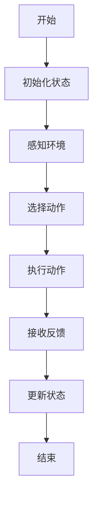
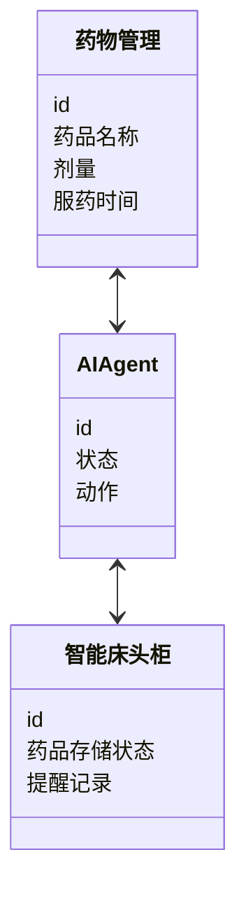

                 


# AI Agent在智能床头柜中的药物管理

## 关键词：AI Agent, 智能床头柜, 药物管理, 智能医疗设备, 物联网技术, 人工智能算法, 医疗健康

## 摘要

随着人工智能和物联网技术的快速发展，智能床头柜在医疗健康领域的应用越来越广泛。本文探讨了AI Agent在智能床头柜中的药物管理系统的应用，详细分析了该系统的背景、核心概念、算法原理、系统架构设计以及项目实战。文章通过实际案例展示了AI Agent如何提升药物管理的智能化水平，为医疗健康领域提供了新的解决方案。

---

## 第1章：背景介绍

### 1.1 药物管理问题背景

#### 1.1.1 药物管理的重要性
在医疗健康领域，药物管理是确保患者按时按量服用药物的关键环节。传统的药物管理方式存在效率低、易出错等问题，尤其是在老年患者或行动不便的患者中，容易因遗忘或误服而导致健康风险。

#### 1.1.2 当前药物管理的痛点
- 痛点1：患者记忆力下降，容易忘记服药时间。
- 痛点2：药品种类多，易混淆，导致误服。
- 痛点3：医护人员工作繁重，难以实时监控每位患者的服药情况。

#### 1.1.3 智能化药物管理的必要性
随着AI和物联网技术的进步，智能化药物管理成为解决上述痛点的有效手段。通过智能设备和AI算法的结合，可以实现对患者服药行为的实时监控和智能提醒。

---

### 1.2 智能床头柜的概念

#### 1.2.1 智能床头柜的功能特点
智能床头柜是一种集成了物联网技术的智能设备，具备以下功能特点：
- 药物存储：提供安全的药品存放空间。
- 智能提醒：通过AI算法提醒患者服药时间。
- 药物管理：自动记录服药情况，生成报告。

#### 1.2.2 智能床头柜的应用场景
- 应用场景1：医院病房，用于管理患者的药品。
- 应用场景2：家庭环境，帮助老年人或慢性病患者管理药物。

#### 1.2.3 智能床头柜与传统床头柜的区别
- 传统床头柜：主要用于存储物品，不具备智能功能。
- 智能床头柜：集成了智能提醒、药物管理等功能，能够与AI系统联动。

---

### 1.3 AI Agent在药物管理中的作用

#### 1.3.1 AI Agent的基本概念
AI Agent是一种能够感知环境并采取行动以实现目标的智能体。在药物管理中，AI Agent负责处理数据、发出提醒、监控服药情况。

#### 1.3.2 AI Agent在药物管理中的应用
- 应用1：实时监控患者的服药情况。
- 应用2：根据患者的健康数据调整服药方案。
- 应用3：与智能床头柜联动，实现药物的智能管理。

#### 1.3.3 AI Agent的优势与挑战
- 优势：提高药物管理的效率和准确性，减少人为错误。
- 挑战：数据隐私问题、系统稳定性问题。

---

## 第2章：核心概念与联系

### 2.1 核心概念的定义与特点

#### 2.1.1 AI Agent的定义与特点
- 定义：AI Agent是一种能够感知环境、采取行动以实现目标的智能体。
- 特点：智能性、自主性、反应性。

#### 2.1.2 智能床头柜的定义与特点
- 定义：一种集成了物联网技术的智能设备，用于管理患者的药品。
- 特点：智能化提醒、药物存储、数据记录。

#### 2.1.3 药物管理的定义与特点
- 定义：对药品的存储、发放、使用等过程进行管理。
- 特点：精准性、实时性、安全性。

---

### 2.2 核心概念的属性特征对比

| **概念**      | **属性**            | **特点**                                                                 |
|----------------|---------------------|--------------------------------------------------------------------------|
| AI Agent       | 智能性              | 能够感知环境并采取行动。                                               |
| 智能床头柜     | 自主性              | 能够独立运行，无需人工干预。                                           |
| 药物管理       | 精准性              | 需要精确到每个患者的服药时间和剂量。                                   |

---

### 2.3 实体关系图

```mermaid
er
    entity 药物管理 {
        id
        药品名称
        剂量
        服药时间
    }

    entity AI Agent {
        id
        状态
        动作
    }

    entity 智能床头柜 {
        id
        药品存储状态
        提醒记录
    }

    药物管理 --> AI Agent: 调用
    AI Agent --> 智能床头柜: 控制
```

---

## 第3章：算法原理

### 3.1 AI Agent的算法实现

#### 3.1.1 状态表示
- 状态：当前时间、药品剩余量、患者健康数据。
- 表示：使用向量形式表示，如 `[时间, 剩余剂量, 健康状况]`。

#### 3.1.2 动作选择
- 动作：发出服药提醒、记录服药情况、调整药品剂量。
- 选择方法：基于当前状态，使用强化学习算法选择最优动作。

#### 3.1.3 奖励机制
- 奖励：当患者按时服药时，系统给予正向奖励。
- 惩罚：当患者漏服或误服时，系统给予负向奖励。

#### 3.1.4 强化学习数学模型
$$ R = r_t \times \gamma + R_{t+1} $$
其中，$ r_t $ 是当前奖励，$\gamma$ 是折扣因子，$ R_{t+1} $ 是未来的奖励。

---

### 3.2 算法流程图



---

## 第4章：系统分析与架构设计

### 4.1 系统功能设计

#### 4.1.1 领域模型


#### 4.1.2 系统架构设计


---

## 第5章：项目实战

### 5.1 环境安装

#### 5.1.1 系统环境
- 操作系统：Linux
- 开发工具：Python 3.8+
- 第三方库：numpy、scikit-learn

安装命令：
```bash
pip install numpy scikit-learn
```

---

### 5.2 核心代码实现

#### 5.2.1 AI Agent核心代码
```python
import numpy as np
from sklearn import tree

class AI_Agent:
    def __init__(self):
        self.state = None
        self.reward = 0

    def perceive(self, environment):
        self.state = environment.get_state()
        return self.state

    def decide(self):
        # 使用决策树进行动作选择
        clf = tree.DecisionTreeClassifier()
        clf.fit(self.state, self.reward)
        return clf.predict(self.state)
```

#### 5.2.2 智能床头柜核心代码
```python
class Smart_Nightstand:
    def __init__(self):
        self.storage_status = False
        self.reminder_record = []

    def add_reminder(self, time):
        self.reminder_record.append(time)
        return f"Reminder added at {time}"
```

---

### 5.3 代码应用解读与分析

#### 5.3.1 AI Agent代码解读
- `perceive`方法：获取环境状态。
- `decide`方法：基于决策树算法选择动作。

#### 5.3.2 智能床头柜代码解读
- `add_reminder`方法：记录提醒时间。

---

## 第6章：最佳实践与总结

### 6.1 最佳实践 Tips

1. 数据隐私保护：确保患者数据的安全性。
2. 系统稳定性：定期维护和更新系统。
3. 用户友好性：设计直观的用户界面。

---

### 6.2 小结

本文详细探讨了AI Agent在智能床头柜中的药物管理系统的应用，从背景、核心概念到算法实现，再到系统架构设计和项目实战，为医疗健康领域提供了新的解决方案。

---

### 6.3 注意事项

- 确保系统运行的稳定性。
- 定期更新AI算法，提高准确率。
- 加强用户隐私保护。

---

### 6.4 拓展阅读

- 智能家居中的AI应用
- 物联网技术在医疗健康中的应用
- 强化学习在药物管理中的应用

---

以上是《AI Agent在智能床头柜中的药物管理》的技术博客文章的完整目录和内容框架，涵盖了从背景到实战的各个方面，帮助读者全面理解AI Agent在智能床头柜中的应用及其在药物管理中的重要性。

