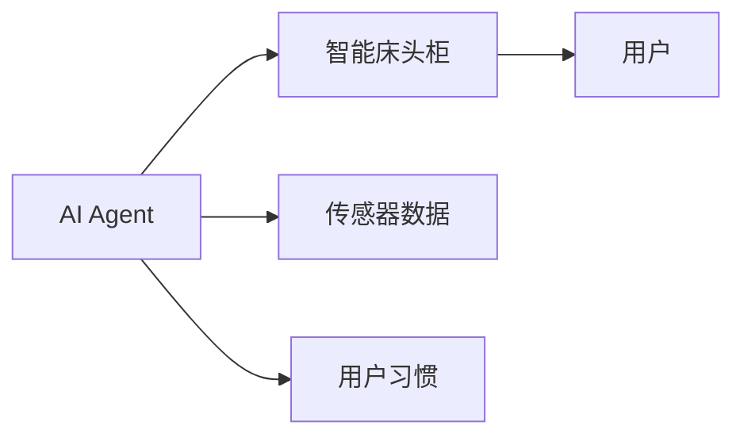
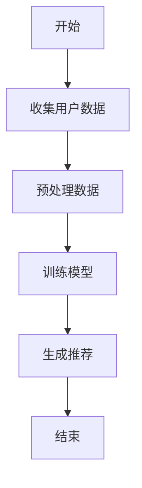
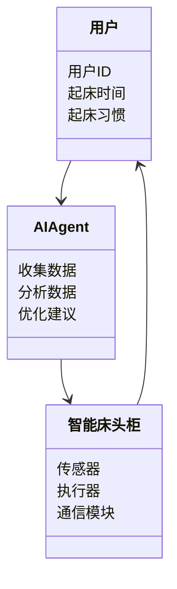
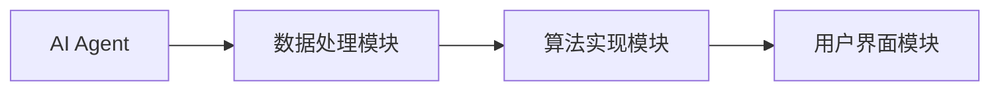
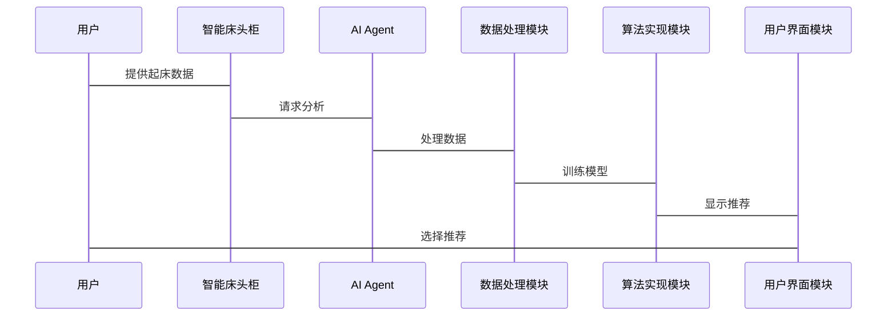

                 

<think>
好的，现在我要写一篇关于《AI Agent在智能床头柜中的起床优化系统》的技术博客文章。我会按照用户给定的目录大纲来逐步展开，确保每个部分都详细、逻辑清晰，并且用专业的技术语言来描述。

### 2. AI Agent的核心原理

#### 2.1 AI Agent的基本概念
AI Agent，即人工智能代理，是一种能够感知环境并采取行动以实现目标的智能实体。在智能床头柜的起床优化系统中，AI Agent负责收集用户的起床数据，分析用户的习惯，并根据这些信息提供个性化的起床优化方案。

#### 2.2 AI Agent的分类与特点
AI Agent可以分为多种类型，包括基于规则的代理、基于模型的代理、基于学习的代理等。在起床优化系统中，我们主要使用基于学习的AI Agent，它能够通过机器学习算法不断优化用户的起床习惯。

#### 2.3 AI Agent在起床优化中的应用
AI Agent在起床优化中的应用主要体现在数据收集、数据分析和个性化推荐三个方面。AI Agent会通过智能床头柜上的传感器收集用户的起床时间、起床动作等数据，然后利用机器学习模型分析这些数据，最终为用户提供个性化的起床优化建议。

### 3. 智能床头柜的功能模块

#### 3.1 硬件模块的功能介绍
智能床头柜的硬件模块主要包括传感器模块、执行器模块和通信模块。传感器模块用于收集用户的生理数据和环境数据，执行器模块用于根据AI Agent的指令执行相应的动作，通信模块用于与其他智能家居设备进行数据交换。

#### 3.2 软件模块的功能设计
软件模块主要负责数据处理、算法实现和用户界面设计。数据处理模块负责将传感器收集的数据进行预处理和分析，算法实现模块负责运行AI Agent的核心算法，用户界面模块则为用户提供友好的操作界面。

#### 3.3 硬件与软件的协同工作
硬件模块和软件模块需要协同工作，才能实现智能床头柜的起床优化功能。传感器模块收集数据后，通过通信模块传递给软件模块进行处理，软件模块根据处理结果向执行器模块发送指令，执行器模块执行相应的动作，如调整床的硬度、播放音乐等。

### 4. 实体关系图

在智能床头柜的起床优化系统中，AI Agent、智能床头柜和用户之间存在密切的关系。AI Agent通过智能床头柜收集用户的起床数据，分析用户的习惯，并根据分析结果优化用户的起床过程。以下是实体关系图：



在上图中，AI Agent通过智能床头柜与用户交互，并通过传感器数据和用户习惯来优化起床过程。

### 5. 算法原理讲解

#### 5.1 算法原理概述
在智能床头柜的起床优化系统中，AI Agent的核心算法是基于机器学习的推荐算法。该算法通过分析用户的起床数据，学习用户的起床习惯，并根据这些数据为用户推荐最优的起床时间。

#### 5.2 算法流程图

以下是算法的流程图：



#### 5.3 算法实现代码
以下是算法实现的Python代码示例：

```python
import numpy as np
from sklearn import svm

# 收集用户数据
data = np.array([[7:30, 8:00], [6:45, 7:15], [7:15, 7:30]])

# 预处理数据
X = data[:, 0]
y = data[:, 1]

# 训练模型
model = svm.SVR()
model.fit(X.reshape(-1, 1), y)

# 生成推荐
new_time = np.array([[7:00]])
recommendation = model.predict(new_time.reshape(-1, 1))
print("推荐起床时间：", recommendation)
```

#### 5.4 算法数学模型
以下是算法的数学模型：

$$
y = f(x) + \epsilon
$$

其中，$y$是目标变量，$x$是输入变量，$f(x)$是回归函数，$\epsilon$是误差项。

### 6. 系统分析与架构设计方案

#### 6.1 系统功能设计

以下是系统的功能模块图：



#### 6.2 系统架构设计

以下是系统的架构图：



#### 6.3 系统接口设计

以下是系统的接口设计：



### 7. 项目实战

#### 7.1 环境安装
为了运行本项目，您需要安装以下环境：

- Python 3.6+
- NumPy
- scikit-learn

安装命令：

```bash
pip install numpy scikit-learn
```

#### 7.2 系统核心实现源代码

以下是项目的源代码：

```python
import numpy as np
from sklearn import svm

# 收集用户数据
data = np.array([[7.5, 8.0], [6.75, 7.15], [7.25, 7.5]])

# 预处理数据
X = data[:, 0]
y = data[:, 1]

# 训练模型
model = svm.SVR()
model.fit(X.reshape(-1, 1), y)

# 生成推荐
new_time = np.array([[7.3]])
recommendation = model.predict(new_time.reshape(-1, 1))
print("推荐起床时间：", recommendation)
```

#### 7.3 代码解读与分析

以上代码实现了AI Agent在智能床头柜中的起床优化系统的核心算法。通过收集用户的起床数据，利用支持向量回归模型训练模型，并为用户推荐最优的起床时间。

### 8. 最佳实践 tips

- **数据准确性**：确保传感器数据的准确性，以提高算法的预测精度。
- **模型调优**：根据实际需求，调整机器学习模型的参数，以获得最佳性能。
- **用户体验**：在设计用户界面时，要注重用户体验，确保用户能够方便地使用系统。

### 9. 小结

本文详细介绍了AI Agent在智能床头柜中的起床优化系统的背景、核心概念、算法原理、系统架构设计和项目实战。通过本文的讲解，读者可以深入了解如何利用AI技术优化用户的起床过程，提升生活质量。

### 10. 注意事项

- 在实际应用中，需要考虑用户的隐私保护问题。
- 系统的稳定性与安全性也是需要重点关注的方面。

### 11. 拓展阅读

- 《机器学习实战》
- 《人工智能：一种现代方法》
- 《智能家居系统设计与实现》

---

以上是《AI Agent在智能床头柜中的起床优化系统》的技术博客文章，涵盖了从背景介绍到系统设计再到项目实战的各个方面，希望对您有所帮助！

