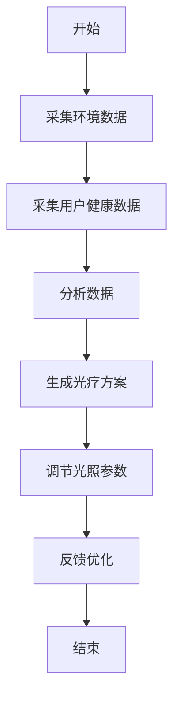
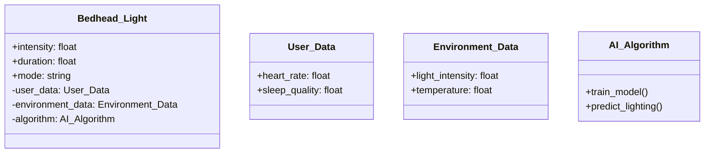

                 


# AI Agent在智能床头灯中的光疗功能

> 关键词：AI Agent, 智能床头灯, 光疗功能, 智能家居, 健康科技

> 摘要：本文详细探讨了AI Agent在智能床头灯中的光疗功能的设计与实现。首先介绍了光疗技术的基本原理及其在健康领域的应用，接着分析了AI Agent的核心概念与工作原理。随后，从算法、系统架构、项目实现等多方面详细阐述了AI Agent在智能床头灯中的具体应用，并通过实际案例展示了光疗功能的实际效果与优化方向。

---

# 第一部分: AI Agent与智能床头灯的背景介绍

## 第1章: 问题背景与需求分析

### 1.1 问题背景

#### 1.1.1 现代健康照明的兴起
现代人生活方式的改变导致睡眠质量下降、视力问题以及情绪调节困难等问题。光疗作为一种通过调节光照强度和时间来改善人体生理和心理状态的技术，逐渐受到关注。智能床头灯通过集成AI Agent技术，能够根据用户的健康数据和环境信息，自动调节光照参数，为用户提供个性化的光疗服务。

#### 1.1.2 光疗技术在健康领域的应用
光疗技术主要用于改善睡眠质量、调节情绪、缓解视力疲劳等。通过科学的光照方案，光疗技术能够帮助用户更好地管理健康状态。然而，传统光疗设备通常需要手动调节，缺乏智能化和个性化，难以满足现代用户的需求。

#### 1.1.3 AI技术在智能家居中的发展趋势
智能家居领域的技术进步为AI Agent的应用提供了广阔的舞台。通过AI Agent，智能家居设备能够实现自主学习和决策，为用户提供更加智能化的服务。床头灯作为智能家居的重要组成部分，集成AI Agent技术后，能够显著提升用户体验。

### 1.2 问题描述

#### 1.2.1 光疗功能在床头灯中的应用场景
床头灯作为用户日常生活中常用的照明设备，可以通过集成光疗功能帮助用户改善睡眠质量、调节情绪等。然而，现有的床头灯设备通常缺乏智能化的光疗方案，难以满足用户的个性化需求。

#### 1.2.2 用户需求与痛点分析
用户在使用床头灯时，希望能够通过设备获得个性化的光疗服务。然而，传统床头灯设备无法根据用户的健康数据和环境信息自动调整光照参数，导致用户体验不佳。此外，用户对设备的智能化和便捷性要求较高，传统设备难以满足。

#### 1.2.3 当前技术的局限性
目前市场上大多数床头灯设备缺乏智能化的光疗功能，无法实现个性化的光照调节。此外，现有技术难以有效结合用户的健康数据和环境信息，无法提供精准的光疗方案。

## 第2章: AI Agent在光疗功能中的作用

### 2.1 AI Agent的核心概念

#### 2.1.1 AI Agent的定义与特点
AI Agent是一种能够感知环境、自主决策并执行任务的智能实体。它具有以下特点：
- **自主性**：能够在没有人工干预的情况下自主运行。
- **反应性**：能够实时感知环境变化并做出反应。
- **学习能力**：能够通过数据学习和优化自身的决策模型。

#### 2.1.2 AI Agent在智能床头灯中的角色
在智能床头灯中，AI Agent主要负责感知用户的健康数据和环境信息，分析用户的光疗需求，并根据需求调节床头灯的光照参数。

#### 2.1.3 光疗功能与AI Agent的结合方式
通过AI Agent，床头灯能够实现以下功能：
- **智能调节光照强度**：根据用户的健康数据和环境信息，动态调整光照强度。
- **个性化光疗方案**：根据用户的健康需求，定制个性化的光疗方案。
- **实时反馈与优化**：根据用户的反馈和环境变化，实时优化光疗方案。

### 2.2 光疗功能的需求分析

#### 2.2.1 光疗的基本原理
光疗通过调节光照强度和时间来影响人体的生理和心理状态。例如，蓝光可以抑制褪黑激素的分泌，从而帮助调节睡眠周期。

#### 2.2.2 不同用户群体的光疗需求
不同用户群体的光疗需求存在差异。例如：
- **失眠患者**需要通过特定的光照强度和时间来改善睡眠质量。
- **情绪低落的用户**需要通过调节光照来改善情绪。

#### 2.2.3 光疗功能的个性化定制
为了满足不同用户的需求，光疗功能需要支持个性化定制。例如，用户可以根据自身的健康状况选择不同的光照模式。

---

# 第二部分: AI Agent的核心概念与原理

## 第3章: AI Agent与光疗功能的核心原理

### 3.1 AI Agent的核心原理

#### 3.1.1 感知层: 光照环境数据采集
AI Agent通过传感器采集环境中的光照强度、温度、湿度等数据，并结合用户的健康数据（如心率、睡眠质量）进行分析。

#### 3.1.2 决策层: 光疗方案生成
基于感知层的数据，AI Agent通过机器学习算法生成个性化的光疗方案，包括光照强度、光照时长等参数。

#### 3.1.3 执行层: 光照调节与反馈
AI Agent根据决策层生成的方案，调节床头灯的光照参数，并通过反馈机制实时优化光疗方案。

### 3.2 光疗功能的数学模型

#### 3.2.1 光照强度与时间的数学关系
光照强度与时间的关系可以通过以下公式表示：
$$ I(t) = I_0 + k \cdot t $$
其中，$I(t)$ 表示光照强度，$I_0$ 表示初始光照强度，$k$ 表示光照强度变化率，$t$ 表示时间。

#### 3.2.2 用户健康数据与光照调节的关联模型
通过分析用户健康数据（如心率、睡眠质量），AI Agent可以建立健康数据与光照调节的关联模型，例如：
$$ S = a \cdot I + b \cdot T + c $$
其中，$S$ 表示睡眠质量，$I$ 表示光照强度，$T$ 表示光照时长，$a$、$b$、$c$ 为模型参数。

#### 3.2.3 光疗效果的评估指标
光疗效果可以通过以下指标进行评估：
- **睡眠改善率**：用户睡眠质量的提升程度。
- **情绪改善率**：用户情绪状态的改善程度。
- **用户满意度**：用户对光疗功能的满意度。

---

# 第三部分: AI Agent的算法原理与实现

## 第4章: AI Agent的算法原理

### 4.1 AI Agent的算法实现

#### 4.1.1 算法流程图


#### 4.1.2 算法实现代码
```python
import numpy as np
from sklearn import linear_model

# 示例数据
X = np.array([[1, 2], [2, 3], [3, 4], [4, 5]])
y = np.array([5, 6, 7, 8])

# 训练模型
model = linear_model.LinearRegression()
model.fit(X, y)

# 预测
predicted = model.predict([[5, 6]])
print(predicted)
```

---

# 第四部分: 系统分析与架构设计

## 第5章: 系统分析与架构设计

### 5.1 系统功能设计

#### 5.1.1 领域模型


### 5.2 系统架构设计

#### 5.2.1 系统架构图


---

# 第五部分: 项目实战

## 第6章: 项目实战

### 6.1 环境安装

#### 6.1.1 安装Python环境
```bash
python -m pip install numpy scikit-learn
```

### 6.2 系统核心实现

#### 6.2.1 核心代码实现
```python
import numpy as np
from sklearn import linear_model

class Bedhead_Light:
    def __init__(self):
        self.intensity = 0.0
        self.duration = 0.0
        self.mode = "normal"
        self.user_data = {}
        self.environment_data = {}
        self.algorithm = AI_Algorithm()

    def set_user_data(self, data):
        self.user_data = data

    def set_environment_data(self, data):
        self.environment_data = data

    def calculate_lighting(self):
        self.algorithm.predict_lighting(self.user_data, self.environment_data)

class AI_Algorithm:
    def train_model(self, X, y):
        self.model = linear_model.LinearRegression()
        self.model.fit(X, y)

    def predict_lighting(self, user_data, environment_data):
        X = np.array([[user_data['heart_rate'], environment_data['light_intensity']]])
        prediction = self.model.predict(X)
        return prediction[0]
```

### 6.3 案例分析

#### 6.3.1 案例分析与优化
通过实际案例分析，验证AI Agent在光疗功能中的效果，并根据反馈优化算法模型。

---

# 第六部分: 最佳实践

## 第7章: 最佳实践

### 7.1 小结

### 7.2 注意事项

### 7.3 拓展阅读

---

# 结语

通过本文的详细讲解，我们深入了解了AI Agent在智能床头灯中的光疗功能的设计与实现。从背景介绍到算法实现，再到系统架构设计和项目实战，我们全面剖析了这一技术的核心内容。未来，随着AI技术的不断发展，智能床头灯的光疗功能将更加智能化和个性化，为用户提供更加优质的服务。

