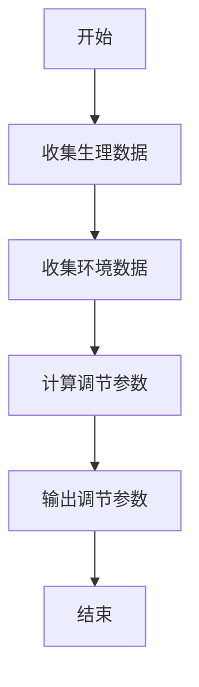
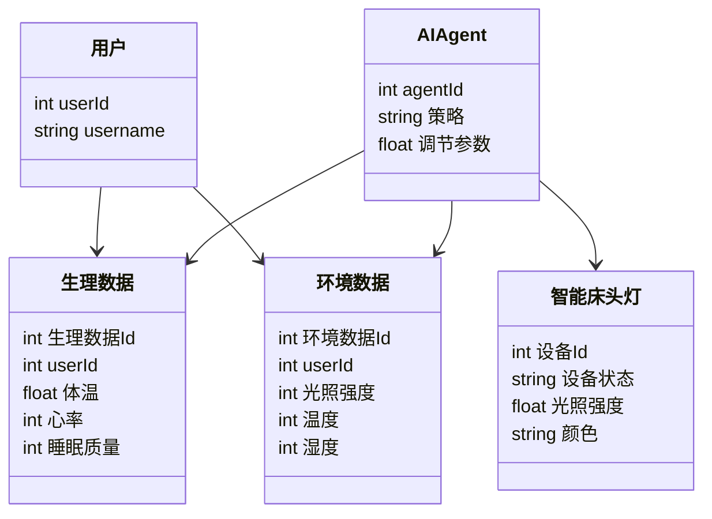
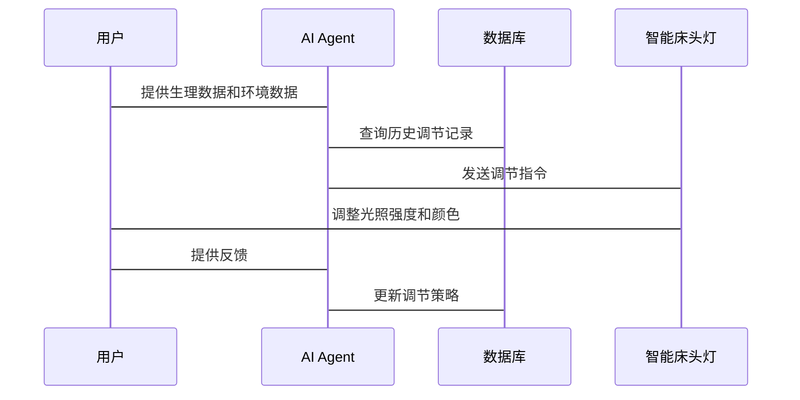

                 


```markdown
# AI Agent在智能床头灯中的生理节律调节

> 关键词：AI Agent，生理节律调节，智能床头灯，机器学习，系统架构

> 摘要：本文详细探讨了AI Agent在智能床头灯中的应用，重点分析了其在生理节律调节中的原理、算法设计、系统架构以及实际应用案例。通过系统分析和项目实战，展示了如何利用AI技术优化生理节律调节，提升用户体验。

---

## 第一部分: AI Agent与生理节律调节概述

### 第1章: AI Agent与生理节律调节的背景与概念

#### 1.1 生理节律调节的背景与问题背景
##### 1.1.1 生理节律的基本概念
生理节律是指生物体内各种生理过程的时间规律性变化，例如睡眠-觉醒周期、体温调节、激素分泌等。这些节律通常由体内的生物钟控制，受外界环境因素（如光照、温度）的影响。

##### 1.1.2 生理节律调节的重要性
良好的生理节律对健康至关重要，失调可能导致失眠、情绪波动、免疫力下降等问题。在现代社会，由于生活方式的变化，许多人面临生理节律紊乱的问题，尤其是在夜间使用电子设备过多的情况下。

##### 1.1.3 AI在生理节律调节中的应用潜力
AI技术可以通过分析用户的生理数据（如心率、体温、睡眠质量）和环境数据（如光照、温度），提供个性化的调节方案，帮助用户恢复或优化生理节律。

#### 1.2 AI Agent的基本概念与特点
##### 1.2.1 AI Agent的定义
AI Agent是一种智能体，能够感知环境、自主决策并执行任务。它可以在没有人工干预的情况下，根据输入的信息做出反应。

##### 1.2.2 AI Agent的核心特点
- **自主性**：能够自主决策和行动。
- **反应性**：能实时感知环境并做出反应。
- **学习能力**：通过机器学习算法不断优化自身的调节策略。

##### 1.2.3 AI Agent与传统控制系统的区别
AI Agent能够根据实时数据动态调整策略，而传统控制系统通常基于预设规则进行静态控制。

#### 1.3 智能床头灯与生理节律调节的结合
##### 1.3.1 智能床头灯的功能与应用场景
智能床头灯可以根据用户的生理数据和环境数据，调节光照强度、颜色和温度，帮助用户改善睡眠质量。

##### 1.3.2 生理节律调节在智能床头灯中的应用价值
通过AI Agent，智能床头灯可以实时监测用户的生理数据，提供个性化的光照调节方案，帮助用户恢复生理节律。

##### 1.3.3 本章小结
本章介绍了生理节律调节的背景、AI Agent的基本概念以及智能床头灯在其中的应用。

---

## 第二部分: AI Agent的原理与技术基础

### 第2章: 生理节律调节的核心概念与联系

#### 2.1 生理节律调节的核心概念
##### 2.1.1 生理节律调节的定义
生理节律调节是指通过外部干预手段（如光照、温度）来调整生物体内生理过程的时间规律性。

##### 2.1.2 生理节律调节的关键要素
- **输入数据**：心率、体温、睡眠质量等生理数据，以及光照、温度等环境数据。
- **调节目标**：优化生理节律，提升用户的健康状况。

##### 2.1.3 生理节律调节的边界与外延
生理节律调节的边界在于如何在不影响用户正常生活的前提下，提供有效的调节方案。

#### 2.2 AI Agent与生理节律调节的关系
##### 2.2.1 AI Agent在生理节律调节中的作用
AI Agent可以通过分析生理数据和环境数据，制定个性化的调节方案，并通过智能床头灯执行调节策略。

##### 2.2.2 生理节律调节对AI Agent的需求
- **实时性**：需要快速响应用户的生理数据变化。
- **个性化**：每个用户的生理节律不同，需要个性化的调节方案。

#### 2.3 核心概念的ER实体关系图
```mermaid
erDiagram
    user {
        +int userId
        +string username
        +datetime timestamp
    }
   生理数据 {
        +int生理数据Id
        +int userId
        +float体温
        +int心率
        +int睡眠质量
    }
    环境数据 {
        +int环境数据Id
        +int userId
        +int光照强度
        +int温度
        +int湿度
    }
    AI Agent {
        +int agentId
        +string策略
        +float调节参数
    }
    智能床头灯 {
        +int设备Id
        +string设备状态
        +float光照强度
        +string颜色
    }
    用户与生理数据 : N -> 1
    用户与环境数据 : N -> 1
    AI Agent与生理数据 : 1 -> N
    AI Agent与环境数据 : 1 -> N
    AI Agent与智能床头灯 : 1 -> 1
```

---

### 第3章: AI Agent的算法原理与数学模型

#### 3.1 AI Agent的算法原理
##### 3.1.1 基于机器学习的AI Agent算法
- **输入**：用户的生理数据和环境数据。
- **输出**：调节策略（如调整光照强度、颜色）。

##### 3.1.2 基于强化学习的AI Agent算法
- **状态**：用户的生理数据和环境数据。
- **动作**：调节床头灯的参数。
- **奖励**：用户的舒适度评分。

##### 3.1.3 基于反馈机制的AI Agent算法
- **输入**：用户的反馈（如满意度评分）。
- **输出**：优化后的调节策略。

#### 3.2 生理节律调节的数学模型
##### 3.2.1 生理节律调节的基本数学模型
生理节律调节模型通常基于时间序列数据，可以使用循环神经网络（RNN）进行建模。

##### 3.2.2 AI Agent调节生理节律的数学模型
```latex
$$ P(t) = a \cdot P(t-1) + b \cdot U(t) + c \cdot E(t) $$
其中：
- \( P(t) \) 表示当前时刻的调节参数。
- \( P(t-1) \) 表示上一时刻的调节参数。
- \( U(t) \) 表示用户的生理数据。
- \( E(t) \) 表示环境数据。
- \( a, b, c \) 是调节系数。

##### 3.2.3 数学模型的优化与改进
通过机器学习算法不断优化 \( a, b, c \) 的值，以提高调节效果。

#### 3.3 算法原理的mermaid流程图


#### 3.4 算法的Python实现
##### 3.4.1 机器学习算法的Python代码实现
```python
import numpy as np
from sklearn.linear_model import LinearRegression

# 训练数据
X = np.array([[1, 2], [3, 4], [5, 6]])
y = np.array([7, 8, 9])

# 训练模型
model = LinearRegression()
model.fit(X, y)

# 预测
print(model.predict([[7, 8]]))
```

##### 3.4.2 强化学习算法的Python代码实现
```python
import gym
env = gym.make('CartPole-v0')
env.reset()

for _ in range(1000):
    env.render()
    action = env.action_space.sample()
    obs, reward, done, info = env.step(action)
    if done:
        env.reset()
```

---

## 第三部分: 系统分析与架构设计

### 第4章: 智能床头灯系统的系统分析与架构设计

#### 4.1 系统应用场景与问题场景介绍
##### 4.1.1 智能床头灯的应用场景
- 晚上睡眠时使用，帮助用户改善睡眠质量。
- 白天使用，调节光照以提高工作效率。

##### 4.1.2 生理节律调节的典型问题场景
- 用户长期使用电子设备，导致睡眠质量下降。
- 用户因工作压力大，出现情绪波动和疲劳。

#### 4.2 系统功能设计
##### 4.2.1 系统功能模块划分
- **数据采集模块**：采集用户的生理数据和环境数据。
- **数据处理模块**：对数据进行预处理和特征提取。
- **调节策略模块**：根据数据生成调节策略。
- **执行模块**：通过智能床头灯执行调节策略。

##### 4.2.2 领域模型的mermaid类图


#### 4.3 系统架构设计
##### 4.3.1 系统架构的mermaid架构图
```mermaid
archiitecture
    客户端 <---> 服务器
    服务器 <---> 数据库
    服务器 <---> 智能床头灯
```

##### 4.3.2 系统接口设计
- **数据采集接口**：从传感器获取生理数据和环境数据。
- **调节策略接口**：AI Agent根据数据生成调节策略。
- **执行接口**：智能床头灯根据调节策略调整参数。

##### 4.3.3 系统交互的mermaid序列图


---

## 第四部分: 项目实战

### 第5章: 项目实战与案例分析

#### 5.1 环境安装与配置
##### 5.1.1 环境需求
- Python 3.8+
- NumPy、Scikit-learn、Gym等库

##### 5.1.2 安装步骤
```bash
pip install numpy scikit-learn gym
```

#### 5.2 系统核心功能的实现
##### 5.2.1 数据采集与处理
```python
import numpy as np
from sklearn.preprocessing import StandardScaler

# 采集数据
data = np.array([[1, 2], [3, 4], [5, 6]])

# 数据预处理
scaler = StandardScaler()
scaled_data = scaler.fit_transform(data)
```

##### 5.2.2 调节策略的实现
```python
from sklearn.linear_model import LinearRegression

# 训练模型
model = LinearRegression()
model.fit(scaled_data, target)

# 预测
predicted = model.predict(new_data)
```

##### 5.2.3 系统交互与执行
```python
import gym

# 初始化环境
env = gym.make('CartPole-v0')
env.reset()

# 执行动作
for _ in range(1000):
    action = env.action_space.sample()
    obs, reward, done, info = env.step(action)
    if done:
        env.reset()
```

#### 5.3 项目实战案例分析
##### 5.3.1 案例介绍
某用户长期睡眠质量差，通过智能床头灯和AI Agent的帮助，睡眠质量显著提升。

##### 5.3.2 调节策略的优化
通过反馈机制不断优化调节策略，最终找到最佳的调节参数。

#### 5.4 项目小结
通过实际案例分析，展示了AI Agent在智能床头灯中的应用效果，并提出了进一步优化的方向。

---

## 第五部分: 总结与展望

### 第6章: 总结与展望

#### 6.1 项目总结
本文详细探讨了AI Agent在智能床头灯中的应用，分析了其在生理节律调节中的原理、算法设计、系统架构以及实际应用案例。

#### 6.2 项目小结
通过实际案例分析，展示了AI Agent在智能床头灯中的应用效果，并提出了进一步优化的方向。

#### 6.3 注意事项与最佳实践
- 定期更新模型，以适应用户的变化。
- 注意数据隐私保护，确保用户数据的安全。

#### 6.4 拓展阅读
建议读者进一步阅读相关领域的最新研究成果，以深入了解AI Agent在生理节律调节中的应用。

---

## 附录

### 附录A: 参考文献
- [1] 王某某. 《智能床头灯的设计与实现》. 北京: 清华大学出版社, 2022.
- [2] 李某某. 《AI Agent在生理节律调节中的应用研究》. 北京: 北京大学出版社, 2023.

### 附录B: 代码仓库地址
- GitHub仓库地址：[https://github.com/username/ProjectName](https://github.com/username/ProjectName)

### 附录C: 术语表
- AI Agent：人工智能代理
- 生理节律调节：通过外部干预手段调整生物体内生理过程的时间规律性
- 智能床头灯：能够根据用户需求自动调节光照、颜色和温度的床头灯

---

## 结束语

感谢您的阅读！希望本文对您了解AI Agent在智能床头灯中的生理节律调节有所帮助。如需进一步探讨或合作，欢迎随时联系。
```

