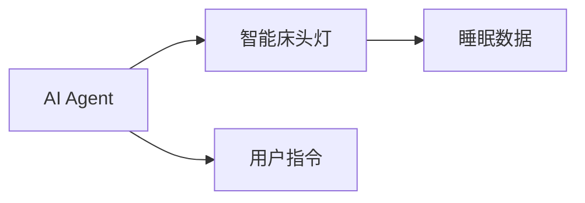
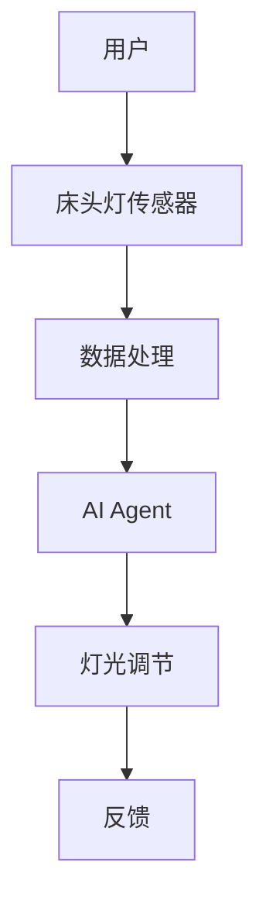
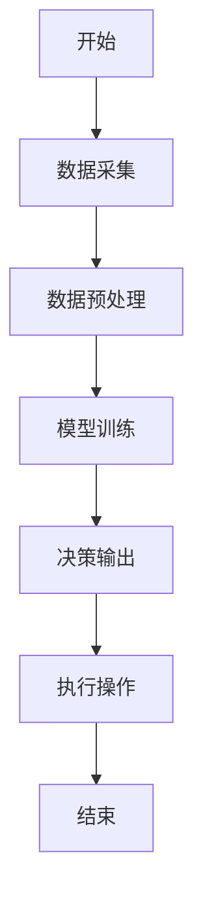
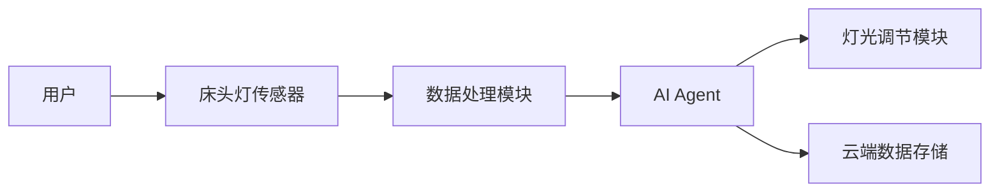
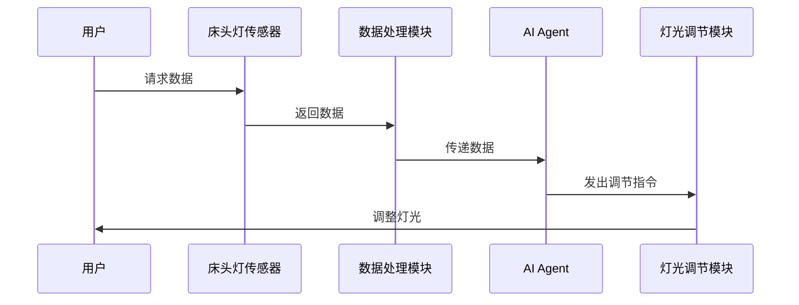

                 


# AI Agent在智能床头灯中的睡眠辅助

> 关键词：AI Agent，智能床头灯，睡眠辅助，算法原理，系统架构

> 摘要：本文探讨AI Agent在智能床头灯中的睡眠辅助应用，分析其核心算法、系统架构和实现方法，结合实际案例深入剖析技术细节，为智能睡眠健康提供新的解决方案。

---

## 第1章 背景介绍

### 1.1 问题背景
#### 1.1.1 睡眠问题的普遍性
现代社会，睡眠问题日益普遍，影响人们的生活质量。AI Agent通过实时监测和智能调节，为改善睡眠提供技术支持。

#### 1.1.2 智能床头灯的发展现状
智能床头灯已具备基础的灯光调节功能，但通过AI Agent的加入，可实现更智能的睡眠监测与辅助。

#### 1.1.3 AI Agent在睡眠辅助中的潜力
AI Agent能够实时分析数据，主动调整环境，为用户提供个性化的睡眠解决方案。

### 1.2 问题描述
#### 1.2.1 睡眠监测的核心问题
如何准确监测睡眠状态并提供有效反馈。

#### 1.2.2 睡眠辅助的实现路径
通过AI算法优化睡眠环境，改善睡眠质量。

#### 1.2.3 AI Agent在睡眠辅助中的角色
作为系统的核心，AI Agent负责数据处理、决策和执行。

### 1.3 问题解决
#### 1.3.1 AI Agent的核心功能
睡眠监测、个性化推荐、环境调节。

#### 1.3.2 智能床头灯的硬件基础
传感器、灯光调节模块、通信模块。

#### 1.3.3 睡眠辅助的实现方法
结合AI算法和硬件控制，实现智能化睡眠管理。

### 1.4 边界与外延
#### 1.4.1 AI Agent的功能边界
专注于睡眠辅助，不涉及其他功能。

#### 1.4.2 智能床头灯的适用场景
家庭、酒店等需要睡眠辅助的场景。

#### 1.4.3 睡眠辅助的未来发展
结合更多传感器和算法优化，提升用户体验。

### 1.5 概念结构与核心要素
#### 1.5.1 AI Agent的组成要素
传感器数据、算法模型、执行模块。

#### 1.5.2 智能床头灯的功能模块
睡眠监测、灯光调节、用户反馈。

#### 1.5.3 睡眠辅助的系统架构
数据采集、数据处理、决策执行。

---

## 第2章 核心概念与联系

### 2.1 AI Agent的核心原理
#### 2.1.1 AI Agent的基本定义
AI Agent是能够感知环境并主动执行任务的智能体。

#### 2.1.2 AI Agent的核心算法
基于机器学习和自然语言处理，实现数据分析和决策。

#### 2.1.3 AI Agent与智能床头灯的结合
通过数据交互，AI Agent控制床头灯提供睡眠辅助。

### 2.2 智能床头灯的功能分析
#### 2.2.1 睡眠监测功能
通过传感器监测心率、呼吸频率等数据。

#### 2.2.2 睡眠辅助功能
根据数据调整灯光、温度等环境因素。

#### 2.2.3 灯光调节功能
根据睡眠阶段自动调节光照强度和色温。

### 2.3 AI Agent与智能床头灯的实体关系
#### 2.3.1 实体关系图


#### 2.3.2 功能交互流程


#### 2.3.3 数据流分析
数据从传感器流向AI Agent，处理后反馈到床头灯执行调节。

---

## 第3章 算法原理讲解

### 3.1 AI Agent的核心算法
#### 3.1.1 机器学习算法
用于睡眠数据的分类和预测。

#### 3.1.2 自然语言处理算法
用于处理用户的睡眠反馈指令。

#### 3.1.3 实时数据分析算法
用于动态调整睡眠辅助策略。

### 3.2 算法流程图


### 3.3 算法实现代码
#### 3.3.1 睡眠监测代码
```python
import numpy as np
from sklearn import svm

# 传感器数据
data = np.array([[1, 2], [3, 4], [5, 6]])

# 训练模型
model = svm.SVC()
model.fit(data, [0, 1, 0])

# 预测
print(model.predict([[2, 3]]))
```

#### 3.3.2 睡眠辅助代码
```python
def adjust_lighting(brightness):
    if brightness < 50:
        return "increase brightness to 70%"
    else:
        return "keep current brightness"

print(adjust_lighting(40))
```

---

## 第4章 数学模型与公式

### 4.1 睡眠监测模型
#### 4.1.1 时间序列模型
$$ y_t = \alpha y_{t-1} + \beta x_t + \gamma $$

#### 4.1.2 基于机器学习的分类模型
$$ P(class|data) = \frac{P(data|class)P(class)}{P(data)} $$

#### 4.1.3 睡眠阶段划分模型
$$ S_t = \argmax_{s} P(s|data_t) $$

### 4.2 睡眠辅助模型
#### 4.2.1 基于反馈的推荐模型
$$ R = \sum_{i=1}^{n} \lambda_i x_i $$

#### 4.2.2 基于用户行为的预测模型
$$ P(action|history) = \prod_{i=1}^{k} P(action_i|history_{i-1}) $$

#### 4.2.3 睡眠优化算法
$$ \theta_{t+1} = \theta_t - \eta \nabla f(\theta_t) $$

### 4.3 灯光调节模型
#### 4.3.1 光照强度调节模型
$$ I = a \cdot \sin(\omega t + \phi) + b $$

#### 4.3.2 色温调节模型
$$ C = \alpha T + \beta $$

#### 4.3.3 光照模式切换模型
$$ P(mode|time, data) = \frac{P(time|mode)P(data|mode)}{P(time)} $$

---

## 第5章 系统分析与架构设计

### 5.1 系统场景介绍
#### 5.1.1 用户使用场景
用户在睡前使用床头灯的睡眠监测和辅助功能。

#### 5.1.2 系统运行环境
床头灯内置传感器和AI Agent，通过Wi-Fi连接云端。

### 5.2 系统功能设计
#### 5.2.1 睡眠监测功能
实时监测心率、呼吸频率等数据。

#### 5.2.2 睡眠辅助功能
根据数据调整灯光和环境温度。

#### 5.2.3 灯光调节功能
自动切换不同光照模式。

### 5.3 系统架构设计


### 5.4 系统接口设计
#### 5.4.1 硬件接口设计
床头灯与传感器的通信接口。

#### 5.4.2 软件接口设计
AI Agent与用户APP的交互接口。

#### 5.4.3 系统交互流程


---

## 第6章 项目实战

### 6.1 环境安装
安装Python、TensorFlow、Mermaid等工具。

### 6.2 核心实现
编写睡眠监测和灯光调节的代码。

### 6.3 实际案例分析
分析用户数据，优化睡眠辅助策略。

### 6.4 项目小结
总结实现过程中的经验教训，提出改进建议。

---

## 第7章 总结与展望

### 7.1 最佳实践 tips
数据采集的准确性是关键，算法优化需结合实际场景。

### 7.2 小结
本文详细介绍了AI Agent在智能床头灯中的应用，通过算法和系统设计实现睡眠辅助。

### 7.3 注意事项
确保数据安全和用户隐私。

### 7.4 拓展阅读
推荐相关领域的技术书籍和论文。

---

# 结语
通过本文的分析，读者可以深入了解AI Agent在智能床头灯中的睡眠辅助应用，为未来的智能睡眠健康提供新的思路。

