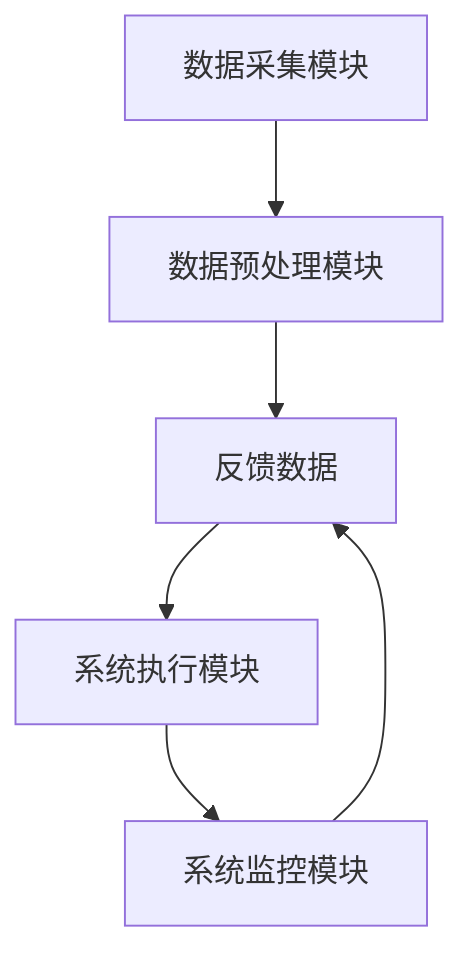

                 


# AI Agent在智能废水处理中的实践

## 关键词：AI Agent, 智能废水处理, 强化学习, 机器学习, 废水处理系统, 系统优化

## 摘要：  
本文探讨了AI Agent在智能废水处理中的实际应用，分析了AI Agent的核心概念与原理，并详细介绍了其在废水处理系统中的系统架构设计、算法实现和数学模型。通过具体案例分析，展示了AI Agent如何优化废水处理流程，提升处理效率，并最终总结了相关经验和未来的发展方向。

---

# 第1章: AI Agent与智能废水处理的背景介绍

## 1.1 AI Agent的基本概念

### 1.1.1 什么是AI Agent
AI Agent（人工智能代理）是指一种能够感知环境、自主决策并执行任务的智能实体。它能够通过传感器获取数据，利用算法进行分析，并根据结果采取相应的行动。AI Agent的核心在于其自主性和智能性，能够适应动态变化的环境。

### 1.1.2 AI Agent的核心特征
- **自主性**：能够自主决策，无需外部干预。
- **反应性**：能够实时感知环境并做出反应。
- **学习能力**：能够通过经验不断优化自身的决策策略。
- **协作性**：能够与其他系统或AI Agent协同工作。

### 1.1.3 AI Agent与传统自动控制系统的区别
| 特性         | AI Agent                 | 传统控制系统             |
|--------------|--------------------------|--------------------------|
| 决策方式     | 基于学习和优化算法       | 基于固定规则和逻辑       |
| 环境适应性   | 能够自适应复杂环境变化     | 需要人工调整参数         |
| 学习能力     | 具备学习和优化能力       | 通常不具备学习能力       |
| 应用场景     | 复杂、动态的环境          | 简单、静态的环境          |

---

## 1.2 智能废水处理的背景与挑战

### 1.2.1 废水处理的基本概念
废水处理是指将工业或生活产生的污水经过物理、化学和生物处理，使其达到排放标准的过程。传统废水处理系统通常依赖人工操作和固定规则，存在效率低下、资源浪费等问题。

### 1.2.2 智能废水处理的必要性
随着环保要求的不断提高，传统废水处理系统已难以满足需求。智能废水处理能够通过AI技术优化处理流程，提高效率，降低成本，并减少对环境的二次污染。

### 1.2.3 当前废水处理的主要技术与挑战
- **主要技术**：物理处理（如过滤）、化学处理（如沉淀）、生物处理（如活性污泥法）。
- **主要挑战**：处理效率不稳定、资源浪费、处理成本高、环境适应性差。

---

## 1.3 AI Agent在废水处理中的应用前景

### 1.3.1 AI Agent在废水处理中的潜在价值
AI Agent可以通过实时监测和优化处理参数，显著提高废水处理效率。例如，AI Agent可以动态调整曝气时间和化学剂量，以优化生物处理过程。

### 1.3.2 企业采用AI Agent的优势
- **降低运营成本**：通过优化处理流程减少能源和资源浪费。
- **提高处理效率**：实现精准控制，提升处理效果。
- **增强环境合规性**：确保废水排放符合环保标准。

### 1.3.3 废水处理行业智能化转型的趋势
随着AI技术的不断进步，越来越多的企业开始采用智能化解决方案。AI Agent在废水处理中的应用将成为行业发展的趋势。

---

## 1.4 本章小结
本章介绍了AI Agent的基本概念和核心特征，分析了智能废水处理的背景与挑战，并探讨了AI Agent在废水处理中的应用前景。通过对比AI Agent与传统自动控制系统的区别，读者可以更好地理解AI Agent在废水处理中的独特价值。

---

# 第2章: AI Agent的核心概念与原理

## 2.1 AI Agent的核心概念

### 2.1.1 AI Agent的定义与分类
AI Agent可以根据其智能水平和应用场景分为多种类型，例如基于规则的AI Agent、基于学习的AI Agent和基于强化学习的AI Agent。

### 2.1.2 AI Agent的感知与决策机制
AI Agent通过传感器获取环境数据，利用算法进行分析，最终做出决策并执行行动。其决策机制通常包括感知、分析、决策和执行四个步骤。

### 2.1.3 AI Agent的自主性与适应性
AI Agent的自主性使其能够在复杂环境中独立工作，而其适应性则使其能够根据环境变化动态调整自身的行为。

---

## 2.2 AI Agent在废水处理中的应用机制

### 2.2.1 废水处理过程中的关键问题
- **水质波动**：废水成分和浓度的变化会影响处理效果。
- **资源浪费**：传统处理系统可能导致能源和化学试剂的浪费。
- **效率低下**：人工操作可能存在延迟和误差。

### 2.2.2 AI Agent如何优化废水处理流程
AI Agent可以通过实时监测水质参数，动态调整处理参数，例如曝气时间、化学剂量等，以优化处理效果。

### 2.2.3 AI Agent与废水处理系统的协同工作
AI Agent与废水处理系统的协同工作可以通过接口实现数据交互和控制指令的传递。例如，AI Agent可以根据传感器数据生成优化策略，并通过系统接口将策略传递给处理系统。

---

## 2.3 AI Agent的核心算法原理

### 2.3.1 强化学习算法
强化学习是一种通过试错机制优化决策的算法。AI Agent通过与环境交互，获得奖励或惩罚，并根据这些反馈优化自身的决策策略。

#### 强化学习的数学模型
$$ Q(s, a) = r(s, a) + \gamma \max_{a'} Q(s', a') $$  
其中：
- \( Q(s, a) \) 表示状态 \( s \) 下采取行动 \( a \) 的期望回报。
- \( r(s, a) \) 表示当前状态和行动的即时回报。
- \( \gamma \) 表示折扣因子，用于平衡当前回报和未来回报的重要性。

### 2.3.2 机器学习模型
机器学习模型通过训练数据学习输入与输出之间的映射关系。例如，回归模型可以用于预测处理效果，分类模型可以用于识别异常情况。

#### 机器学习的数学模型
$$ y = \theta x + b $$  
其中：
- \( y \) 表示预测的输出。
- \( \theta \) 表示模型参数。
- \( x \) 表示输入特征。
- \( b \) 表示偏置项。

### 2.3.3 深度学习的应用
深度学习通过多层神经网络模型提取数据的高层次特征，并进行复杂的模式识别。例如，卷积神经网络（CNN）可以用于图像识别，循环神经网络（RNN）可以用于时间序列分析。

---

## 2.4 本章小结
本章详细介绍了AI Agent的核心概念与原理，并探讨了其在废水处理中的应用机制。通过分析强化学习、机器学习和深度学习的算法原理，读者可以更好地理解AI Agent如何优化废水处理流程。

---

# 第3章: AI Agent在废水处理中的系统架构设计

## 3.1 系统总体架构

### 3.1.1 系统功能模块划分
- **数据采集模块**：负责采集废水处理系统的实时数据，例如pH值、温度、流量等。
- **AI Agent决策模块**：基于采集的数据，利用算法生成优化策略。
- **系统执行模块**：根据AI Agent的决策执行相应的控制指令，例如调整曝气时间、添加化学试剂等。
- **系统监控模块**：实时监控系统运行状态，并将数据反馈给AI Agent。

### 3.1.2 系统的分层架构设计
系统可以分为数据层、算法层和控制层。数据层负责数据的采集和存储，算法层负责数据的分析和决策，控制层负责执行决策指令。

### 3.1.3 系统的可扩展性设计
系统设计应具备良好的可扩展性，以便在未来增加新的功能或模块。例如，可以通过模块化设计实现功能的动态加载和卸载。

---

## 3.2 系统功能设计

### 3.2.1 数据采集与处理模块
- 数据采集：通过传感器实时采集废水处理系统的各项参数。
- 数据预处理：对采集的数据进行清洗和标准化处理，确保数据的准确性和一致性。

### 3.2.2 AI Agent决策模块
- 数据分析：利用机器学习或深度学习模型对数据进行分析，识别潜在问题。
- 战略生成：根据分析结果生成优化策略，例如调整曝气时间和化学剂量。
- 策略执行：将优化策略传递给系统执行模块。

### 3.2.3 系统监控与反馈模块
- 实时监控：监控系统运行状态，确保系统按照优化策略执行。
- 数据反馈：将系统运行数据反馈给AI Agent，用于后续的优化和调整。

---

## 3.3 系统架构的mermaid图



---

## 3.4 系统接口设计

### 3.4.1 数据接口规范
- 数据格式：JSON或CSV。
- 数据传输：通过MQTT或HTTP协议进行数据传输。

### 3.4.2 AI Agent接口规范
- 输入接口：接收实时数据和系统状态。
- 输出接口：发送优化策略和控制指令。

### 3.4.3 系统监控接口
- 监控数据：实时监控系统运行状态和处理效果。
- 报警机制：当系统出现异常时，触发报警。

---

## 3.5 本章小结
本章详细介绍了AI Agent在废水处理中的系统架构设计，包括功能模块划分、系统分层架构、可扩展性设计、系统接口设计等内容。通过mermaid图展示系统架构，读者可以更直观地理解系统的整体结构。

---

# 第4章: AI Agent算法实现与数学模型

## 4.1 算法原理

### 4.1.1 强化学习算法
强化学习是一种通过试错机制优化决策的算法。AI Agent通过与环境交互，获得奖励或惩罚，并根据这些反馈优化自身的决策策略。

#### 强化学习的数学模型
$$ Q(s, a) = r(s, a) + \gamma \max_{a'} Q(s', a') $$  
其中：
- \( Q(s, a) \) 表示状态 \( s \) 下采取行动 \( a \) 的期望回报。
- \( r(s, a) \) 表示当前状态和行动的即时回报。
- \( \gamma \) 表示折扣因子，用于平衡当前回报和未来回报的重要性。

### 4.1.2 机器学习模型
机器学习模型通过训练数据学习输入与输出之间的映射关系。例如，回归模型可以用于预测处理效果，分类模型可以用于识别异常情况。

#### 机器学习的数学模型
$$ y = \theta x + b $$  
其中：
- \( y \) 表示预测的输出。
- \( \theta \) 表示模型参数。
- \( x \) 表示输入特征。
- \( b \) 表示偏置项。

---

## 4.2 算法实现

### 4.2.1 强化学习算法的Python实现
```python
class AI-Agent:
    def __init__(self):
        self.Q = {}  # 初始化Q表
        self.gamma = 0.9  # 折扣因子
        self.alpha = 0.1  # 学习率

    def learn(self, state, action, reward, next_state):
        # 更新Q表
        q_current = self.Q.get((state, action), 0)
        q_next = max(self.Q.get((next_state, action), 0) for action in self.possible_actions)
        self.Q[(state, action)] = q_current + self.alpha * (reward + self.gamma * q_next - q_current)
```

### 4.2.2 机器学习模型的训练过程
```python
import numpy as np
from sklearn.linear_model import LinearRegression

# 创建数据集
X = np.array([[1], [2], [3], [4]])
y = np.array([2, 4, 6, 8])

# 训练模型
model = LinearRegression()
model.fit(X, y)

# 预测结果
print(model.predict(np.array([[5]])))
```

---

## 4.3 数学模型

### 4.3.1 强化学习的数学模型
$$ Q(s, a) = r(s, a) + \gamma \max_{a'} Q(s', a') $$

### 4.3.2 机器学习的数学模型
$$ y = \theta x + b $$

---

## 4.4 本章小结
本章详细介绍了AI Agent的核心算法原理和数学模型，并提供了Python代码实现示例。通过分析强化学习和机器学习的算法实现，读者可以更好地理解AI Agent如何优化废水处理流程。

---

# 第5章: 项目实战

## 5.1 环境安装

### 5.1.1 Python环境的安装与配置
- 安装Python：可以从官方网站下载并安装最新版本的Python。
- 安装必要的库：例如numpy、pandas、scikit-learn、matplotlib等。

### 5.1.2 系统依赖安装
- 安装MQTT协议支持：可以使用paho-mqtt库。
- 安装数据可视化工具：例如Matplotlib或Seaborn。

---

## 5.2 系统核心实现

### 5.2.1 数据采集模块
```python
import paho.mqtt.client as mqtt

def on_message(client, userdata, message):
    data = eval(message.payload.decode())
    print(f"接收到数据: {data}")

client = mqtt.Client()
client.connect("localhost", 1883)
client.subscribe("废水处理系统")
client.on_message = on_message
client.loop_forever()
```

### 5.2.2 AI Agent决策模块
```python
class AI-Agent:
    def __init__(self):
        self.Q = {}  # 初始化Q表
        self.gamma = 0.9  # 折扣因子
        self.alpha = 0.1  # 学习率

    def learn(self, state, action, reward, next_state):
        # 更新Q表
        q_current = self.Q.get((state, action), 0)
        q_next = max(self.Q.get((next_state, action), 0) for action in self.possible_actions)
        self.Q[(state, action)] = q_current + self.alpha * (reward + self.gamma * q_next - q_current)
```

### 5.2.3 系统执行模块
```python
def execute_action(action):
    # 根据动作执行相应的控制指令
    if action == '调整曝气时间':
        # 调整曝气时间
        pass
    elif action == '添加化学试剂':
        # 添加化学试剂
        pass
```

---

## 5.3 案例分析与详细讲解

### 5.3.1 案例分析
假设我们有一个小型废水处理系统，需要优化曝气时间。AI Agent可以通过强化学习算法，根据实时的pH值和溶解氧浓度，动态调整曝气时间，以达到最佳的处理效果。

### 5.3.2 详细讲解
1. **数据采集**：AI Agent通过传感器实时采集pH值和溶解氧浓度。
2. **数据分析**：利用强化学习算法分析数据，生成优化策略。
3. **策略执行**：根据优化策略调整曝气时间，例如增加或减少曝气时间以维持最佳的溶解氧浓度。
4. **反馈优化**：系统监控模块将新的数据反馈给AI Agent，用于后续的优化和调整。

---

## 5.4 本章小结
本章通过具体案例分析和详细讲解，展示了AI Agent在废水处理中的实际应用。通过Python代码实现数据采集、AI Agent决策和系统执行模块，读者可以更好地理解AI Agent如何优化废水处理流程。

---

# 第6章: 总结与展望

## 6.1 最佳实践 Tips
- **数据质量**：确保数据的准确性和完整性。
- **算法选择**：根据具体场景选择合适的算法。
- **系统集成**：确保系统各模块之间的协同工作。

## 6.2 小结
通过本文的介绍，读者可以全面了解AI Agent在智能废水处理中的应用，包括核心概念、算法原理、系统架构设计和项目实战等内容。

## 6.3 注意事项
- **数据隐私**：确保数据的安全性和隐私性。
- **系统稳定性**：确保系统的稳定运行，避免因故障导致处理效果下降。
- **环境适应性**：确保系统能够适应不同的环境条件。

## 6.4 拓展阅读
- 《强化学习：理论与应用》
- 《机器学习在环保领域的应用》
- 《AI Agent在工业自动化中的实践》

---

# 附录

## 附录A: 术语表
- AI Agent：人工智能代理。
- 强化学习：通过试错机制优化决策的算法。
- 机器学习：通过数据学习输入与输出之间映射关系的算法。

## 附录B: 参考文献
1. Russell, S., & Norvig, P. (2010). Artificial Intelligence: A Modern Approach.
2. 环境保护部. (2020). 废水处理技术与应用.

---

通过以上内容，读者可以全面了解AI Agent在智能废水处理中的实践应用，包括理论基础、算法实现和项目实战等方面。

