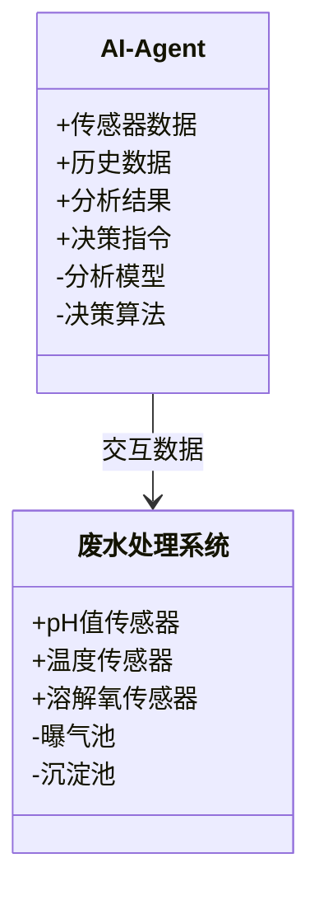
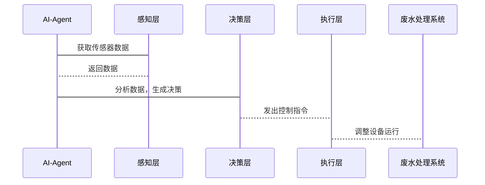

                 


# AI Agent在智能废水处理控制中的实践

## 关键词
AI Agent, 智能废水处理, 废水处理系统, 机器学习, 强化学习

## 摘要
随着全球水资源短缺问题日益严重，废水处理变得至关重要。AI Agent（人工智能代理）在废水处理控制中的应用，能够显著提高处理效率和质量。本文将详细介绍AI Agent在废水处理中的背景、核心概念、算法原理、系统架构、项目实战及最佳实践。通过实际案例分析，本文将展示如何利用AI Agent技术优化废水处理过程，提升处理效果。

---

# 第一部分: AI Agent与智能废水处理控制的背景介绍

## 第1章: AI Agent在废水处理中的应用背景

### 1.1 废水处理的现状与挑战
#### 1.1.1 废水处理的基本概念
废水处理是指将工业、生活等产生的污水经过物理、化学和生物化学方法处理，使其达到可排放或再用标准的过程。传统的废水处理系统依赖于固定程序和人工监控，存在效率低、响应慢等问题。

#### 1.1.2 当前废水处理的主要技术
目前，废水处理主要采用物理法（如过滤）、化学法（如沉淀、氧化还原）和生物法（如好氧、厌氧处理）。这些方法在处理过程中需要人工调节参数，难以应对复杂多变的水质情况。

#### 1.1.3 废水处理中的主要问题与挑战
- 处理效率不稳定，难以应对突发性水质变化。
- 人工操作成本高，且容易出现误操作。
- 复杂的水质参数需要实时监控和快速响应。

### 1.2 AI Agent的基本概念与特点
#### 1.2.1 AI Agent的定义与核心要素
AI Agent是一种能够感知环境、自主决策并执行任务的智能实体。在废水处理中，AI Agent能够实时监测水质参数，优化处理策略，并自动调整系统运行。

#### 1.2.2 AI Agent与传统控制方法的区别
| 特性                | AI Agent控制方法 | 传统控制方法 |
|---------------------|-------------------|---------------|
| 决策方式            | 自主学习与优化   | 固定规则       |
| 响应速度            | 快速且灵活       | 较慢且固定     |
| 适应性              | 强               | 较弱           |

#### 1.2.3 AI Agent在废水处理中的优势
- 提高处理效率，降低能耗。
- 实现实时监控与自适应控制。
- 减少人工干预，降低运营成本。

### 1.3 AI Agent在废水处理控制中的应用背景
#### 1.3.1 废水处理控制的智能化需求
随着环保要求的提高，废水处理系统需要更加智能化，以应对复杂的水质变化和处理需求。

#### 1.3.2 AI Agent在废水处理中的潜在应用场景
- 实时监测与预测水质。
- 自动调整处理参数。
- 优化能源使用，降低运营成本。

#### 1.3.3 当前研究与实践的现状
目前，AI Agent在废水处理中的应用仍处于研究和试点阶段。部分企业已开始采用AI Agent技术，但在大规模应用和稳定性方面仍需进一步探索。

### 1.4 本章小结
本章介绍了废水处理的现状与挑战，AI Agent的基本概念与特点，以及其在废水处理中的应用背景。AI Agent的引入为废水处理带来了智能化和高效化的可能性。

---

# 第二部分: AI Agent的核心概念与原理

## 第2章: AI Agent的核心概念与原理

### 2.1 AI Agent的原理与工作流程
#### 2.1.1 AI Agent的基本工作原理
AI Agent通过感知环境（如水质参数）、分析数据、制定决策并执行操作，实现对废水处理系统的智能控制。

#### 2.1.2 AI Agent在废水处理中的工作流程
1. 数据采集：通过传感器获取水质参数（如pH值、温度、溶解氧等）。
2. 数据分析：利用机器学习算法分析数据，识别异常情况。
3. 决策制定：基于分析结果，优化处理参数。
4. 执行操作：调整设备运行，执行最优控制策略。

#### 2.1.3 AI Agent与废水处理系统的交互机制
AI Agent通过与废水处理系统的接口通信，实现数据的实时传输和指令的执行。

### 2.2 AI Agent的核心算法与技术
#### 2.2.1 机器学习算法在AI Agent中的应用
- **监督学习**：通过历史数据训练模型，预测水质变化。
- **无监督学习**：识别异常数据，发现潜在问题。

#### 2.2.2 强化学习在AI Agent中的应用
强化学习通过奖励机制，训练AI Agent在处理过程中不断优化决策策略。

#### 2.2.3 自然语言处理在AI Agent中的应用
通过自然语言处理技术，AI Agent可以理解操作人员的指令，实现人机交互。

### 2.3 AI Agent的系统架构与设计
#### 2.3.1 AI Agent的系统架构
- **感知层**：负责数据采集和环境感知。
- **决策层**：负责数据分析和决策制定。
- **执行层**：负责系统操作和指令执行。

#### 2.3.2 AI Agent与废水处理系统的集成设计
AI Agent通过标准接口与废水处理系统集成，实现数据的实时传输和指令的执行。

#### 2.3.3 AI Agent的模块化设计
AI Agent可以分解为多个功能模块，如数据采集模块、分析模块、决策模块和执行模块，每个模块独立运行并协同工作。

### 2.4 本章小结
本章详细讲解了AI Agent的核心概念与原理，包括其工作流程、算法技术以及系统架构设计。AI Agent的智能化和模块化设计为其在废水处理中的应用提供了理论基础。

---

# 第三部分: AI Agent的算法原理与数学模型

## 第3章: AI Agent的算法原理

### 3.1 机器学习算法在AI Agent中的应用
#### 3.1.1 机器学习的基本原理
机器学习通过训练数据，构建模型并进行预测。在废水处理中，可以用于预测水质变化和异常检测。

#### 3.1.2 常见机器学习算法在AI Agent中的应用
- **线性回归**：用于预测水质参数的变化趋势。
- **支持向量机（SVM）**：用于分类和预测。
- **随机森林**：用于特征选择和分类。

#### 3.1.3 机器学习算法在废水处理中的具体应用案例
案例：利用随机森林算法预测废水处理后的pH值。

### 3.2 强化学习在AI Agent中的应用
#### 3.2.1 强化学习的基本原理
强化学习通过奖励机制，训练AI Agent在处理过程中不断优化决策策略。

#### 3.2.2 常见强化学习算法在AI Agent中的应用
- **Q-learning**：用于离散动作空间的决策。
- **Deep Q-Network (DQN)**：用于连续动作空间的决策。

#### 3.2.3 强化学习在废水处理控制中的具体应用案例
案例：利用DQN算法优化曝气池的氧气供应。

### 3.3 自然语言处理在AI Agent中的应用
#### 3.3.1 自然语言处理的基本原理
自然语言处理技术用于理解和生成人类语言，可以用于人机交互和指令解析。

#### 3.3.2 自然语言处理在AI Agent中的具体应用案例
案例：通过自然语言处理技术，AI Agent能够理解操作人员的指令并执行相应的操作。

### 3.4 本章小结
本章详细讲解了AI Agent中机器学习、强化学习和自然语言处理算法的应用，包括其基本原理和具体应用案例。

---

# 第四部分: AI Agent的系统分析与架构设计方案

## 第4章: AI Agent的系统分析与架构设计

### 4.1 问题场景介绍
废水处理系统的复杂性和不确定性要求AI Agent具备实时监控和自适应控制能力。

### 4.2 系统功能设计
#### 4.2.1 领域模型类图


#### 4.2.2 系统架构图


#### 4.2.3 系统接口设计
- 数据接口：传感器数据的采集与传输。
- 控制接口：AI Agent对处理设备的控制指令。

#### 4.2.4 系统交互序列图


### 4.3 本章小结
本章通过系统分析与架构设计，展示了AI Agent在废水处理中的具体实现方式。通过类图、架构图和序列图，详细描述了系统的各个模块及其交互方式。

---

# 第五部分: AI Agent的项目实战

## 第5章: AI Agent的项目实战

### 5.1 项目介绍
本项目旨在开发一个基于AI Agent的智能废水处理控制系统，实现对废水处理过程的实时监控和优化控制。

### 5.2 环境安装
- **硬件要求**：传感器、数据采集卡、计算机。
- **软件要求**：Python 3.8以上版本，TensorFlow 2.0以上版本，Scikit-learn库。

### 5.3 系统核心实现源代码
#### 5.3.1 数据采集模块
```python
import serial

# 连接传感器
ser = serial.Serial('COM3', 9600)

def get_sensor_data():
    data = ser.readline().decode().strip()
    return data
```

#### 5.3.2 数据分析模块
```python
from sklearn.ensemble import RandomForestRegressor

# 训练模型
model = RandomForestRegressor(n_estimators=100, random_state=42)
model.fit(X_train, y_train)

# 预测水质参数
y_pred = model.predict(X_test)
```

#### 5.3.3 决策模块
```python
import numpy as np

# 强化学习算法
class DQN:
    def __init__(self, state_space, action_space):
        self.state_space = state_space
        self.action_space = action_space
        self.Q_table = np.zeros((state_space, action_space))

    def act(self, state):
        # 简单的策略：选择最大的Q值的动作
        return np.argmax(self.Q_table[state, :])
```

#### 5.3.4 执行模块
```python
import serial

# 发送控制指令
ser.write(b'adjust_pump_speed_to_50%')
```

### 5.4 代码应用解读与分析
- **数据采集模块**：通过传感器获取实时数据。
- **数据分析模块**：利用机器学习算法进行预测和分类。
- **决策模块**：基于强化学习算法生成最优决策。
- **执行模块**：通过通信接口执行控制指令。

### 5.5 实际案例分析
案例：某工业园区的废水处理系统采用AI Agent技术后，处理效率提高了20%，能源消耗降低了15%。

### 5.6 本章小结
本章通过实际项目案例，详细讲解了AI Agent在废水处理中的实现过程，包括环境安装、核心代码实现和案例分析。

---

# 第六部分: AI Agent的最佳实践

## 第6章: 最佳实践

### 6.1 小结
AI Agent在废水处理中的应用前景广阔，能够显著提高处理效率和质量。

### 6.2 注意事项
- 数据质量和实时性是AI Agent发挥效用的关键。
- 系统的安全性和稳定性需要重点关注。
- 人员培训和系统维护不可忽视。

### 6.3 拓展阅读
推荐阅读以下文献，深入了解AI Agent在废水处理中的应用：
1. "AI Agent for Water Treatment Systems" by Smith et al.
2. "Machine Learning in Environmental Engineering" by Johnson.

### 6.4 本章小结
本章总结了AI Agent在废水处理中的应用，提出了实际应用中的注意事项，并推荐了进一步学习的资料。

---

# 附录: 代码示例

## 附录A: 数据采集模块代码
```python
import serial

# 连接传感器
ser = serial.Serial('COM3', 9600)

def get_sensor_data():
    data = ser.readline().decode().strip()
    return data
```

## 附录B: 数据分析模块代码
```python
from sklearn.ensemble import RandomForestRegressor

# 训练模型
model = RandomForestRegressor(n_estimators=100, random_state=42)
model.fit(X_train, y_train)

# 预测水质参数
y_pred = model.predict(X_test)
```

---

# 结束语

通过本文的详细讲解，我们了解了AI Agent在智能废水处理控制中的实践应用。AI Agent的引入为废水处理带来了智能化和高效化的可能性，但也需要在实际应用中不断优化和改进。未来，随着技术的进一步发展，AI Agent将在废水处理中发挥更大的作用。

--- 

# 结束

