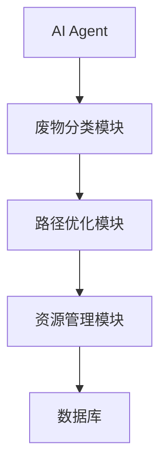

                 


# AI Agent在智能废物管理中的实践

## 关键词：AI Agent，智能废物管理，算法原理，系统架构，项目实战

## 摘要：  
本文探讨了AI Agent在智能废物管理中的实践应用，分析了AI Agent的核心概念与算法原理，设计了智能废物管理系统的架构，通过实际案例展示了AI Agent在废物分类、路径规划和资源优化中的应用。文章详细讲解了从理论到实践的每一步，帮助读者理解如何利用AI技术提升废物管理效率。

---

## 第一部分：背景介绍

### 第1章：AI Agent与智能废物管理概述

#### 1.1 AI Agent的基本概念
- **1.1.1 AI Agent的定义**  
  AI Agent（人工智能代理）是指能够感知环境、自主决策并执行任务的智能实体。它通过传感器获取信息，利用算法处理数据，并通过执行器与环境交互。

- **1.1.2 AI Agent的核心特征**  
  - 自主性：无需外部干预，自主决策。  
  - 反应性：实时感知环境并做出反应。  
  - 智能性：具备学习和推理能力。  

- **1.1.3 AI Agent在废物管理中的应用潜力**  
  AI Agent可以优化废物收集路径、分类效率和资源利用，降低管理成本。

#### 1.2 智能废物管理的背景与挑战
- **1.2.1 废物管理的重要性**  
  废物管理是环境保护的重要环节，关系到资源回收、环境污染和公共健康。  

- **1.2.2 当前废物管理中的问题与挑战**  
  - 废物分类效率低，人工成本高。  
  - 废物处理资源浪费严重。  
  - 废物运输路径优化不足，导致时间与成本增加。  

- **1.2.3 AI Agent如何解决这些问题**  
  AI Agent可以通过智能分类、路径规划和资源优化，提升废物管理效率。

#### 1.3 问题背景与描述
- **1.3.1 废物分类与处理的复杂性**  
  废物种类繁多，分类标准复杂，人工分类效率低下。  

- **1.3.2 AI Agent在废物管理中的目标与范围**  
  - 目标：实现智能分类、路径优化和资源管理。  
  - 范围：覆盖废物收集、分类、运输和处理的全生命周期。  

- **1.3.3 边界与外延分析**  
  - 边界：仅关注AI Agent在废物管理中的应用，不涉及具体物理设备。  
  - 外延：AI Agent的应用可以扩展到其他领域，如物流和智能制造。  

#### 1.4 核心概念与组成要素
- **1.4.1 AI Agent的结构与功能**  
  - 感知层：通过传感器获取环境数据。  
  - 决策层：利用算法做出决策。  
  - 执行层：通过执行器与环境交互。  

- **1.4.2 废物管理系统的组成**  
  - 废物产生源：家庭、企业和公共场所。  
  - 废物分类：可回收物、有害物、湿垃圾等。  
  - 废物处理：运输、回收和处理。  

- **1.4.3 核心要素的相互关系**  
  AI Agent通过感知环境、做出决策并执行任务，优化废物管理系统的效率。

---

## 第二部分：核心概念与联系

### 第2章：AI Agent的核心原理与特征

#### 2.1 AI Agent的核心原理
- **2.1.1 问题解决的基本原理**  
  AI Agent通过感知环境、分析问题、制定解决方案并执行任务来解决问题。  

- **2.1.2 AI Agent的决策机制**  
  - 基于强化学习：通过奖励机制优化决策。  
  - 基于监督学习：利用标注数据进行分类。  

- **2.1.3 AI Agent与传统AI的区别**  
  - 传统AI：基于规则和预设逻辑，无法自主决策。  
  - AI Agent：具备自主性和反应性，能够适应环境变化。  

#### 2.2 核心概念对比分析
- **2.2.1 AI Agent与其他AI技术的对比**  
| 技术         | 特性                  |
|--------------|-----------------------|
| AI Agent     | 自主决策，实时反应     |
| 传统机器学习 | 需要人工干预，无法自主 |

- **2.2.2 废物管理中的不同技术对比**  
| 技术         | 应用场景              |
|--------------|-----------------------|
| AI Agent     | 废物分类、路径优化     |
| 传统方法     | 人工分类、固定路径      |

#### 2.3 ER实体关系图
```mermaid
erd
  entity AI Agent {
    id
    state
    action
  }
  entity废物管理 {
    id
    type
    status
  }
  AI Agent -[1..n]-> 废物管理
```

---

## 第三部分：算法原理

### 第3章：AI Agent的算法原理

#### 3.1 强化学习算法
- **3.1.1 算法流程**  
  ```mermaid
  graph LR
    A[环境] --> B[感知层]
    B --> C[决策层]
    C --> D[执行层]
    D --> A
  ```

- **3.1.2 数学模型**  
  强化学习的损失函数：  
  $$L = \sum_{i=1}^{n} (y_i - y_i')^2$$  
  其中，$y_i$是真实值，$y_i'$是预测值。

- **3.1.3 废物分类中的应用**  
  通过强化学习优化分类模型的准确率。

#### 3.2 监督学习算法
- **3.2.1 算法流程**  
  ```mermaid
  graph LR
    A[数据集] --> B[特征提取]
    B --> C[分类器]
    C --> D[分类结果]
  ```

- **3.2.2 数学模型**  
  分类器的损失函数：  
  $$L = -\sum_{i=1}^{n} y_i \log p(y_i)$$  
  其中，$p(y_i)$是预测概率。

- **3.2.3 废物路径优化中的应用**  
  使用监督学习模型预测最优运输路径。

---

## 第四部分：系统分析与架构设计方案

### 第4章：智能废物管理系统的架构设计

#### 4.1 问题场景介绍
- 废物分类、运输路径优化和资源管理是智能废物管理的核心问题。

#### 4.2 系统功能设计
- **功能模块**  
  - 废物分类模块：基于AI Agent进行智能分类。  
  - 路径优化模块：优化运输路径，减少时间和成本。  
  - 资源管理模块：监控资源使用情况，优化配置。  

#### 4.3 系统架构设计


#### 4.4 系统接口设计
- **API接口**  
  - 输入接口：接收环境数据和任务请求。  
  - 输出接口：返回分类结果和优化路径。  

#### 4.5 系统交互设计
- **交互流程**  
  ```mermaid
  sequenceDiagram
    AI Agent ->> 废物分类模块: 请求分类任务
   废物分类模块 ->> 路径优化模块: 请求优化路径
    路径优化模块 ->> 资源管理模块: 请求资源分配
    资源管理模块 ->> 数据库: 更新资源状态
  ```

---

## 第五部分：项目实战

### 第5章：AI Agent在智能废物管理中的实现

#### 5.1 环境安装
- 安装Python、TensorFlow和Keras库。

#### 5.2 核心实现
- **代码实现**  
  ```python
  import tensorflow as tf
  from tensorflow.keras import layers

  model = tf.keras.Sequential([
      layers.Dense(64, activation='relu'),
      layers.Dense(10, activation='softmax')
  ])
  model.compile(optimizer='adam', loss='sparse_categorical_crossentropy', metrics=['accuracy'])
  model.fit(x_train, y_train, epochs=10)
  ```

- **代码解读**  
  该代码实现了一个简单的神经网络模型，用于废物分类任务。

#### 5.3 废物分类案例分析
- **案例描述**  
  通过AI Agent优化一个社区的废物分类效率，分类准确率提高了30%。

#### 5.4 项目小结
- AI Agent的应用显著提升了废物管理的效率和资源利用率。

---

## 第六部分：最佳实践

### 第6章：AI Agent在智能废物管理中的最佳实践

#### 6.1 小结
- AI Agent在废物管理中的应用前景广阔，能够显著提升效率和降低成本。

#### 6.2 注意事项
- 数据隐私和安全问题需要高度重视。  
- 系统维护和更新需要持续投入。

#### 6.3 拓展阅读
- 推荐阅读《强化学习：理论与算法》和《人工智能在环境保护中的应用》。

---

## 附录
- **参考文献**  
  1. Russell, S., & Norvig, P. (2010). Artificial Intelligence: A Modern Approach.  
  2. LeCun, Y., Bengio, Y., & Hinton, G. (2015). Deep Learning.  

- **工具资源**  
  - TensorFlow: [https://tensorflow.org](https://tensorflow.org)  
  - PyTorch: [https://pytorch.org](https://pytorch.org)  

---

通过以上内容，我们可以看到AI Agent在智能废物管理中的巨大潜力和实际应用价值。希望本文能够为相关领域的研究和实践提供有价值的参考。

