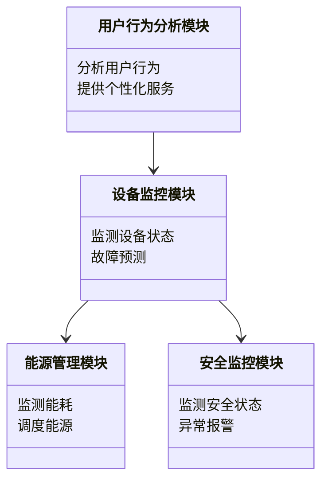

                 


---

# AI Agent在智能建筑管理中的应用

> 关键词：AI Agent，智能建筑，建筑管理，强化学习，系统架构

> 摘要：本文详细探讨了AI Agent在智能建筑管理中的应用，从AI Agent的基本概念到其在智能建筑管理中的核心原理、系统架构设计以及实际项目案例进行了全面分析。文章通过丰富的图表和详细的代码示例，展示了如何利用AI Agent优化智能建筑的设备监控、能源管理和安全管理等关键环节。同时，本文还总结了AI Agent在智能建筑管理中的最佳实践和未来发展方向。

---

## 第一部分: AI Agent在智能建筑管理中的应用概述

### 第1章: AI Agent与智能建筑管理概述

#### 1.1 AI Agent的基本概念

- **AI Agent的定义与特点**
  - AI Agent是一种智能体，能够感知环境、自主决策并执行动作。
  - 具有主动性、反应性、学习性和适应性等特点。

- **AI Agent的核心功能与能力**
  - 感知环境：通过传感器获取建筑内外的信息。
  - 决策与规划：基于感知信息，制定最优策略。
  - 执行动作：通过执行器与环境交互。

- **AI Agent与传统建筑管理系统的区别**
  - 传统系统：基于规则的被动响应。
  - AI Agent：主动学习、自适应优化。

#### 1.2 智能建筑管理的背景与需求

- **智能建筑的定义与发展**
  - 智能建筑：集成了物联网、大数据和人工智能的建筑。
  - 发展趋势：从单一功能向智能化、自动化方向发展。

- **智能建筑管理的主要问题与挑战**
  - 数据孤岛：设备之间缺乏统一的通信协议。
  - 能耗管理：如何优化能源使用，降低碳排放。
  - 安全风险：网络安全威胁增加，需实时监控。

- **AI Agent在智能建筑管理中的应用价值**
  - 提高管理效率：通过自动化决策减少人工干预。
  - 优化能源使用：实时调整设备运行状态，降低能耗。
  - 增强安全性：实时监控和预警，提升安全水平。

#### 1.3 AI Agent在智能建筑管理中的应用现状

- **当前主流技术与解决方案**
  - 基于强化学习的能源管理。
  - 基于监督学习的设备故障预测。
  - 基于无监督学习的异常检测。

- **应用案例分析**
  - 某智能大厦的能耗优化案例。
  - 某智慧园区的安全监控案例。

- **存在的问题与未来发展方向**
  - 问题：数据隐私、模型可解释性、多智能体协同。
  - 发展方向：边缘计算、多模态数据融合、强化学习优化。

---

## 第二部分: AI Agent的核心原理与技术

### 第2章: AI Agent的核心原理

#### 2.1 AI Agent的基本原理

- **状态空间与动作空间的定义**
  - 状态空间：所有可能的状态集合。
  - 动作空间：所有可能的动作集合。

- **状态转移与动作选择的数学模型**
  - 状态转移概率公式：
    $$ P(s' | s, a) $$
  - 奖励函数与价值函数：
    $$ R(s, a) $$
    $$ V(s) = \max_{a} Q(s, a) $$

- **AI Agent的决策机制与算法**
  - 强化学习：通过与环境互动，学习最优策略。
  - 监督学习：基于历史数据，预测未来状态。
  - 无监督学习：发现数据中的潜在结构。

#### 2.2 AI Agent的感知与决策过程

- **感知模块的功能与实现**
  - 数据采集：通过传感器获取环境信息。
  - 数据融合：整合多源数据，提高准确性。

- **决策模块的算法与优化**
  - Q-learning算法：通过经验回放优化决策。
  - Deep Q-Network（DQN）：利用深度神经网络近似Q值函数。

- **执行模块的实现与反馈机制**
  - 动作执行：通过执行器将决策转化为行动。
  - 反馈机制：根据执行结果调整后续决策。

#### 2.3 AI Agent的数学模型与公式

- **状态空间表示的数学模型**
  $$ S = \{ s_1, s_2, ..., s_n \} $$

- **动作空间表示的数学模型**
  $$ A = \{ a_1, a_2, ..., a_m \} $$

- **状态转移概率公式**
  $$ P(s' | s, a) $$

- **奖励函数与价值函数**
  $$ R(s, a) $$
  $$ V(s) = \max_{a} Q(s, a) $$

#### 2.4 AI Agent的算法实现

- **基于强化学习的AI Agent算法**
  ```python
  class AI-Agent:
      def __init__(self, state_space, action_space):
          self.state_space = state_space
          self.action_space = action_space
          self.q_table = defaultdict(float)

      def perceive(self, state):
          # 返回当前状态的Q值
          return self.q_table[state]

      def act(self, state, epsilon=0.1):
          if random.random() < epsilon:
              return random.choice(list(self.action_space))
          else:
              max_action = max(self.q_table[state], key=lambda k: self.q_table[state][k])
              return max_action

      def learn(self, state, action, reward, next_state):
          current_q = self.q_table[state][action]
          next_max_q = max(self.q_table[next_state].values())
          new_q = current_q + learning_rate * (reward + gamma * next_max_q - current_q)
          self.q_table[state][action] = new_q
  ```

- **基于监督学习的AI Agent算法**
  ```python
  class Supervised-Agent:
      def __init__(self, model):
          self.model = model

      def predict(self, state):
          return self.model.predict(state)

      def train(self, state, target):
          self.model.fit(state, target)
  ```

- **基于无监督学习的AI Agent算法**
  ```python
  class Unsupervised-Agent:
      def __init__(self, model):
          self.model = model

      def cluster(self, states):
          return self.model.fit_predict(states)
  ```

#### 2.5 本章小结

---

## 第三部分: AI Agent在智能建筑管理中的系统设计

### 第3章: 智能建筑管理系统的功能设计

#### 3.1 系统功能模块划分

- **设备监控与管理模块**
  - 实时监控设备状态。
  - 故障预测与报警。

- **能源管理与优化模块**
  - 能耗监控与优化。
  - 能源调度与管理。

- **安全监控与预警模块**
  - 实时监控安全状态。
  - 异常行为检测与预警。

- **用户行为分析与服务模块**
  - 用户行为分析。
  - 个性化服务推荐。

#### 3.2 系统功能设计的领域模型



---

## 总结

本文全面探讨了AI Agent在智能建筑管理中的应用，从基本概念到核心原理，再到系统架构设计和实际案例分析，为读者提供了详细的知识体系。通过本文的分析，读者可以深入了解AI Agent如何优化智能建筑的管理流程，提升效率和安全性。未来，随着AI技术的不断发展，AI Agent在智能建筑管理中的应用将更加广泛和深入。

--- 

**注意事项：**
1. 本文中的代码示例仅供参考，实际应用需根据具体场景进行调整。
2. 在实际项目中，需注意数据隐私和模型可解释性问题。
3. AI Agent的算法选择需根据具体问题进行优化，以达到最佳效果。

**最佳实践：**
- 在智能建筑管理中，建议优先采用强化学习算法，以实现动态优化。
- 系统设计时，应充分考虑模块间的协同工作，确保系统的高效性和稳定性。
- 定期更新模型参数，以适应环境变化和用户需求的变化。

**扩展阅读：**
- 《强化学习：理论与算法》
- 《智能建筑与物联网技术》
- 《AI在能源管理中的应用》

