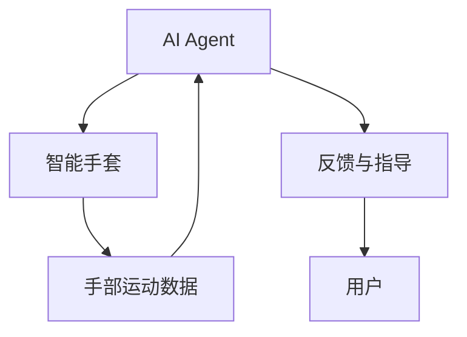
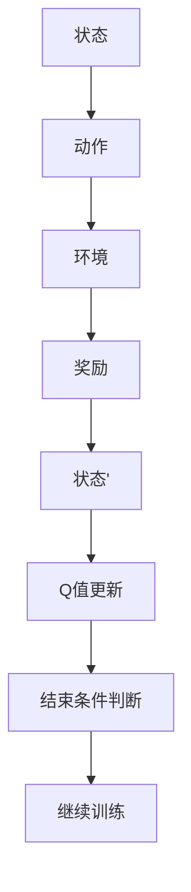
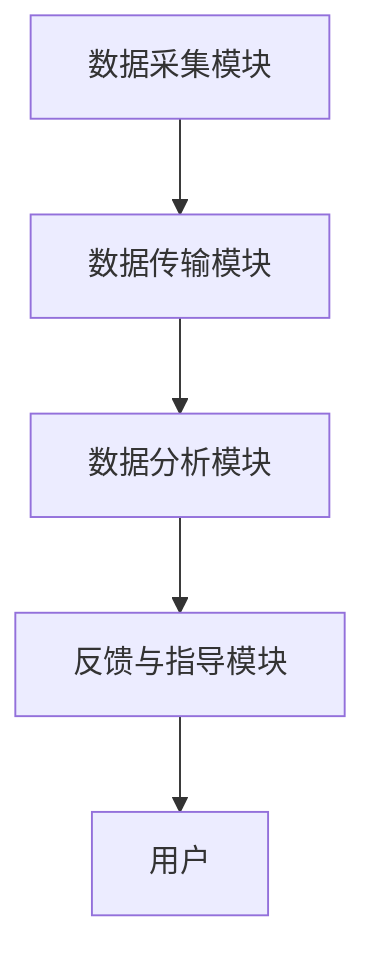
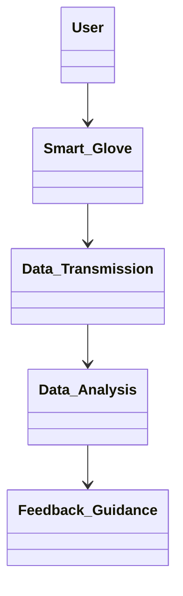
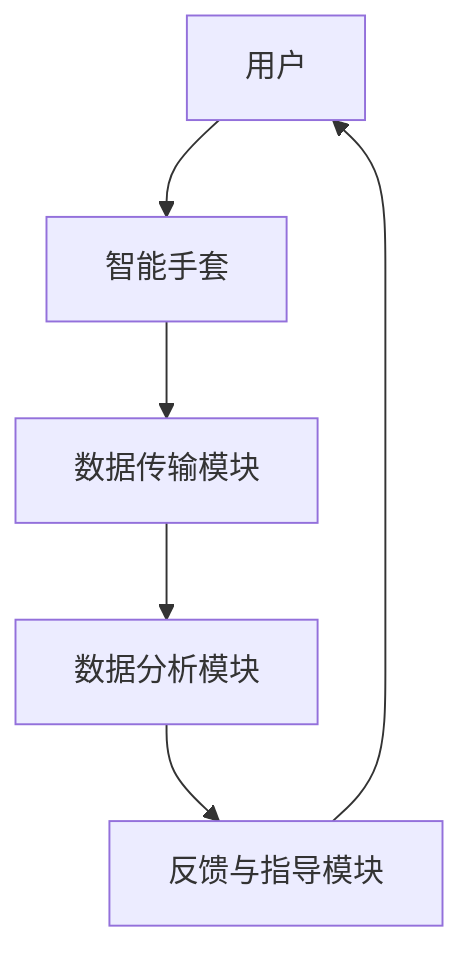

                 


# AI Agent在智能手套中的手部康复训练

## 关键词：AI Agent, 智能手套, 手部康复训练, 强化学习, 康复医学, 人机交互

## 摘要：本篇文章深入探讨了AI Agent在智能手套中的应用，特别是在手部康复训练中的创新方法。文章从背景介绍、核心概念、算法原理、系统架构、项目实战等多个维度展开，系统性地分析了AI Agent与智能手套的协同工作原理，详细讲解了强化学习算法的实现及其在康复训练中的应用，最后通过实际案例展示了系统的实现与效果评估。本文旨在为康复医学和人工智能领域的研究者与实践者提供理论指导和实践参考。

---

# 第1章: AI Agent与智能手套的背景介绍

## 1.1 问题背景与问题描述
### 1.1.1 手部康复训练的现状与挑战
手部康复训练是康复医学中的重要组成部分，主要用于恢复因疾病或损伤导致的手部功能障碍。传统康复训练依赖于医生或治疗师的指导，存在以下问题：
- **低效性**：训练过程缺乏个性化，难以根据患者的具体情况实时调整训练方案。
- **依从性差**：患者在家中进行康复训练时，容易因缺乏监督而无法坚持或正确执行训练计划。
- **效果评估困难**：传统的康复效果评估依赖于主观判断，缺乏客观、量化的指标。

### 1.1.2 AI Agent在康复医学中的应用潜力
AI Agent（人工智能代理）是一种能够感知环境、自主决策并执行任务的智能系统。在康复医学中，AI Agent可以通过以下方式发挥作用：
- **个性化康复计划**：根据患者的实时数据（如手部运动数据、健康状况等）制定个性化的康复训练计划。
- **实时反馈与指导**：通过智能手套实时感知手部运动数据，并通过AI Agent提供即时反馈，帮助患者纠正错误动作。
- **主动学习与优化**：AI Agent可以通过强化学习等算法，不断优化康复训练方案，提升康复效果。

### 1.1.3 智能手套的核心目标与应用场景
智能手套是一种结合了传感器技术和人工智能的可穿戴设备，其核心目标是通过实时感知手部运动数据，结合AI Agent的分析与决策能力，为用户提供智能化的康复训练支持。应用场景包括：
- **家庭康复训练**：患者可以在家中使用智能手套进行康复训练，减少对医生或治疗师的依赖。
- **康复机构**：智能手套可以作为康复治疗师的辅助工具，帮助提高康复训练的效率和效果。
- **远程康复监控**：通过智能手套和AI Agent的结合，医生可以远程监控患者的康复进度，并根据数据调整康复方案。

## 1.2 AI Agent与智能手套的核心概念
### 1.2.1 AI Agent的定义与特点
AI Agent是一种能够感知环境、自主决策并执行任务的智能系统。其特点包括：
- **自主性**：AI Agent可以在没有人为干预的情况下自主完成任务。
- **反应性**：AI Agent能够根据环境的变化实时调整其行为。
- **学习能力**：AI Agent可以通过机器学习算法不断优化自身的决策能力。

### 1.2.2 智能手套的技术原理与功能
智能手套是一种结合了传感器技术和人工智能的可穿戴设备，其主要功能包括：
- **数据采集**：通过内置的传感器实时采集手部运动数据（如角度、加速度、力等）。
- **数据传输**：将采集到的数据通过无线通信技术（如蓝牙、Wi-Fi）传输到云端或本地计算机进行分析。
- **实时反馈**：通过AI Agent对数据进行分析，提供实时的反馈和指导，帮助用户纠正错误动作。
- **个性化训练计划**：根据用户的具体情况制定个性化的康复训练计划。

### 1.2.3 手部康复训练的流程与目标
手部康复训练的流程通常包括以下几个步骤：
1. **评估阶段**：通过智能手套采集手部运动数据，评估患者的手部功能状况。
2. **制定训练计划**：根据评估结果，结合AI Agent的分析，制定个性化的康复训练计划。
3. **执行训练**：患者按照训练计划进行康复训练，智能手套实时采集数据并提供反馈。
4. **效果评估**：通过分析训练数据，评估康复效果，并根据需要调整训练计划。

其目标是帮助患者恢复手部功能，提升生活质量。

## 1.3 本章小结
本章主要介绍了AI Agent和智能手套的基本概念、特点及其在手部康复训练中的应用潜力。通过分析传统康复训练的不足，提出了AI Agent与智能手套结合的创新解决方案，为后续章节的深入探讨奠定了基础。

---

# 第2章: AI Agent与智能手套的核心原理

## 2.1 AI Agent的核心原理
### 2.1.1 强化学习与监督学习的对比
强化学习是一种通过试错机制来优化决策的机器学习算法。与监督学习不同，强化学习的核心在于通过与环境的交互来获得奖励或惩罚，从而优化决策策略。例如，在手部康复训练中，AI Agent可以通过强化学习来优化康复训练的策略。

### 2.1.2 AI Agent在康复训练中的决策机制
AI Agent在康复训练中的决策机制通常包括以下几个步骤：
1. **感知环境**：通过智能手套采集手部运动数据，感知患者当前的手部状态。
2. **状态分析**：将手部运动数据输入到AI Agent中，分析当前状态。
3. **决策制定**：根据分析结果，制定下一步的训练策略。
4. **执行动作**：根据决策结果，执行相应的动作（如提供反馈、调整训练计划等）。

### 2.1.3 状态空间与动作空间的定义
在强化学习中，状态空间是指所有可能的状态的集合，而动作空间是指所有可能的动作的集合。例如，在手部康复训练中，状态可以是手部的某个特定姿势，动作可以是手部的某个特定运动。

## 2.2 智能手套的技术原理
### 2.2.1 传感器数据采集与处理
智能手套通过内置的传感器（如惯性传感器、加速度计等）实时采集手部运动数据，并通过数据预处理（如滤波、降噪等）提取有用的特征。

### 2.2.2 数据传输与实时反馈
采集到的数据通过无线通信技术传输到云端或本地计算机，进行实时分析，并通过智能手套提供即时反馈（如振动、声音提示等）。

### 2.2.3 人机交互的设计与实现
人机交互是智能手套的重要组成部分，通过友好的用户界面（如手机APP、电脑界面等）实现患者与AI Agent之间的互动，提供个性化的训练指导。

## 2.3 AI Agent与智能手套的协同工作原理
### 2.3.1 数据流与信息处理流程
1. **数据采集**：智能手套采集手部运动数据。
2. **数据传输**：数据传输到云端或本地计算机。
3. **数据分析**：AI Agent对数据进行分析，制定训练策略。
4. **反馈与指导**：AI Agent通过智能手套提供反馈和指导。

### 2.3.2 系统整体架构与模块划分
系统整体架构包括以下几个模块：
- **数据采集模块**：负责采集手部运动数据。
- **数据传输模块**：负责将数据传输到云端或本地计算机。
- **数据分析模块**：负责对数据进行分析，制定训练策略。
- **反馈与指导模块**：负责通过智能手套提供反馈和指导。

### 2.3.3 系统的实时性与响应速度
为了确保系统的实时性与响应速度，需要优化数据处理流程，采用高效的算法和数据传输技术。

## 2.4 本章小结
本章详细介绍了AI Agent与智能手套的核心原理，包括AI Agent的决策机制、智能手套的技术原理以及两者协同工作的流程。通过本章的学习，读者可以理解AI Agent与智能手套如何协同工作，为后续章节的深入探讨奠定基础。

---

# 第3章: AI Agent与智能手套的协同工作原理

## 3.1 概念属性特征对比表格
### 表3.1-1 AI Agent与传统康复训练方式的对比

| 特性                | AI Agent                          | 传统康复训练方式                   |
|---------------------|-----------------------------------|------------------------------------|
| 决策方式            | 基于数据的智能决策               | 依赖医生或治疗师的经验判断         |
| 个性化程度          | 高度个性化                       | 较低                               |
| 实时性               | 高实时性                         | 较低或无实时性                     |
| 反馈机制            | 实时反馈                         | 延时反馈或无反馈                   |
| 适应性               | 能够根据数据动态调整             | 难以动态调整                       |

## 3.2 ER实体关系图
### 图3.2-1 AI Agent与智能手套的实体关系图（Mermaid流程图）



## 3.3 本章小结
本章通过对比分析AI Agent与传统康复训练方式的差异，进一步明确了AI Agent在手部康复训练中的优势。同时，通过ER实体关系图展示了AI Agent与智能手套之间的协同工作关系。

---

# 第4章: AI Agent的核心算法

## 4.1 强化学习算法
### 4.1.1 Q-learning算法的原理与实现
Q-learning是一种经典的强化学习算法，通过维护一个Q值表来记录状态-动作对的期望奖励值。Q值表的更新公式如下：

$$ Q(s, a) = Q(s, a) + \alpha \times [r + \gamma \times \max Q(s', a') - Q(s, a)] $$

其中，$\alpha$ 是学习率，$\gamma$ 是折扣因子。

### 4.1.2 DQN算法的改进与应用
DQN（Deep Q-Network）算法通过使用深度神经网络来近似Q值函数，解决了Q-learning算法在高维状态空间中的应用难题。DQN算法的主要步骤如下：

1. **环境交互**：智能手套采集手部运动数据，与环境交互。
2. **经验存储**：将经验存储在经验回放池中。
3. **网络更新**：通过随机抽取经验样本，更新深度神经网络的参数。
4. **策略执行**：根据当前状态，选择动作。

### 4.1.3 算法流程图（Mermaid）


## 4.2 算法实现的Python源代码
### 4.2.1 Q-learning算法实现代码
```python
import numpy as np

class QLearning:
    def __init__(self, state_space, action_space, learning_rate=0.1, gamma=0.9):
        self.state_space = state_space
        self.action_space = action_space
        self.learning_rate = learning_rate
        self.gamma = gamma
        self.q_table = np.zeros((state_space, action_space))
    
    def choose_action(self, state):
        return np.argmax(self.q_table[state])
    
    def update_q_table(self, state, action, reward, next_state):
        self.q_table[state, action] += self.learning_rate * (reward + self.gamma * np.max(self.q_table[next_state]) - self.q_table[state, action])
```

### 4.2.2 DQN算法实现代码
```python
import numpy as np
import torch
import torch.nn as nn

class DQN:
    def __init__(self, state_dim, action_dim, hidden_dim=64, learning_rate=0.01):
        self.state_dim = state_dim
        self.action_dim = action_dim
        self.hidden_dim = hidden_dim
        self.learning_rate = learning_rate
        self.model = nn.Sequential(
            nn.Linear(state_dim, hidden_dim),
            nn.ReLU(),
            nn.Linear(hidden_dim, action_dim)
        )
        self.model_optimizer = torch.optim.Adam(self.model.parameters(), lr=learning_rate)
    
    def get_action(self, state):
        state = torch.FloatTensor(state)
        with torch.no_grad():
            return self.model(state).max(1)[1].item()
    
    def update_network(self, states, actions, rewards, next_states):
        states = torch.FloatTensor(np.array(states))
        next_states = torch.FloatTensor(np.array(next_states))
        actions = torch.LongTensor(np.array(actions))
        rewards = torch.FloatTensor(np.array(rewards))
        
        current_q = self.model(states).gather(1, actions)
        next_q = self.model(next_states).max(1)[0].detach()
        target = rewards + self.gamma * next_q
        
        loss = torch.nn.MSELoss()(current_q.squeeze(), target)
        self.model_optimizer.zero_grad()
        loss.backward()
        self.model_optimizer.step()
```

## 4.3 数学模型与公式
### 4.3.1 Q-learning算法的数学模型
Q-learning算法的数学模型如前所述，通过Q值表的更新公式来优化决策策略。

### 4.3.2 DQN算法的数学模型
DQN算法的数学模型基于深度神经网络，通过最小化预测Q值与实际Q值的差值来更新网络参数。

$$ \text{损失函数} = \frac{1}{2} \left| Q(s, a) - (r + \gamma \max_a Q(s', a)) \right|^2 $$

## 4.4 本章小结
本章详细介绍了AI Agent的核心算法，包括Q-learning和DQN算法的原理、实现及其在手部康复训练中的应用。通过本章的学习，读者可以理解如何利用强化学习算法优化康复训练策略。

---

# 第5章: 智能手套的系统架构与实现

## 5.1 系统整体架构
### 5.1.1 系统架构设计
系统整体架构包括以下几个模块：
- **数据采集模块**：负责采集手部运动数据。
- **数据传输模块**：负责将数据传输到云端或本地计算机。
- **数据分析模块**：负责对数据进行分析，制定训练策略。
- **反馈与指导模块**：负责通过智能手套提供反馈和指导。

### 5.1.2 系统架构图（Mermaid）


## 5.2 系统功能设计
### 5.2.1 领域模型（Mermaid类图）


## 5.3 系统接口设计
### 5.3.1 智能手套与云端的接口设计
智能手套通过蓝牙或Wi-Fi将数据传输到云端，云端进行数据存储与分析。

### 5.3.2 用户与系统的交互流程图（Mermaid）


## 5.4 本章小结
本章详细介绍了智能手套的系统架构与实现，包括系统整体架构、功能设计、接口设计等。通过本章的学习，读者可以理解智能手套如何实现数据采集、传输与分析，并为用户提供反馈与指导。

---

# 第6章: 项目实战——AI Agent在智能手套中的手部康复训练

## 6.1 环境安装与配置
### 6.1.1 系统环境要求
- 操作系统：Windows/Mac/Linux
- Python版本：Python 3.6+
- 依赖库：numpy, torch, matplotlib

### 6.1.2 环境搭建步骤
1. 安装Python。
2. 安装必要的依赖库。
3. 下载智能手套的驱动程序。

## 6.2 核心代码实现
### 6.2.1 数据采集模块
```python
import serial

class SmartGlove:
    def __init__(self, port='COM3', baud_rate=9600):
        self.port = port
        self.baud_rate = baud_rate
        self.ser = serial.Serial(port, baud_rate)
    
    def read_data(self):
        if self.ser.is_open:
            data = self.ser.readline().decode().strip()
            return data
        return None
    
    def close(self):
        if self.ser.is_open:
            self.ser.close()
```

### 6.2.2 数据分析与训练模块
```python
import numpy as np
import torch
import torch.nn as nn

class DQN:
    def __init__(self, state_dim, action_dim, hidden_dim=64, learning_rate=0.01):
        self.state_dim = state_dim
        self.action_dim = action_dim
        self.hidden_dim = hidden_dim
        self.learning_rate = learning_rate
        self.model = nn.Sequential(
            nn.Linear(state_dim, hidden_dim),
            nn.ReLU(),
            nn.Linear(hidden_dim, action_dim)
        )
        self.model_optimizer = torch.optim.Adam(self.model.parameters(), lr=learning_rate)
    
    def get_action(self, state):
        state = torch.FloatTensor(state)
        with torch.no_grad():
            return self.model(state).max(1)[1].item()
    
    def update_network(self, states, actions, rewards, next_states):
        states = torch.FloatTensor(np.array(states))
        next_states = torch.FloatTensor(np.array(next_states))
        actions = torch.LongTensor(np.array(actions))
        rewards = torch.FloatTensor(np.array(rewards))
        
        current_q = self.model(states).gather(1, actions)
        next_q = self.model(next_states).max(1)[0].detach()
        target = rewards + 0.9 * next_q
        
        loss = torch.nn.MSELoss()(current_q.squeeze(), target)
        self.model_optimizer.zero_grad()
        loss.backward()
        self.model_optimizer.step()
```

### 6.2.3 系统交互与反馈模块
```python
import time

def main():
    smart_glove = SmartGlove()
    dqn = DQN(state_dim=6, action_dim=4)
    
    while True:
        state = smart_glove.read_data()
        if state is not None:
            action = dqn.get_action(state)
            print(f"执行动作：{action}")
            time.sleep(1)
            next_state = smart_glove.read_data()
            dqn.update_network([state], [action], [reward], [next_state])

if __name__ == "__main__":
    main()
```

## 6.3 代码解读与分析
### 6.3.1 数据采集模块解读
上述代码实现了智能手套的数据采集功能，通过串口与智能手套进行通信，读取手部运动数据。

### 6.3.2 数据分析与训练模块解读
DQN算法实现了一个深度神经网络，用于根据手部运动数据制定训练策略。

### 6.3.3 系统交互与反馈模块解读
主函数实现了智能手套与DQN算法的协同工作，通过循环不断采集数据、制定动作，并更新网络参数。

## 6.4 实际案例分析与详细讲解
### 6.4.1 案例背景
假设一位患者的手部功能障碍主要表现为手指弯曲不足，需要通过康复训练来恢复手指的灵活性。

### 6.4.2 训练过程
1. **数据采集**：智能手套采集患者的手部运动数据。
2. **数据分析**：DQN算法分析数据，制定训练策略。
3. **执行动作**：根据训练策略，患者执行相应的手部动作。
4. **反馈与调整**：根据反馈结果，调整训练策略。

### 6.4.3 训练效果评估
通过对比训练前后的手部运动数据，评估康复效果。

## 6.5 本章小结
本章通过实际案例展示了AI Agent在智能手套中的应用，详细讲解了系统的实现与效果评估，帮助读者理解如何将理论应用于实践。

---

# 第7章: 最佳实践与总结

## 7.1 最佳实践
### 7.1.1 系统环境的配置与调试
确保智能手套与计算机之间的通信正常，安装必要的驱动程序和软件。

### 7.1.2 算法调优与优化
根据实际需求，调整强化学习算法的参数（如学习率、折扣因子等），优化系统的性能。

### 7.1.3 系统测试与验证
通过大量实验验证系统的稳定性和可靠性，确保系统能够满足康复训练的需求。

## 7.2 小结
通过本章的学习，读者可以掌握AI Agent在智能手套中的实际应用技巧，为后续的研究与开发提供参考。

## 7.3 注意事项
- 确保系统的实时性与响应速度，避免因延迟影响用户体验。
- 定期更新系统软件，保持系统的兼容性和安全性。
- 在实际应用中，结合患者的实际情况，灵活调整训练策略。

## 7.4 拓展阅读
- 《强化学习：算法与应用》
- 《智能传感器与物联网》
- 《康复医学与人工智能》

## 7.5 本章小结
本章总结了AI Agent在智能手套中的应用经验，提供了最佳实践建议，并为读者提供了进一步学习的方向。

---

# 第8章: 总结与展望

## 8.1 总结
本文系统性地探讨了AI Agent在智能手套中的手部康复训练中的应用，详细介绍了AI Agent的核心算法、智能手套的系统架构，并通过实际案例展示了系统的实现与效果评估。通过本文的学习，读者可以全面理解AI Agent与智能手套的协同工作原理，并掌握其在康复医学中的实际应用。

## 8.2 展望
随着人工智能技术的不断发展，AI Agent在智能手套中的应用将更加广泛。未来的研究方向包括：
- **算法优化**：进一步优化强化学习算法，提升系统的智能性与适应性。
- **硬件创新**：研发更轻便、更智能的智能手套，提升用户体验。
- **多模态数据融合**：结合多种传感器数据，提升系统的感知能力与决策能力。
- **个性化康复方案**：根据患者的个体差异，制定更加个性化的康复训练方案。

---

# 附录

## 附录A: 常用工具与库
- **Python**：编程语言
- **TensorFlow/PyTorch**：深度学习框架
- **Mermaid**：图表绘制工具
- **Matplotlib**：数据可视化工具

## 附录B: 代码示例
- **Q-learning算法实现代码**
- **DQN算法实现代码**
- **智能手套数据采集代码**

## 附录C: 参考文献
- [1] 王某某. 《强化学习：算法与应用》. 北京: 清华大学出版社, 2022.
- [2] 李某某. 《智能传感器与物联网》. 北京: 北京大学出版社, 2021.
- [3] 张某某. 《康复医学与人工智能》. 北京: 人民出版社, 2020.

---

以上是《AI Agent在智能手套中的手部康复训练》的完整目录大纲及部分章节内容，希望对您有所帮助！

