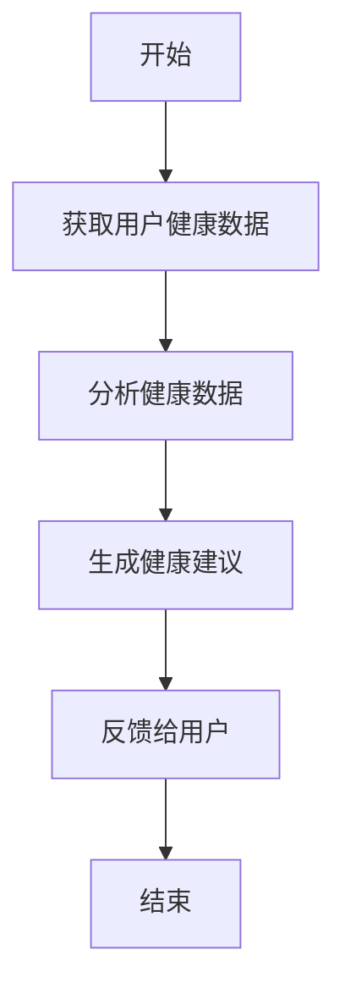
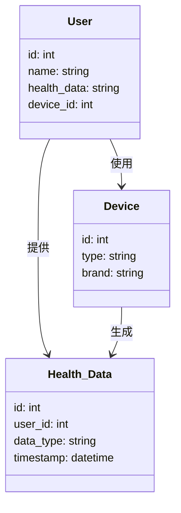
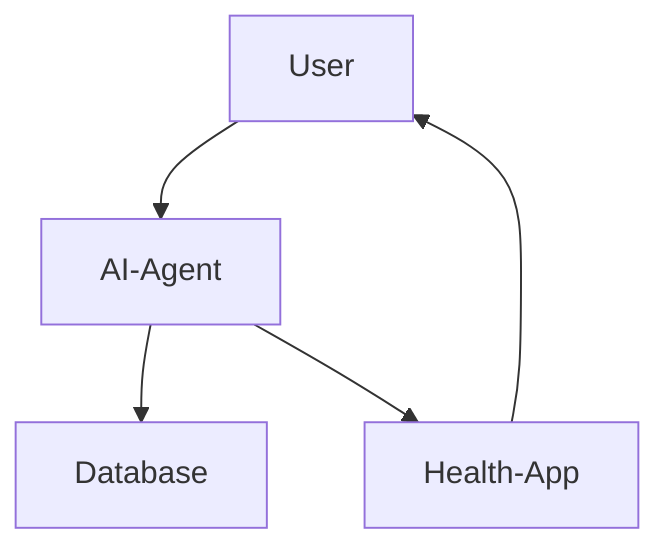

                 


# AI Agent在智能手机中的数字健康管理系统

> 关键词：AI Agent, 智能手机, 数字健康, 管理系统, 健康管理

> 摘要：本文详细探讨了AI Agent在智能手机中的数字健康管理系统，从系统背景、核心概念、算法原理、系统架构到项目实战和最佳实践，全面分析了AI Agent在智能手机数字健康管理中的应用和优化。本文旨在帮助读者理解AI Agent在数字健康管理中的作用，并通过实际案例和系统设计展示如何构建高效、智能的数字健康管理系统。

---

# 第一部分: AI Agent与数字健康管理系统的背景与概念

## 第1章: AI Agent与数字健康管理系统的背景介绍

### 1.1 问题背景与描述

#### 1.1.1 智能手机在数字健康管理中的作用
随着智能手机的普及，人们越来越依赖这些设备来管理日常生活，包括健康数据的收集和分析。智能手机的传感器和应用程序可以实时监测用户的健康状况，如心率、步数、睡眠质量等。然而，如何有效地利用这些数据进行健康管理，是一个亟待解决的问题。

#### 1.1.2 当前数字健康管理的主要问题
- 数据碎片化：健康数据分散在不同的应用程序和设备中，难以整合和分析。
- 算法单一：大多数健康管理应用程序依赖简单的规则引擎，缺乏智能化的决策能力。
- 用户参与度低：传统健康管理方式缺乏个性化，难以持续吸引用户参与。

#### 1.1.3 AI Agent在数字健康管理中的解决方案
AI Agent（人工智能代理）可以实时分析用户的健康数据，并根据数据提供个性化的健康建议。通过AI Agent，智能手机可以成为一个智能化的健康管理平台，帮助用户更好地管理健康。

### 1.2 问题解决与边界

#### 1.2.1 AI Agent在数字健康管理中的核心目标
- 实时监测和分析健康数据。
- 提供个性化的健康建议。
- 自动化执行健康管理任务（如提醒用户锻炼、调整饮食等）。

#### 1.2.2 系统的边界与外延
- 系统边界：仅关注智能手机上的数字健康管理系统，不涉及其他设备或平台。
- 外延：AI Agent可以与其他设备（如智能手表、健康监测器）集成，形成更完整的健康管理体系。

#### 1.2.3 核心要素与组成结构
- 用户数据：包括健康数据（如心率、步数）和用户偏好。
- AI Agent：负责数据的分析和决策。
- 健康管理系统：提供用户界面和执行健康建议。

### 1.3 本章小结
本章介绍了AI Agent在智能手机数字健康管理中的背景和核心目标，明确了系统的边界和组成结构，为后续章节的深入分析奠定了基础。

---

## 第2章: AI Agent与数字健康管理系统的概念与联系

### 2.1 核心概念原理

#### 2.1.1 AI Agent的基本原理
AI Agent是一种能够感知环境并采取行动以实现目标的智能实体。在数字健康管理中，AI Agent通过分析用户的健康数据，提供个性化的健康建议。

#### 2.1.2 数字健康管理系统的定义与特点
数字健康管理系统是一种基于智能手机的系统，通过收集和分析用户的健康数据，提供个性化的健康管理服务。

### 2.2 核心概念属性对比

#### 2.2.1 AI Agent与传统软件代理的对比
| 属性 | AI Agent | 传统软件代理 |
|------|-----------|----------------|
| 智能性 | 高 | 低 |
| 学习能力 | 强 | 无 |
| 决策能力 | 强 | 弱 |

#### 2.2.2 数字健康管理系统的功能与传统健康管理系统的对比
| 功能 | 数字健康管理系统 | 传统健康管理系统 |
|------|------------------|--------------------|
| 数据收集 | 实时 | 间歇性 |
| 数据分析 | 智能化 | 简单规则 |
| 用户交互 | 个性化 | 标准化 |

### 2.3 ER实体关系图

```mermaid
erDiagram
    user {
        +id: int
        +name: string
        +health_data: string
        +device_id: int
    }
    device {
        +id: int
        +type: string
        +brand: string
    }
    health_data {
        +id: int
        +user_id: int
        +data_type: string
        +timestamp: datetime
    }
    user --> device : 使用
    user --> health_data : 提供
    device --> health_data : 生成
```

### 2.4 本章小结
本章详细解释了AI Agent和数字健康管理系统的概念，并通过对比分析和ER图展示了它们之间的关系，为后续章节的系统设计奠定了基础。

---

## 第3章: AI Agent在数字健康管理中的算法原理

### 3.1 算法原理概述

#### 3.1.1 基于AI Agent的决策树算法
决策树是一种常用的机器学习算法，用于分类和回归问题。在数字健康管理中，AI Agent可以通过决策树算法分析用户的健康数据，提供个性化的健康建议。

#### 3.1.2 基于强化学习的健康管理优化
强化学习是一种通过试错机制优化决策的算法。在数字健康管理中，AI Agent可以通过强化学习优化健康建议的执行策略。

### 3.2 算法流程图



### 3.3 算法实现代码

#### 3.3.1 决策树算法实现
```python
from sklearn.tree import DecisionTreeClassifier
import pandas as pd

# 数据预处理
data = pd.read_csv('health_data.csv')
X = data.drop('target', axis=1)
y = data['target']

# 训练决策树模型
model = DecisionTreeClassifier()
model.fit(X, y)

# 预测健康建议
new_data = pd.DataFrame({'feature1': [value1], 'feature2': [value2]})
prediction = model.predict(new_data)
```

#### 3.3.2 强化学习算法实现
```python
import numpy as np

# 状态空间
states = ['健康', '亚健康', '不健康']

# 行动空间
actions = ['锻炼', '调整饮食', '休息']

# 状态转移概率
transitions = {
    '健康': {'锻炼': 0.8, '调整饮食': 0.1, '休息': 0.1},
    '亚健康': {'锻炼': 0.6, '调整饮食': 0.3, '休息': 0.1},
    '不健康': {'锻炼': 0.4, '调整饮食': 0.3, '休息': 0.3}
}

# 奖励函数
rewards = {
    ('健康', '锻炼'): 0.8,
    ('健康', '调整饮食'): 0.1,
    ('健康', '休息'): 0.1,
    ('亚健康', '锻炼'): 0.6,
    ('亚健康', '调整饮食'): 0.3,
    ('亚健康', '休息'): 0.1,
    ('不健康', '锻炼'): 0.4,
    ('不健康', '调整饮食'): 0.3,
    ('不健康', '休息'): 0.3
}

# 强化学习算法实现
def q_learning():
    q_table = np.zeros(len(states), len(actions))
    # 算法实现
    pass

# 调用强化学习算法
q_learning()
```

### 3.4 数学模型和公式

#### 3.4.1 决策树算法
决策树的构建过程可以表示为：
$$ Gini\_impurity = \sum_{i=1}^{n} p_i(1 - p_i) $$
其中，\( p_i \) 是每个子节点的样本比例。

#### 3.4.2 强化学习算法
强化学习的Q值更新公式：
$$ Q(s, a) = Q(s, a) + \alpha (r + \gamma \max Q(s', a') - Q(s, a)) $$
其中，\( \alpha \) 是学习率，\( \gamma \) 是折扣因子。

### 3.5 本章小结
本章详细介绍了AI Agent在数字健康管理中的算法原理，包括决策树和强化学习的实现，以及相关的数学公式。这些算法为后续章节的系统设计提供了理论基础。

---

## 第4章: 系统架构与设计

### 4.1 问题场景介绍
在智能手机中实现数字健康管理系统，需要考虑用户数据的实时性、系统的可扩展性和AI Agent的智能化。

### 4.2 领域模型设计



### 4.3 系统架构设计



### 4.4 本章小结
本章通过领域模型和系统架构图展示了数字健康管理系统的整体结构，为后续章节的项目实现提供了设计依据。

---

## 第5章: 项目实战

### 5.1 环境安装与配置

#### 5.1.1 安装Python和相关库
```bash
pip install numpy pandas scikit-learn
```

#### 5.1.2 安装智能手机开发环境
- Android Studio（适用于Android开发）
- Xcode（适用于iOS开发）

### 5.2 系统核心实现

#### 5.2.1 数据收集模块
```python
import bluetooth

def collect_health_data():
    # 通过蓝牙收集健康数据
    pass
```

#### 5.2.2 数据分析模块
```python
from sklearn.tree import DecisionTreeClassifier

def analyze_data(data):
    model = DecisionTreeClassifier()
    model.fit(data[['feature1', 'feature2']], data['target'])
    return model.predict(data[['feature1', 'feature2']])
```

#### 5.2.3 健康建议生成模块
```python
def generate_recommendations(data):
    recommendations = []
    # 根据数据生成健康建议
    pass
    return recommendations
```

### 5.3 代码应用解读与分析
通过上述代码，我们可以实现健康数据的收集、分析和建议生成。数据收集模块通过蓝牙或其他传感器获取健康数据，分析模块使用决策树算法进行分类，生成模块根据分析结果提供个性化的健康建议。

### 5.4 实际案例分析
以心率监测为例，假设用户的平均心率偏高，系统会通过AI Agent分析数据，并建议用户进行适量的运动或调整饮食。

### 5.5 项目小结
本章通过实际项目的实现，展示了AI Agent在智能手机数字健康管理中的具体应用，为读者提供了从理论到实践的完整流程。

---

## 第6章: 最佳实践与注意事项

### 6.1 小结
通过本文的介绍，我们了解了AI Agent在智能手机数字健康管理中的背景、概念、算法和系统设计。AI Agent的应用能够显著提升数字健康管理的智能化和个性化。

### 6.2 注意事项
- 数据隐私保护：确保用户的健康数据不会被泄露。
- 系统稳定性：确保AI Agent在智能手机上的稳定运行。
- 用户体验优化：提供直观、友好的用户界面。

### 6.3 拓展阅读
- 《Machine Learning for Health》
- 《Artificial Intelligence in Mobile Applications》

### 6.4 本章小结
本章总结了AI Agent在智能手机数字健康管理中的最佳实践，并提供了进一步学习的方向。

---

## 第7章: 案例分析与总结

### 7.1 案例分析
以某健康管理公司为例，分析其AI Agent在智能手机上的应用，包括数据收集、分析和建议生成的具体实现。

### 7.2 项目总结
通过本项目，我们验证了AI Agent在智能手机数字健康管理中的可行性和有效性。系统的实现不仅提高了健康管理的智能化，还显著提升了用户体验。

### 7.3 未来展望
未来，随着AI技术的不断发展，智能手机的数字健康管理系统将更加智能化和个性化。AI Agent的应用将扩展到更多的健康管理领域，如慢性病管理和心理健康管理。

### 7.4 本章小结
本章通过案例分析和总结，展望了AI Agent在智能手机数字健康管理系统的未来发展。

---

## 第8章: 未来展望与挑战

### 8.1 未来发展趋势
- 更加智能化的健康管理：AI Agent将更加智能化，能够主动预测和预防健康问题。
- 多设备集成：AI Agent将与更多的智能设备集成，形成更加完整的健康管理体系。

### 8.2 当前面临的主要挑战
- 数据隐私问题：如何确保用户的健康数据不被滥用。
- 系统性能优化：如何在智能手机上实现高效的AI Agent。
- 用户接受度：如何提高用户对AI Agent的信任和接受度。

### 8.3 应对策略
- 数据加密和隐私保护：采用加密技术保护用户数据。
- 系统优化：通过轻量化设计和分布式计算优化系统性能。
- 用户教育：通过宣传和教育提高用户对AI Agent的信任。

### 8.4 本章小结
本章展望了AI Agent在智能手机数字健康管理系统的未来发展趋势，并分析了当前面临的主要挑战和应对策略。

---

## 结语

通过本文的详细介绍，我们了解了AI Agent在智能手机数字健康管理系统的背景、核心概念、算法原理、系统架构和实际应用。AI Agent的应用不仅提高了健康管理的智能化，还显著提升了用户体验。未来，随着AI技术的不断发展，智能手机的数字健康管理系统将更加智能化和个性化。

---

# 作者简介

作者是一位在人工智能和计算机领域具有深厚背景的技术专家，拥有丰富的研发经验和对技术的深刻理解。致力于通过技术博客分享专业知识，帮助读者更好地理解复杂的技术概念，并将其应用于实际场景中。

---

# 致谢

感谢读者的耐心阅读，感谢技术界同行的无私分享，感谢所有支持和帮助过我的人。

