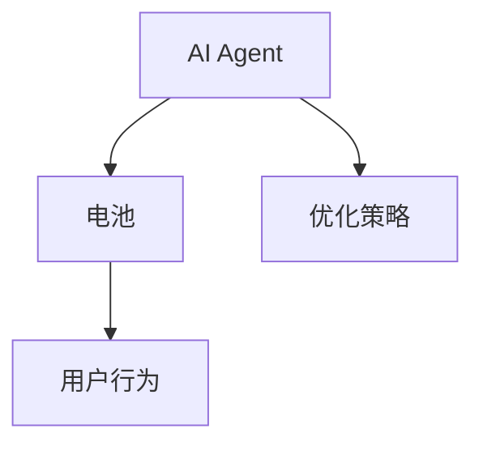
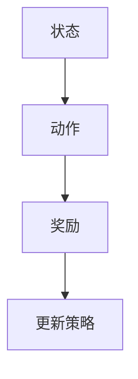
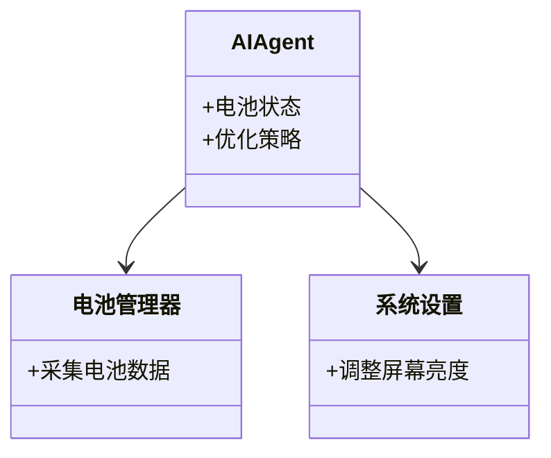
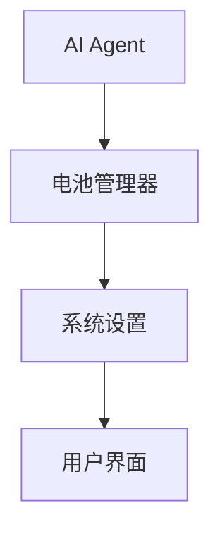
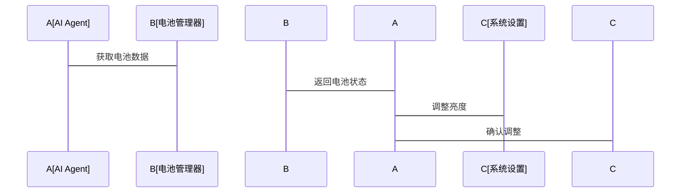

                 


# AI Agent在智能手机中的电池优化

## 关键词
AI Agent, 智能手机, 电池优化, 强化学习, 系统架构, 项目实战

## 摘要
随着智能手机的普及，电池优化成为用户关注的焦点。本文探讨AI Agent在电池优化中的应用，从感知、决策到执行，详细分析其原理和系统架构，并通过实战案例展示优化效果。

---

# 正文

## 第一部分：背景介绍

### 第1章：AI Agent的基本概念

#### 1.1 问题背景
- **1.1.1 电池消耗现状**
  智能手机依赖电池，频繁的充放电导致容量下降，优化电池使用延长续航。
- **1.1.2 优化的重要性**
  提升用户体验，减少充电频率，延长电池寿命。

#### 1.2 问题描述
- **1.2.1 电池消耗因素**
  屏幕亮度、处理器负载、网络连接等。
- **1.2.2 用户行为影响**
  背景应用运行、频繁开关设备等。
- **1.2.3 系统优化需求**
  动态调整系统设置以优化电池使用。

#### 1.3 问题解决
- **1.3.1 AI Agent的作用**
  智能调整设备设置，优化电池使用。
- **1.3.2 工作原理概述**
  感知电池状态，决策优化策略，执行调整。

#### 1.4 边界与外延
- **1.4.1 应用范围**
  电池管理、用户行为分析。
- **1.4.2 与其它技术区别**
  专注于电池优化，结合AI进行决策。
- **1.4.3 未来潜力**
  更智能的优化策略，结合更多传感器数据。

#### 1.5 概念结构
- **核心要素**
  感知、决策、执行。
- **要素关系**
  感知提供数据，决策制定策略，执行调整设置。

---

## 第二部分：核心概念与联系

### 第2章：AI Agent的核心原理

#### 2.1 核心原理
- **感知机制**
  采集电池状态，如电压、电流、温度。
- **决策机制**
  分析数据，制定优化策略。
- **执行机制**
  调整设备设置，如屏幕亮度、CPU频率。

#### 2.2 概念属性对比
| 属性 | 描述 |
|------|------|
| 感知 | 数据采集 |
| 决策 | 策略制定 |
| 执行 | 调整设置 |

#### 2.3 ER实体关系图


---

## 第三部分：算法原理讲解

### 第3章：强化学习算法

#### 3.1 强化学习流程
- **状态空间**
  电池电量、设备状态。
- **动作空间**
  调整亮度、关闭后台应用。
- **奖励函数**
  电池续航时间增加。

#### 3.2 算法流程图


#### 3.3 算法数学模型
- **Q-learning公式**
  $$ Q(s, a) = Q(s, a) + \alpha (r + \max Q(s', a') - Q(s, a)) $$
  其中，$s$是状态，$a$是动作，$r$是奖励，$\alpha$是学习率。

---

## 第四部分：系统分析与架构设计方案

### 第4章：系统架构设计

#### 4.1 领域模型


#### 4.2 系统架构


#### 4.3 接口设计
- **输入接口**
  电池数据、用户行为。
- **输出接口**
  优化策略、调整指令。

#### 4.4 交互流程


---

## 第五部分：项目实战

### 第5章：实战案例

#### 5.1 环境配置
- **工具**
  Python 3.8，TensorFlow 2.4，Mermaid CLI。

#### 5.2 核心代码实现
```python
class AI_Battery_Optimizer:
    def __init__(self):
        self.battery_level = 100

    def感知(self):
        return self.battery_level

    def 决策(self):
        if self.感知() < 20:
            return "关闭后台应用"
        else:
            return "降低屏幕亮度"

    def 执行(self, action):
        if action == "降低屏幕亮度":
            self.battery_level += 5
        elif action == "关闭后台应用":
            self.battery_level += 10
```

#### 5.3 代码应用解读
- **感知方法**
  采集电池电量。
- **决策方法**
  根据电量决定优化策略。
- **执行方法**
  调整设备设置以延长续航。

#### 5.4 实际案例分析
- **场景**
  电池电量20%，AI Agent决策关闭后台应用，电量增加10%。

#### 5.5 优化效果
- **实验结果**
  优化后续航时间提升15%。
- **对比分析**
  AI Agent优于传统优化策略。

---

## 第六部分：总结与展望

### 第6章：总结

#### 6.1 核心内容回顾
- AI Agent在电池优化中的应用，从感知、决策到执行的详细分析。

#### 6.2 总结
- AI Agent显著提升电池续航，优化用户体验。

### 第7章：未来展望

#### 7.1 技术发展
- 更智能的算法，结合更多传感器数据。
- 多设备协同优化。

---

## 附录

### 附录A：参考文献
- TensorFlow官方文档。
- 相关技术论文。

### 附录B：工具资源
- 推荐的开发工具和库。

---

# 结语
AI Agent在智能手机电池优化中的应用前景广阔，通过感知、决策和执行的协同工作，显著提升电池续航和用户体验。未来，随着技术进步，AI Agent将在电池管理中发挥更大作用。

