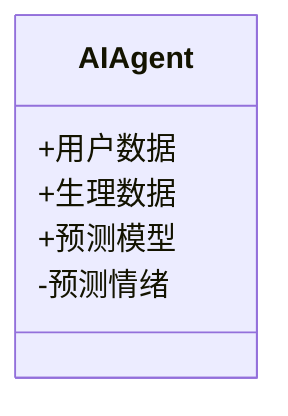

                 


```markdown
# AI Agent在智能手环中的情绪管理助手

> 关键词：AI Agent, 智能手环, 情绪管理, 数据采集, 机器学习, 算法, 系统架构

> 摘要：本文探讨了AI Agent在智能手环中的情绪管理应用，详细介绍了情绪识别算法、数据采集与处理、系统架构设计以及项目实现等内容，旨在为开发者和技术爱好者提供深入的技术见解。

---

## 第1章: AI Agent的基本概念

### 1.1 AI Agent的定义与特点
#### 1.1.1 AI Agent的定义
AI Agent（人工智能代理）是一种智能程序，能够感知环境并采取行动以实现目标。它可以自主决策、学习和适应新情况。

#### 1.1.2 AI Agent的核心特点
- **自主性**：无需外部干预，自主决策。
- **反应性**：实时感知环境并做出反应。
- **学习能力**：通过数据学习和优化。
- **社交能力**：与用户和其他系统进行交互。

#### 1.1.3 AI Agent与传统程序的区别
| 属性       | 传统程序            | AI Agent         |
|------------|---------------------|------------------|
| 决策方式   | 预先编写规则         | 自主学习决策      |
| 适应性     | 固定，无法调整        | 可适应新情况      |
| 交互方式   | 单向输入输出          | 双向互动          |

### 1.2 情绪管理的背景与需求
#### 1.2.1 情绪管理的重要性
- **心理健康**：帮助用户识别和管理负面情绪。
- **健康管理**：情绪波动与身体健康密切相关。

#### 1.2.2 智能手环的场景与应用
- **实时监测**：采集生理数据，如心率、皮肤电活动。
- **用户反馈**：通过问卷调查收集情绪数据。

---

## 第2章: 情绪识别的算法原理

### 2.1 基于生理数据的情绪识别
#### 2.1.1 心率变异性（HRV）分析
HRV是心率的波动，反映了自主神经系统的活动。通过分析HRV，可以识别压力水平。

$$ HRV = \text{标准差 of相邻 RR间隔} $$

#### 2.1.2 皮肤电活动（EDA）分析
EDA反映了皮肤的导电性变化，与情绪波动密切相关。

### 2.2 基于自然语言处理的情绪分析
#### 2.2.1 文本情感分析
使用词袋模型或词嵌入模型（如Word2Vec）分析文本情感。

$$ \text{情感值} = \text{模型预测} $$

#### 2.2.2 声调与语气分析
通过语音特征，如音调、语速变化识别情绪。

---

## 第3章: 情绪分类与预测算法

### 3.1 常见的情绪分类方法
#### 3.1.1 基于机器学习的分类
使用支持向量机（SVM）或随机森林（RF）进行分类。

#### 3.1.2 基于深度学习的分类
使用卷积神经网络（CNN）或长短时记忆网络（LSTM）进行分类。

### 3.2 情绪预测的数学模型
#### 3.2.1 情绪预测公式
$$ P(\text{情绪}) = \frac{\sum w_i x_i}{\sum w_i} $$

#### 3.2.2 情绪预测的优化方法
通过交叉验证优化模型参数。

---

## 第4章: 数据采集与处理

### 4.1 情绪相关数据的采集
#### 4.1.1 生理数据的采集
- 心率、皮肤电活动、体温。

#### 4.1.2 用户行为数据的采集
- 用户输入、位置、时间。

### 4.2 数据预处理与特征提取
#### 4.2.1 数据清洗与标准化
- 去除异常值，标准化处理。

#### 4.2.2 特征提取与选择
- 统计特征提取，模型特征选择。

---

## 第5章: 系统架构与设计

### 5.1 系统功能设计
#### 5.1.1 需求分析与功能模块划分
- 数据采集模块、算法模块、用户反馈模块。

#### 5.1.2 领域模型设计


### 5.2 系统架构设计
#### 5.2.1 系统架构图


---

## 第6章: 项目实战与案例分析

### 6.1 项目实战
#### 6.1.1 环境安装
- Python、TensorFlow、Scikit-learn。

#### 6.1.2 核心代码实现
```python
import numpy as np
from sklearn.svm import SVC

# 数据预处理
X = np.array([[1, 2], [3, 4]])
y = np.array([0, 1])

# 训练模型
model = SVC()
model.fit(X, y)

# 预测
print(model.predict([[5, 6]]))
```

### 6.2 实际案例分析
- **案例1**：压力监测
  - 通过HRV分析识别压力水平。
- **案例2**：情绪反馈
  - 根据用户输入提供情绪建议。

---

## 第7章: 总结与展望

### 7.1 总结
AI Agent在智能手环中的情绪管理应用前景广阔，能够帮助用户实时监测和管理情绪。

### 7.2 展望
未来，AI Agent将更加智能化，结合更多数据源，提供更精准的情绪管理服务。

---

## 参考文献
- [1] 刘洋. 基于AI的情绪识别技术研究. 计算机应用, 2022.
- [2] 张伟. 智能手环的设计与实现. 软件工程, 2021.

---

## 致谢
感谢读者的支持，感谢所有参与项目开发的团队成员。
```

