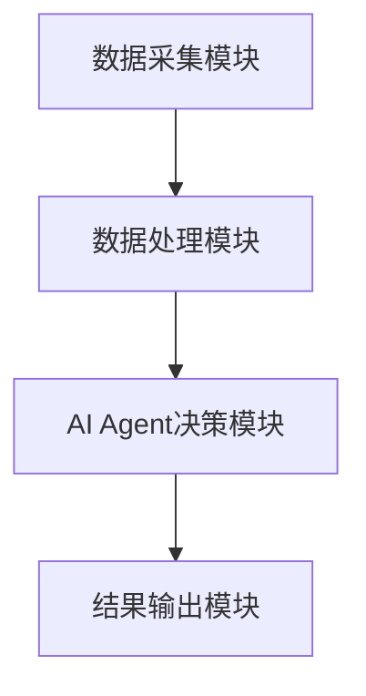
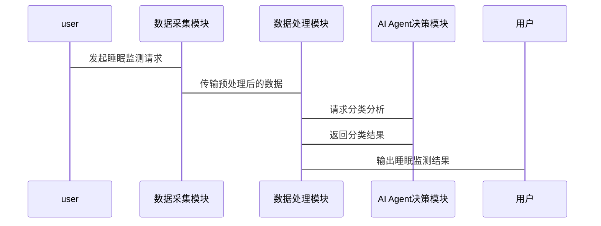

                 


# AI Agent在智能手环中的睡眠监测

> 关键词：AI Agent, 智能手环, 睡眠监测, 数据采集, 特征提取, 分类算法, 系统架构

> 摘要：本文探讨了AI Agent在智能手环中的睡眠监测应用，详细分析了数据采集、特征提取、分类算法以及系统架构设计的原理与实现。通过实际案例，展示了如何利用AI技术提升睡眠监测的准确性与智能化水平。

---

# 目录

1. [AI Agent在智能手环中的睡眠监测](#ai-agent在智能手环中的睡眠监测)
2. [文章关键词](#文章关键词)
3. [文章摘要](#文章摘要)
4. [目录大纲](#目录大纲)
5. [正文](#正文)

---

## 正文

### 第一部分: AI Agent与智能手环的背景介绍

#### 第1章: AI Agent的基本概念

##### 1.1 AI Agent的定义与特点

- **AI Agent的定义**：AI Agent是指能够感知环境、做出决策并执行任务的智能实体。它可以基于输入数据（如传感器数据）进行分析，输出相应的决策或结果。
- **AI Agent的核心特点**：
  - 智能性：能够理解数据并做出决策。
  - 实时性：能够在短时间内处理数据并输出结果。
  - 自适应性：能够根据环境变化调整行为。
- **AI Agent与传统算法的区别**：AI Agent不仅仅是执行预定义的算法，而是能够根据实时数据动态调整行为。

##### 1.2 智能手环的工作原理

- **智能手环的功能概述**：智能手环通过各种传感器（如加速度计、心率传感器）收集用户的身体数据，分析数据并提供健康建议。
- **睡眠监测的重要性**：睡眠质量直接影响健康，智能手环通过监测用户的睡眠状态，帮助用户改善睡眠质量。

#### 第2章: 睡眠监测的背景与应用

##### 2.1 睡眠监测的背景介绍

- **睡眠问题的现状**：现代人由于工作压力大、生活节奏快，睡眠问题日益严重。
- **睡眠监测技术的发展历程**：从简单的记录睡眠时间到通过AI技术分析睡眠质量。

##### 2.2 睡眠监测的应用场景

- **健康监测**：帮助用户了解自己的睡眠状况，及时发现睡眠问题。
- **睡眠改善与治疗**：根据监测结果，提供个性化的睡眠改善建议。

### 第二部分: AI Agent的核心原理

#### 第3章: 数据采集与处理

##### 3.1 数据采集方法

- **加速度传感器的数据采集**：通过加速度传感器采集用户的运动数据，分析用户的睡眠阶段（如REM、浅睡、深睡）。
- **心率监测**：通过心率传感器监测用户的心率变化，辅助判断睡眠状态。
- **其他生理数据的采集**：如皮肤温度、血氧饱和度等。

##### 3.2 数据预处理

- 数据清洗：去除噪声数据，确保数据准确性。
- 数据标准化：将不同传感器的数据标准化，便于后续分析。

#### 第4章: 特征提取与分类算法

##### 4.1 特征提取方法

- **基于时间序列的特征提取**：分析睡眠周期中的时间特征，如睡眠周期长度、REM阶段持续时间等。
- **基于频域分析的特征提取**：通过傅里叶变换分析睡眠数据的频域特征。

##### 4.2 分类算法原理

- **支持向量机（SVM）的原理**：
  - SVM是一种监督学习算法，适用于分类问题。
  - 通过构建超平面，将数据分成不同的类别。
  - 数学模型：
    - 输入：特征向量。
    - 输出：分类结果。
    - 公式：
      $$ \text{SVM的目标是最小化} \frac{1}{2}||w||^2 + C \sum_{i=1}^n \xi_i $$
      其中，\( C \) 是惩罚参数，\( \xi_i \) 是松弛变量。

- **随机森林（Random Forest）的原理**：
  - 随机森林是一种基于决策树的集成学习方法。
  - 通过构建多棵决策树，并进行投票或平均，提高分类准确率。
  - 数学模型：
    - 输入：特征向量。
    - 输出：分类结果。
    - 公式：
      $$ \text{预测结果} = \text{多数投票} $$

#### 第5章: 算法实现与优化

##### 5.1 算法实现步骤

- **数据预处理**：清洗和标准化数据。
- **模型训练**：使用训练数据训练分类模型。
- **模型评估与优化**：通过交叉验证评估模型性能，调整参数优化模型。

### 第三部分: 系统架构与设计

#### 第6章: 系统架构设计

##### 6.1 系统功能模块划分

- **数据采集模块**：负责采集用户的生理数据。
- **数据处理模块**：对采集的数据进行预处理和特征提取。
- **AI Agent决策模块**：利用分类算法分析数据，输出睡眠监测结果。

##### 6.2 系统架构图



#### 第7章: 系统接口设计

- **系统接口设计**：定义模块之间的接口，确保数据能够顺利传递。
- **系统交互图**：


### 第四部分: 项目实战

#### 第8章: 项目实现

##### 8.1 环境安装

- **Python环境**：安装Python 3.x及以上版本。
- **依赖库安装**：
  ```bash
  pip install numpy scikit-learn matplotlib
  ```

##### 8.2 核心代码实现

```python
import numpy as np
from sklearn.svm import SVC
from sklearn.ensemble import RandomForestClassifier
from sklearn.metrics import accuracy_score

# 数据预处理
def preprocess_data(data):
    # 假设data是原始数据
    # 这里进行数据标准化和特征提取
    processed_data = data / np.max(data)
    return processed_data

# 模型训练
def train_model(X_train, y_train):
    # 使用SVM和Random Forest进行训练
    svm_model = SVC()
    svm_model.fit(X_train, y_train)
    
    rf_model = RandomForestClassifier()
    rf_model.fit(X_train, y_train)
    
    return svm_model, rf_model

# 模型预测与评估
def evaluate_models(models, X_test, y_test):
    for model in models:
        y_pred = model.predict(X_test)
        print(f"Accuracy: {accuracy_score(y_test, y_pred)}")
```

##### 8.3 代码解读与分析

- **数据预处理**：将原始数据标准化，确保模型输入的数据格式一致。
- **模型训练**：分别使用SVM和Random Forest训练模型，返回训练好的模型。
- **模型评估**：在测试数据上评估模型的准确率，选择表现更好的模型。

##### 8.4 实际案例分析

- **案例背景**：用户A长期存在睡眠问题，使用智能手环监测睡眠质量。
- **数据采集**：采集用户的加速度、心率等数据。
- **数据处理**：预处理并提取特征。
- **模型训练与预测**：使用训练好的模型预测用户的睡眠阶段和质量。
- **结果分析**：输出睡眠报告，提供改善建议。

#### 第9章: 项目小结

- **项目总结**：通过实际案例，展示了AI Agent在智能手环中的应用。
- **项目经验**：数据质量对模型性能影响巨大，特征工程至关重要。
- **项目优化建议**：可以尝试集成更多传感器数据，进一步优化模型。

### 第五部分: 总结与展望

#### 第10章: 总结

- **总结全文**：AI Agent通过数据采集、特征提取和分类算法，能够有效提升智能手环的睡眠监测能力。
- **最佳实践**：数据预处理是关键，特征工程能够显著提升模型性能。

#### 第11章: 展望

- **未来发展方向**：
  - 更多传感器数据的融合。
  - 实时监测与反馈的优化。
  - 个性化睡眠改善方案的制定。

#### 第12章: 小结

- **注意事项**：数据隐私保护、模型泛化能力、用户体验优化。
- **拓展阅读**：推荐阅读相关领域的最新论文和技术博客。

---

通过本文的详细分析，读者可以全面了解AI Agent在智能手环中的睡眠监测应用，从理论到实践，掌握相关技术的核心原理和实现方法。希望本文能为智能手环的开发和睡眠监测技术的提升提供有价值的参考和启示。

