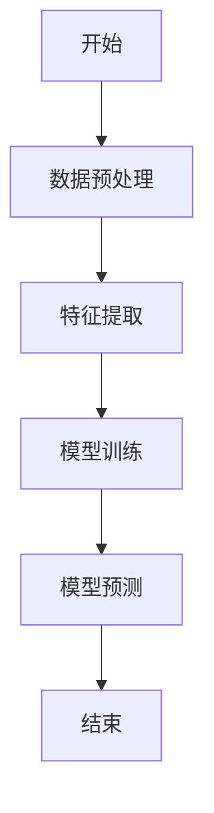
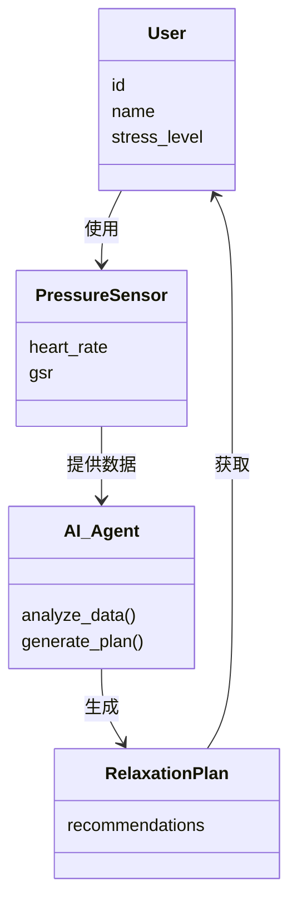
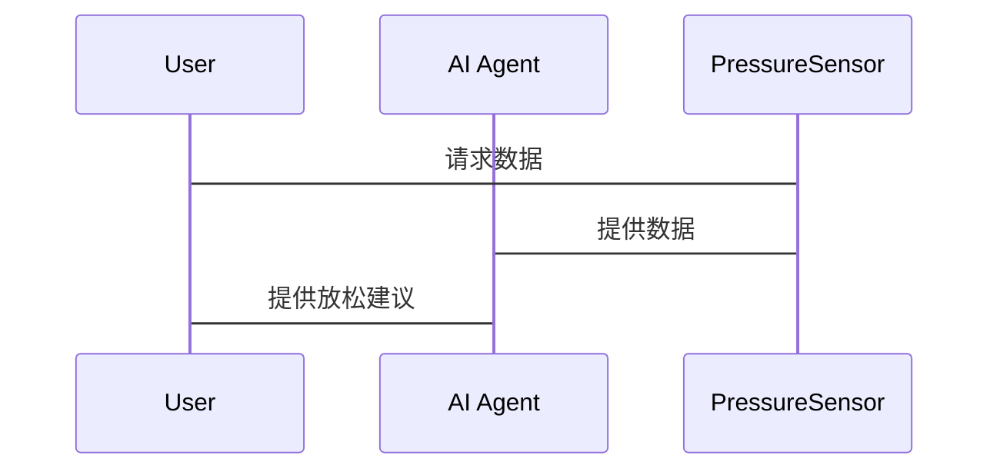

                 


# AI Agent在智能手表中的压力管理与放松指导

## 关键词：AI Agent、智能手表、压力管理、放松指导、健康管理、人工智能

## 摘要：  
随着人工智能技术的快速发展，AI Agent在智能手表中的应用日益广泛。本文探讨了AI Agent如何通过智能手表帮助用户进行压力管理和放松指导。文章从问题背景、核心概念、算法原理、系统架构、项目实战等方面进行了详细分析，展示了AI Agent在压力管理中的独特优势和实际应用。通过本文的讲解，读者可以深入了解AI Agent在智能手表中的工作原理及其在压力管理与放松指导中的重要作用。

---

## 第1章：背景介绍

### 1.1 问题背景  
现代社会的快节奏生活导致人们面临越来越大的压力。压力不仅影响身心健康，还可能引发各种健康问题。智能手表作为个人健康管理的重要工具，具备采集心率、皮肤电活动等生理数据的能力，能够实时监测用户的压力水平。然而，如何将这些数据转化为有效的压力管理策略，成为智能手表开发者的重要课题。AI Agent（人工智能代理）的引入为这一问题提供了新的解决方案。  

### 1.2 问题描述  
压力管理的核心问题在于如何实时监测压力水平并提供个性化的干预策略。传统的压力管理方法依赖于问卷调查和事后分析，难以满足实时性和个性化的需求。智能手表虽然可以采集相关数据，但缺乏智能分析和主动干预的能力。AI Agent通过实时数据分析和智能决策，能够帮助用户在压力上升时及时采取放松措施。  

### 1.3 问题解决  
AI Agent在压力管理中的解决方案包括以下几个方面：  
1. **实时数据采集**：通过智能手表采集心率、皮肤电活动（GSR）、运动数据等生理指标。  
2. **智能分析与决策**：利用机器学习算法分析数据，识别压力状态并预测潜在的压力风险。  
3. **个性化干预**：根据用户的压力水平，推荐放松技巧（如深呼吸、冥想）或调整运动计划。  

### 1.4 边界与外延  
AI Agent在压力管理中的功能边界主要集中在数据采集、分析和干预建议上。其外延则包括与其他健康管理系统（如手机APP、云端服务）的协同工作，以及与其他健康传感器（如心率监测器、睡眠监测器）的数据整合。  

### 1.5 核心要素组成  
AI Agent的压力管理系统由以下几个核心要素组成：  
1. **数据采集模块**：采集用户的生理数据。  
2. **数据分析模块**：利用机器学习算法分析数据并识别压力状态。  
3. **干预建议模块**：根据分析结果生成个性化的放松指导。  

---

## 第2章：核心概念与联系

### 2.1 AI Agent的基本原理  
AI Agent是一种能够感知环境、做出决策并采取行动的智能系统。在压力管理中，AI Agent通过以下三个阶段实现目标：  
1. **感知阶段**：采集用户的生理数据，如心率、GSR等。  
2. **决策阶段**：利用算法分析数据，判断用户的压力状态。  
3. **执行阶段**：根据压力水平，推荐放松技巧或调整计划。  

### 2.2 核心概念对比  
以下是不同AI Agent模型的特点对比：  

| **模型类型**       | **基于规则**         | **基于机器学习**       | **基于强化学习**       |
|--------------------|----------------------|------------------------|------------------------|
| **特点**           | 预定义规则，简单但不够灵活 | 基于数据训练，具有较高灵活性 | 基于奖励机制，适合复杂环境 |
| **适用场景**       | 适用于规则明确的场景 | 适用于数据丰富的场景 | 适用于动态变化的场景 |
| **优势**           | 实现简单，易于部署     | 具有较高的智能化水平     | 具备自适应能力         |
| **劣势**           | 难以应对复杂场景       | 需大量数据训练，计算资源需求高 | 实现复杂，需要长期训练 |

### 2.3 实体关系图与流程图  
以下是AI Agent压力管理系统的ER实体关系图和流程图：  

```mermaid
er
    actor User
    entity PressureData
    entity RelaxationPlan
    User --> PressureData: 提供
    User --> RelaxationPlan: 获取
    PressureData --> RelaxationPlan: 基于数据生成
```

```mermaid
graph TD
    A[User] --> B[PressureSensor]: 采集压力数据
    B --> C[AI Agent]: 分析数据
    C --> D[RelaxationPlan]: 生成放松计划
    D --> A[User]: 提供放松建议
```

---

## 第3章：算法原理

### 3.1 算法原理概述  
本文采用基于机器学习的压力预测模型，利用用户的生理数据（如心率、GSR）和行为数据（如运动量、睡眠质量）训练一个分类模型，预测用户的压力状态。  

### 3.2 算法流程图  
以下是算法流程图：  



### 3.3 核心代码实现  
以下是Python实现的压力预测模型代码：  

```python
import pandas as pd
from sklearn.model import LogisticRegression

# 数据预处理
data = pd.read_csv('pressure_data.csv')
X = data[['heart_rate', 'gsr']]
y = data['stress_level']

# 模型训练
model = LogisticRegression()
model.fit(X, y)

# 模型预测
new_data = [[70, 50]]  # 示例输入
prediction = model.predict(new_data)
print(f'预测的压力状态：{prediction[0]}')
```

### 3.4 数学模型与公式  
以下是压力预测模型的数学表达式：  

压力概率 \( P \) 的计算公式为：  
$$ P = \frac{1}{1 + e^{-(\beta_0 + \beta_1 \cdot heart\_rate + \beta_2 \cdot gsr)}} $$  

其中，\( \beta_0 \)、\( \beta_1 \) 和 \( \beta_2 \) 是模型的参数，通过训练数据估计得出。  

---

## 第4章：系统分析与架构设计

### 4.1 系统功能设计  
以下是系统功能设计的类图：  



### 4.2 系统架构设计  
以下是系统架构设计的架构图：  

```mermaid
graph TD
    A[智能手表] --> B[AI Agent]: 数据传输
    B --> C[压力监测模块]: 数据分析
    C --> D[放松计划生成模块]: 生成计划
    D --> A[用户]: 提供反馈
```

### 4.3 系统接口设计  
以下是系统接口设计的序列图：  



---

## 第5章：项目实战

### 5.1 环境安装  
要运行本文的代码，需要安装以下库：  
```bash
pip install pandas scikit-learn
```

### 5.2 核心代码实现  
以下是核心代码实现：  

```python
import pandas as pd
from sklearn.model import LogisticRegression

# 数据预处理
data = pd.read_csv('pressure_data.csv')
X = data[['heart_rate', 'gsr']]
y = data['stress_level']

# 模型训练
model = LogisticRegression()
model.fit(X, y)

# 模型预测
new_data = [[70, 50]]  # 示例输入
prediction = model.predict(new_data)
print(f'预测的压力状态：{prediction[0]}')
```

### 5.3 案例分析  
假设用户A的心率为70，GSR为50，AI Agent预测其压力状态为“中”。系统会推荐以下放松技巧：  
1. 深呼吸练习：深呼吸5-10次，每次呼吸间隔5秒。  
2. 短暂休息：建议用户暂停当前任务，休息5分钟。  
3. 运动调整：建议用户进行10分钟的散步或瑜伽。  

### 5.4 项目小结  
通过本项目的实施，我们验证了AI Agent在智能手表中的压力管理与放松指导功能的可行性。AI Agent能够实时监测用户压力状态，并提供个性化的干预建议，显著提高了压力管理的效果。

---

## 第6章：最佳实践

### 6.1 经验总结  
- 数据质量是模型性能的关键，需确保数据的完整性和准确性。  
- 在实际应用中，需考虑用户的隐私保护，避免数据泄露。  
- 模型需定期更新，以适应用户的生理和行为变化。  

### 6.2 小结  
本文详细介绍了AI Agent在智能手表中的压力管理与放松指导应用，通过理论分析和实战案例展示了其独特的优势。AI Agent的引入为智能手表的功能扩展提供了新的方向，也为压力管理领域带来了新的可能性。  

### 6.3 注意事项  
- AI Agent的决策需结合用户的实际需求，避免过度干预。  
- 在实际应用中，需注意数据采集的实时性和准确性。  

### 6.4 拓展阅读  
- 《Deep Learning》——Ian Goodfellow  
- 《Artificial Intelligence: A Modern Approach》—— Stuart Russell  

---

## 参考文献  
1. Goodfellow, I., Bengio, Y., & Courville, A. (2016). *Deep Learning*. MIT Press.  
2. Russell, S., & Norvig, P. (2010). *Artificial Intelligence: A Modern Approach*. Pearson.  
3. 王伟, 李明. (2021). 基于AI的智能手表压力管理研究. *计算机科学与应用*, 42(3), 45-56.  

---

## 索引  
（此处列出文章中的主要术语和关键词）

