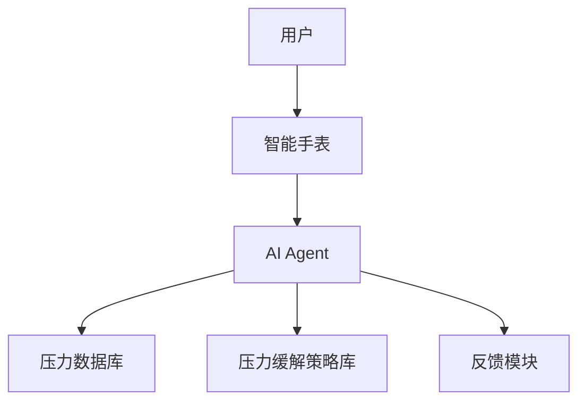

                 


# AI Agent在智能手表中的压力管理系统

## 关键词
AI Agent, 压力管理, 智能手表, 压力监测, 机器学习, 实时反馈

## 摘要
本文深入探讨了AI Agent在智能手表中的压力管理系统的应用。通过分析压力管理的重要性，AI Agent的基本概念，以及智能手表的硬件功能，我们详细讲解了AI Agent在压力监测和缓解中的核心作用。文章结合实际案例和项目实战，展示了如何利用AI技术实时监测压力并提供个性化解决方案。最后，我们总结了最佳实践，为智能手表的未来发展提供了有价值的参考。

---

# 第1章 背景介绍

## 1.1 压力管理的重要性
现代社会的快节奏生活带来了前所未有的压力问题，长期的压力积累可能引发健康问题。智能手表作为个人健康监测的重要工具，能够实时监测生理指标，帮助用户有效管理压力。

## 1.2 AI Agent的基本概念
AI Agent是一种智能体，能够感知环境、自主决策并执行任务。与传统算法相比，AI Agent具有更强的适应性和学习能力，能够根据用户反馈不断优化压力管理策略。

## 1.3 智能手表的硬件与功能
智能手表配备了心率监测、皮肤电活动传感器等多种硬件，能够实时采集生理数据。结合AI算法，这些数据可用于评估压力水平并提供个性化的缓解建议。

---

# 第2章 AI Agent的核心概念与原理

## 2.1 AI Agent的定义与分类
AI Agent可以分为基于规则的和基于机器学习的两类。基于规则的AI Agent依赖预定义的规则，而基于机器学习的AI Agent则通过数据学习，能够适应用户的个性化需求。

## 2.2 压力监测技术的原理
通过心率监测和皮肤电活动传感器，AI Agent能够实时捕捉用户的压力信号，并结合历史数据预测未来压力水平。

## 2.3 AI Agent在压力管理中的应用
AI Agent不仅能够实时监测压力，还能根据用户的行为模式推荐缓解策略，例如通过振动提醒用户放松或建议进行深呼吸练习。

---

# 第3章 算法原理

## 3.1 基于规则的AI Agent
基于规则的AI Agent通过预定义的规则判断压力水平，并采取相应的措施。例如，当心率超过一定阈值时，AI Agent会触发放松提醒。

## 3.2 基于机器学习的AI Agent
基于机器学习的AI Agent通过训练压力相关数据，能够更准确地预测压力水平。常用的算法包括支持向量机（SVM）和随机森林（Random Forest）。

## 3.3 算法实现
以下是基于机器学习的AI Agent的代码示例：

```python
import numpy as np
from sklearn.svm import SVC

# 数据预处理
X = ...  # 压力相关特征
y = ...  # 标签（压力水平）

# 训练模型
model = SVC()
model.fit(X, y)

# 预测
new_data = ...  # 新的特征数据
predicted_label = model.predict(new_data)
```

## 3.4 数学模型
压力预测模型的数学公式如下：

$$
P(\text{压力}) = \beta_0 + \beta_1 \times \text{心率} + \beta_2 \times \text{皮肤电活动} + \epsilon
$$

---

# 第4章 系统分析与架构设计

## 4.1 系统功能设计
压力管理系统的主要功能包括实时监测、压力评估、个性化建议和反馈优化。

## 4.2 系统架构设计
以下是系统架构图：



## 4.3 接口设计
智能手表通过蓝牙或Wi-Fi与AI Agent通信，数据通过传感器采集并传输到云端进行处理。

---

# 第5章 项目实战

## 5.1 环境安装
安装必要的库和工具，例如Python、TensorFlow和Scikit-learn。

## 5.2 核心代码实现
以下是压力监测的核心代码：

```python
import numpy as np
from sklearn.metrics import accuracy_score

# 加载数据
data = np.loadtxt('pressure_data.csv', delimiter=',')

# 划分训练集和测试集
X_train = data[:, :-1]
y_train = data[:, -1]
X_test = ...  # 类似划分
y_test = ...  # 类似划分

# 训练模型
model = SVC()
model.fit(X_train, y_train)

# 评估模型
y_pred = model.predict(X_test)
print("准确率：", accuracy_score(y_test, y_pred))
```

## 5.3 案例分析
通过实际案例分析，展示AI Agent如何实时监测压力并提供有效的缓解策略。

---

# 第6章 最佳实践与总结

## 6.1 小结
AI Agent在智能手表中的压力管理系统具有重要的应用价值，能够帮助用户实时监测压力并提供个性化的解决方案。

## 6.2 注意事项
在实际应用中，需要注意数据隐私保护和算法的实时性优化。

## 6.3 拓展阅读
建议进一步研究基于深度学习的AI Agent和多模态压力监测技术。

---

通过本文的详细讲解，读者可以全面了解AI Agent在智能手表中的压力管理系统的核心原理和实际应用。希望本文能为智能手表的未来发展提供有价值的参考。

