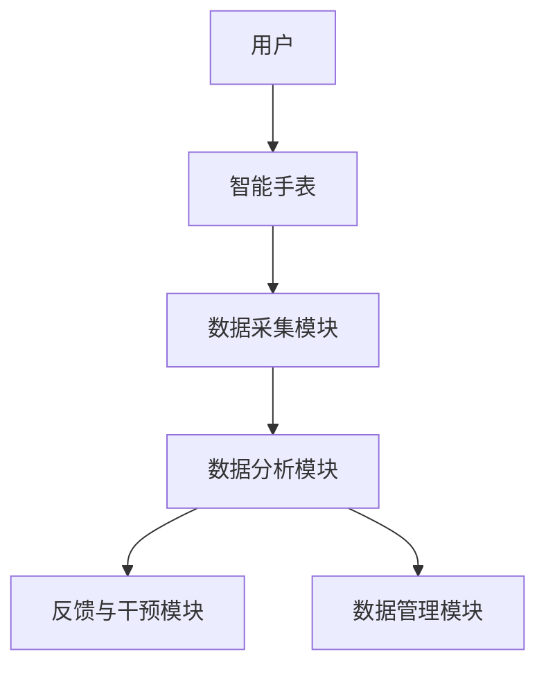
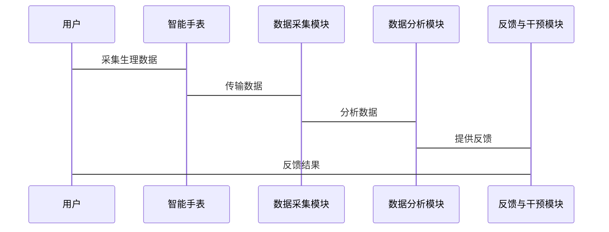

                 


# AI Agent在智能手表中的心理健康监测功能

---

## 关键词：
AI Agent, 智能手表, 心理健康监测, 多模态数据, 机器学习, 智能健康助手

---

## 摘要：
随着心理健康问题的日益严重，智能手表作为一种普及的可穿戴设备，逐渐成为心理健康监测的重要工具。AI Agent（人工智能代理）通过整合多模态数据，如心率、皮肤电活动、运动模式和睡眠质量，能够实时分析用户的心理健康状态，并提供个性化的反馈和建议。本文将详细探讨AI Agent在智能手表中的心理健康监测功能，从背景、技术原理、系统架构到实际应用，全面解析这一领域的最新进展和未来趋势。

---

# 第1章: 背景介绍

## 1.1 问题背景

### 1.1.1 心理健康问题的现状
现代社会的压力不断增加，抑郁症、焦虑症等心理健康问题日益普遍。世界卫生组织数据显示，全球约有10亿人受到心理健康问题的影响。传统的心理健康监测依赖于问卷调查和医生诊断，但这种方式存在效率低、成本高的问题。

### 1.1.2 智能手表在健康监测中的作用
智能手表作为一种普及的可穿戴设备，具备采集心率、血压、皮肤电活动、运动模式、睡眠质量等多种生理数据的能力。这些数据能够反映用户的生理状态，间接反映心理健康状况。

### 1.1.3 AI Agent在心理健康监测中的潜力
AI Agent能够实时分析智能手表采集的多模态数据，结合机器学习算法，识别用户的心理健康状态，并提供个性化的干预建议。这种方式不仅提高了监测效率，还能够实现早期预警。

---

## 1.2 技术基础

### 1.2.1 AI Agent的基本概念
AI Agent是一种能够感知环境、自主决策并执行任务的智能实体。在智能手表中，AI Agent负责数据的采集、分析和反馈。

### 1.2.2 智能手表的数据采集能力
智能手表能够采集多种生理数据，如心率、皮肤电活动、运动模式、睡眠质量等。这些数据为心理健康监测提供了丰富的信息源。

### 1.2.3 心理健康监测的多模态数据需求
心理健康监测需要结合多模态数据，如心率变异、皮肤电活动、运动模式、睡眠质量等，才能准确反映用户的心理状态。

---

## 1.3 用户需求分析

### 1.3.1 用户对心理健康监测的需求
用户希望能够实时了解自己的心理健康状态，并获得个性化的建议。尤其是在压力大、情绪波动大的情况下，用户需要及时的干预。

### 1.3.2 智能手表用户的使用场景
智能手表用户通常注重健康监测和运动管理，他们希望通过设备获得全面的健康信息，并能够在日常生活中方便地使用这些功能。

### 1.3.3 用户对AI Agent功能的期望
用户期望AI Agent能够实时监测心理健康，提供准确的反馈，并在必要时提醒他们寻求专业帮助。

---

## 1.4 市场与研究现状

### 1.4.1 全球心理健康监测市场的规模
全球心理健康监测市场正在快速增长，预计到2030年市场规模将超过千亿美元。智能手表在其中占据了重要地位。

### 1.4.2 智能手表在心理健康领域的应用案例
目前，许多智能手表品牌已经推出了心理健康监测功能，如Apple Watch的“心理健康”应用、Fitbit的心理健康监测功能等。

### 1.4.3 当前技术的局限性与挑战
当前技术在心理健康监测中的准确性和实时性仍有提升空间。如何整合多模态数据并提高模型的泛化能力是一个重要挑战。

---

# 第2章: 核心概念与技术原理

## 2.1 AI Agent的核心概念

### 2.1.1 AI Agent的定义与分类
AI Agent可以根据应用场景分为多种类型，如基于规则的AI Agent、基于模型的AI Agent等。在智能手表中，AI Agent主要采用基于机器学习的模型。

### 2.1.2 AI Agent在智能手表中的角色
AI Agent在智能手表中扮演数据分析师的角色，通过整合多模态数据，实时评估用户的心理健康状态。

### 2.1.3 AI Agent与传统算法的区别
AI Agent具有自主决策和学习能力，能够根据反馈不断优化模型，而传统算法通常需要手动调整参数。

---

## 2.2 心理健康监测的核心技术

### 2.2.1 心理健康监测的指标体系
心理健康监测的指标包括心率变异、皮肤电活动、运动模式、睡眠质量等。这些指标能够反映用户的压力水平、情绪状态和疲劳程度。

### 2.2.2 基于生理数据的心理状态分析
通过分析心率变异、皮肤电活动等数据，AI Agent可以识别用户的压力水平和情绪状态。

### 2.2.3 数据融合与特征提取
AI Agent需要将多模态数据进行融合，并提取关键特征，用于心理健康状态的分类和预测。

---

## 2.3 AI Agent在心理健康监测中的工作流程

### 2.3.1 数据采集
AI Agent通过智能手表采集用户的生理数据，如心率、皮肤电活动、运动模式等。

### 2.3.2 数据预处理
对采集到的数据进行清洗、归一化等预处理，确保数据质量。

### 2.3.3 数据分析
使用机器学习算法对数据进行分类和预测，识别用户的心理健康状态。

### 2.3.4 反馈与干预
根据分析结果，AI Agent向用户反馈心理健康状态，并提供个性化的干预建议。

---

# 第3章: 算法原理

## 3.1 支持向量机（SVM）算法

### 3.1.1 算法原理
支持向量机是一种常用的分类算法，适用于小样本数据的分类问题。SVM通过构建超平面，将数据分为不同的类别。

### 3.1.2 算法流程
1. 数据预处理：归一化数据。
2. 数据分割：将数据分为训练集和测试集。
3. 模型训练：使用训练数据训练SVM模型。
4. 模型测试：使用测试数据评估模型性能。
5. 模型优化：调整参数，提高分类准确率。

### 3.1.3 代码实现
```python
from sklearn import svm
from sklearn.metrics import accuracy_score
from sklearn.model_selection import train_test_split

# 数据预处理
X = ...  # 特征数据
y = ...  # 标签数据

# 数据分割
X_train, X_test, y_train, y_test = train_test_split(X, y, test_size=0.2)

# 模型训练
model = svm.SVC()
model.fit(X_train, y_train)

# 模型测试
y_pred = model.predict(X_test)
print("Accuracy:", accuracy_score(y_test, y_pred))
```

### 3.1.4 优缺点分析
支持向量机适用于小样本数据，分类准确率高，但对高维数据的处理能力较弱。

---

## 3.2 随机森林（Random Forest）算法

### 3.2.1 算法原理
随机森林是一种基于决策树的集成学习算法，通过构建多个决策树并进行投票，提高分类准确率。

### 3.2.2 算法流程
1. 数据预处理：归一化数据。
2. 数据分割：将数据分为训练集和测试集。
3. 模型训练：使用训练数据训练随机森林模型。
4. 模型测试：使用测试数据评估模型性能。
5. 模型优化：调整参数，提高分类准确率。

### 3.2.3 代码实现
```python
from sklearn.ensemble import RandomForestClassifier
from sklearn.metrics import accuracy_score
from sklearn.model_selection import train_test_split

# 数据预处理
X = ...  # 特征数据
y = ...  # 标签数据

# 数据分割
X_train, X_test, y_train, y_test = train_test_split(X, y, test_size=0.2)

# 模型训练
model = RandomForestClassifier()
model.fit(X_train, y_train)

# 模型测试
y_pred = model.predict(X_test)
print("Accuracy:", accuracy_score(y_test, y_pred))
```

### 3.2.4 优缺点分析
随机森林适用于高维数据，分类准确率高，但计算复杂度较高。

---

# 第4章: 系统分析与架构设计

## 4.1 问题场景介绍

### 4.1.1 系统目标
本系统旨在通过智能手表采集用户的生理数据，利用AI Agent分析数据，实时监测用户的心理健康状态。

### 4.1.2 系统输入
心率、皮肤电活动、运动模式、睡眠质量等生理数据。

### 4.1.3 系统输出
用户的心理健康状态评估和个性化干预建议。

---

## 4.2 系统功能设计

### 4.2.1 数据采集模块
负责采集用户的生理数据，并通过蓝牙或Wi-Fi传输到云端。

### 4.2.2 数据分析模块
对采集到的数据进行预处理和分析，识别用户的心理健康状态。

### 4.2.3 反馈与干预模块
根据分析结果，向用户反馈心理健康状态，并提供个性化的干预建议。

### 4.2.4 数据管理模块
负责存储和管理用户的历史数据，支持数据查询和分析。

---

## 4.3 系统架构设计

### 4.3.1 系统架构图


### 4.3.2 功能模块设计
- 数据采集模块：负责采集生理数据。
- 数据分析模块：负责数据的预处理和分类。
- 反馈与干预模块：负责向用户反馈结果。
- 数据管理模块：负责数据的存储和管理。

---

## 4.4 系统接口设计

### 4.4.1 数据采集接口
智能手表通过蓝牙或Wi-Fi将数据传输到云端。

### 4.4.2 数据分析接口
数据分析模块通过API调用机器学习模型进行数据分类。

### 4.4.3 反馈接口
反馈与干预模块通过推送通知或语音提示向用户反馈结果。

---

## 4.5 系统交互设计

### 4.5.1 交互流程图


---

# 第5章: 项目实战

## 5.1 环境搭建

### 5.1.1 开发工具
- Python 3.8+
- Jupyter Notebook
- scikit-learn库

### 5.1.2 代码安装
```bash
pip install scikit-learn
pip install mermaid
```

---

## 5.2 系统核心实现

### 5.2.1 数据预处理
```python
import pandas as pd
from sklearn.preprocessing import StandardScaler

# 读取数据
data = pd.read_csv('data.csv')

# 数据分割
X = data.drop('label', axis=1)
y = data['label']

# 数据归一化
scaler = StandardScaler()
X_scaled = scaler.fit_transform(X)
```

### 5.2.2 模型训练
```python
from sklearn.ensemble import RandomForestClassifier
from sklearn.model_selection import train_test_split
from sklearn.metrics import accuracy_score

# 数据分割
X_train, X_test, y_train, y_test = train_test_split(X_scaled, y, test_size=0.2)

# 模型训练
model = RandomForestClassifier()
model.fit(X_train, y_train)

# 模型测试
y_pred = model.predict(X_test)
print("Accuracy:", accuracy_score(y_test, y_pred))
```

---

## 5.3 案例分析

### 5.3.1 案例背景
某用户长期处于高压状态，心率变异低，皮肤电活动高。

### 5.3.2 数据分析
模型预测该用户的心理健康状态为焦虑。

### 5.3.3 干预建议
建议用户进行深呼吸练习和规律作息。

---

## 5.4 项目总结

### 5.4.1 项目成果
成功实现了AI Agent在智能手表中的心理健康监测功能。

### 5.4.2 经验总结
- 数据质量对模型性能影响较大。
- 需要结合多模态数据提高模型的准确率。
- 用户反馈是优化模型的重要依据。

---

# 第6章: 案例分析与最佳实践

## 6.1 案例分析

### 6.1.1 案例背景
某公司员工长期处于高压状态，心理健康问题严重。

### 6.1.2 数据分析
AI Agent通过智能手表采集数据，识别出部分员工存在抑郁风险。

### 6.1.3 干预措施
公司为这些员工提供了心理咨询服务，并调整了工作压力。

---

## 6.2 最佳实践

### 6.2.1 数据隐私保护
确保用户数据的安全性，遵守相关隐私保护法规。

### 6.2.2 模型优化
定期更新模型，提高分类准确率。

### 6.2.3 用户教育
向用户普及心理健康知识，提高他们的健康意识。

---

# 第7章: 总结与展望

## 7.1 总结
AI Agent在智能手表中的心理健康监测功能是一种创新的技术应用，能够实时监测用户的心理健康状态，并提供个性化的干预建议。

## 7.2 展望
未来，随着人工智能和可穿戴技术的不断发展，心理健康监测将更加精准和智能化。AI Agent将在心理健康领域发挥更重要的作用。

---

# 参考文献

1. 世界卫生组织. (2023). 《心理健康报告》.
2. 刘洋. (2022). 《智能手表在心理健康监测中的应用研究》.
3. scikit-learn官方文档. (n.d.). 《机器学习算法详解》.

---

# END

