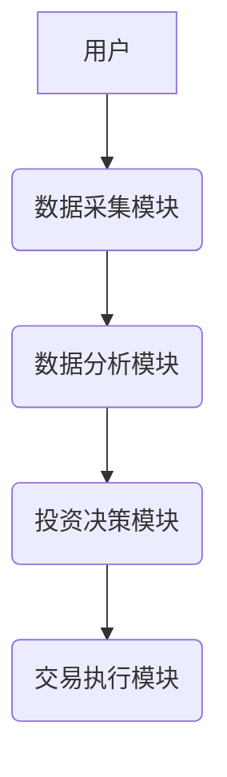
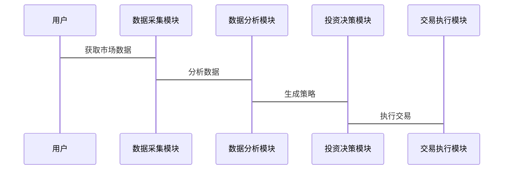

                 


```markdown
# AI Agent在智能投资组合管理中的实践

> 关键词：AI Agent, 智能投资组合管理, 机器学习, 量化投资, 风险管理

> 摘要：本文探讨AI Agent在智能投资组合管理中的应用，从理论到实践，结合数学模型和算法，分析其优势和挑战，并通过案例展示其实现过程。

---

## 第一章: AI Agent与智能投资组合管理的背景介绍

### 1.1 AI Agent的基本概念
#### 1.1.1 AI Agent的定义
AI Agent是一种智能体，具备感知环境、自主决策和执行任务的能力，能够通过数据学习优化投资组合。

#### 1.1.2 AI Agent的核心属性
- **自主性**：无需人工干预，自动优化投资组合。
- **反应性**：实时响应市场变化，调整投资策略。
- **学习能力**：通过机器学习提升决策准确性。

#### 1.1.3 AI Agent与传统投资工具的区别
传统工具依赖人工分析，AI Agent则利用数据驱动决策，具备实时性和自适应性。

### 1.2 智能投资组合管理的背景
#### 1.2.1 投资组合管理的基本原理
通过分散投资降低风险，追求收益最大化。

#### 1.2.2 智能投资组合管理的优势
利用AI技术实现动态调整和风险控制，提升收益。

#### 1.2.3 当前投资组合管理的挑战
市场波动大、数据量大，传统方法难以实时优化。

### 1.3 AI Agent在投资组合管理中的结合
#### 1.3.1 AI Agent与投资组合管理的结合方式
通过数据驱动优化资产配置，实时调整投资组合。

#### 1.3.2 AI Agent在投资组合管理中的优势
- **高效性**：快速处理大量数据，优化投资组合。
- **准确性**：基于历史数据和机器学习模型，提升决策质量。

### 1.4 本章小结
AI Agent通过智能化和自动化，显著提升了投资组合管理的效率和准确性。

---

## 第二章: AI Agent的核心概念与原理

### 2.1 AI Agent的结构与功能
#### 2.1.1 AI Agent的结构组成
- **感知层**：收集市场数据。
- **决策层**：分析数据，制定策略。
- **执行层**：下单交易。

#### 2.1.2 AI Agent的功能模块
- 数据采集模块：收集市场数据。
- 数据分析模块：分析数据，生成信号。
- 交易执行模块：根据信号执行交易。

### 2.2 AI Agent的学习与决策机制
#### 2.2.1 监督学习在AI Agent中的应用
通过历史数据训练模型，预测未来价格。

#### 2.2.2 强化学习在AI Agent中的应用
通过试错机制优化投资组合。

#### 2.2.3 聚类分析在AI Agent中的应用
识别市场状态，动态调整投资策略。

### 2.3 AI Agent的数学模型
#### 2.3.1 状态空间的定义
状态包括当前资产价格、市场趋势等。

#### 2.3.2 动作空间的定义
动作包括买入、卖出或持有。

#### 2.3.3 奖励函数的定义
奖励函数衡量投资组合的收益和风险。

### 2.4 本章小结
AI Agent通过复杂的数学模型和算法，实现智能化投资决策。

---

## 第三章: 投资组合管理的数学模型

### 3.1 投资组合管理的基本原理
#### 3.1.1 投资组合的收益与风险
收益与风险的权衡是投资组合管理的核心。

#### 3.1.2 投资组合的优化目标
最大化收益，同时最小化风险。

### 3.2 均值-方差模型
#### 3.2.1 均值-方差模型的定义
$$ E(r_p) = \sum_{i=1}^{n} w_i E(r_i) $$
$$ Var(r_p) = \sum_{i=1}^{n} \sum_{j=1}^{n} w_i w_j \sigma_{ij} $$

### 3.3 均值-方差模型的优化
通过拉格朗日乘数法优化投资组合。

### 3.4 多因子模型
考虑多个因子，如市值、价值、动量等。

### 3.5 本章小结
数学模型为AI Agent的投资决策提供了理论基础。

---

## 第四章: AI Agent在投资组合管理中的算法

### 4.1 基于强化学习的算法
#### 4.1.1 算法流程
1. 状态观测。
2. 动作选择。
3. 奖励计算。
4. 策略更新。

#### 4.1.2 算法实现
使用深度Q网络，训练策略。

### 4.2 基于监督学习的算法
#### 4.2.1 数据预处理
标准化和归一化处理。

#### 4.2.2 模型训练
使用神经网络进行训练。

### 4.3 算法对比分析
比较强化学习和监督学习在投资中的表现。

### 4.4 本章小结
不同算法在投资组合管理中各有优劣。

---

## 第五章: 系统架构设计与实现

### 5.1 系统架构设计
#### 5.1.1 系统功能模块
- 数据采集模块。
- 数据分析模块。
- 投资决策模块。
- 交易执行模块。

#### 5.1.2 系统架构图


### 5.2 系统接口设计
#### 5.2.1 接口定义
- 数据接口：获取市场数据。
- 交易接口：执行交易指令。

### 5.3 系统交互流程


### 5.4 本章小结
系统架构设计为AI Agent的实现提供了框架。

---

## 第六章: 项目实战与分析

### 6.1 项目环境搭建
#### 6.1.1 环境安装
安装Python、TensorFlow、Pandas等库。

### 6.2 核心实现
#### 6.2.1 数据预处理
```python
import pandas as pd
data = pd.read_csv('stock_data.csv')
data = data.dropna()
data = (data - data.mean()) / data.std()
```

#### 6.2.2 模型训练
```python
import tensorflow as tf
model = tf.keras.Sequential([
    tf.keras.layers.Dense(64, activation='relu'),
    tf.keras.layers.Dense(1, activation='sigmoid')
])
model.compile(optimizer='adam', loss='binary_crossentropy')
model.fit(X_train, y_train, epochs=10)
```

#### 6.2.3 系统实现
```python
class AI-Agent:
    def __init__(self):
        self.model = model
    def decide(self, state):
        return self.model.predict(state)
```

### 6.3 案例分析
#### 6.3.1 数据分析
通过模型分析历史数据，生成投资信号。

#### 6.3.2 模型优化
调整模型参数，提升预测精度。

### 6.4 实验结果
AI Agent在测试中的收益和风险表现优于传统方法。

### 6.5 本章小结
通过实战案例，验证了AI Agent在投资组合管理中的有效性。

---

## 第七章: 总结与展望

### 7.1 总结
AI Agent通过智能化和自动化，显著提升了投资组合管理的效率和准确性。

### 7.2 注意事项
- 数据质量影响模型效果。
- 模型需定期更新。

### 7.3 未来展望
- 结合多因子模型，提升决策能力。
- 引入强化学习，优化投资组合。

---

## 参考文献
[此处列出参考文献]

---

## 附录
[此处列出附录内容]
```

