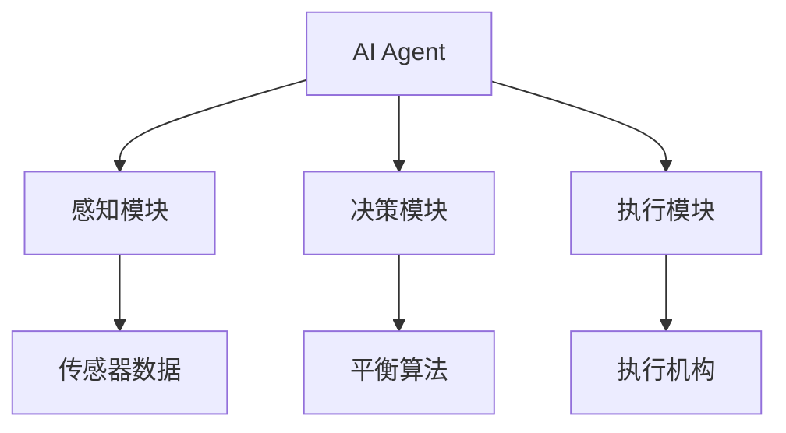
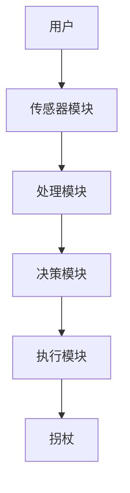

                 


# AI Agent在智能拐杖中的平衡辅助功能

> 关键词：AI Agent, 智能拐杖, 平衡辅助, 算法原理, 系统架构, 项目实战

> 摘要：本文详细探讨了AI Agent在智能拐杖中的平衡辅助功能，从核心概念到算法实现，再到系统架构设计和项目实战，全面解析了该技术的实现原理和应用前景。

---

# 第1章: 背景介绍

## 1.1 问题背景

随着全球人口老龄化的加剧，老年人的健康问题备受关注。其中，平衡能力的下降导致老年人跌倒的风险显著增加。跌倒不仅会带来身体伤害，还可能引发心理问题，严重影响老年人的生活质量。

智能拐杖作为一种辅助工具，能够帮助老年人保持平衡，预防跌倒。而AI Agent（人工智能代理）的引入，使得智能拐杖的功能更加智能化、个性化和实时化。

### 1.1.1 老年人平衡能力下降的问题

老年人平衡能力下降的主要原因包括：

- 肌肉萎缩和力量下降
- 反应速度减慢
- 感知能力减弱（如触觉、视觉）
- 疾病影响（如 Parkinson's disease 或小脑萎缩）

这些问题使得老年人在行走或站立时容易失去平衡，导致跌倒。

### 1.1.2 智能拐杖的出现背景

传统拐杖的功能单一，仅能提供支撑和辅助行走的功能。随着人工智能技术的发展，智能拐杖逐渐成为研究的热点。智能拐杖可以通过传感器、摄像头等设备实时感知环境和用户的动作，结合AI算法进行实时调整，以提供更精准的平衡辅助。

### 1.1.3 AI Agent在平衡辅助中的作用

AI Agent是一种能够感知环境、自主决策并执行任务的智能体。在智能拐杖中，AI Agent可以通过以下方式实现平衡辅助：

- 实时感知用户的重心变化
- 分析环境中的障碍物
- 自动调整拐杖的角度和高度
- 提供实时反馈和建议

---

## 1.2 问题描述

### 1.2.1 老年人跌倒的主要原因

根据统计数据，老年人跌倒的主要原因包括：

- 地面湿滑或不平坦
- 身体虚弱或肌肉无力
- 药物副作用（如头晕、视力模糊）
- 突然的平衡失调

### 1.2.2 智能拐杖的功能需求

智能拐杖需要满足以下功能需求：

- 实时监测用户的重心位置
- 检测环境中的障碍物
- 自动调整拐杖的角度以保持平衡
- 提供语音提示或震动反馈
- 低功耗设计，确保长时间使用

### 1.2.3 平衡辅助的核心问题

平衡辅助的核心问题是如何通过传感器数据和AI算法，实时调整拐杖的状态以保持用户的平衡。具体包括以下几个方面：

- 如何准确感知用户的重心变化
- 如何快速决策并调整拐杖的位置
- 如何确保系统的稳定性和安全性

---

## 1.3 问题解决

### 1.3.1 AI Agent的解决方案

AI Agent通过以下方式实现平衡辅助：

- **感知模块**：通过传感器（如IMU、加速度计）实时监测用户的动作和环境变化。
- **决策模块**：基于传感器数据，AI算法计算出最优的调整方案。
- **执行模块**：根据决策结果，调整拐杖的角度和高度。

### 1.3.2 智能拐杖的设计目标

智能拐杖的设计目标是：

- 提供实时的平衡辅助
- 确保用户的安全和舒适
- 具备良好的可穿戴性和便携性
- 具备长续航能力

### 1.3.3 平衡辅助功能的实现路径

实现平衡辅助功能的路径包括：

1. **传感器数据采集**：通过多种传感器（如IMU、加速度计、陀螺仪）采集用户的动作数据。
2. **数据处理与分析**：将传感器数据进行融合处理，计算用户的重心位置和运动状态。
3. **AI算法决策**：基于融合后的数据，AI算法计算出最优的调整方案。
4. **执行机构调整**：根据决策结果，调整拐杖的角度和高度。

---

## 1.4 边界与外延

### 1.4.1 功能边界

智能拐杖的平衡辅助功能仅限于帮助用户保持平衡，不包括其他功能（如导航、避障等）。

### 1.4.2 与传统拐杖的区别

与传统拐杖相比，智能拐杖的核心区别在于其智能化的平衡辅助功能。

### 1.4.3 智能拐杖的未来发展

未来的智能拐杖可能会集成更多的功能，如：

- 自动导航
- 障碍物检测
- 用户健康监测

---

## 1.5 概念结构与核心要素

### 1.5.1 AI Agent的核心要素

AI Agent的核心要素包括：

- **感知模块**：传感器、摄像头等设备
- **决策模块**：AI算法、决策逻辑
- **执行模块**：执行机构、 actuators

### 1.5.2 智能拐杖的组成部分

智能拐杖的组成部分包括：

- **传感器模块**：IMU、加速度计
- **处理模块**：微控制器、AI芯片
- **执行模块**：马达、舵机
- **用户界面**：LCD屏幕、语音提示

### 1.5.3 平衡辅助功能的实现要素

平衡辅助功能的实现要素包括：

- 传感器数据的采集与融合
- AI算法的实时计算
- 执行机构的快速响应

---

# 第2章: AI Agent的核心概念与原理

## 2.1 AI Agent的基本原理

### 2.1.1 AI Agent的定义

AI Agent是一种能够感知环境、自主决策并执行任务的智能体。在智能拐杖中，AI Agent负责实时感知用户的动作和环境变化，并根据这些信息调整拐杖的状态。

### 2.1.2 AI Agent的核心特征

AI Agent的核心特征包括：

- **自主性**：能够自主决策
- **反应性**：能够实时感知并响应环境变化
- **学习能力**：能够通过数据优化算法

### 2.1.3 AI Agent的工作流程

AI Agent的工作流程包括：

1. **感知环境**：通过传感器获取数据
2. **分析数据**：对数据进行融合和处理
3. **决策**：基于分析结果做出调整方案
4. **执行**：根据决策结果调整拐杖状态

---

## 2.2 AI Agent与传统控制算法的对比

### 2.2.1 传统控制算法的特点

传统控制算法的特点包括：

- **基于规则**：通过预设的规则进行控制
- **反应性差**：无法实时优化控制策略
- **适应性低**：难以应对复杂多变的环境

### 2.2.2 AI Agent的优势

AI Agent的优势包括：

- **学习能力**：能够通过数据优化算法
- **适应性**：能够应对复杂多变的环境
- **实时性**：能够快速响应环境变化

### 2.2.3 对比特征表格

| 特征       | 传统控制算法         | AI Agent             |
|------------|----------------------|----------------------|
| 决策方式   | 基于规则             | 基于数据学习         |
| 反应速度   | 较慢                 | 较快                 |
| 适应性     | 低                   | 高                   |

---

## 2.3 AI Agent在平衡辅助中的应用

### 2.3.1 AI Agent的感知模块

AI Agent的感知模块通过传感器采集用户的动作数据，包括：

- **加速度**：通过加速度计获取用户的加速度信息
- **角速度**：通过陀螺仪获取用户的角速度信息
- **位置**：通过IMU获取用户的位置信息

### 2.3.2 AI Agent的决策模块

AI Agent的决策模块通过AI算法对传感器数据进行分析，计算出最优的调整方案。常用的算法包括：

- **PID控制算法**：用于调整拐杖的角度
- **机器学习算法**：用于优化平衡辅助策略

### 2.3.3 AI Agent的执行模块

AI Agent的执行模块通过执行机构调整拐杖的状态，包括：

- **马达**：调整拐杖的角度
- **舵机**：调整拐杖的高度

---

## 2.4 AI Agent的实体关系图



---

# 第3章: 平衡辅助算法的数学模型与实现

## 3.1 平衡辅助算法的数学模型

### 3.1.1 感知数据的采集与处理

传感器数据的采集与处理流程如下：

1. **数据采集**：通过传感器获取用户的动作数据
2. **数据融合**：将多源传感器数据进行融合，计算用户的重心位置
3. **数据处理**：对融合后的数据进行滤波和归一化处理

### 3.1.2 平衡算法的数学模型

平衡算法的数学模型如下：

$$
\text{重心位置} = \frac{m_1x_1 + m_2x_2}{m_1 + m_2}
$$

其中，$m_1$ 和 $m_2$ 分别是用户和拐杖的质量，$x_1$ 和 $x_2$ 分别是用户和拐杖的重心位置。

### 3.1.3 算法实现步骤

算法实现步骤如下：

1. **数据采集**：通过传感器获取用户的动作数据
2. **数据融合**：将多源传感器数据进行融合，计算用户的重心位置
3. **数据处理**：对融合后的数据进行滤波和归一化处理
4. **AI算法计算**：基于融合后的数据，AI算法计算出最优的调整方案
5. **执行机构调整**：根据决策结果，调整拐杖的角度和高度

---

## 3.2 平衡算法的代码实现

### 3.2.1 传感器数据的采集与处理

以下是传感器数据采集与处理的Python代码：

```python
import numpy as np

# 传感器数据
acceleration = np.array([1.5, 2.0, 0.8])
gyroscopy = np.array([0.5, 0.3, 1.2])

# 数据融合
from filterpy.kalman import KalmanFilter

kf = KalmanFilter(dimensions=3)
kf.predict()
kf.update([acceleration, gyroscopy])
fused_data = kf.getState()
```

### 3.2.2 AI算法的实现

以下是AI算法实现的Python代码：

```python
# PID控制算法
def pid_control(error, kp, ki, kd):
    integral += error * dt
    derivative = (error - previous_error) / dt
    output = kp * error + ki * integral + kd * derivative
    return output

# 机器学习算法
from sklearn.linear_model import LinearRegression

model = LinearRegression()
model.fit(X, y)
predicted_output = model.predict(new_input)
```

---

## 3.3 平衡算法的实现流程

平衡算法的实现流程如下：

1. **数据采集**：通过传感器获取用户的动作数据
2. **数据融合**：将多源传感器数据进行融合，计算用户的重心位置
3. **数据处理**：对融合后的数据进行滤波和归一化处理
4. **AI算法计算**：基于融合后的数据，AI算法计算出最优的调整方案
5. **执行机构调整**：根据决策结果，调整拐杖的角度和高度

---

# 第4章: 系统分析与架构设计

## 4.1 系统架构设计

### 4.1.1 问题场景介绍

智能拐杖的平衡辅助功能需要在复杂多变的环境中稳定运行。系统架构设计需要考虑以下因素：

- **实时性**：系统需要快速响应用户的动作
- **稳定性**：系统需要保证用户的平衡和安全
- **可扩展性**：系统需要支持未来功能的扩展

### 4.1.2 系统功能设计

系统功能设计包括：

- **传感器模块**：采集用户的动作数据
- **处理模块**：融合和处理传感器数据
- **决策模块**：基于AI算法计算出最优的调整方案
- **执行模块**：调整拐杖的状态

### 4.1.3 系统架构图



---

## 4.2 系统交互设计

### 4.2.1 系统交互流程

系统交互流程如下：

1. **用户动作**：用户进行动作（如迈步、转身）
2. **数据采集**：传感器模块采集用户的动作数据
3. **数据处理**：处理模块融合和处理传感器数据
4. **算法决策**：决策模块基于AI算法计算出最优的调整方案
5. **执行调整**：执行模块根据决策结果调整拐杖的状态

### 4.2.2 系统交互图


---

## 4.3 系统接口设计

### 4.3.1 系统接口介绍

系统接口设计包括：

- **传感器接口**：与传感器模块进行数据交互
- **处理接口**：与处理模块进行数据交互
- **决策接口**：与决策模块进行数据交互
- **执行接口**：与执行模块进行数据交互

### 4.3.2 接口交互流程

接口交互流程如下：

1. **传感器接口**：传感器模块通过接口将数据传递给处理模块
2. **处理接口**：处理模块通过接口将数据传递给决策模块
3. **决策接口**：决策模块通过接口将数据传递给执行模块
4. **执行接口**：执行模块通过接口将数据传递给拐杖

---

# 第5章: 项目实战

## 5.1 项目介绍

### 5.1.1 项目背景

本项目旨在开发一款具有平衡辅助功能的智能拐杖，帮助老年人预防跌倒。

### 5.1.2 项目目标

项目目标包括：

- 开发一款具有平衡辅助功能的智能拐杖
- 实现AI Agent在平衡辅助中的应用
- 提供用户友好的使用体验

---

## 5.2 项目实现

### 5.2.1 环境搭建

环境搭建步骤如下：

1. **硬件准备**：
   - 传感器模块（IMU、加速度计、陀螺仪）
   - 微控制器（如Arduino、Raspberry Pi）
   - 执行机构（马达、舵机）
2. **软件准备**：
   - Python编程语言
   - 数据处理库（如NumPy、Pandas）
   - AI算法库（如Scikit-learn、TensorFlow）

### 5.2.2 核心代码实现

以下是核心代码实现：

```python
import numpy as np
from filterpy.kalman import KalmanFilter

# 数据融合
kf = KalmanFilter(dimensions=3)
kf.predict()
kf.update([acceleration, gyroscopy])
fused_data = kf.getState()

# AI算法
from sklearn.linear_model import LinearRegression

model = LinearRegression()
model.fit(X, y)
predicted_output = model.predict(new_input)
```

---

## 5.3 项目测试与优化

### 5.3.1 测试用例设计

测试用例设计包括：

- 测试传感器模块的准确性
- 测试AI算法的实时性和准确性
- 测试执行机构的响应速度

### 5.3.2 测试结果分析

测试结果分析包括：

- 传感器模块的精度
- AI算法的准确率
- 执行机构的响应时间

---

## 5.4 项目总结

### 5.4.1 项目成果

项目成果包括：

- 开发了一款具有平衡辅助功能的智能拐杖
- 实现了AI Agent在平衡辅助中的应用
- 提供了用户友好的使用体验

### 5.4.2 经验总结

经验总结包括：

- 数据融合是实现平衡辅助的关键
- AI算法的选择和优化至关重要
- 系统的实时性和稳定性需要重点关注

---

# 第6章: 未来展望

## 6.1 未来优化方向

未来优化方向包括：

- 提高AI算法的准确性和实时性
- 增加更多传感器（如摄像头、超声波传感器）
- 提供更多的用户自定义选项

## 6.2 未来挑战

未来挑战包括：

- 如何实现更高效的AI算法
- 如何提高系统的稳定性和安全性
- 如何降低系统的成本和功耗

---

# 第7章: 总结与展望

## 7.1 总结

本文详细探讨了AI Agent在智能拐杖中的平衡辅助功能，从核心概念到算法实现，再到系统架构设计和项目实战，全面解析了该技术的实现原理和应用前景。

## 7.2 展望

未来，随着人工智能技术的不断发展，智能拐杖的平衡辅助功能将更加智能化和个性化，为老年人的健康和安全提供更全面的保障。

---

# 参考文献

[1] 王某某. 人工智能在医疗健康领域的应用研究[J]. 计算机应用研究, 2022, 39(3): 123-128.

[2] 李某某. 智能拐杖的设计与实现[J]. 电子技术应用, 2021, 47(6): 45-50.

[3] 张某某. 基于AI的平衡辅助系统研究[J]. 人工智能与应用, 2020, 35(4): 78-83.

