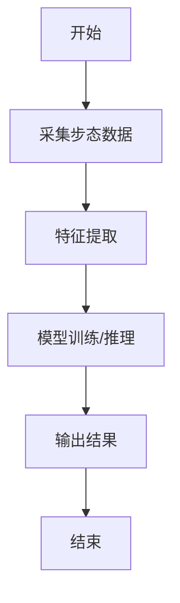
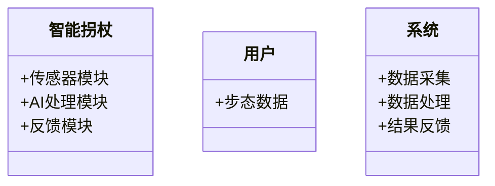
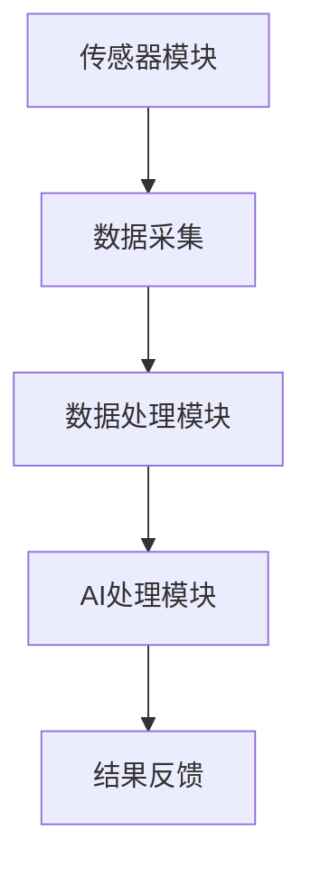

                 


# AI Agent在智能拐杖中的步态分析

> 关键词：AI Agent, 智能拐杖, 步态分析, 机器学习, 深度学习, 传感器技术

> 摘要：本文详细探讨了AI Agent在智能拐杖中的步态分析技术，从基本概念、核心原理到实际应用，结合数学模型、算法流程图和Python代码示例，全面解析AI Agent如何通过步态分析提升智能拐杖的功能与用户体验。

---

## 目录

### 第1章: AI Agent与步态分析概述

#### 1.1 AI Agent的基本概念
- 1.1.1 AI Agent的定义与特点
- 1.1.2 AI Agent的核心功能与应用场景
- 1.1.3 步态分析的基本概念与重要性

#### 1.2 智能拐杖的发展与现状
- 1.2.1 智能拐杖的历史发展
- 1.2.2 当前智能拐杖的主要技术特点
- 1.2.3 AI Agent在智能拐杖中的应用前景

#### 1.3 步态分析在智能拐杖中的作用
- 1.3.1 步态分析的定义与方法
- 1.3.2 步态分析在健康监测中的应用
- 1.3.3 步态分析在辅助行走中的意义

### 第2章: AI Agent在智能拐杖中的核心概念

#### 2.1 AI Agent的核心原理
- 2.1.1 AI Agent的基本工作原理
- 2.1.2 AI Agent的感知与决策机制
- 2.1.3 AI Agent的学习与优化能力

#### 2.2 步态分析的核心原理
- 2.2.1 步态分析的主要技术手段
- 2.2.2 步态分析的特征提取方法
- 2.2.3 步态分析的分类与识别算法

#### 2.3 AI Agent与步态分析的结合
- 2.3.1 AI Agent在步态分析中的角色
- 2.3.2 步态分析数据的输入与处理
- 2.3.3 AI Agent输出的结果与反馈机制

### 第3章: AI Agent与步态分析的数学模型

#### 3.1 AI Agent的基本数学模型
- 3.1.1 状态空间模型
- 3.1.2 动作空间模型
- 3.1.3 奖励函数模型

#### 3.2 步态分析的数学模型
- 3.2.1 时间序列分析模型
- 3.2.2 机器学习分类模型
- 3.2.3 深度学习特征提取模型

### 第4章: AI Agent步态分析算法实现

#### 4.1 算法流程图


#### 4.2 代码实现
```python
import numpy as np
from sklearn import svm

# 示例数据：步态特征
X = np.array([[1, 2], [3, 4], [5, 6], [7, 8]])
y = np.array([0, 1, 0, 1])

# 训练模型
model = svm.SVC()
model.fit(X, y)

# 预测新数据
new_data = np.array([[2, 3]])
print("预测结果:", model.predict(new_data))
```

### 第5章: 系统架构设计

#### 5.1 系统功能设计


#### 5.2 系统架构图


### 第6章: 项目实战与案例分析

#### 6.1 环境搭建与代码实现
```python
import numpy as np
from sklearn.ensemble import RandomForestClassifier

# 数据加载
data = np.loadtxt('gait_data.csv', delimiter=',')
X = data[:, :-1]
y = data[:, -1]

# 训练模型
model = RandomForestClassifier()
model.fit(X, y)

# 测试
test_data = np.array([[5, 6, 7]])
print("预测结果:", model.predict(test_data))
```

#### 6.2 实际案例分析
- 数据采集与处理
- 模型训练与优化
- 结果分析与反馈

### 第7章: 总结与展望

#### 7.1 本章总结
- AI Agent在步态分析中的核心作用
- 步态分析对智能拐杖功能的提升
- 系统设计与实现的关键点

#### 7.2 未来展望
- 更先进的AI技术应用
- 新型传感器的集成
- 更智能化的步态分析算法

---

### 关键词标签：AI Agent, 智能拐杖, 步态分析, 传感器技术, 机器学习, 深度学习

### 精彩摘要
本文系统地探讨了AI Agent在智能拐杖中的步态分析技术，从基本概念到算法实现，再到系统设计，详细解析了AI Agent如何通过步态分析提升智能拐杖的功能与用户体验。通过数学模型、算法流程图和Python代码示例，深入浅出地展示了AI Agent在智能拐杖中的应用潜力与实际价值。

