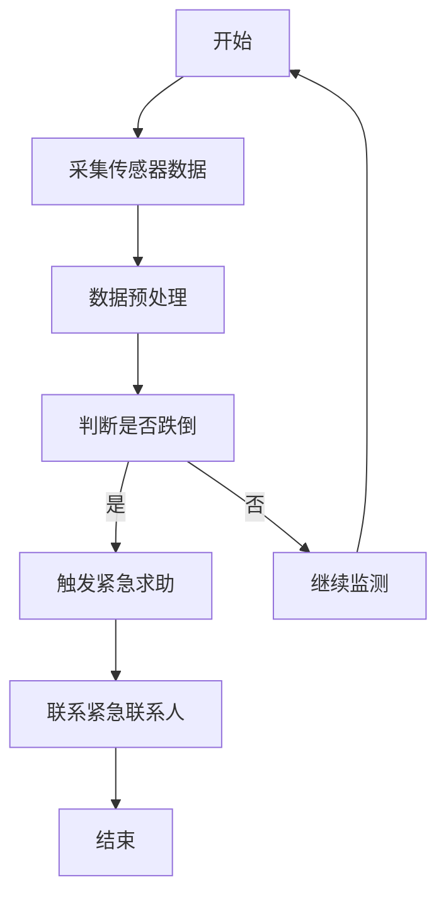

                 


# AI Agent在智能拐杖中的跌倒预防与紧急求助

> 关键词：AI Agent, 智能拐杖, 跌倒预防, 紧急求助, 传感器, 机器学习, 系统架构

> 摘要：本文深入探讨了AI Agent在智能拐杖中的应用，重点分析了跌倒预防与紧急求助的核心技术。通过详细的技术分析和系统设计，展示了如何利用AI技术提升智能拐杖的功能，为老年人提供更安全的辅助工具。文章从背景介绍、核心概念、算法原理、系统架构到项目实战，全面解析了AI Agent在智能拐杖中的实现与应用。

---

## 第一部分：AI Agent在智能拐杖中的跌倒预防与紧急求助概述

### 第1章：背景介绍

#### 1.1 问题背景
- **1.1.1 老年人跌倒问题的严重性**  
  跌倒是老年人致残和致死的主要原因之一，据统计，每年有超过30%的老年人因跌倒导致严重伤害。  
- **1.1.2 智能拐杖的发展现状**  
  智能拐杖作为一种辅助工具，逐渐从单一的支撑功能向多功能化发展，结合传感器和AI技术，能够实现跌倒监测和紧急求助。  
- **1.1.3 AI Agent在智能拐杖中的应用潜力**  
  AI Agent（智能代理）能够实时感知环境、分析数据并做出决策，为智能拐杖提供智能化支持，显著提升其功能和用户体验。

#### 1.2 问题描述
- **1.2.1 跌倒预防的核心问题**  
  如何通过传感器和AI算法实时监测用户的动作和环境，提前预测跌倒风险。  
- **1.2.2 紧急求助的实现需求**  
  当跌倒发生时，系统需要快速识别并启动紧急求助流程，如拨打急救电话或通知家人。  
- **1.2.3 AI Agent在智能拐杖中的角色定位**  
  AI Agent作为智能拐杖的核心，负责数据处理、决策制定和指令执行，确保跌倒预防和紧急求助功能的实现。

#### 1.3 问题解决
- **1.3.1 AI Agent的核心功能**  
  - 数据采集与处理：整合来自传感器（如加速度、陀螺仪、压力传感器）的数据。  
  - 跌倒预测模型：基于机器学习算法，分析用户的动作模式，预测跌倒风险。  
  - 紧急求助机制：在检测到跌倒后，触发报警并联系紧急联系人。  
- **1.3.2 智能拐杖的技术实现路径**  
  - 传感器集成：在拐杖中嵌入多种传感器，实时采集用户的身体姿势和环境数据。  
  - 数据传输与处理：通过无线通信技术（如蓝牙、Wi-Fi）将数据传输到云端或本地处理。  
  - AI算法应用：利用深度学习或规则引擎分析数据，制定决策。  
- **1.3.3 跌倒预防与紧急求助的系统架构**  
  - 传感器 → 数据采集 → AI Agent处理 → 决策 → 用户反馈或系统响应。

#### 1.4 边界与外延
- **1.4.1 系统的边界条件**  
  - 智能拐杖仅支持跌倒预防和紧急求助功能，不涉及其他辅助功能（如导航）。  
- **1.4.2 功能的外延范围**  
  - 紧急求助仅限于电话报警和联系预设的紧急联系人，不支持其他社交功能。  
- **1.4.3 与其他系统的接口关系**  
  - 与云端服务器通信，支持数据上传和远程监控。  
  - 与手机APP或其他设备联动，提供额外的用户反馈。

#### 1.5 概念结构与核心要素
- **1.5.1 AI Agent的构成要素**  
  - 感知模块：负责采集环境和用户数据。  
  - 决策模块：基于数据进行分析和决策。  
  - 执行模块：根据决策输出指令。  
- **1.5.2 智能拐杖的功能模块**  
  - 传感器模块：采集用户的动作和环境数据。  
  - 通信模块：实现数据的无线传输。  
  - 用户交互界面：显示状态和接收用户指令。  
- **1.5.3 系统的核心要素组成**  
  - 用户：智能拐杖的使用主体。  
  - 传感器：数据采集的核心工具。  
  - AI算法：数据处理和决策的核心逻辑。  
  - 通信模块：数据传输的桥梁。  

---

## 第二部分：核心概念与联系

### 第2章：核心概念与联系

#### 2.1 AI Agent的核心原理
- **2.1.1 AI Agent的基本概念**  
  AI Agent是一种能够感知环境、自主决策并执行任务的智能系统。  
- **2.1.2 AI Agent的核心算法**  
  - 机器学习算法：如支持向量机（SVM）、随机森林（Random Forest）和深度学习模型（如LSTM）。  
  - 规则引擎：基于预定义的规则进行判断和决策。  
- **2.1.3 AI Agent在智能拐杖中的具体实现**  
  - 数据采集与预处理：传感器数据的清洗和特征提取。  
  - 模型训练与部署：基于历史数据训练跌倒预测模型，并在拐杖中部署实时推理模块。  
  - 决策逻辑：根据传感器数据和模型输出，判断是否需要触发跌倒预防或紧急求助。

#### 2.2 智能拐杖的技术特征
- **2.2.1 智能拐杖的传感器技术**  
  - 加速度传感器：检测用户的运动状态（如静止、行走、跌倒）。  
  - 陀螺仪：测量用户的旋转角度，辅助判断跌倒方向。  
  - 压力传感器：感知用户对拐杖的握力变化。  
- **2.2.2 AI Agent的数据处理能力**  
  - 多传感器融合：通过加权融合多种传感器数据，提高跌倒检测的准确性。  
  - 实时分析：AI Agent在本地或云端快速处理数据，响应时间小于1秒。  
- **2.2.3 系统的实时性与响应速度**  
  - 系统设计需要确保实时性，特别是在跌倒发生时，必须快速响应。  

#### 2.3 核心概念对比分析
- **2.3.1 AI Agent与传统传感器的区别**  
  - 传统传感器仅能采集数据，无法分析和决策。  
  - AI Agent能够结合传感器数据进行分析，提供智能化的决策支持。  
- **2.3.2 AI Agent与智能设备的联系**  
  - AI Agent是智能设备的核心，通过数据处理和决策能力，赋予设备智能化功能。  
- **2.3.3 智能拐杖与其他跌倒预防设备的对比**  
  - 智能拐杖结合了AI Agent和传感器技术，功能更全面。  
  - 其他设备可能仅支持单一功能（如跌倒报警），缺乏智能化的决策能力。  

#### 2.4 ER实体关系图
```mermaid
erd
    节点: AI Agent
        属性: 感知数据、决策逻辑、执行指令
    节点: 智能拐杖
        属性: 传感器数据、通信模块、用户输入
  

    AI Agent -- 管理 --> 智能拐杖
    AI Agent -- 接收 --> 感知数据
    智能拐杖 -- 提供 --> 传感器数据
```

---

## 第三部分：算法原理讲解

### 第3章：算法原理讲解

#### 3.1 跌倒预测模型
- **3.1.1 数据采集与预处理**  
  - 传感器数据：加速度、陀螺仪、压力传感器。  
  - 数据清洗：去除噪声，提取有效特征。  
- **3.1.2 算法选择与实现**  
  - 使用LSTM（长短期记忆网络）进行时间序列分析。  
  - 训练数据：用户正常行走和跌倒时的传感器数据。  
  - 模型输出：概率值，判断是否可能发生跌倒。  

#### 3.2 紧急求助机制
- **3.2.1 数据采集与触发条件**  
  - 当AI Agent检测到跌倒信号（如加速度突然变化）时，触发紧急求助流程。  
  - 通过传感器数据确认跌倒事件（如重力加速度超过阈值）。  
- **3.2.2 通信模块实现**  
  - 启动紧急联系人列表，拨打预设电话或发送短信。  
  - 通过GPS定位用户位置，提供给急救中心。  

#### 3.3 算法流程图


#### 3.4 数学公式
- **跌倒预测模型的概率计算公式**：  
  $$ P(\text{跌倒}) = \sigma(w_1x_1 + w_2x_2 + \dots + w_nx_n) $$  
  其中，$x_i$是传感器特征，$w_i$是模型权重，$\sigma$是sigmoid函数。  
- **LSTM的时间序列模型**：  
  $$ f(t) = \text{LSTM}(x_t, f(t-1)) $$  

---

## 第四部分：系统分析与架构设计

### 第4章：系统分析与架构设计

#### 4.1 问题场景介绍
- 系统需要在用户跌倒时快速响应，确保用户安全。  
- 系统需要支持多种传感器数据的融合分析。  

#### 4.2 项目介绍
- 项目目标：开发一款支持跌倒预防和紧急求助的智能拐杖。  
- 项目范围：仅限于跌倒预防和紧急求助功能，不涉及其他功能。  

#### 4.3 系统功能设计
- **领域模型设计**  
  ```mermaid
  classDiagram
      class 用户 {
          姓名, 联系方式, 紧急联系人
      }
      class 传感器 {
          加速度, 陀螺仪, 压力
      }
      class AI Agent {
          感知数据, 决策逻辑, 执行指令
      }
      用户 --> 传感器: 使用
      传感器 --> AI Agent: 提供数据
      AI Agent --> 用户: 输出指令
  ```

#### 4.4 系统架构设计
- **系统架构图**  
  ```mermaid
  architecture
      智能拐杖
          传感器模块
          通信模块
          AI Agent模块
      云端服务器
          数据存储
          决策支持
      用户端
          手机APP
  ```

#### 4.5 接口设计
- 传感器数据接口：通过蓝牙或Wi-Fi传输数据。  
- 云端接口：与服务器通信，支持数据存储和远程监控。  
- 用户交互接口：通过手机APP查看状态和设置参数。  

#### 4.6 交互流程
- **跌倒检测流程**  
  ```mermaid
  sequenceDiagram
      用户 ->> 传感器: 感知数据
      传感器 ->> AI Agent: 传输数据
      AI Agent ->> 决策模块: 数据分析
      决策模块 ->> 执行模块: 下达指令
      执行模块 ->> 用户: 提示或触发报警
  ```

---

## 第五部分：项目实战

### 第5章：项目实战

#### 5.1 环境安装
- **安装传感器库**：如`pyserial`用于串口通信。  
- **安装机器学习库**：如`scikit-learn`用于模型训练。  
- **安装通信库**：如`socket`用于网络通信。  

#### 5.2 核心代码实现
- **跌倒检测算法实现**  
  ```python
  import numpy as np
  from sklearn.linear_model import LogisticRegression

  # 示例数据集
  X = np.random.rand(100, 3)  # 3个特征，100个样本
  y = np.random.randint(0, 2, 100)  # 标签：0为正常，1为跌倒

  # 训练模型
  model = LogisticRegression()
  model.fit(X, y)

  # 预测
  new_sample = np.array([[0.5, 0.3, 0.8]])
  prediction = model.predict(new_sample)
  print("预测结果：", prediction)
  ```

#### 5.3 代码解读与分析
- 代码功能：训练一个逻辑回归模型，用于分类正常状态和跌倒状态。  
- 优势：简单易实现，适合小规模数据集。  

#### 5.4 实际案例分析
- 案例1：用户正常行走时，传感器数据稳定，模型预测为0（正常）。  
- 案例2：用户突然跌倒时，传感器数据剧烈变化，模型预测为1（跌倒），触发紧急求助。  

#### 5.5 项目小结
- 通过代码实现跌倒检测算法，验证了AI Agent在智能拐杖中的可行性。  
- 实际案例分析表明，系统能够有效识别跌倒事件并启动紧急求助流程。  

---

## 第六部分：最佳实践

### 第6章：最佳实践

#### 6.1 小结
- 本文详细介绍了AI Agent在智能拐杖中的跌倒预防与紧急求助功能。  
- 通过系统设计和算法实现，展示了如何利用AI技术提升智能拐杖的功能和用户体验。  

#### 6.2 注意事项
- 传感器的选择：不同传感器的精度和功耗不同，需根据需求选择合适的传感器。  
- 数据安全：确保用户数据的安全性，避免隐私泄露。  
- 系统稳定性：确保AI Agent的算法稳定，避免误报或漏报。  

#### 6.3 拓展阅读
- 推荐阅读《人工智能在医疗领域的应用》。  
- 推荐学习传感器数据融合技术，提升跌倒检测的准确性。  

---

以上是文章的完整目录结构和部分内容展示，具体内容可根据实际需求进一步扩展和详细阐述。

