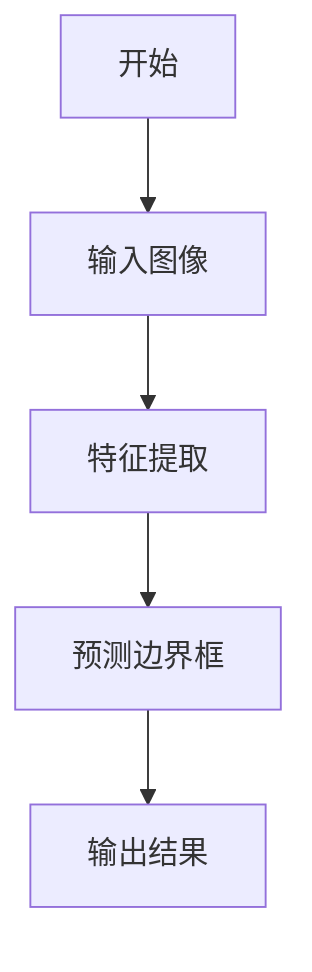
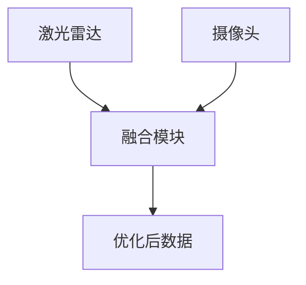
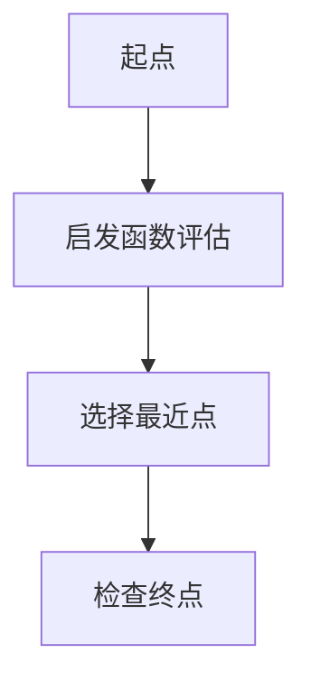
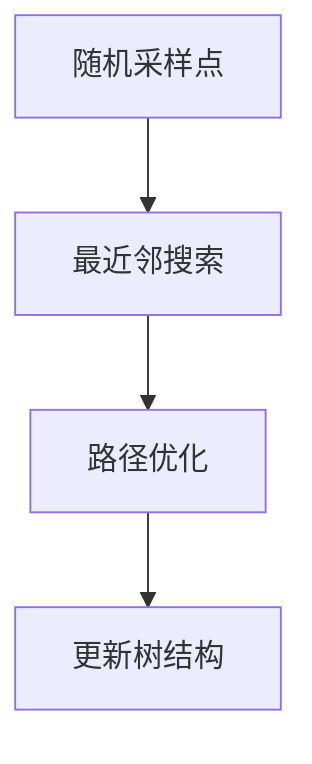
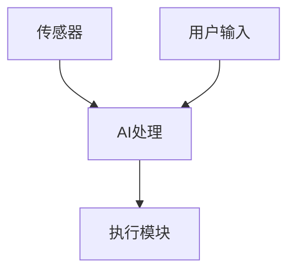

                 


# AI Agent在智能拐杖中的路况分析与导航

## 关键词
AI Agent, 智能拐杖, 路况分析, 导航算法, 深度学习, 传感器数据融合, 系统架构

## 摘要
本文探讨AI Agent在智能拐杖中的应用，重点分析路况分析与导航算法。通过深度学习和传感器数据融合，AI Agent帮助智能拐杖实时感知环境并规划路径。文章详细解释了算法原理、系统架构，并通过实例展示实际应用。

---

# 第一部分: AI Agent与智能拐杖的背景与概念

## 第1章: AI Agent与智能拐杖概述

### 1.1 AI Agent的基本概念
#### 1.1.1 AI Agent的定义与特点
- **定义**：AI Agent是具有感知、决策、执行能力的智能体。
- **特点**：自主性、反应性、社会性、持续学习。

#### 1.1.2 AI Agent的核心功能与应用场景
- **核心功能**：感知环境、分析数据、制定策略、执行动作。
- **应用场景**：智能拐杖、自动驾驶、智能助手。

#### 1.1.3 智能拐杖的发展历程与现状
- **历程**：从机械式到AI驱动的演变。
- **现状**：AI Agent技术提升用户体验。

### 1.2 智能拐杖的功能与技术基础
#### 1.2.1 智能拐杖的硬件组成
- 传感器（激光雷达、摄像头）、处理器、通信模块、电池。

#### 1.2.2 智能拐杖的软件架构
- 数据采集、处理、分析、执行模块。

#### 1.2.3 AI Agent在智能拐杖中的作用
- 处理传感器数据、分析环境、规划路径。

---

# 第二部分: AI Agent的路况分析与导航原理

## 第2章: 路况分析的核心算法

### 2.1 视觉感知算法
#### 2.1.1 基于深度学习的物体检测
- 使用YOLO算法，实时检测障碍物。
- **流程图**：


#### 2.1.2 图像分割与场景理解
- 使用U-Net进行语义分割，识别可通行区域。
- **数学公式**：
$$ \text{损失函数} = \lambda_1 \text{交叉熵} + \lambda_2 \text{边界损失} $$

#### 2.1.3 视觉信息的特征提取
- 使用卷积神经网络提取图像特征。

### 2.2 传感器数据融合
#### 2.2.1 多传感器数据的采集与处理
- 结合激光雷达和摄像头数据。

#### 2.2.2 数据融合算法与实现
- 使用卡尔曼滤波优化传感器数据。
- **流程图**：


#### 2.2.3 数据融合对路况分析的影响
- 提高检测准确性和可靠性。

### 2.3 路况分析的数学模型
#### 2.3.1 基于概率的物体检测模型
- 使用贝叶斯公式计算检测概率。
- **公式**：
$$ P(\text{物体存在}|I) = \frac{P(I|\text{物体存在})P(\text{物体存在})}{P(I)} $$

---

## 第3章: 导航算法的设计与实现

### 3.1 基于图的最短路径算法
#### 3.1.1 图的构建与表示
- 将环境建模为图，节点为可通行区域，边为移动成本。

#### 3.1.2 Dijkstra算法与A*算法的比较
- A*算法结合启发函数，效率更高。
- **流程图**：


#### 3.1.3 算法实现与优化
- 使用优先队列优化路径搜索。

### 3.2 动态环境下的路径规划
#### 3.2.1 RRT算法与RRT*算法
- RRT*算法全局规划，适应动态障碍物。
- **流程图**：


#### 3.2.2 算法的实现与应用
- 应用于智能拐杖避障。

#### 3.2.3 动态环境对路径规划的影响
- 算法需实时更新路径。

### 3.3 导航算法的数学模型
#### 3.3.1 基于Dijkstra算法的数学公式
$$ \text{距离} = \sum_{i=1}^{n} w_i \times d_i $$

#### 3.3.2 基于A*算法的数学公式
$$ f(n) = g(n) + h(n) $$

---

# 第三部分: 智能拐杖的系统架构与实现

## 第4章: 系统功能设计

### 4.1 系统架构设计
#### 4.1.1 系统组成部分
- 传感器模块、AI处理模块、通信模块。

#### 4.1.2 系统功能模块
- 数据采集、环境分析、路径规划、用户反馈。

#### 4.1.3 系统架构图


### 4.2 系统接口设计
#### 4.2.1 系统接口描述
- API定义传感器数据的输入和输出。

#### 4.2.2 交互流程
- 用户输入请求，系统处理并反馈结果。

---

## 第5章: 项目实战与案例分析

### 5.1 环境搭建与代码实现
#### 5.1.1 开发环境安装
- 安装Python、TensorFlow、ROS。

#### 5.1.2 核心代码实现
- 使用YOLO进行物体检测的Python代码：
```python
import tensorflow as tf
from tensorflow.keras import layers

model = tf.keras.Sequential([
    layers.Conv2D(32, (3,3), activation='relu'),
    layers.MaxPooling2D((2,2)),
    layers.Conv2D(64, (3,3), activation='relu'),
    layers.MaxPooling2D((2,2)),
    layers.Flatten(),
    layers.Dense(128, activation='relu'),
    layers.Dense(1, activation='sigmoid')
])
```

### 5.2 系统测试与优化
#### 5.2.1 测试用例设计
- 测试不同场景下的路径规划效果。

#### 5.2.2 性能优化
- 优化传感器数据处理速度。

### 5.3 案例分析
#### 5.3.1 实际案例
- 智能拐杖在复杂环境中的导航测试。

#### 5.3.2 案例结果与分析
- 成功避障并规划最优路径。

---

## 第6章: 最佳实践与总结

### 6.1 最佳实践
#### 6.1.1 开发注意事项
- 确保传感器数据的实时性和准确性。

#### 6.1.2 用户体验优化
- 提供反馈机制，及时调整路径。

### 6.2 小结
- AI Agent在智能拐杖中的应用前景广阔，技术不断进步将提升产品性能。

### 6.3 注意事项
- 确保系统安全性，防止数据泄露。

### 6.4 拓展阅读
- 探索更多AI算法在智能设备中的应用。

---

# 结语
AI Agent在智能拐杖中的应用展示了科技如何改变生活。通过深度学习和先进算法，智能拐杖能够帮助用户更安全、高效地导航。未来，随着技术进步，这类设备将更加智能化，为更多人带来便利。

