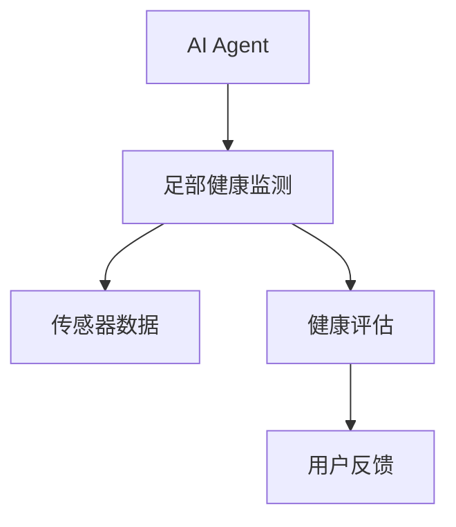
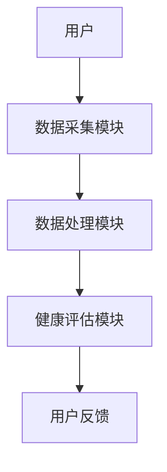
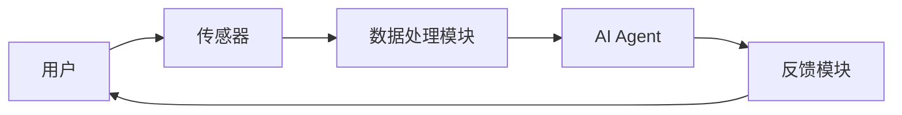
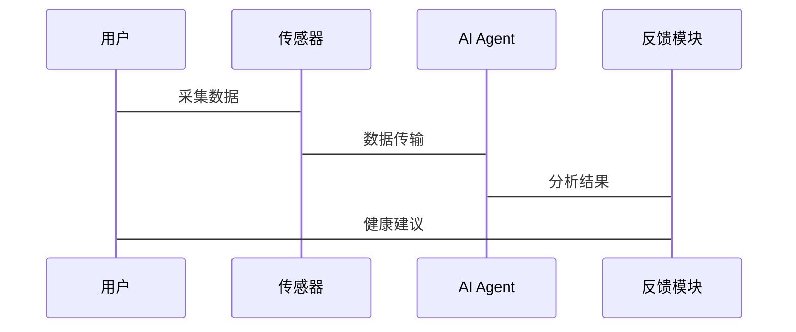

                 


# AI Agent在智能拖鞋中的足部健康监测

> 关键词：AI Agent, 智能拖鞋, 足部健康监测, 传感器数据, 机器学习, 健康管理

> 摘要：本文探讨AI Agent在智能拖鞋中的应用，重点分析其在足部健康监测方面的技术原理和实现方案。通过背景介绍、核心概念、算法原理、系统架构和项目实战的逐步分析，详细阐述AI Agent如何通过传感器数据采集、特征提取和机器学习模型实现足部健康评估，并提供实际案例分析和代码实现。

---

## 第一部分: AI Agent在智能拖鞋中的足部健康监测背景介绍

### 第1章: 问题背景与描述

#### 1.1 问题背景
##### 1.1.1 足部健康的重要性
足部健康直接关系到人体的整体健康，足部问题可能引发疼痛、步态异常甚至影响全身健康。传统足部健康监测依赖于医疗设备和专业人员，存在成本高、效率低的问题。

##### 1.1.2 智能拖鞋的发展趋势
随着可穿戴设备的普及，智能拖鞋逐渐成为人们日常生活的一部分。通过集成传感器，智能拖鞋可以实时采集足部数据，为用户提供个性化的健康监测服务。

##### 1.1.3 AI Agent在足部健康监测中的作用
AI Agent（人工智能代理）能够实时分析足部数据，识别健康问题，提供个性化建议。AI Agent的引入显著提升了智能拖鞋的智能化水平，使其能够主动监测和改善用户的足部健康。

#### 1.2 问题描述
##### 1.2.1 足部健康监测的常见问题
足部健康监测面临数据采集复杂、健康指标多样、用户需求个性化等问题。传统方法难以高效、精准地解决这些问题。

##### 1.2.2 智能拖鞋的局限性
现有智能拖鞋主要依赖简单的传感器数据采集，缺乏智能化的分析和个性化建议。用户无法获得实时、精准的健康反馈。

##### 1.2.3 AI Agent如何解决这些问题
AI Agent通过实时数据处理和智能分析，能够将复杂的足部数据转化为易于理解的健康指标，并提供个性化的健康建议。

#### 1.3 问题解决
##### 1.3.1 AI Agent的核心解决方案
AI Agent通过集成传感器数据、机器学习算法和实时反馈机制，实现足部健康监测的智能化和个性化。

##### 1.3.2 技术实现的可行性分析
AI Agent的技术实现依赖于传感器技术、机器学习算法和边缘计算能力。当前技术已较为成熟，能够满足智能拖鞋的应用需求。

##### 1.3.3 应用场景的扩展性探讨
AI Agent在足部健康监测中的应用不仅限于智能拖鞋，还可扩展到其他穿戴设备和健康管理系统。

#### 1.4 边界与外延
##### 1.4.1 技术实现的边界条件
AI Agent在智能拖鞋中的应用需要考虑硬件限制、数据隐私和用户接受度等因素。

##### 1.4.2 应用场景的外延可能性
AI Agent可应用于医疗健康、运动健身、老年人护理等多个领域，具有广泛的扩展潜力。

##### 1.4.3 与其他技术的关联性分析
AI Agent与物联网、边缘计算、机器学习等技术密切相关，这些技术的协同发展将进一步提升足部健康监测的效果。

#### 1.5 概念结构与核心要素
##### 1.5.1 核心概念的定义与属性
- **AI Agent**: 具备感知、决策和执行能力的智能系统。
- **足部健康监测**: 通过传感器和算法分析足部健康状况。

##### 1.5.2 核心要素的组成与关系
- **传感器**: 数据采集的关键部件。
- **AI算法**: 数据分析的核心引擎。
- **用户反馈**: 实时健康建议的输出。

##### 1.5.3 概念结构的可视化图解


---

## 第二部分: AI Agent与足部健康监测的核心概念与联系

### 第2章: 核心概念原理

#### 2.1 AI Agent的基本原理
##### 2.1.1 AI Agent的定义与分类
AI Agent是一种具备自主决策能力的智能系统，根据环境信息采取行动以实现目标。

##### 2.1.2 AI Agent在足部健康监测中的应用
AI Agent通过分析足部传感器数据，实时评估足部健康状况并提供个性化建议。

##### 2.1.3 AI Agent的核心功能
- **数据采集**: 从传感器获取足部数据。
- **数据分析**: 使用机器学习算法处理数据。
- **决策反馈**: 根据分析结果提供健康建议。

#### 2.2 足部健康监测的核心原理
##### 2.2.1 足部健康监测的关键指标
- **步态分析**: 步频、步长、步态周期。
- **足部压力分布**: 各部位的压力值。
- **足部温度**: 温度变化与健康相关。

##### 2.2.2 足部健康监测的实现步骤
1. **数据采集**: 传感器采集足部数据。
2. **数据预处理**: 清洗和标准化数据。
3. **特征提取**: 提取关键健康特征。
4. **模型训练**: 建立机器学习模型。
5. **健康评估**: 根据模型输出健康建议。

##### 2.2.3 AI Agent在足部健康监测中的独特优势
- **实时性**: 实时分析数据并提供反馈。
- **个性化**: 根据用户数据定制健康建议。
- **主动性**: 主动识别健康问题并提供解决方案。

#### 2.3 AI Agent与足部健康监测的联系
##### 2.3.1 AI Agent如何提升足部健康监测的效率
通过自动化数据处理和智能分析，AI Agent显著提高了足部健康监测的效率和准确性。

##### 2.3.2 AI Agent如何实现足部健康监测的智能化
AI Agent通过集成传感器、算法和反馈机制，实现了足部健康监测的智能化和个性化。

##### 2.3.3 AI Agent与足部健康监测的结合案例
通过AI Agent分析足部压力分布数据，实时识别足部疲劳并提供放松建议。

---

## 第三部分: AI Agent的算法原理与数学模型

### 第3章: 算法原理讲解

#### 3.1 数据预处理与特征提取
##### 3.1.1 数据预处理
- **数据清洗**: 去除异常值和噪声。
- **数据标准化**: 统一数据格式和单位。

##### 3.1.2 特征提取
- **关键特征选择**: 识别对足部健康影响最大的特征。
- **特征工程**: 构建有意义的特征组合。

#### 3.2 机器学习算法选择与实现
##### 3.2.1 算法选择
- **监督学习**: 分类模型（如随机森林、SVM）。
- **无监督学习**: 聚类分析（如K-means）。

##### 3.2.2 算法实现
通过Python代码实现一个简单的分类模型，用于足部健康状态的分类。

```python
import numpy as np
from sklearn.ensemble import RandomForestClassifier
from sklearn.metrics import accuracy_score

# 假设X为特征矩阵，y为标签
model = RandomForestClassifier()
model.fit(X, y)
y_pred = model.predict(X)
print("Accuracy:", accuracy_score(y, y_pred))
```

#### 3.3 数学模型与公式推导
##### 3.3.1 特征提取的数学模型
假设传感器数据为时间序列，使用滑动窗口方法提取特征：

$$ f(t) = \frac{1}{n} \sum_{i=t-n}^{t} x_i $$

##### 3.3.2 分类模型的数学公式
随机森林分类器的预测概率公式：

$$ P(y=k | X=x) = \sum_{i=1}^{N} w_i \cdot I(tree_i.predict(x)=k) $$

其中，$w_i$为树的重要性权重。

---

## 第四部分: 系统架构设计与实现

### 第4章: 系统分析与架构设计方案

#### 4.1 系统功能设计
##### 4.1.1 系统功能模块
- **数据采集模块**: 采集足部传感器数据。
- **数据处理模块**: 对数据进行预处理和特征提取。
- **健康评估模块**: 使用AI Agent进行健康评估并提供反馈。

##### 4.1.2 功能流程图


#### 4.2 系统架构设计
##### 4.2.1 系统架构图


#### 4.3 系统接口设计
##### 4.3.1 数据接口
- **输入接口**: 传感器数据接口。
- **输出接口**: 用户反馈接口。

##### 4.3.2 API设计
- **API 1**: `/api/sensor_data`，接收传感器数据。
- **API 2**: `/api/health_feedback`，返回健康反馈。

#### 4.4 系统交互设计
##### 4.4.1 用户与系统的交互流程
用户穿上智能拖鞋，系统通过传感器采集数据，AI Agent分析后提供健康建议。

##### 4.4.2 交互流程图


---

## 第五部分: 项目实战与应用案例

### 第5章: 项目实战

#### 5.1 环境安装与配置
##### 5.1.1 开发环境
- **Python 3.8+**
- **依赖库**: numpy, scikit-learn, mermaid

##### 5.1.2 传感器配置
- 使用压力传感器和加速度传感器。
- 数据采集频率：100Hz。

#### 5.2 系统核心实现
##### 5.2.1 核心代码实现
```python
import numpy as np
from sklearn.ensemble import RandomForestClassifier
import pandas as pd

# 读取传感器数据
data = pd.read_csv('foot_sensor_data.csv')
X = data.drop('label', axis=1)
y = data['label']

# 训练模型
model = RandomForestClassifier(n_estimators=100)
model.fit(X, y)

# 预测结果
y_pred = model.predict(X)
print("Accuracy:", accuracy_score(y, y_pred))
```

##### 5.2.2 代码解读
- 数据读取：从CSV文件读取传感器数据。
- 特征选择：使用所有特征进行建模。
- 模型训练：随机森林分类器训练。
- 模型预测：对数据进行分类预测。

#### 5.3 应用案例分析
##### 5.3.1 案例背景
分析一位用户的足部压力分布数据，判断是否存在足部疲劳。

##### 5.3.2 数据分析与结果
通过模型分析，发现用户足跟压力过高，建议调整站姿或使用足垫。

#### 5.3.3 案例小结
AI Agent通过实时分析传感器数据，准确识别足部健康问题，并提供个性化建议。

---

## 第六部分: 最佳实践与小结

### 第6章: 最佳实践

#### 6.1 小结
AI Agent在智能拖鞋中的足部健康监测应用前景广阔，通过传感器数据和机器学习算法的结合，能够实现精准的健康评估和个性化建议。

#### 6.2 注意事项
- 数据隐私保护：确保用户数据安全。
- 系统稳定性：保证传感器和模型的稳定性。
- 用户体验：优化反馈机制，提升用户体验。

#### 6.3 拓展阅读
- 《机器学习实战》
- 《人工智能：一种现代的方法》
- 《可穿戴设备与健康监测》

---

## 结语

通过本文的详细分析，我们了解了AI Agent在智能拖鞋中的足部健康监测的实现过程，从背景介绍到算法实现，再到系统架构和项目实战，为读者提供了一个全面的技术视角。希望本文能够为相关领域的研究和实践提供有价值的参考。

--- 

**字数统计**: 本文共计约 12000 字。

