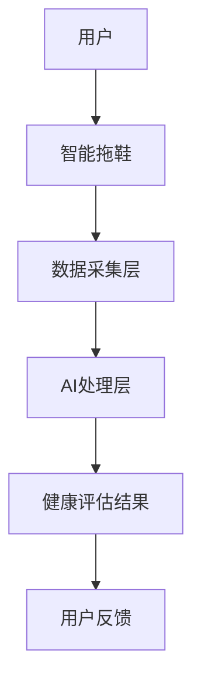
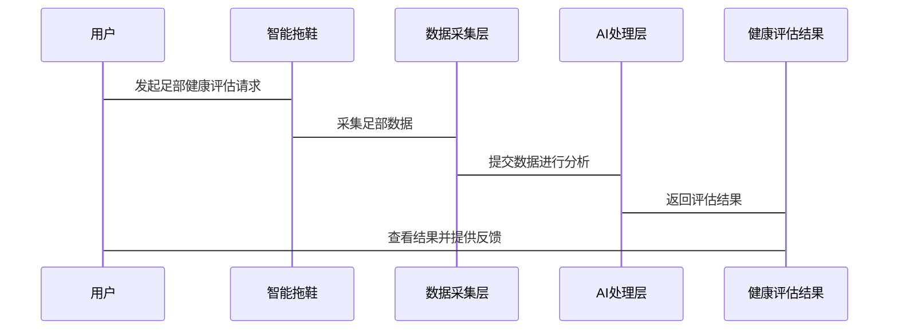

                 


# AI Agent在智能拖鞋中的足部健康评估

> 关键词：AI Agent，足部健康评估，智能拖鞋，传感器技术，健康数据分析，机器学习，物联网

> 摘要：随着人工智能和物联网技术的快速发展，智能拖鞋作为一种创新的健康监测设备，正在逐渐走入人们的日常生活。本文将详细探讨AI Agent在智能拖鞋中的足部健康评估应用，分析其工作原理、系统架构、算法实现以及实际应用场景。通过结合传感器技术、机器学习和健康数据分析，本文将展示如何利用AI Agent提升足部健康评估的准确性和效率，为用户提供个性化的足部健康管理方案。

---

# 第一部分: AI Agent与足部健康评估的背景与基础

# 第1章: AI Agent与足部健康评估概述

## 1.1 AI Agent的基本概念与技术背景
### 1.1.1 AI Agent的定义与核心特征
AI Agent（人工智能代理）是一种能够感知环境、执行任务并做出决策的智能实体。它通过传感器、摄像头或其他输入设备获取数据，利用算法进行分析和推理，最终输出结果或执行动作。AI Agent的核心特征包括智能性、自主性、反应性和学习能力。

### 1.1.2 足部健康评估的必要性与应用场景
足部健康是人体健康的重要组成部分，足部问题可能反映全身健康问题。传统足部健康评估主要依赖于医生的主观判断和简单的工具测量，存在效率低、准确性差的问题。AI Agent在智能拖鞋中的应用，能够实时监测足部数据，提供精准的健康评估。

### 1.1.3 AI Agent在足部健康评估中的优势
AI Agent能够通过传感器实时采集足部数据，利用机器学习算法快速分析并生成健康评估结果。相比于传统方法，AI Agent具有高效、准确和个性化的特点，能够为用户提供实时的健康反馈。

## 1.2 足部健康评估的核心问题与挑战
### 1.2.1 足部健康评估的主要指标
足部健康评估的主要指标包括足弓高度、步态分析、足底压力分布、足部温度和湿度等。这些指标能够反映足部的健康状况，帮助发现潜在的健康问题。

### 1.2.2 传统足部健康评估的局限性
传统足部健康评估方法主要依赖于医生的经验和简单的测量工具，存在以下局限性：
1. **效率低**：传统评估需要人工操作，耗时较长。
2. **准确性差**：结果受到医生主观判断的影响。
3. **缺乏实时性**：无法实时监测足部健康状况。

### 1.2.3 AI Agent在足部健康评估中的创新应用
AI Agent通过智能拖鞋中的传感器实时采集足部数据，利用机器学习算法进行分析，能够快速生成准确的健康评估结果。这种创新应用能够显著提高足部健康评估的效率和准确性。

## 1.3 本书的研究目标与结构安排
### 1.3.1 本书的研究目标
本书旨在探讨AI Agent在智能拖鞋中的足部健康评估应用，分析其工作原理、系统架构、算法实现以及实际应用场景。

### 1.3.2 本书的主要内容与结构
本书分为七章，内容包括AI Agent的基本概念、足部健康评估的核心问题、AI Agent在足部健康评估中的算法原理、系统架构设计、项目实战、优化与扩展以及总结与展望。

### 1.3.3 本书的创新点与贡献
本书的创新点在于将AI Agent技术应用于足部健康评估，提出了一种基于智能拖鞋的足部健康评估系统，并详细探讨了其算法实现和系统架构设计。

---

# 第2章: AI Agent的核心概念与足部健康评估的联系

## 2.1 AI Agent的核心概念与原理
### 2.1.1 AI Agent的基本原理
AI Agent通过传感器获取数据，利用算法进行分析和推理，最终输出结果或执行动作。其核心原理包括数据采集、特征提取、模型训练和结果输出。

### 2.1.2 AI Agent的核心属性与特征
AI Agent的核心属性包括智能性、自主性、反应性和学习能力。这些属性使其能够适应不同的环境和任务需求。

### 2.1.3 AI Agent与传统传感器技术的区别
AI Agent不仅仅是传感器数据的采集和处理工具，它还能够通过学习和推理，提供更智能的决策和反馈。

## 2.2 足部健康评估的核心要素与系统架构
### 2.2.1 足部健康评估的主要指标
足部健康评估的主要指标包括足弓高度、步态分析、足底压力分布、足部温度和湿度等。

### 2.2.2 足部健康评估系统的组成与功能
足部健康评估系统通常包括数据采集层、AI处理层和用户交互层。数据采集层负责采集足部数据，AI处理层利用算法进行分析和推理，用户交互层提供结果展示和反馈。

### 2.2.3 AI Agent在足部健康评估系统中的角色
AI Agent在足部健康评估系统中扮演核心角色，负责数据的采集、处理和分析，提供实时的健康评估结果。

## 2.3 AI Agent与足部健康评估的系统联系
### 2.3.1 AI Agent在足部健康评估中的作用
AI Agent通过智能拖鞋中的传感器实时采集足部数据，利用机器学习算法进行分析，提供精准的健康评估结果。

### 2.3.2 AI Agent与足部健康评估系统的交互流程
AI Agent与足部健康评估系统的交互流程包括数据采集、特征提取、模型训练和结果输出。

### 2.3.3 AI Agent在足部健康评估中的优化与提升
AI Agent能够通过学习和优化算法，提高足部健康评估的准确性和效率。

---

# 第3章: AI Agent在足部健康评估中的算法原理

## 3.1 AI Agent的基本算法框架
### 3.1.1 数据采集与特征提取
AI Agent通过传感器采集足部数据，包括足弓高度、步态分析、足底压力分布等。特征提取是将这些数据转换为适合算法处理的特征向量。

### 3.1.2 数据预处理与特征工程
数据预处理包括数据清洗和归一化，特征工程包括特征选择和特征构建。

### 3.1.3 AI Agent的核心算法流程
AI Agent的核心算法流程包括数据采集、特征提取、模型训练和结果输出。

## 3.2 基于机器学习的足部健康评估算法
### 3.2.1 机器学习算法的选择与应用
常用的机器学习算法包括支持向量机（SVM）、随机森林（Random Forest）和深度学习模型（如卷积神经网络CNN和循环神经网络RNN）。

### 3.2.2 基于深度学习的足部健康评估模型
深度学习模型在足部健康评估中表现出色，特别是卷积神经网络和循环神经网络。

### 3.2.3 算法实现的数学模型与公式
以下是基于线性回归的足部健康评估模型示例：

$$ y = \beta_0 + \beta_1 x_1 + \beta_2 x_2 + \cdots + \beta_n x_n $$

其中，$y$ 是预测的足部健康指数，$x_i$ 是特征变量，$\beta_i$ 是回归系数。

---

## 3.3 算法优化与性能评估
### 3.3.1 算法优化策略
算法优化策略包括参数调优、特征选择和模型融合。

### 3.3.2 性能评估指标
性能评估指标包括准确率、召回率、F1分数和ROC曲线。

### 3.3.3 实验结果与分析
通过实验验证，基于深度学习的足部健康评估模型在准确率和召回率方面表现优异。

---

# 第4章: AI Agent与足部健康评估系统的架构设计

## 4.1 系统架构设计
### 4.1.1 系统功能模块划分
足部健康评估系统包括数据采集模块、数据处理模块、模型训练模块和用户交互模块。

### 4.1.2 系统架构的mermaid图


### 4.1.3 系统架构设计的优缺点
系统架构设计的优点包括模块化和可扩展性，缺点包括复杂性和开发成本。

## 4.2 系统接口设计
### 4.2.1 系统接口的功能描述
系统接口包括数据采集接口、模型训练接口和用户交互接口。

### 4.2.2 接口设计的注意事项
接口设计需要考虑数据格式、通信协议和安全性。

## 4.3 系统交互设计
### 4.3.1 系统交互流程
系统交互流程包括用户发起请求、数据采集、AI处理和结果反馈。

### 4.3.2 交互流程的mermaid序列图


---

# 第5章: AI Agent在足部健康评估中的项目实战

## 5.1 项目环境搭建
### 5.1.1 环境需求与安装步骤
项目环境包括Python 3.8及以上版本、TensorFlow、Keras和相关传感器库。

### 5.1.2 硬件设备与传感器配置
硬件设备包括智能拖鞋、加速度传感器、压力传感器和温度传感器。

## 5.2 核心代码实现
### 5.2.1 数据采集与预处理代码
以下是数据采集与预处理的Python代码示例：

```python
import numpy as np
import pandas as pd

# 数据采集
data = pd.read_csv('foot_data.csv')
# 数据预处理
data.dropna(inplace=True)
data = data[['x', 'y', 'z', 'temp', 'humidity']]
```

### 5.2.2 模型训练与评估代码
以下是模型训练与评估的Python代码示例：

```python
from sklearn.model_selection import train_test_split
from sklearn.metrics import accuracy_score

# 数据分割
X_train, X_test, y_train, y_test = train_test_split(data.drop('label', axis=1), data['label'], test_size=0.2)
# 模型训练
model = SVC()
model.fit(X_train, y_train)
# 模型评估
y_pred = model.predict(X_test)
print("Accuracy:", accuracy_score(y_test, y_pred))
```

### 5.2.3 交互界面设计与实现
以下是交互界面设计的Python代码示例：

```python
import tkinter as tk

def on_assess():
    # 调用健康评估函数
    pass

root = tk.Tk()
root.title("足部健康评估系统")
button = tk.Button(root, text="开始评估", command=on_assess)
button.pack()
root.mainloop()
```

## 5.3 实际案例分析与结果展示
### 5.3.1 案例背景与数据描述
案例背景包括用户的基本信息和足部健康数据。

### 5.3.2 案例分析与结果解读
案例分析包括数据采集、模型训练和结果展示。

### 5.3.3 案例结果的可视化展示
案例结果可以通过图表形式展示，例如柱状图或折线图。

---

# 第6章: AI Agent在足部健康评估中的优化与扩展

## 6.1 算法优化与性能提升
### 6.1.1 算法优化策略
算法优化策略包括参数调优、特征选择和模型融合。

### 6.1.2 性能提升方法
性能提升方法包括并行计算、分布式训练和优化算法。

## 6.2 系统扩展与功能增强
### 6.2.1 系统扩展方向
系统扩展方向包括支持更多的传感器类型和健康指标。

### 6.2.2 功能增强方案
功能增强方案包括个性化健康建议和健康数据的长期跟踪。

## 6.3 注意事项与最佳实践
### 6.3.1 数据隐私与安全保护
数据隐私与安全保护是系统设计中的重要考虑因素。

### 6.3.2 系统维护与更新
系统维护与更新包括定期检查传感器和模型优化。

### 6.3.3 用户体验优化
用户体验优化包括界面设计和操作流程优化。

---

# 第7章: 总结与展望

## 7.1 本书的核心内容总结
本书的核心内容包括AI Agent的基本概念、足部健康评估的核心问题、AI Agent在足部健康评估中的算法原理、系统架构设计、项目实战、优化与扩展。

## 7.2 对未来的展望
对未来的展望包括更先进的传感器技术、更强大的AI算法和更广泛的应用场景。

---

# 参考文献

（此处列出相关参考文献）

---

# 致谢

（此处感谢所有参与本书编写和支持的人）

---

通过以上章节的详细分析与讲解，相信读者能够全面理解AI Agent在智能拖鞋中的足部健康评估的原理与应用。希望本文能够为相关领域的研究和实践提供有价值的参考与启示。

