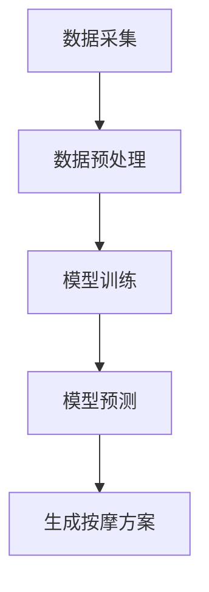
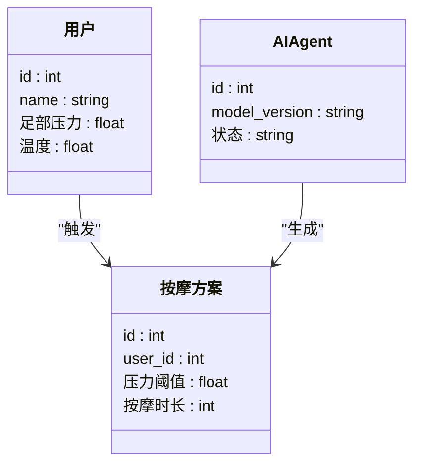
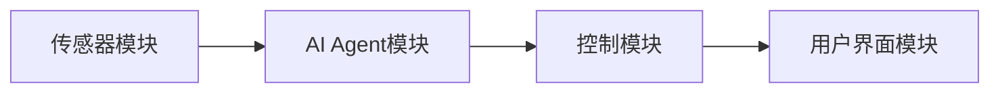
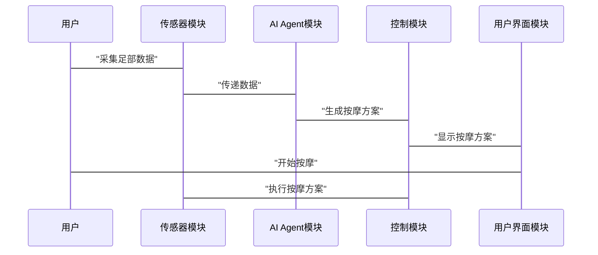

                 


# AI Agent在智能拖鞋中的足部按摩定制

## 关键词：AI Agent，足部按摩，智能拖鞋，定制算法，用户体验

## 摘要：  
本文详细探讨了AI Agent在智能拖鞋中的足部按摩定制应用，从背景介绍、核心概念、算法原理、系统架构设计到项目实战，全面分析了如何通过AI技术实现足部按摩的个性化定制。文章结合理论与实践，提出了基于AI Agent的足部按摩定制方案，并通过具体案例展示了其在智能拖鞋中的实现过程，为相关领域的研究和应用提供了有价值的参考。

---

# 第1章 背景介绍

## 1.1 问题背景

### 1.1.1 足部按摩的历史与现状  
足部按摩是一种通过刺激足部穴位来促进身体健康和放松的技术。传统的足部按摩主要依赖于人工操作，按摩师根据经验判断用户的痛点并进行按摩。然而，这种方式存在效率低、成本高、个性化不足等问题。

### 1.1.2 智能硬件在足部按摩中的应用趋势  
随着智能硬件技术的发展，足部按摩设备逐渐从传统的手动按摩向智能化方向转型。智能足部按摩器可以通过传感器采集用户足部的压力、温度等数据，并通过算法进行分析，从而实现个性化的按摩方案。

### 1.1.3 AI技术在足部按摩中的潜力  
AI技术的应用为足部按摩的个性化定制带来了新的可能性。通过AI Agent（智能代理），可以实时分析用户的足部数据，动态调整按摩方案，从而提供更精准、更个性化的足部按摩服务。

## 1.2 问题描述

### 1.2.1 足部按摩的个性化需求  
每个人的身体状况、痛点位置和按摩偏好都不同，传统足部按摩设备无法满足个性化需求。

### 1.2.2 智能拖鞋的痛点与不足  
当前市场上的智能拖鞋大多仅具备基础的健康监测功能，缺乏智能化的按摩功能，无法满足用户的个性化按摩需求。

### 1.2.3 AI Agent在足部按摩中的应用价值  
AI Agent可以通过实时数据采集、分析和决策，为用户提供个性化的足部按摩服务，提升用户体验。

## 1.3 问题解决

### 1.3.1 AI Agent的核心作用  
AI Agent可以实时采集用户的足部数据，分析用户的健康状况和按摩需求，动态调整按摩方案。

### 1.3.2 足部按摩定制的实现路径  
通过AI Agent实现足部按摩的个性化定制，需要结合传感器技术、AI算法和硬件设计。

### 1.3.3 智能拖鞋的硬件与软件结合  
智能拖鞋需要结合硬件传感器和AI算法，通过软件实现数据采集、分析和控制。

## 1.4 边界与外延

### 1.4.1 AI Agent在足部按摩中的应用边界  
AI Agent的应用范围包括足部数据采集、分析和按摩方案调整，但不包括硬件设计和物理按摩执行。

### 1.4.2 智能拖鞋的功能范围界定  
智能拖鞋的功能包括足部数据采集、AI Agent驱动的按摩方案调整、用户反馈收集等。

### 1.4.3 足部按摩定制的用户体验优化  
通过AI Agent实现个性化的足部按摩，可以提升用户的舒适度和健康效果。

## 1.5 核心概念

### 1.5.1 AI Agent的定义与特征  
AI Agent是一种智能代理，能够通过数据采集、分析和决策，实现自动化服务。其特征包括智能性、实时性、个性化和可扩展性。

### 1.5.2 足部按摩定制的核心要素  
足部按摩定制的核心要素包括足部数据采集、AI算法分析和个性化按摩方案生成。

### 1.5.3 智能拖鞋的系统架构  
智能拖鞋的系统架构包括传感器模块、AI Agent模块、控制模块和用户界面模块。

---

# 第2章 核心概念与联系

## 2.1 AI Agent的原理

### 2.1.1 AI Agent的基本原理  
AI Agent通过数据采集、分析和决策，驱动硬件设备执行相应的操作。

### 2.1.2 AI Agent在足部按摩中的具体实现  
AI Agent通过采集用户的足部压力、温度等数据，分析用户的健康状况和按摩需求，动态调整按摩方案。

### 2.1.3 AI Agent与足部按摩定制的关系  
AI Agent是实现足部按摩定制的核心技术，通过AI Agent可以实现个性化的按摩方案。

## 2.2 足部按摩定制的原理

### 2.2.1 足部按摩的生理学基础  
足部按摩通过刺激足部穴位，促进血液循环和身体健康。

### 2.2.2 足部按摩的个性化需求分析  
不同用户的身体状况和按摩需求不同，需要个性化的按摩方案。

### 2.2.3 足部按摩定制的算法实现  
通过AI算法分析足部数据，生成个性化的按摩方案。

## 2.3 AI Agent与足部按摩定制的关系

### 2.3.1 AI Agent在足部按摩定制中的作用  
AI Agent通过实时数据采集和分析，实现个性化的按摩方案调整。

### 2.3.2 足部按摩定制对AI Agent的需求  
足部按摩定制需要AI Agent的实时数据处理和决策能力。

### 2.3.3 AI Agent与足部按摩定制的协同优化  
通过AI Agent与足部按摩定制的协同优化，可以提升用户体验和健康效果。

## 2.4 核心概念对比

### 2.4.1 AI Agent与传统足部按摩的对比  
| 特性           | AI Agent驱动的足部按摩 | 传统足部按摩 |
|----------------|--------------------------|---------------|
| 数据采集       | 实时采集足部数据         | 手动采集数据   |
| 按摩方案调整   | AI算法动态调整           | 人工调整       |
| 个性化程度     | 高度个性化               | 个性化不足     |

### 2.4.2 ER实体关系图  
```mermaid
erDiagram
    user {
        +id : int
        +name : string
        +foot_pressure : float
        +temperature : float
    }
   按摩方案 {
        +id : int
        +user_id : int
        +pressure_threshold : float
        +massage_duration : int
    }
    AI Agent {
        +id : int
        +model_version : string
        +status : string
    }
    user -> 按摩方案 : "触发"
    AI Agent -> 按摩方案 : "生成"
```

---

# 第3章 算法原理讲解

## 3.1 算法原理

### 3.1.1 算法选择  
选择基于用户足部压力分布的算法模型，用于个性化按摩方案的生成。

### 3.1.2 算法流程  
1. 数据采集：采集用户的足部压力和温度数据。
2. 数据预处理：对采集的数据进行归一化处理。
3. 模型训练：基于历史数据训练AI模型。
4. 按摩方案生成：根据实时数据生成个性化的按摩方案。

### 3.1.3 数学模型  
$$ y = \beta_0 + \beta_1x + \epsilon $$  
其中，$y$ 是按摩强度，$x$ 是足部压力，$\beta_0$ 和 $\beta_1$ 是模型参数。

### 3.1.4 算法实现  
```python
import numpy as np
from sklearn.linear_model import LinearRegression

# 示例数据
X = np.array([[10], [20], [30], [40]])
y = np.array([2, 4, 6, 8])

# 模型训练
model = LinearRegression()
model.fit(X, y)

# 预测按摩强度
def predict_massage_strength.pressure:
    return model.predict([[pressure]])
```

## 3.2 算法流程图  


---

# 第4章 系统分析与架构设计

## 4.1 系统功能设计

### 4.1.1 领域模型类图  


## 4.2 系统架构设计

### 4.2.1 系统架构图  


### 4.2.2 系统接口设计  
- 传感器模块接口：`get_foot_data()`
- AI Agent模块接口：`generate_massage_plan(data)`
- 控制模块接口：`execute_plan(plan)`

## 4.3 系统交互流程图  


---

# 第5章 项目实战

## 5.1 环境安装

### 5.1.1 安装Python和相关库  
```bash
pip install numpy scikit-learn
```

## 5.2 核心代码实现

### 5.2.1 数据采集模块  
```python
import numpy as np
import serial

# 串口通信参数
ser = serial.Serial('COM3', 9600)

def get_foot_data():
    while True:
        data = ser.readline().decode('utf-8')
        if data:
            pressure = float(data.split(',')[0])
            temperature = float(data.split(',')[1])
            return pressure, temperature
```

### 5.2.2 AI Agent模块  
```python
from sklearn.linear_model import LinearRegression

class AI-Agent:
    def __init__(self):
        self.model = LinearRegression()
        self.model.fit(X, y)

    def predict(self, pressure):
        return self.model.predict([[pressure]])
```

## 5.3 实际案例分析

### 5.3.1 用户数据收集  
假设用户足部压力为30，温度为36.5℃，AI Agent生成按摩方案。

### 5.3.2 按摩方案调整  
根据模型预测结果，调整按摩强度和时长。

## 5.4 项目小结  
通过AI Agent实现足部按摩的个性化定制，提升了用户体验和健康效果。

---

# 第6章 最佳实践与小结

## 6.1 最佳实践

### 6.1.1 数据隐私保护  
确保用户的足部数据加密存储和传输。

### 6.1.2 传感器校准  
定期校准传感器，保证数据采集的准确性。

## 6.2 小结  
本文详细探讨了AI Agent在智能拖鞋中的足部按摩定制应用，从理论到实践，展示了如何通过AI技术实现个性化的足部按摩服务。

## 6.3 注意事项  
- 确保系统的稳定性和安全性。
- 定期更新AI模型，提升按摩方案的准确性。

## 6.4 拓展阅读  
- 探讨AI Agent在其他健康领域的应用。
- 研究更先进的AI算法，提升按摩方案的智能化水平。

---

# 结语

通过本文的分析和实践，我们可以看到AI Agent在智能拖鞋中的足部按摩定制应用具有广阔的发展前景。未来，随着AI技术的不断进步，足部按摩定制将更加智能化、个性化，为用户带来更优质的健康体验。

