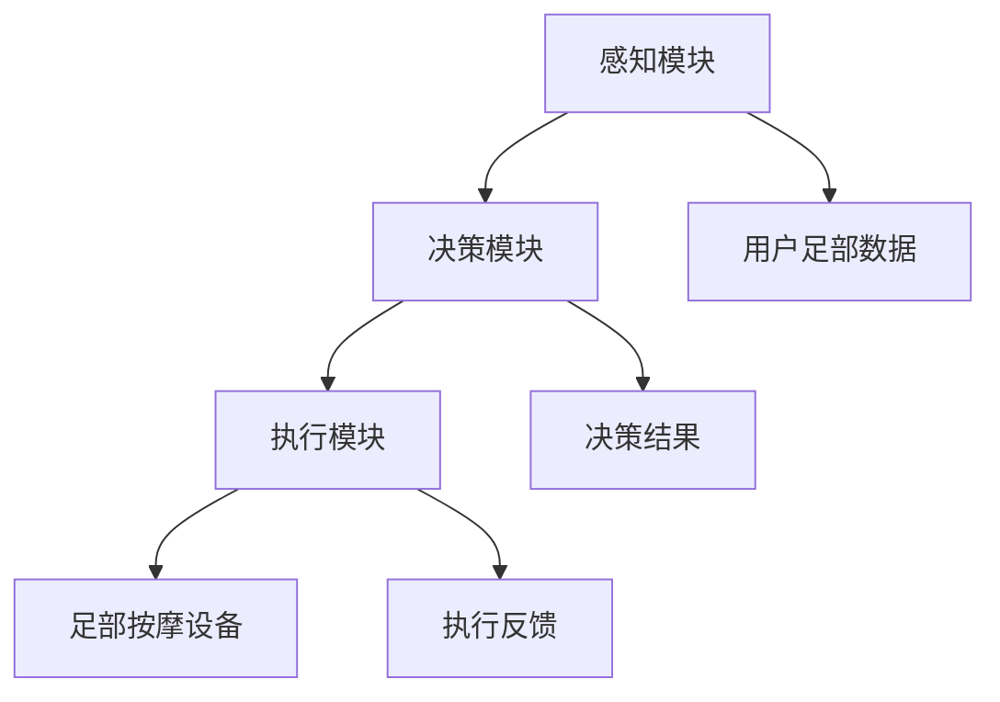
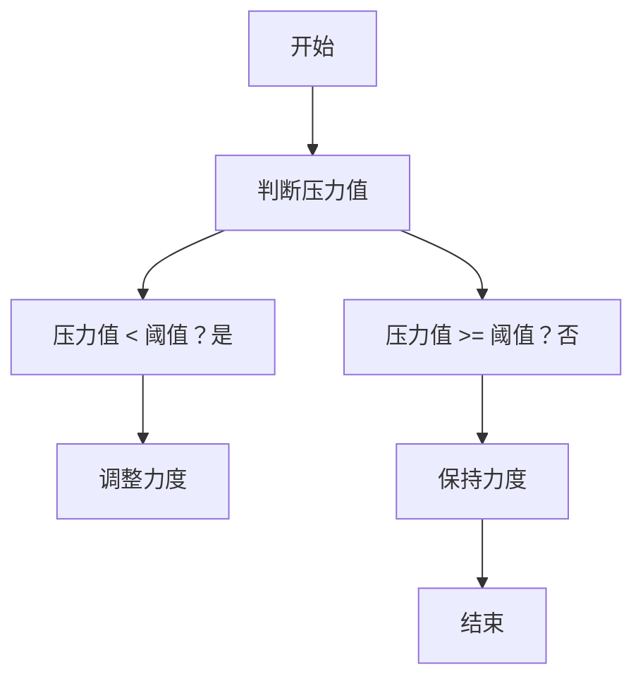
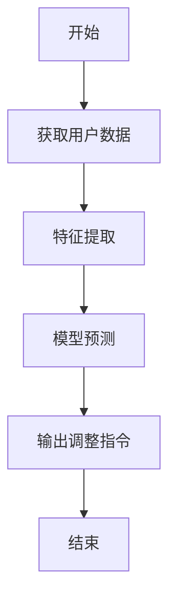
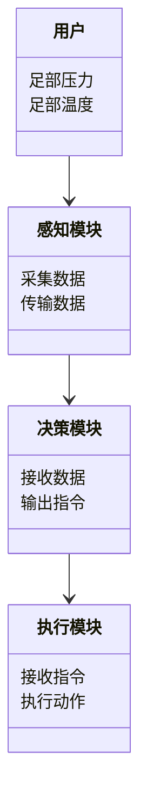
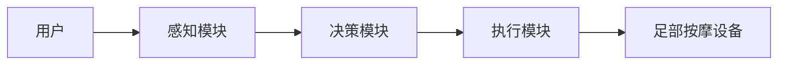
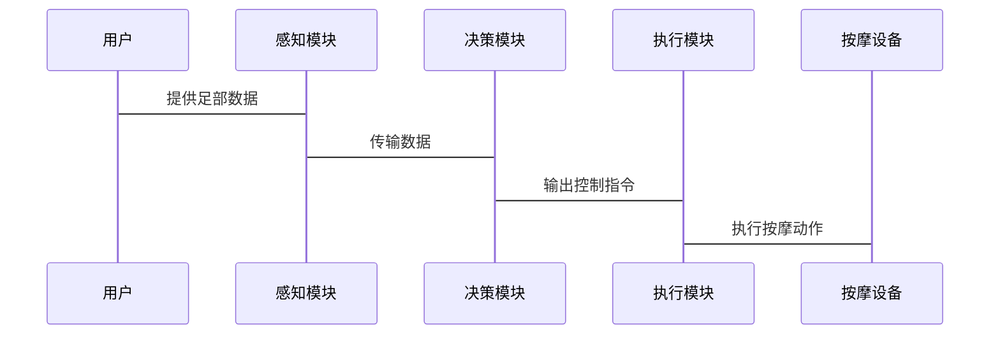

                 


# AI Agent在智能拖鞋中的足部按摩控制

---

## 关键词：
- AI Agent
- 足部按摩
- 智能拖鞋
- 算法原理
- 系统架构
- 项目实战

---

## 摘要：
本文详细探讨了AI Agent在智能拖鞋足部按摩控制中的应用。从AI Agent的基本概念到其在足部按摩控制中的具体实现，再到系统的架构设计和实际项目案例，文章全面分析了AI Agent如何通过感知、决策和执行模块优化足部按摩体验。通过对比传统控制与AI Agent控制的差异，本文展示了AI技术在提升用户体验和系统智能化方面的独特优势。最后，文章还总结了AI Agent在智能拖鞋中的最佳实践和未来发展方向。

---

# 第一部分: AI Agent在智能拖鞋中的足部按摩控制背景介绍

---

# 第1章: AI Agent与足部按摩控制概述

## 1.1 AI Agent的基本概念

### 1.1.1 AI Agent的定义与特点

AI Agent（人工智能代理）是指能够感知环境、自主决策并执行任务的智能体。其特点包括：

- **自主性**：能够在没有外部干预的情况下独立运行。
- **反应性**：能够实时感知环境并做出响应。
- **目标导向**：通过实现预设目标来优化系统性能。
- **学习能力**：能够通过数据和经验不断优化自身算法。

### 1.1.2 AI Agent在智能设备中的应用

AI Agent广泛应用于智能家居、自动驾驶、医疗设备等领域。在智能拖鞋中，AI Agent主要用于足部按摩控制，通过感知足部的压力、温度和运动状态，优化按摩力度和模式。

### 1.1.3 足部按摩控制的需求背景

足部按摩是一种常见的健康护理方式，能够缓解疲劳、促进血液循环。传统拖鞋的按摩功能通常基于固定的模式，无法根据用户的实时需求进行调整。而AI Agent可以通过动态感知和自适应学习，提供个性化的按摩体验。

---

## 1.2 足部按摩控制的必要性

### 1.2.1 足部健康的重要性

足部健康与全身健康密切相关。通过科学的足部按摩，可以有效缓解足部疲劳、预防足部疾病，并提升整体健康水平。

### 1.2.2 智能拖鞋的优势

智能拖鞋结合了传统拖鞋的舒适性和智能设备的便捷性，能够通过AI技术提供更精准、个性化的足部按摩服务。

### 1.2.3 用户体验的提升

通过AI Agent的动态调整和自适应学习，用户可以获得更加舒适和高效的足部按摩体验，满足个性化需求。

---

## 1.3 AI Agent在足部按摩控制中的应用前景

### 1.3.1 技术可行性分析

AI Agent的核心技术包括感知、决策和执行模块，这些技术在足部按摩控制中已有成熟的解决方案，具备较高的技术可行性。

### 1.3.2 市场需求预测

随着人们对健康生活的重视，智能拖鞋市场潜力巨大。AI Agent的应用能够显著提升产品的竞争力，满足高端用户的个性化需求。

### 1.3.3 未来发展趋势

未来的AI Agent将更加智能化、个性化，并能够与其他智能设备联动，提供更全面的健康服务。

---

## 1.4 本章小结

本章从AI Agent的基本概念出发，分析了足部按摩控制的必要性和应用前景，为后续章节的深入探讨奠定了基础。

---

# 第二部分: AI Agent的核心概念与足部按摩控制的联系

---

# 第2章: AI Agent的核心原理

## 2.1 AI Agent的感知模块

### 2.1.1 感知模块的功能与作用

感知模块负责采集足部的压力、温度、运动等数据，并将其转化为可处理的信号。这些数据为后续的决策和执行提供依据。

### 2.1.2 常见的感知技术

- **压力传感器**：用于检测足部的压力分布。
- **温度传感器**：用于监测足部的温度变化。
- **加速度传感器**：用于感知足部的运动状态。

### 2.1.3 数据采集与处理流程

数据采集→数据预处理→特征提取→数据传输。

---

## 2.2 AI Agent的决策模块

### 2.2.1 决策算法的分类

- **基于规则的算法**：通过预设的规则进行决策。
- **基于机器学习的算法**：通过训练数据进行模式识别和预测。

### 2.2.2 常见的决策算法

- **决策树**：通过树状结构进行分类和回归。
- **随机森林**：通过集成学习提高决策准确性。
- **神经网络**：通过深度学习进行复杂模式识别。

### 2.2.3 决策模块的实现流程

数据输入→特征提取→模型训练→决策输出。

---

## 2.3 AI Agent的执行模块

### 2.3.1 执行模块的功能与作用

执行模块负责根据决策模块的输出，驱动足部按摩设备（如电机、振动器）进行动作。

### 2.3.2 常见的执行方式

- **电机控制**：通过调整电机转速实现不同力度的按摩。
- **振动控制**：通过振动频率和幅度实现不同的按摩效果。

### 2.3.3 执行模块的实现流程

指令接收→驱动控制→执行反馈。

---

## 2.4 AI Agent的核心概念对比表

| 概念 | 传统控制 | AI Agent控制 |
|------|----------|--------------|
| 数据来源 | 单一传感器 | 多源传感器融合 |
| 决策方式 | 固定规则 | 自适应学习 |
| 执行方式 | 固定模式 | 动态调整 |

---

## 2.5 AI Agent的核心原理Mermaid流程图



---

## 2.6 本章小结

本章详细介绍了AI Agent的核心原理，包括感知、决策和执行模块的功能与实现流程，并通过对比分析展示了AI Agent的优势。

---

# 第三部分: AI Agent的算法原理与数学模型

---

# 第3章: AI Agent的算法原理

## 3.1 基于规则的算法

### 3.1.1 基于规则的算法原理

通过预设的规则（如If-Else条件语句）进行决策。适用于规则简单、场景固定的足部按摩控制。

### 3.1.2 基于规则的算法流程图



### 3.1.3 基于规则的算法代码示例

```python
def adjust_masseuse_force(force, threshold):
    if force < threshold:
        return force + 0.5
    else:
        return force
```

---

## 3.2 基于机器学习的算法

### 3.2.1 基于机器学习的算法原理

通过训练数据，学习足部按摩的最佳模式，实现自适应调整。

### 3.2.2 基于机器学习的算法流程图



### 3.2.3 基于机器学习的算法数学模型

$$ y = f(x) $$

其中，$x$ 是输入特征，$y$ 是输出调整指令，$f$ 是训练好的机器学习模型。

---

## 3.3 算法对比分析

| 指标 | 基于规则的算法 | 基于机器学习的算法 |
|------|----------------|--------------------|
| 可解释性 | 高 | 低 |
| 适应性 | 低 | 高 |
| 计算资源 | 低 | 高 |

---

## 3.4 本章小结

本章详细讲解了AI Agent的两种主要算法，基于规则的算法和基于机器学习的算法，并通过对比分析帮助读者选择适合的算法。

---

# 第四部分: 系统分析与架构设计

---

# 第4章: 系统分析与架构设计

## 4.1 问题场景介绍

智能拖鞋需要在足部按摩过程中，实时感知足部的压力、温度等数据，并通过AI Agent进行决策，驱动按摩设备进行调整。

---

## 4.2 系统功能设计

### 4.2.1 领域模型Mermaid类图



---

## 4.3 系统架构设计

### 4.3.1 系统架构Mermaid架构图



---

## 4.4 系统接口设计

### 4.4.1 接口定义

- **输入接口**：用户足部数据。
- **输出接口**：按摩设备控制指令。

---

## 4.5 系统交互设计

### 4.5.1 系统交互Mermaid序列图



---

## 4.6 本章小结

本章通过系统分析与架构设计，明确了AI Agent在智能拖鞋中的实现方式，并通过类图和序列图展示了系统的交互流程。

---

# 第五部分: 项目实战与案例分析

---

# 第5章: 项目实战

## 5.1 环境安装

### 5.1.1 安装Python

```bash
python --version
```

### 5.1.2 安装相关库

```bash
pip install numpy scikit-learn
```

---

## 5.2 系统核心实现

### 5.2.1 AI Agent的核心代码

```python
import numpy as np
from sklearn.tree import DecisionTreeClassifier

# 示例数据
X = np.array([[5, 20], [6, 25], [7, 30]])
y = np.array([0, 1, 0])

# 训练决策树模型
model = DecisionTreeClassifier()
model.fit(X, y)

# 预测新数据
new_data = np.array([[6, 22]])
prediction = model.predict(new_data)
print(prediction)
```

### 5.2.2 代码解读

- **数据输入**：用户足部的压力和温度数据。
- **模型训练**：使用决策树算法进行分类训练。
- **预测输出**：根据模型预测结果调整按摩力度。

---

## 5.3 项目实战案例分析

### 5.3.1 案例背景

某用户在使用智能拖鞋时，足部压力为6，温度为22。系统通过AI Agent算法调整按摩力度。

### 5.3.2 实际输出

预测结果为1，系统调整按摩力度为中等偏强。

---

## 5.4 项目总结

通过实际案例分析，展示了AI Agent在足部按摩控制中的应用效果，并总结了项目实施的关键点。

---

## 5.5 本章小结

本章通过项目实战，详细讲解了AI Agent在智能拖鞋中的实现过程，并通过实际案例展示了系统的应用效果。

---

# 第六部分: 最佳实践与未来展望

---

# 第6章: 最佳实践

## 6.1 数据质量的重要性

确保足部数据的准确性和实时性，是AI Agent发挥效用的前提。

## 6.2 模型的可解释性

选择易于理解和解释的算法，有助于系统的调试和优化。

## 6.3 系统的可扩展性

设计灵活的架构，便于后续功能的扩展和升级。

---

## 6.4 小结

本章总结了AI Agent在智能拖鞋中的最佳实践，并为未来的发展提供了参考。

---

## 6.5 未来展望

随着AI技术的不断发展，未来的AI Agent将更加智能化、个性化，并能够与其他智能设备联动，提供更全面的健康服务。

---

# 第七部分: 总结

---

## 结语

AI Agent在智能拖鞋中的足部按摩控制，不仅提升了用户体验，还展示了人工智能技术在生活中的广泛应用。通过本文的详细分析，读者可以全面理解AI Agent的核心原理和实现方法，并为未来的智能化产品开发提供参考。

---

## 致谢

感谢读者的耐心阅读，希望本文对您有所帮助。

---

## 参考文献

（此处列出相关的参考文献）

---

## 附录

（此处列出相关的附录内容）

---

