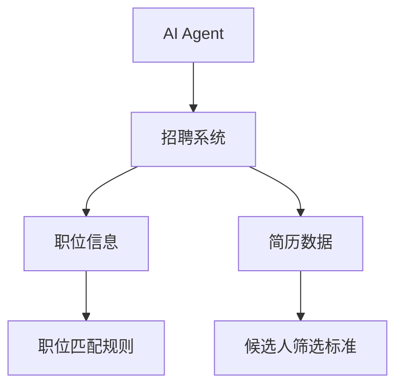
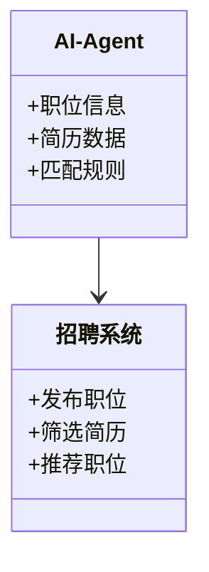
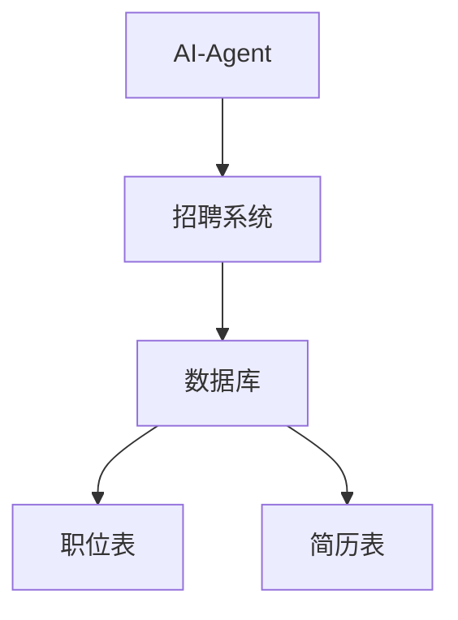

                 


# AI Agent在智能招聘系统中的应用

> 关键词：AI Agent，智能招聘系统，自然语言处理，机器学习，协同过滤算法

> 摘要：本文系统地探讨了AI Agent在智能招聘系统中的应用，涵盖核心概念、算法原理、系统架构设计以及项目实战，深入分析了AI Agent如何提升招聘效率和精准度。

---

## 第1章: AI Agent与智能招聘系统概述

### 1.1 AI Agent的定义与特点

#### 1.1.1 AI Agent的定义
AI Agent是一种智能主体，能够感知环境、自主决策并执行任务，具备学习和适应能力，能够在复杂环境中优化目标达成。

#### 1.1.2 AI Agent的核心特点
- **自主性**：无需外部干预，自主完成任务。
- **反应性**：实时感知环境变化并做出响应。
- **学习能力**：通过数据和反馈不断优化行为。
- **社交能力**：能够与其他系统或用户进行交互协作。

#### 1.1.3 AI Agent与传统AI的区别
| 特性 | AI Agent | 传统AI |
|------|-----------|---------|
| 行为 | 主动执行任务 | 被动处理数据 |
| 学习 | 自主学习 | 预先编程 |
| 适应性 | 高 | 低 |

### 1.2 智能招聘系统的定义与特点

#### 1.2.1 智能招聘系统的定义
智能招聘系统利用AI技术，通过数据挖掘、自然语言处理等方法，自动匹配候选人和职位，优化招聘流程。

#### 1.2.2 智能招聘系统的核心功能
- 职位发布与管理
- 简历自动筛选
- 职位推荐
- 背景调查
- 面试安排

#### 1.2.3 智能招聘系统的发展趋势
- 自动化程度提高
- 数据分析深度增强
- 人机协作优化用户体验

### 1.3 AI Agent在智能招聘中的应用背景

#### 1.3.1 招聘行业的现状与挑战
- 招聘流程繁琐，效率低下
- 人才匹配精准度不足
- 企业招聘成本高

#### 1.3.2 AI Agent在招聘中的潜在价值
- 提高招聘效率
- 增强人才匹配精准度
- 降低招聘成本

#### 1.3.3 应用场景与边界
- **场景**：简历筛选、职位推荐、面试安排
- **边界**：不涉及实际决策，如offer发放，仅提供辅助建议

---

## 第2章: AI Agent的核心概念与联系

### 2.1 AI Agent的核心概念原理

#### 2.1.1 感知层
- **定义**：处理输入数据，识别环境中的相关信息。
- **技术**：自然语言处理、数据挖掘。
- **作用**：提取职位描述和简历中的关键信息。

#### 2.1.2 决策层
- **定义**：基于感知层的信息，做出推荐或决策。
- **技术**：机器学习模型，如协同过滤算法。
- **作用**：匹配候选人与职位，优化推荐结果。

#### 2.1.3 执行层
- **定义**：根据决策层的结果，执行具体操作。
- **技术**：自动化系统，如自动发送邮件。
- **作用**：触发招聘流程中的具体步骤，如发送邀请邮件。

### 2.2 核心概念属性特征对比表

| 概念 | 属性 | 特征 |
|------|------|------|
| 感知层 | 数据处理 | 自然语言处理、数据挖掘 |
| 决策层 | 算法选择 | 机器学习、推荐算法 |
| 执行层 | 动作执行 | 自动化操作、反馈机制 |

### 2.3 ER实体关系图



---

## 第3章: AI Agent的算法原理

### 3.1 感知层算法

#### 3.1.1 自然语言处理
- **词嵌入模型**：将文本转化为向量表示。
  $$\text{词向量表示} = \text{输入文本} \rightarrow \text{词向量}$$

#### 3.1.2 数据挖掘
- **聚类算法**：将数据分成相似的簇。
  $$\text{聚类结果} = \text{数据输入} \rightarrow \text{聚类中心}$$

### 3.2 决策层算法

#### 3.2.1 机器学习模型
- **协同过滤算法**：基于用户行为推荐相似职位。
  $$\text{推荐结果} = \text{用户行为} \rightarrow \text{相似用户}$$

---

## 第4章: 系统分析与架构设计

### 4.1 系统功能设计

#### 4.1.1 领域模型



#### 4.1.2 系统架构



---

## 第5章: 项目实战

### 5.1 环境配置

- **技术栈**：Python、TensorFlow、Flask
- **工具**：Jupyter Notebook，Git

### 5.2 代码实现

#### 5.2.1 感知层代码

```python
import tensorflow as tf
model = tf.keras.Sequential([
    tf.keras.layers.Dense(128, activation='relu'),
    tf.keras.layers.Dense(10, activation='softmax')
])
```

#### 5.2.2 决策层代码

```python
from sklearn.metrics.pairwise import cosine_similarity
def get_recommendations(user_vector, item_matrix):
    similarities = cosine_similarity(user_vector, item_matrix)
    return np.argsort(similarities, axis=1)[:, ::-1]
```

### 5.3 案例分析

#### 5.3.1 应用场景

- **简历筛选**：通过自然语言处理提取关键词，匹配职位要求。
- **职位推荐**：基于协同过滤算法，推荐适合职位。

#### 5.3.2 实施效果

- **效率提升**：自动化筛选和推荐，节省时间。
- **精准度提高**：算法优化匹配，降低错误率。

---

## 第6章: 总结与展望

### 6.1 总结

- AI Agent在智能招聘系统中的应用显著提升了效率和精准度。
- 通过感知、决策、执行三层架构，优化招聘流程。

### 6.2 未来展望

- **技术进步**：更复杂的模型如BERT，提升处理能力。
- **应用场景扩展**：AI Agent在招聘中的应用将更加广泛，如面试安排、背景调查。
- **伦理与隐私**：数据安全和隐私保护是未来的重要挑战。

---

通过以上章节，我们系统地介绍了AI Agent在智能招聘系统中的应用，从理论到实践，为读者提供了全面的视角。

