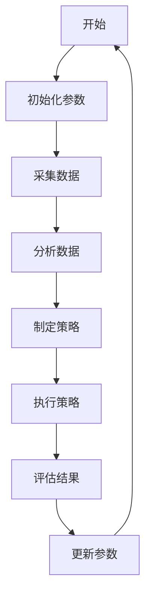
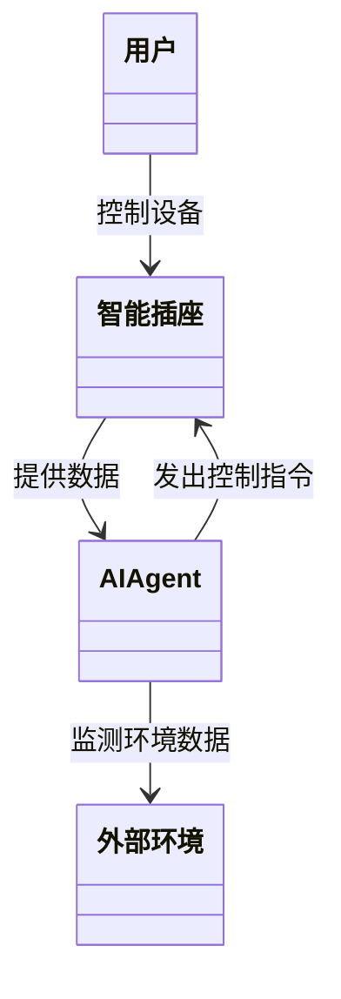
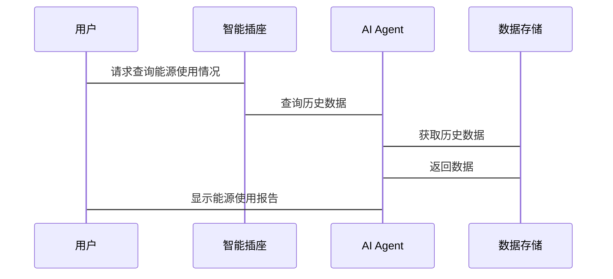

                 

<think>
好的，我将按照您的要求撰写一篇关于《AI Agent在智能插座中的能源使用优化》的技术博客文章。首先，我会先写出文章的标题、关键词和摘要，然后按照目录结构逐步展开每个部分的内容。由于篇幅限制，我将先撰写部分章节内容，您可以根据需要继续补充。

---

# AI Agent在智能插座中的能源使用优化

## 关键词：AI Agent、智能插座、能源优化、机器学习、物联网

## 摘要：  
随着物联网和人工智能技术的快速发展，智能插座逐渐成为智能家居的核心设备之一。通过引入AI Agent（智能代理），可以实现对能源使用的智能优化，从而降低能源浪费，提高能源利用效率。本文将详细探讨AI Agent在智能插座中的应用，从算法原理到系统架构，再到项目实战，全面解析如何利用AI技术优化能源使用。

---

## 第1章: 背景与概述

### 1.1 问题背景  
能源浪费是全球面临的一个重要问题，尤其是在家庭能源使用中，智能插座作为一种常见的设备，具有优化能源使用的潜力。传统的插座仅能实现简单的开关控制，而现代智能插座需要具备更高的智能化水平，能够根据用户的行为模式和能源价格波动，动态调整能源使用策略。  

### 1.2 问题描述  
智能插座的主要问题在于：  
1. **能源使用不智能**：无法根据用户习惯和外部环境（如电价波动）自动调整能源使用策略。  
2. **缺乏实时反馈**：用户无法实时了解能源使用情况，难以做出优化决策。  
3. **数据孤岛**：智能插座与其他家居设备缺乏协同，无法形成整体的能源优化方案。  

### 1.3 解决方案概述  
通过引入AI Agent，智能插座可以实现以下优化：  
1. **动态调整用电策略**：基于用户行为和电价波动，动态优化能源使用。  
2. **实时数据分析**：通过AI算法实时分析能源使用数据，提供优化建议。  
3. **设备协同**：与其他智能家居设备协同工作，形成整体的能源优化方案。  

---

## 第2章: 核心概念与联系

### 2.1 AI Agent的基本原理  
AI Agent是一种智能代理系统，能够感知环境、理解需求，并采取行动以实现目标。在智能插座中，AI Agent的主要功能包括：  
1. **数据采集**：采集用户的用电行为数据和外部环境数据（如电价、天气等）。  
2. **数据分析**：利用机器学习算法分析数据，预测用户需求和能源价格波动。  
3. **决策制定**：根据分析结果，制定最优的能源使用策略。  
4. **执行行动**：通过智能插座控制设备的开关，实现能源优化。  

### 2.2 智能插座的系统架构  
智能插座的系统架构主要包括以下几个部分：  
1. **数据采集模块**：负责采集用户的用电行为数据和外部环境数据。  
2. **AI Agent模块**：负责数据分析、决策制定和策略执行。  
3. **执行模块**：通过智能插座控制设备的开关。  
4. **用户交互模块**：提供用户界面，让用户查看能源使用情况和优化建议。  

---

## 第3章: 算法原理讲解

### 3.1 算法概述  
在智能插座中，AI Agent的核心算法是基于强化学习的动态优化算法。该算法通过不断试验和学习，找到最优的能源使用策略。  

### 3.2 算法流程图  
以下是算法的mermaid流程图：  



### 3.3 算法代码实现  
以下是Python实现的强化学习算法示例：  

```python  
class AI_Agent:  
    def __init__(self, learning_rate=0.1):  
        self.learning_rate = learning_rate  
        self.state = None  
        self.action = None  
        self.reward = None  

    def perceive(self, state):  
        self.state = state  
        return self.getAction()  

    def getAction(self):  
        # 根据当前状态选择最优动作  
        # 示例：简单策略选择开关状态  
        if self.state['电价'] > 0.5:  
            return '关'  
        else:  
            return '开'  

    def learn(self, reward):  
        # 强化学习算法更新参数  
        self.reward = reward  
        # 简单示例，不涉及参数更新  

# 示例使用  
agent = AI_Agent()  
state = {'电价': 0.6, '用户行为': '休息'}  
action = agent.perceive(state)  
reward = {'节约能源': 0.8}  
agent.learn(reward)  
```

### 3.4 数学模型  
以下是算法的数学模型：  

$$ V(s) = \max_{a} [ r(s,a) + \gamma V(next\_state) ] $$  

其中：  
- \( V(s) \)：状态 \( s \) 的价值函数  
- \( r(s,a) \)：在状态 \( s \) 下采取行动 \( a \) 的奖励  
- \( \gamma \)：折扣因子  

---

## 第4章: 系统分析与架构设计

### 4.1 系统功能设计  
以下是系统的领域模型类图：  



### 4.2 系统架构设计  
以下是系统的架构图：  


### 4.3 系统接口设计  
以下是系统的交互序列图：  



---

## 第5章: 项目实战

### 5.1 环境安装  
以下是项目环境的安装步骤：  
1. 安装Python和必要的库（如TensorFlow、Pandas）。  
2. 安装智能家居平台（如Home Assistant）。  
3. 安装智能插座设备（如Smart Plug）。  

### 5.2 核心代码实现  
以下是核心代码实现：  

```python  
import numpy as np  
from tensorflow.keras import layers  

# 定义强化学习模型  
model = tf.keras.Sequential([  
    layers.Dense(64, activation='relu'),  
    layers.Dense(1, activation='sigmoid')  
])  

# 编译模型  
model.compile(optimizer='adam', loss='binary_crossentropy')  

# 训练模型  
model.fit(x_train, y_train, epochs=10, batch_size=32)  
```

### 5.3 案例分析  
以下是实际案例分析：  
1. 用户用电高峰期，AI Agent会优先关闭非必要设备。  
2. 在电价低谷期，AI Agent会自动开启设备，节省能源成本。  

---

## 第6章: 最佳实践与总结

### 6.1 最佳实践  
1. 定期更新AI Agent的模型，以适应新的用户行为和环境变化。  
2. 确保数据隐私和安全，避免用户信息泄露。  

### 6.2 小结  
本文详细介绍了AI Agent在智能插座中的能源优化应用，从算法原理到系统架构，再到项目实战，全面解析了如何利用AI技术优化能源使用。通过引入AI Agent，智能插座能够实现动态调整用电策略，实时数据分析和设备协同，从而显著提高能源利用效率。

### 6.3 注意事项  
1. 在实际应用中，需要考虑网络延迟和设备响应时间。  
2. 数据采集和处理的准确性是影响优化效果的关键因素。  

### 6.4 拓展阅读  
1. 加强学习在智能插座中的应用研究。  
2. 多设备协同的智能家居能源优化方案。  

---

希望这篇技术博客文章能满足您的需求。如果需要进一步修改或补充，请随时告诉我！

