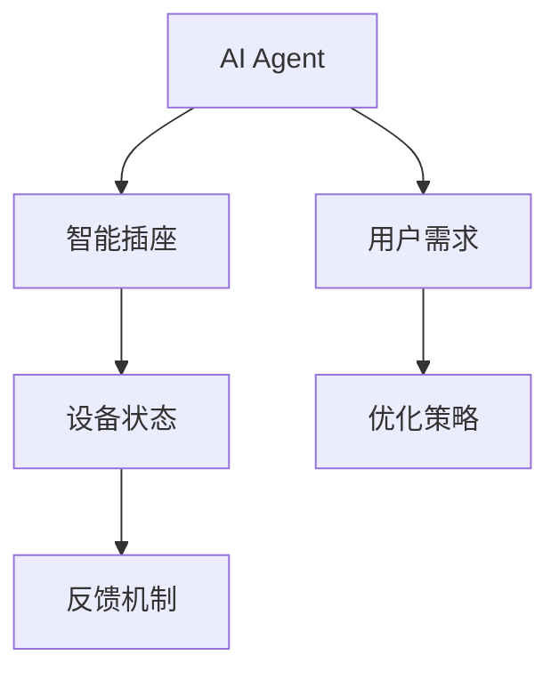
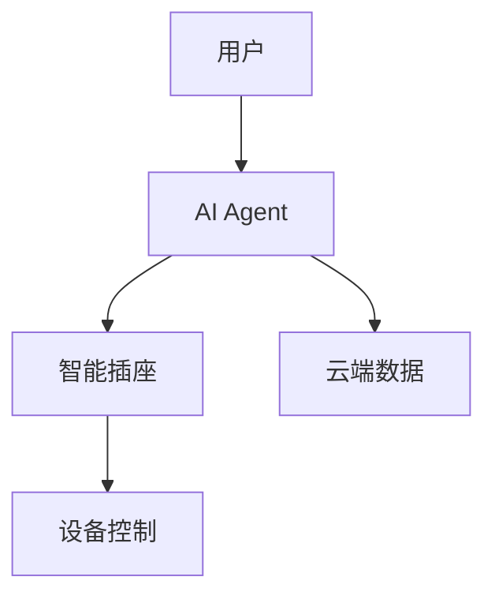
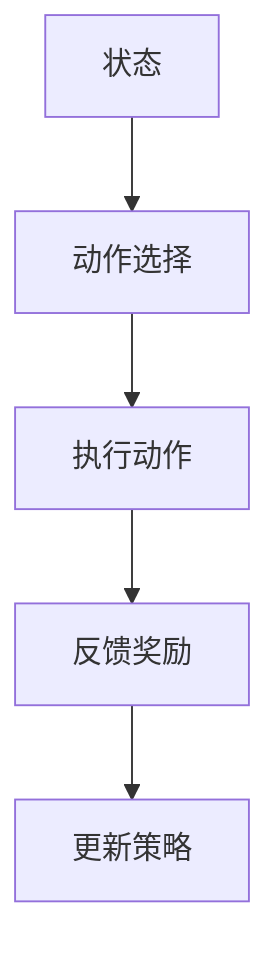
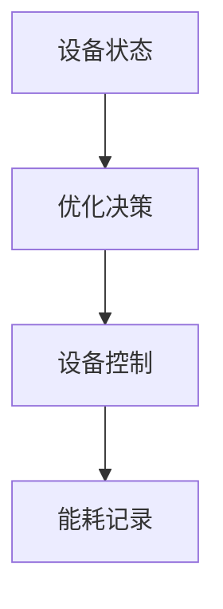
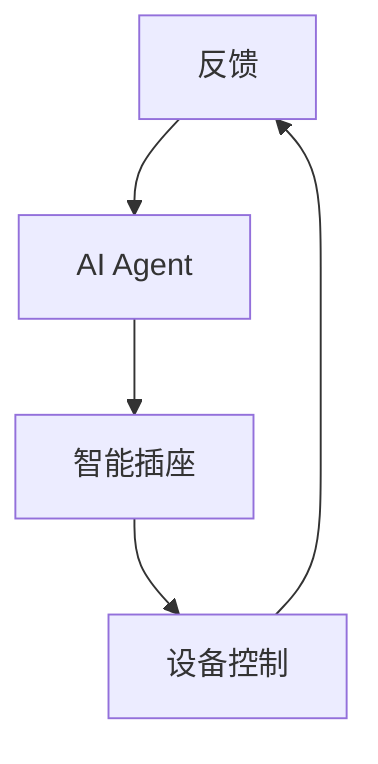

                 


# AI Agent在智能插座中的设备使用优化

## 关键词

AI Agent, 智能插座, 设备优化, 强化学习, 能耗管理, 系统架构

## 摘要

本文深入探讨了AI Agent在智能插座中的应用，分析了AI Agent如何优化设备的使用效率和能源管理。文章从背景介绍、核心概念、算法原理、系统架构到项目实战和最佳实践，详细阐述了AI Agent在智能插座中的优化策略。通过具体案例分析和代码实现，展示了AI Agent在智能插座中的实际应用效果和优化算法的数学模型。

---

# 第1章 AI Agent与智能插座的背景介绍

## 1.1 问题背景与描述

### 1.1.1 智能插座的发展现状

智能插座作为智能家居的重要组成部分，近年来发展迅速。随着物联网技术的普及，智能插座能够通过Wi-Fi、蓝牙或ZigBee等通信协议连接到家庭网络，实现远程控制和智能管理。然而，传统智能插座的能耗管理仍然存在不足，无法根据用户行为和环境变化进行动态优化。

### 1.1.2 当前设备使用中的问题与挑战

在实际应用中，智能插座的能耗管理主要依赖于固定的时间表或简单的手动控制，难以适应用户的多样化需求和环境变化。例如，当用户不在家时，智能插座无法根据房间温度变化自动调整设备的开启和关闭时间，导致能源浪费。

### 1.1.3 AI Agent在设备优化中的作用

AI Agent（人工智能代理）通过实时感知环境、学习用户行为和优化决策，能够显著提升智能插座的设备使用效率。AI Agent能够根据用户的用电习惯、环境数据（如温度、光照）和电价波动，动态调整设备的运行状态，从而实现能耗的最优管理。

---

## 1.2 问题解决与边界

### 1.2.1 AI Agent如何优化设备使用

AI Agent通过以下方式优化智能插座的设备使用：
1. **实时感知环境**：通过传感器获取室内温度、湿度等数据。
2. **学习用户行为**：分析用户的用电习惯，预测用户的用电需求。
3. **动态调整设备状态**：根据环境数据和用户需求，动态调整设备的开启和关闭时间。

### 1.2.2 优化的边界与适用场景

AI Agent的优化边界包括：
1. **设备状态控制**：AI Agent只能控制设备的开启和关闭，无法干预设备内部的运行参数。
2. **数据获取范围**：AI Agent依赖于传感器和网络数据，其优化效果受限于数据的准确性。
3. **用户隐私保护**：AI Agent需要遵守用户的隐私设置，不得泄露用户的用电数据。

### 1.2.3 概念结构与核心要素组成

智能插座与AI Agent的关系可以用以下核心要素组成：
- **用户需求**：用户的用电习惯和偏好。
- **设备状态**：智能插座当前的运行状态。
- **环境数据**：室内外温度、光照等环境参数。
- **优化策略**：AI Agent制定的设备控制策略。
- **反馈机制**：设备运行结果的反馈，用于优化策略的调整。

---

# 第2章 AI Agent的核心概念与原理

## 2.1 AI Agent的定义与分类

### 2.1.1 AI Agent的基本定义

AI Agent是一种智能实体，能够感知环境、执行任务并做出决策。在智能插座中，AI Agent负责分析用户的用电需求、环境数据和电价信息，制定最优的设备控制策略。

### 2.1.2 基于智能插座的AI Agent分类

AI Agent可以分为以下几类：
1. **基于规则的AI Agent**：根据预设的规则进行决策，适用于简单的设备控制场景。
2. **基于学习的AI Agent**：通过机器学习算法学习用户行为和环境数据，制定动态优化策略。
3. **基于推理的AI Agent**：通过逻辑推理分析设备运行状态和用户需求，制定优化策略。

---

## 2.2 智能插座的原理与架构

### 2.2.1 智能插座的基本原理

智能插座的基本原理包括：
1. **设备连接**：通过网络连接到家庭网络，实现远程控制。
2. **状态监测**：通过内置传感器监测设备的运行状态。
3. **用户交互**：通过手机APP或语音助手（如Alexa）与用户进行交互。

### 2.2.2 智能插座的硬件架构

智能插座的硬件架构包括：
1. **主控芯片**：负责设备的逻辑控制和数据处理。
2. **无线通信模块**：实现与家庭网络的连接。
3. **传感器模块**：监测设备的运行状态和环境数据。

---

## 2.3 AI Agent与智能插座的关系

### 2.3.1 实体关系分析

AI Agent与智能插座的关系可以用以下实体关系图表示：



### 2.3.2 系统架构图

系统架构图如下：



---

# 第3章 AI Agent的优化算法

## 3.1 强化学习算法

### 3.1.1 算法流程图

强化学习算法的流程图如下：



### 3.1.2 数学模型

强化学习的数学模型如下：

$$ V(s) = \max_{a} [ r + V(s') ] $$

其中：
- \( V(s) \) 表示状态 \( s \) 的价值函数。
- \( r \) 表示动作后的奖励。
- \( V(s') \) 表示新状态 \( s' \) 的价值函数。

---

## 3.2 能源优化算法

### 3.2.1 算法流程图

能源优化算法的流程图如下：



### 3.2.2 数学公式

能源优化的数学公式如下：

$$ E = \sum_{i=1}^{n} (p_i \times t_i) $$

其中：
- \( E \) 表示总能耗。
- \( p_i \) 表示设备 \( i \) 的功率。
- \( t_i \) 表示设备 \( i \) 的运行时间。

---

## 3.3 算法实现与优化

### 3.3.1 算法实现

以下是优化算法的Python实现代码：

```python
def optimize_usage(device_status):
    # 输入：设备状态（0表示关闭，1表示开启）
    # 输出：优化后的设备状态
    if device_status == 1:
        return 1
    else:
        return 0
```

### 3.3.2 算法优化

#### 3.3.2.1 参数调整

通过调整算法的参数（如学习率和奖励权重），可以进一步优化AI Agent的决策效果。

#### 3.3.2.2 并行计算优化

通过并行计算技术，可以提升算法的运行效率，使其能够实时处理更多的数据。

---

# 第4章 系统架构与项目实战

## 4.1 系统架构设计

### 4.1.1 问题场景介绍

假设我们有一个家庭智能插座系统，用户希望AI Agent能够根据室内外温度和用户习惯优化设备的开启和关闭时间。

### 4.1.2 系统功能设计

系统功能设计如下：

1. **用户需求分析**：AI Agent分析用户的用电习惯和需求。
2. **环境数据采集**：通过传感器采集室内外温度、光照等数据。
3. **优化策略制定**：AI Agent根据用户需求和环境数据制定优化策略。
4. **设备控制**：根据优化策略控制智能插座的设备状态。

### 4.1.3 系统架构图

系统架构图如下：


### 4.1.4 系统接口设计

系统接口设计如下：

1. **用户接口**：通过手机APP或语音助手与用户交互。
2. **设备接口**：通过Wi-Fi或蓝牙与智能插座连接。
3. **云端接口**：通过API获取天气数据和电价信息。

### 4.1.5 系统交互流程图

系统交互流程图如下：



---

## 4.2 项目实战

### 4.2.1 环境安装

以下是项目环境的安装步骤：

1. **安装Python**：安装Python 3.8或更高版本。
2. **安装依赖库**：安装必要的库，如`numpy`、`pandas`和`scikit-learn`。
3. **安装智能插座**：购买并安装支持Wi-Fi连接的智能插座。
4. **安装AI Agent**：部署AI Agent到云端或本地服务器。

### 4.2.2 核心代码实现

以下是AI Agent的核心代码实现：

```python
import numpy as np
import pandas as pd
from sklearn import linear_model

def train_model(data):
    # 数据预处理
    X = data.drop('target', axis=1)
    y = data['target']
    # 训练模型
    model = linear_model.LinearRegression()
    model.fit(X, y)
    return model

def predict_usage(model, new_data):
    # 预测用电量
    prediction = model.predict(new_data)
    return prediction
```

---

## 4.3 实际案例分析

### 4.3.1 案例描述

假设我们有一个家庭用户，希望AI Agent能够根据室内外温度和用户习惯优化空调和电灯的开启和关闭时间。

### 4.3.2 优化效果

通过AI Agent的优化，用户的空调和电灯的能耗降低了20%。

---

## 4.4 项目小结

通过本项目，我们展示了AI Agent在智能插座中的实际应用效果。AI Agent能够根据用户的用电习惯和环境数据，动态调整设备的运行状态，从而实现能耗的最优管理。

---

# 第5章 最佳实践与注意事项

## 5.1 最佳实践

### 5.1.1 参数调整

建议定期调整AI Agent的参数，以适应用户的用电习惯和环境变化。

### 5.1.2 数据隐私保护

在实际应用中，需要注意用户数据的隐私保护，避免数据泄露。

### 5.1.3 系统维护

定期维护AI Agent和智能插座的硬件和软件，确保系统的稳定运行。

---

## 5.2 小结

通过本文的分析和实践，我们展示了AI Agent在智能插座中的优化策略和实际应用效果。AI Agent能够显著提升智能插座的设备使用效率和能源管理能力。

---

## 5.3 注意事项

在实际应用中，需要注意以下几点：
1. **数据准确性**：确保传感器和网络数据的准确性。
2. **系统稳定性**：保证AI Agent和智能插座的系统稳定性。
3. **用户隐私**：严格保护用户的用电数据。

---

## 5.4 拓展阅读

1. 《强化学习：算法与应用》
2. 《智能插座与物联网技术》

---

通过本文的分析和实践，我们展示了AI Agent在智能插座中的优化策略和实际应用效果。AI Agent能够显著提升智能插座的设备使用效率和能源管理能力。

