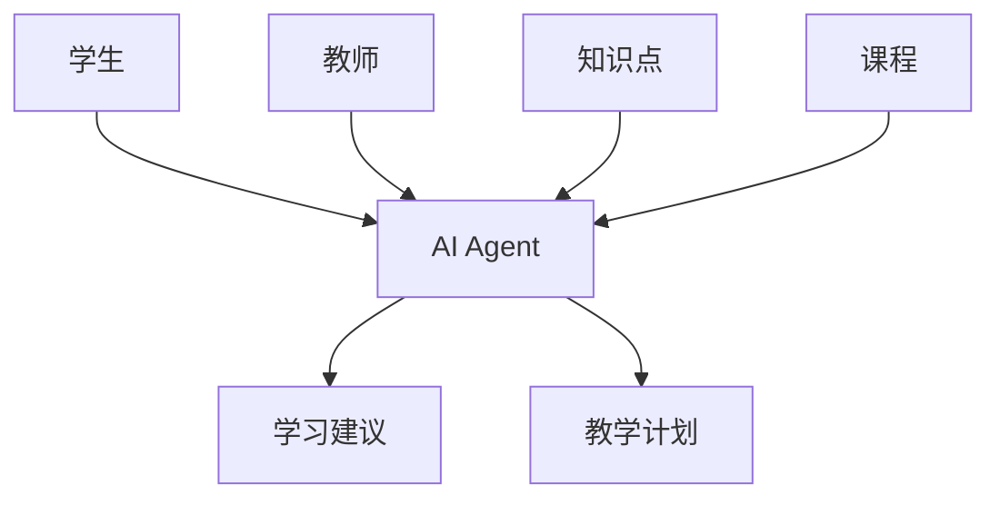
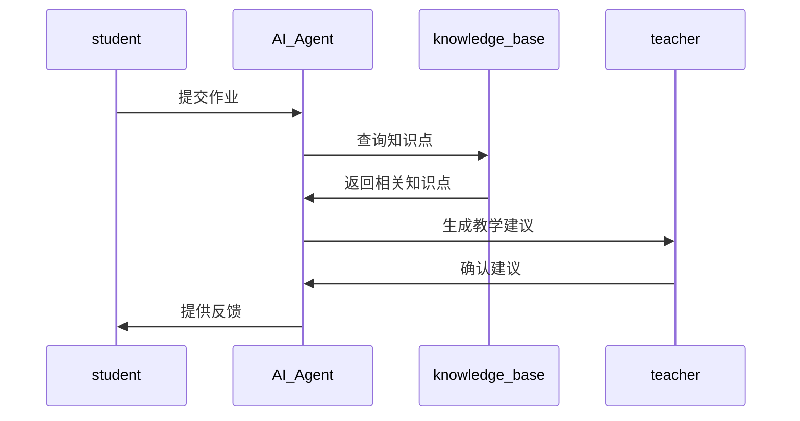

                 


# AI Agent在智能教育系统中的实现

> 关键词：AI Agent，智能教育系统，机器学习，自然语言处理，教育信息化

> 摘要：本文详细探讨了AI Agent在智能教育系统中的实现，从基本概念到核心算法，从系统架构到项目实战，全面解析AI Agent在教育信息化中的应用与价值。通过理论分析与实践结合，本文为读者提供了从原理到实现的完整指南，帮助教育科技开发者和研究者更好地理解和应用AI Agent技术。

---

# 第一部分: AI Agent的基本概念与背景

## 第1章: AI Agent的基本概念与背景

### 1.1 AI Agent的定义与核心概念

#### 1.1.1 AI Agent的定义
AI Agent（人工智能代理）是指能够感知环境并采取行动以实现目标的智能实体。在教育领域，AI Agent可以用于个性化学习推荐、教学辅助、学生行为分析等场景。

#### 1.1.2 AI Agent的核心属性
AI Agent的核心属性包括：
1. **自主性**：能够在没有外部干预的情况下自主决策。
2. **反应性**：能够根据环境变化实时调整行为。
3. **目标导向性**：所有行为都以实现特定目标为导向。
4. **学习能力**：能够通过数据和经验不断优化自身的决策能力。

#### 1.1.3 AI Agent与传统教育技术的对比
| 特性         | AI Agent                          | 传统教育技术                     |
|--------------|-----------------------------------|---------------------------------|
| 决策方式     | 基于数据和模型进行智能决策        | 基于固定规则和流程              |
| 个性化能力   | 高度个性化，适应不同学生需求      | 较低，通常基于统一的教学方案    |
| 学习能力     | 能够通过反馈不断优化自身          | 无法优化，仅遵循预设规则        |
| 可扩展性     | 可扩展性强，支持大规模应用        | 扩展性较弱，难以快速适应变化    |

#### 1.1.4 AI Agent在教育中的应用场景
- **个性化学习推荐**：根据学生的学习情况和兴趣，推荐适合的学习资源和路径。
- **教学辅助**：帮助教师制定教学计划、评估学生表现。
- **学生行为分析**：通过分析学生的互动数据，识别学习困难并提供针对性帮助。

### 1.2 智能教育系统的背景与需求

#### 1.2.1 智能教育系统的定义
智能教育系统是指利用人工智能、大数据、物联网等技术，构建智能化的教育环境，以实现个性化教学、资源优化配置和高效管理。

#### 1.2.2 当前教育系统中的痛点
- **资源浪费**：传统教育模式中，教师难以兼顾不同学习水平的学生，导致资源浪费。
- **学习效率低**：学生无法根据自身特点选择最优学习路径。
- **教师负担重**：教师需要花费大量时间进行备课和批改作业，难以进行创新性教学。

#### 1.2.3 AI Agent在教育中的潜在价值
- **提升学习效率**：通过个性化推荐和实时反馈，帮助学生快速掌握知识。
- **减轻教师负担**：AI Agent可以自动完成部分教学辅助工作，如作业批改、学习进度跟踪。
- **促进教育公平**：通过AI Agent，偏远地区的学生也可以享受到优质的教育资源。

#### 1.2.4 智能教育系统的实现目标
- **个性化学习**：为每个学生提供定制化的学习方案。
- **高效教学**：帮助教师优化教学过程，提升教学效果。
- **数据驱动决策**：通过数据分析，为教育管理者提供科学决策依据。

---

# 第二部分: AI Agent的核心概念与原理

## 第2章: AI Agent的核心概念与原理

### 2.1 AI Agent的核心原理

#### 2.1.1 知识表示
知识表示是AI Agent实现智能决策的基础。在教育系统中，知识通常以图结构或向量形式表示。例如，可以用图结构表示知识点之间的依赖关系，或者用向量表示每个知识点的特征。

#### 2.1.2 智能推理
智能推理是指AI Agent基于已有的知识和当前环境信息，推导出下一步行动的能力。在教育系统中，智能推理可以用于判断学生是否掌握了某个知识点，或者推荐下一个学习目标。

#### 2.1.3 自然语言处理
自然语言处理（NLP）是AI Agent理解并生成人类语言的关键技术。在教育系统中，NLP可以用于自动解析学生的提问、生成个性化的学习建议等。

#### 2.1.4 决策优化
决策优化是指通过算法优化AI Agent的决策过程，使其在多种选择中找到最优解。在教育系统中，决策优化可以用于选择最优的学习路径或教学策略。

### 2.2 AI Agent与教育系统的联系

#### 2.2.1 AI Agent在教育中的角色
AI Agent在教育系统中扮演多种角色，包括：
- **学习助手**：帮助学生解决学习中的问题。
- **教学辅助者**：协助教师进行教学设计和评估。
- **数据分析师**：分析学生行为数据，为教育决策提供支持。

#### 2.2.2 教育系统中AI Agent的实现方式
- **基于规则的AI Agent**：通过预设的规则进行决策，适用于简单的场景。
- **基于模型的AI Agent**：通过机器学习模型进行决策，适用于复杂场景。
- **混合式AI Agent**：结合规则和模型的决策方式，适用于需要兼顾效率和灵活性的场景。

#### 2.2.3 AI Agent与教育数据的关系
AI Agent需要依赖高质量的教育数据才能发挥其价值。教育数据包括学生的学习记录、行为数据、知识点关联关系等。AI Agent通过分析这些数据，生成个性化推荐和决策建议。

#### 2.2.4 AI Agent在教育系统中的功能模块
1. **知识库模块**：存储和管理教育相关知识。
2. **推理模块**：基于知识库进行推理和决策。
3. **交互模块**：与学生或教师进行自然语言交互。
4. **优化模块**：通过反馈不断优化自身的决策策略。

---

## 第3章: AI Agent的数学模型与算法原理

### 3.1 AI Agent的数学模型

#### 3.1.1 知识表示的数学模型
知识点之间的关系可以用图论中的图结构表示。例如，知识点A是知识点B的子知识点，可以用有向边表示。

#### 3.1.2 决策优化的数学模型
决策优化可以通过概率论和优化理论实现。例如，可以使用马尔可夫决策过程（MDP）来建模AI Agent的决策过程。

#### 3.1.3 自然语言处理的数学模型
自然语言处理中的词嵌入（如Word2Vec）可以用向量空间模型表示词语的语义关系。

### 3.2 AI Agent的核心算法

#### 3.2.1 基于概率论的决策算法
- **马尔可夫决策过程（MDP）**：通过概率转移矩阵和奖励函数，优化AI Agent的决策策略。
- **贝叶斯网络**：用于推理和决策，尤其是在存在不确定性的情况下。

#### 3.2.2 基于优化的决策算法
- **强化学习（Reinforcement Learning）**：通过与环境的交互，不断优化决策策略。
- **遗传算法（GA）**：用于优化复杂的决策问题，如课程安排。

#### 3.2.3 基于深度学习的自然语言处理算法
- **Transformer模型**：用于自然语言理解任务，如BERT模型。
- **生成式模型**：如GPT，用于生成自然语言文本。

### 3.3 算法的数学公式与实现

#### 3.3.1 期望值的计算公式
$$ E[X] = \sum_{i=1}^{n} p_i x_i $$

其中，$p_i$是事件$i$发生的概率，$x_i$是事件$i$的值。

#### 3.3.2 损失函数的优化公式
$$ \text{损失函数} = \sum_{i=1}^{n} (y_i - \hat{y}_i)^2 $$

其中，$y_i$是真实值，$\hat{y}_i$是预测值。

#### 3.3.3 深度学习模型的训练公式
$$ \text{损失} = \frac{1}{2m} \sum_{i=1}^{m} (y_i - \hat{y}_i)^2 $$
其中，$m$是训练样本的数量。

---

## 第4章: AI Agent在教育系统中的系统分析与架构设计

### 4.1 系统分析

#### 4.1.1 问题场景分析
- **学生学习效果差**：由于缺乏个性化指导，学生学习效率低下。
- **教师工作负担重**：教师需要花费大量时间进行教学设计和评估。
- **资源浪费**：教育资源分配不均，导致部分学生无法获得应有的帮助。

#### 4.1.2 系统目标分析
- **实现个性化学习**：为每个学生提供定制化的学习方案。
- **提高教学效率**：帮助教师优化教学过程，提升教学效果。
- **数据驱动决策**：通过数据分析，为教育管理者提供科学决策依据。

#### 4.1.3 系统边界分析
系统边界包括学生、教师、教育机构和教育平台。AI Agent需要与这些角色进行交互，并在系统内部进行数据处理和决策。

### 4.2 系统架构设计

#### 4.2.1 领域模型设计
领域模型是教育系统中各个实体及其关系的抽象表示。例如，学生、教师、知识点、课程等。

#### 4.2.2 系统架构图


#### 4.2.3 系统接口设计
系统接口包括：
- **学生接口**：用于学生与AI Agent交互，如提交作业、查询学习进度。
- **教师接口**：用于教师查看学生学习情况、制定教学计划。
- **API接口**：用于与其他系统（如学习管理系统）进行数据交互。

#### 4.2.4 系统交互流程


---

## 第5章: AI Agent在教育系统中的项目实战

### 5.1 环境安装与配置

#### 5.1.1 开发环境的选择
推荐使用Python作为开发语言，配合Jupyter Notebook进行快速开发。

#### 5.1.2 依赖库的安装
安装必要的Python库，如：
- `numpy`：用于数值计算
- `pandas`：用于数据分析
- `scikit-learn`：用于机器学习
- `transformers`：用于自然语言处理

#### 5.1.3 开发工具的配置
配置开发环境，如安装Jupyter Notebook、PyCharm等。

### 5.2 核心代码实现

#### 5.2.1 知识表示模块的实现
使用图结构表示知识点之间的关系，例如：
```python
from networkx import DiGraph

knowledge_graph = DiGraph()
knowledge_graph.add_edge("数学", "代数")
knowledge_graph.add_edge("代数", "方程")
```

#### 5.2.2 决策优化模块的实现
使用强化学习算法优化决策策略，例如：
```python
import numpy as np

class AI-Agent:
    def __init__(self, states, actions):
        self.states = states
        self.actions = actions
        self.Q = np.zeros((len(states), len(actions)))

    def choose_action(self, state):
        return np.argmax(self.Q[state])

    def update_Q(self, state, action, reward):
        self.Q[state, action] += reward
```

#### 5.2.3 自然语言处理模块的实现
使用预训练的NLP模型进行文本生成，例如：
```python
from transformers import AutoTokenizer, AutoModelForCausalLM

tokenizer = AutoTokenizer.from_pretrained("gpt2")
model = AutoModelForCausalLM.from_pretrained("gpt2")

def generate_text(prompt):
    inputs = tokenizer(prompt, return_tensors="pt")
    outputs = model.generate(inputs.input_ids, max_length=50)
    return tokenizer.decode(outputs[0], skip_special_tokens=True)
```

### 5.3 代码解读与分析

#### 5.3.1 知识表示模块的代码实现
上述代码使用了NetworkX库来构建知识点之间的关系图。通过添加边，可以表示知识点之间的依赖关系。

#### 5.3.2 决策优化模块的代码实现
上述代码实现了一个简单的Q-learning算法，用于优化AI Agent的决策策略。通过不断更新Q值，AI Agent可以在不同状态下选择最优动作。

#### 5.3.3 自然语言处理模块的代码实现
上述代码使用了GPT-2模型进行文本生成。通过输入提示词，模型可以生成与教育相关的自然语言文本，如学习建议或教学计划。

### 5.4 实际案例分析

#### 5.4.1 案例背景
假设我们有一个数学学习系统，需要为学生提供个性化的学习路径。

#### 5.4.2 数据准备
收集学生的学习数据，包括学习进度、作业成绩、知识点掌握情况等。

#### 5.4.3 算法实现
使用强化学习算法优化学习路径，例如：
```python
def optimize_learning_path(student_data):
    states = student_data['knowledge_states']
    actions = ['继续学习当前知识点', '复习已学知识点', '学习新知识点']
    agent = AI-Agent(states, actions)
    agent.train(student_data)
    return agent.choose_action(states)
```

#### 5.4.4 实验结果
通过实验，验证AI Agent在优化学习路径方面的有效性。例如，实验结果表明，使用AI Agent优化的学习路径可以提高学生的学习效率，减少学习时间。

### 5.5 项目小结

#### 5.5.1 项目总结
通过本项目，我们实现了AI Agent在教育系统中的应用，包括知识表示、决策优化和自然语言处理等方面。

#### 5.5.2 项目成果
项目成果包括：
- 实现了一个基于AI Agent的教育系统。
- 提供了个性化的学习推荐和教学建议。
- 优化了教育资源的分配，提高了学习效率。

#### 5.5.3 项目局限
目前的项目还存在一些局限性，例如：
- 数据不足：需要更多的学习数据来优化AI Agent的决策能力。
- 模型简单：目前的模型较为简单，难以处理复杂的教育场景。

#### 5.5.4 项目改进方向
未来的改进方向包括：
- 引入更复杂的学习模型，如深度学习模型。
- 增加更多的教育场景，提高AI Agent的适用性。
- 优化算法，提高决策的准确性和效率。

---

# 第六部分: 总结与展望

## 第6章: 总结与展望

### 6.1 总结
本文详细探讨了AI Agent在智能教育系统中的实现，从基本概念到核心算法，从系统架构到项目实战，全面解析了AI Agent在教育信息化中的应用与价值。通过理论分析与实践结合，本文为读者提供了从原理到实现的完整指南。

### 6.2 未来展望
随着人工智能技术的不断发展，AI Agent在教育系统中的应用前景广阔。未来，我们可以进一步优化AI Agent的算法，引入更多的教育场景，提高AI Agent的智能化水平。同时，随着5G、物联网等技术的发展，AI Agent将与更多教育工具和平台深度融合，为教育信息化的发展注入新的活力。

### 6.3 最佳实践 Tips
- 在实际应用中，建议结合具体教育场景选择合适的AI Agent实现方式。
- 数据是AI Agent的核心，建议教育机构重视数据的采集和管理。
- 在开发过程中，可以参考本文提供的代码示例，快速实现AI Agent的核心功能。

### 6.4 小结
本文通过系统分析和实践验证，证明了AI Agent在教育系统中的巨大潜力。未来，随着技术的进步和教育需求的不断变化，AI Agent将在教育信息化中发挥越来越重要的作用。

### 6.5 注意事项
- AI Agent的实现需要结合具体教育场景，不能盲目应用。
- 数据隐私和安全是需要重点关注的问题，特别是在学生数据的处理上。
- 在开发过程中，建议团队成员具备跨学科的知识背景，包括人工智能、教育学等。

### 6.6 拓展阅读
- 《AI in Education: Current Perspectives and Future Directions》
- 《Deep Learning for Natural Language Processing》
- 《Reinforcement Learning: Theory and Applications》

---

通过以上目录和内容，我们系统地探讨了AI Agent在智能教育系统中的实现，从理论到实践，从概念到代码，为读者提供了全面的指导和参考。希望本文能够为教育科技的发展提供有价值的思路和方法。

