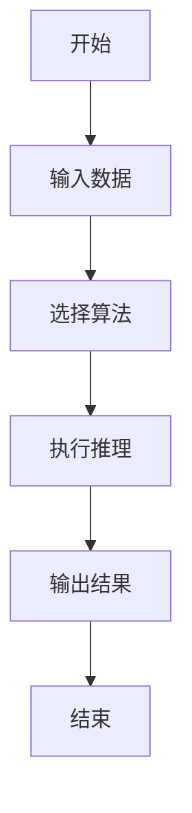
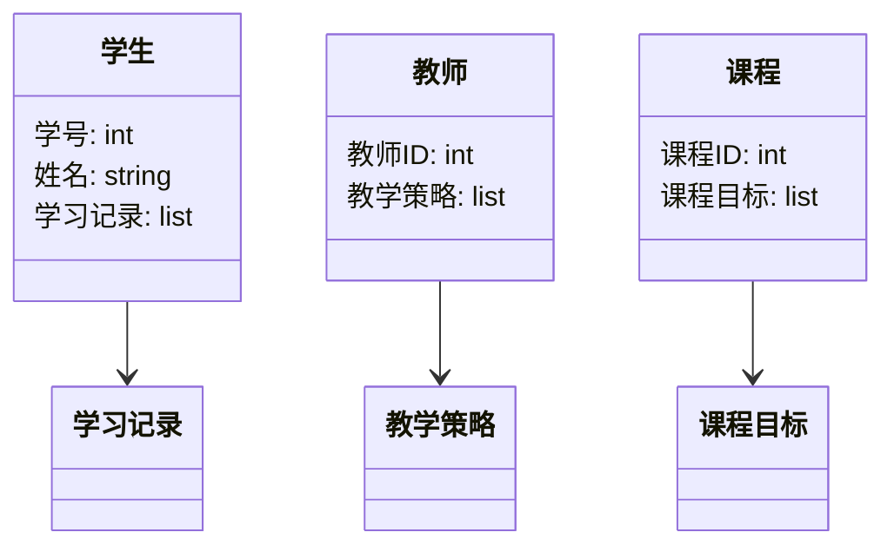
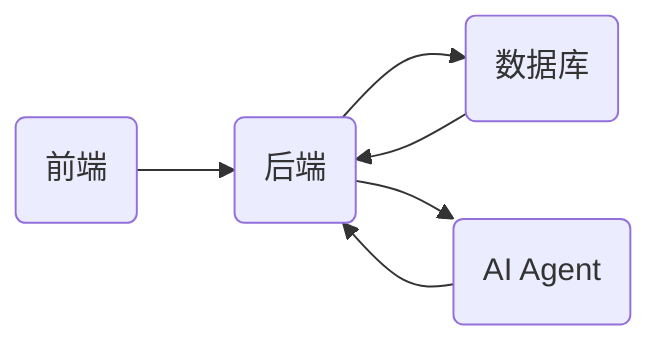
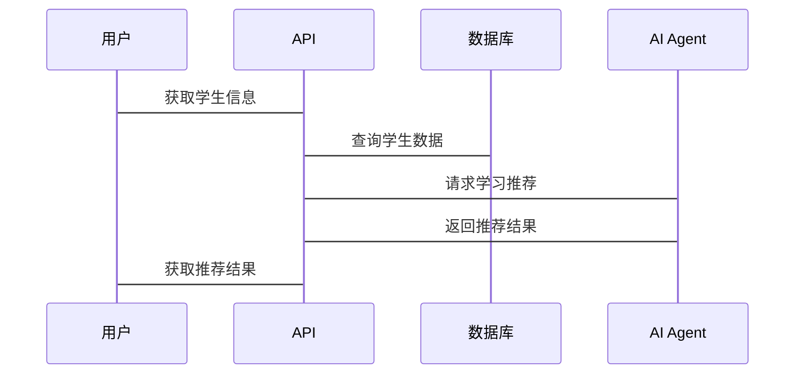

                 


# AI Agent在智能教育系统中的应用

## 关键词：
AI Agent, 智能教育系统, 教育信息化, 个性化学习, 知识表示, 智能推理, 机器学习

## 摘要：
本文探讨AI Agent在智能教育系统中的应用，涵盖其核心概念、算法原理、系统架构及项目实战。通过详细分析，展示AI Agent如何在教育中实现个性化学习、知识表示与推理，以及系统设计与实现，为教育信息化提供新思路。

---

# 第一部分: AI Agent在智能教育系统中的应用概述

## 第1章: AI Agent的基本概念与背景

### 1.1 AI Agent的定义与核心概念

#### 1.1.1 AI Agent的定义
AI Agent（智能体）是指在环境中能够感知并自主行动以实现目标的实体。在教育领域，AI Agent通常用于辅助教学或优化学习体验。

#### 1.1.2 AI Agent的核心特征
- **自主性**：无需外部干预，自主决策。
- **反应性**：能实时感知环境并做出反应。
- **目标导向**：所有行动均以实现特定目标为导向。
- **学习能力**：通过经验改进性能。

#### 1.1.3 AI Agent与智能教育系统的联系
AI Agent作为智能教育系统的核心组件，负责处理数据、提供个性化建议和自动化服务。

### 1.2 智能教育系统的背景

#### 1.2.1 教育信息化的发展历程
从传统教学到数字化、智能化教育，AI Agent推动教育信息化进入新阶段。

#### 1.2.2 智能教育系统的概念
整合AI、大数据等技术，提供智能化教学支持和个性化学习体验。

#### 1.2.3 AI Agent在教育中的潜力
- 个性化学习支持
- 教学决策优化
- 教育资源管理

### 1.3 AI Agent在教育中的应用前景

#### 1.3.1 教学辅助工具
AI Agent帮助教师优化教学策略，提供实时反馈。

#### 1.3.2 学生个性化学习支持
根据学生特点，定制学习计划，推荐学习资源。

#### 1.3.3 教育管理与决策优化
利用AI Agent进行数据分析，辅助教育管理者制定政策。

---

## 第2章: AI Agent的核心概念与联系

### 2.1 AI Agent的原理

#### 2.1.1 知识表示
将知识以符号或框架形式表示，便于AI Agent理解和推理。

#### 2.1.2 智能推理
通过逻辑推理或机器学习模型，推导出新的知识。

#### 2.1.3 行为决策
基于推理结果，选择最优行动方案。

### 2.2 AI Agent的属性特征对比

| 属性 | 特征 |
|------|------|
| 自主性 | 高   |
| 反应性 | 强   |
| 目标导向 | 明确 |
| 学习能力 | 可扩展 |

### 2.3 ER实体关系图

```mermaid
erd
  图表标题：AI Agent ER图

  学生 ----N--> 学习记录
  教师 ----N--> 教学策略
  课程 ----1--> 课程目标
  学习目标 ----M--> 知识点
  AI Agent ----N--> 学习反馈
```

---

## 第3章: AI Agent的算法原理

### 3.1 算法概述

#### 3.1.1 基于规则的推理
定义一系列规则，根据输入数据匹配规则，得出结论。

#### 3.1.2 强化学习
通过奖励机制，优化行动策略。

#### 3.1.3 深度学习
利用神经网络模型，学习复杂模式。

### 3.2 算法流程图



### 3.3 算法实现

#### 基于规则的推理代码示例

```python
def rule_based_inference(input_data):
    if input_data['score'] > 80:
        return '优秀'
    elif input_data['score'] > 70:
        return '良好'
    else:
        return '需改进'
```

---

## 第4章: 数学模型与公式

### 4.1 知识表示模型

#### 概率论在推荐系统中的应用
计算学生对课程的偏好概率：

$$ P(\text{选择课程} | \text{兴趣}) = \frac{\text{历史选择次数}}{\text{总选择次数}} $$

#### 逻辑回归模型
预测学生的学习成绩：

$$ P(y=1|x) = \frac{e^{\beta x}}{1 + e^{\beta x}} $$

#### 神经网络模型
多层感知机（MLP）结构：

$$ y = \sigma(Wx + b) $$

其中，σ为激活函数，W为权重矩阵，b为偏置。

---

## 第5章: 系统分析与架构设计

### 5.1 问题场景介绍

#### 教学辅助工具
帮助教师分析学生成绩，优化教学策略。

#### 学生个性化学习
根据学生特点，推荐适合的学习资源。

### 5.2 系统功能设计

#### 领域模型Mermaid类图



### 5.3 系统架构设计

#### Mermaid架构图



### 5.4 系统接口与交互

#### 接口设计
- `/api/student_info`：获取学生信息
- `/api/recommend_course`：推荐课程

#### 序列图



---

## 第6章: 项目实战

### 6.1 环境安装

#### 安装Python与库
```bash
pip install python-mermaid matplotlib numpy
```

### 6.2 核心代码实现

#### 教学辅助工具代码
```python
import numpy as np

def analyze_students(students_data):
    # 计算平均成绩
    avg_score = np.mean(students_data['score'])
    return f"平均成绩为：{avg_score:.2f}"
```

#### 学生个性化学习代码
```python
def recommend_courses(student_info, courses):
    # 基于兴趣推荐
    interests = student_info['interests']
    recommended = []
    for course in courses:
        if course['category'] in interests:
            recommended.append(course)
    return recommended
```

### 6.3 代码解读与分析

#### 功能模块分析
- `analyze_students`：分析学生整体表现。
- `recommend_courses`：根据学生兴趣推荐课程。

### 6.4 实际案例分析
以一名成绩中等的学生为例，AI Agent分析其学习特点，推荐适合的课程和学习资源。

---

## 第7章: 最佳实践

### 7.1 小结
本文详细探讨了AI Agent在智能教育系统中的应用，从理论到实践，展示了其在教育中的潜力。

### 7.2 注意事项
- 数据隐私保护
- 算法可解释性
- 系统稳定性

### 7.3 拓展阅读
推荐阅读《机器学习实战》和《模式识别与机器学习》。

---

# 结语

AI Agent正在改变教育方式，通过智能化手段，提升教育质量和效率。未来，随着技术进步，AI Agent将在教育中发挥更大作用。

