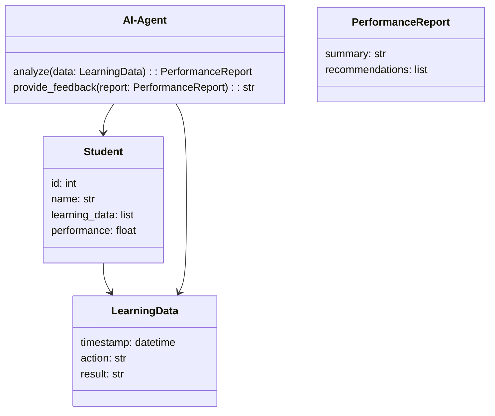

                 


# AI Agent在智能教育评估中的角色

> 关键词：AI Agent, 智能教育评估, 教育技术, 数据驱动评估, 自适应学习

> 摘要：随着人工智能技术的快速发展，AI Agent在教育领域的应用逐渐成为焦点。本文将深入探讨AI Agent在智能教育评估中的角色，分析其在数据驱动评估、个性化学习路径规划以及教育决策支持中的作用。通过结合算法原理、系统架构设计和实际项目案例，本文将详细阐述AI Agent如何通过智能化手段提升教育评估的效率和准确性，为未来的教育创新提供新的思路。

---

## 第一部分: AI Agent在智能教育评估中的背景与概念

### 第1章: 教育评估的现状与挑战

#### 1.1 传统教育评估的局限性

传统教育评估模式主要依赖教师的主观判断，存在以下问题：

- **数据采集有限**：传统评估主要依赖考试成绩和教师观察，缺乏对学生学习行为的全面记录和分析。
- **个性化评估缺失**：每个学生的学习特点和进度不同，传统评估难以实现个性化反馈。
- **效率低下**：教师需要花费大量时间进行评估和反馈，导致评估效率低下。

#### 1.2 教育评估的智能化需求

随着大数据和人工智能技术的发展，教育评估逐渐从传统模式向智能化模式转变。智能化教育评估的需求包括：

- **数据驱动的评估**：通过收集和分析学生的学习数据，实现更精准的评估。
- **个性化学习路径规划**：根据学生的学习情况，提供个性化的学习建议和反馈。
- **实时反馈**：通过实时数据分析，为学生提供即时的学习反馈。

### 第2章: AI Agent的核心概念与优势

#### 2.1 AI Agent的定义与特点

AI Agent是一种智能代理系统，能够根据输入的数据和环境反馈，自动执行任务并做出决策。在教育评估中的特点包括：

- **自动化**：能够自动采集和分析学生数据，无需人工干预。
- **个性化**：能够根据学生的学习情况，提供个性化的评估和反馈。
- **实时性**：能够实时监控学生的学习行为，提供即时反馈。

#### 2.2 AI Agent在教育评估中的角色

AI Agent在教育评估中的角色可以分为以下几个方面：

- **数据采集与处理**：通过传感器和学习平台，采集学生的学习行为数据，如学习时间、答题速度、错误率等。
- **评估与反馈**：基于采集的数据，自动评估学生的学习效果，并提供个性化的反馈和建议。
- **学习路径规划**：根据学生的评估结果，推荐适合的学习资源和学习计划。

---

## 第二部分: AI Agent的算法原理与数学模型

### 第3章: AI Agent的算法原理

#### 3.1 基于规则的AI Agent

基于规则的AI Agent是一种简单的实现方式，通过预定义的规则对数据进行分析和决策。例如：

- 如果学生在某一知识点上的错误率超过50%，则建议加强该知识点的学习。

#### 3.2 基于机器学习的AI Agent

基于机器学习的AI Agent能够通过数据训练模型，自动学习和优化评估策略。常用算法包括：

- **监督学习**：根据标注数据训练模型，预测学生的学习效果。
- **无监督学习**：通过聚类分析，发现学生学习行为中的潜在模式。
- **强化学习**：通过奖励机制，优化AI Agent的决策策略。

#### 3.3 算法流程

以下是基于机器学习的AI Agent算法流程：

1. **数据预处理**：清洗数据，去除噪声，归一化数据。
2. **模型训练**：选择合适的算法，训练模型。
3. **模型评估**：通过测试数据评估模型的准确率、召回率等指标。
4. **模型优化**：根据评估结果，调整模型参数，优化性能。

#### 3.4 算法实现

以下是一个基于监督学习的AI Agent算法实现示例：

```python
import pandas as pd
from sklearn.model_selection import train_test_split
from sklearn.linear_model import LogisticRegression

# 数据加载与预处理
data = pd.read_csv('student_data.csv')
X = data.drop('performance', axis=1)
y = data['performance']

# 数据分割
X_train, X_test, y_train, y_test = train_test_split(X, y, test_size=0.2)

# 模型训练
model = LogisticRegression()
model.fit(X_train, y_train)

# 模型预测
y_pred = model.predict(X_test)

# 模型评估
from sklearn.metrics import accuracy_score
print('Accuracy:', accuracy_score(y_test, y_pred))
```

---

## 第三部分: 系统分析与架构设计

### 第4章: 系统架构设计

#### 4.1 领域模型设计

以下是领域模型的Mermaid类图：



#### 4.2 系统架构设计

以下是系统架构的Mermaid架构图：


---

## 第四部分: 项目实战与案例分析

### 第5章: 项目实战

#### 5.1 环境安装

安装所需的Python库：

```bash
pip install pandas scikit-learn mermaid4jupyter
```

#### 5.2 核心代码实现

以下是AI-Agent的核心代码实现：

```python
import pandas as pd
from sklearn.ensemble import RandomForestClassifier

# 数据加载
data = pd.read_csv('student_data.csv')

# 数据预处理
X = data.drop('performance', axis=1)
y = data['performance']

# 数据分割
X_train, X_test, y_train, y_test = train_test_split(X, y, test_size=0.2)

# 模型训练
model = RandomForestClassifier()
model.fit(X_train, y_train)

# 模型预测
y_pred = model.predict(X_test)

# 模型评估
print('Accuracy:', accuracy_score(y_test, y_pred))
```

#### 5.3 案例分析

以下是一个实际案例分析：

- **问题场景**：某学生在数学课程中的错误率较高。
- **AI-Agent分析**：AI-Agent通过分析学生的学习数据，发现学生在代数部分存在较大困难。
- **解决方案**：AI-Agent推荐相关代数课程资源，并提供针对性的练习题。

---

## 第五部分: 最佳实践与总结

### 第6章: 最佳实践

#### 6.1 小结

通过本文的分析，可以得出以下结论：

- AI Agent能够显著提高教育评估的效率和准确性。
- 数据驱动的评估和个性化学习路径规划是AI Agent在教育评估中的核心应用。

#### 6.2 注意事项

- 数据隐私保护：在采集和处理学生数据时，必须遵守相关隐私保护法规。
- 模型优化：需要不断优化AI Agent的算法，提高评估的准确性和实时性。

#### 6.3 拓展阅读

- 《机器学习在教育中的应用》
- 《智能教育系统设计与实现》

---

通过本文的详细分析，我们可以看到AI Agent在智能教育评估中的巨大潜力。未来，随着人工智能技术的不断发展，AI Agent将在教育评估中发挥更加重要的作用，为教育创新提供更多的可能性。

