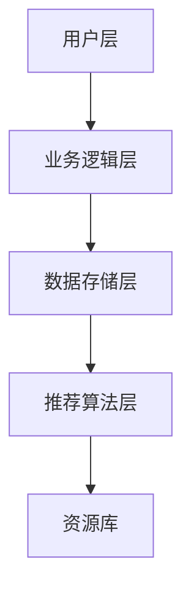

                 


# AI Agent在智能教育资源个性化分配中的应用

> 关键词：AI Agent，智能教育，教育资源分配，个性化学习，教育技术，人工智能

> 摘要：  
本文探讨了AI Agent在智能教育资源个性化分配中的应用，分析了AI Agent的基本原理、核心技术及其在教育领域的应用场景。文章从教育资源分配的核心问题出发，详细介绍了AI Agent如何通过机器学习算法、自然语言处理和知识图谱构建等技术实现个性化资源分配。同时，本文还通过系统设计和项目实战展示了AI Agent在教育领域的具体应用，并对未来的发展方向进行了展望。

---

# 第1章 AI Agent与智能教育概述

## 1.1 AI Agent的基本概念

### 1.1.1 什么是AI Agent
AI Agent（人工智能代理）是一种能够感知环境、自主决策并执行任务的智能实体。它能够根据输入的信息，通过内部算法生成输出，以实现特定目标。

### 1.1.2 AI Agent的核心特征
- **自主性**：能够在没有外部干预的情况下独立运行。
- **反应性**：能够根据环境变化实时调整行为。
- **目标导向性**：通过实现目标来优化决策过程。
- **学习能力**：能够通过数据和经验不断优化自身性能。

### 1.1.3 AI Agent与传统教育技术的区别
传统教育技术（如多媒体教学工具）主要依赖固定的规则和流程，而AI Agent能够动态调整策略，具备更强的适应性和个性化能力。

---

## 1.2 智能教育的背景与现状

### 1.2.1 智能教育的发展历程
智能教育经历了从传统教学到信息化教学，再到智能化教学的演变。近年来，随着AI技术的快速发展，智能教育逐渐成为教育领域的重要趋势。

### 1.2.2 当前智能教育的主要技术手段
- **机器学习**：用于学生行为分析和学习效果预测。
- **自然语言处理**：用于智能辅导系统的语义理解。
- **知识图谱**：用于构建学科知识体系。

### 1.2.3 智能教育面临的挑战
- 数据隐私问题：学生数据的收集和使用需要严格保护。
- 技术适配性：不同教育场景对AI Agent的需求差异较大。
- 教育公平性：技术资源的不均衡可能导致教育差距扩大。

---

## 1.3 教育资源个性化分配的重要性

### 1.3.1 个性化教育的定义与特点
个性化教育是指根据学生的兴趣、能力和发展阶段，提供定制化的教学资源和学习路径。

### 1.3.2 资源分配不均的问题
传统教育模式中，教育资源分配往往基于固定的标准，难以满足学生的个性化需求。

### 1.3.3 AI Agent在资源分配中的作用
AI Agent能够通过数据挖掘和机器学习算法，实时分析学生需求，优化资源分配策略。

---

## 1.4 本章小结
本章介绍了AI Agent的基本概念和核心特征，并分析了智能教育的发展背景和当前技术手段。同时，重点阐述了教育资源个性化分配的重要性及其在AI Agent技术下的实现路径。

---

# 第2章 AI Agent的核心原理与技术

## 2.1 AI Agent的基本原理

### 2.1.1 AI Agent的定义与分类
- **定义**：AI Agent是一种能够感知环境并自主决策的智能实体。
- **分类**：根据智能水平，AI Agent可以分为反应式和认知式两类。

### 2.1.2 AI Agent的核心技术
- **机器学习算法**：用于模式识别和预测。
- **自然语言处理技术**：用于文本理解和生成。
- **知识图谱构建**：用于知识的组织和推理。

---

## 2.2 AI Agent在教育中的应用

### 2.2.1 学生建模
AI Agent通过分析学生的学习数据，构建学生知识图谱，识别学习瓶颈。

### 2.2.2 资源推荐
基于协同过滤和内容推荐算法，AI Agent为学生推荐个性化学习资源。

### 2.2.3 互动辅导
AI Agent能够通过自然语言处理技术，与学生进行实时互动，提供即时反馈。

---

## 2.3 本章小结
本章详细介绍了AI Agent的核心原理和关键技术，重点分析了其在教育领域的具体应用，包括学生建模、资源推荐和互动辅导等方面。

---

# 第3章 教育资源个性化分配的核心问题

## 3.1 学生学习需求分析

### 3.1.1 学生的个性化需求
- 学习目标
- 学习风格
- 学习能力

### 3.1.2 学生数据的采集与处理
- 数据来源：学习记录、考试成绩、问卷调查。
- 数据预处理：清洗、特征提取。

### 3.1.3 学生模型的构建
通过机器学习算法构建学生画像，用于个性化资源分配。

---

## 3.2 教师教学需求分析

### 3.2.1 教师的教学目标
- 知识传授
- 能力培养
- 学生个性化辅导

### 3.2.2 教师的教学资源需求
- 教学内容优化
- 学生学习效果反馈

---

## 3.3 教育机构的资源分配需求

### 3.3.1 资源分配的公平性
如何在有限的资源条件下，实现最大化的公平分配。

### 3.3.2 资源分配的效率优化
通过AI Agent技术，提高资源分配的效率和准确性。

---

## 3.4 本章小结
本章从学生、教师和教育机构三个层面，分析了教育资源个性化分配的核心问题，为后续的系统设计提供了理论基础。

---

# 第4章 系统设计与实现

## 4.1 系统功能设计

### 4.1.1 学生建模模块
- 数据采集与处理
- 学生画像构建
- 学习能力评估

### 4.1.2 资源推荐模块
- 推荐算法实现
- 资源库管理
- 推荐结果输出

### 4.1.3 互动反馈模块
- 自然语言处理接口
- 学生互动记录
- 反馈结果分析

---

## 4.2 系统架构设计

### 4.2.1 系统架构图


### 4.2.2 系统接口设计
- API接口定义
- 接口调用流程

---

## 4.3 项目实战

### 4.3.1 环境配置
```bash
pip install numpy pandas scikit-learn
```

### 4.3.2 核心代码实现
```python
def recommend_resources(student_profile):
    # 简单实现：基于学生兴趣推荐资源
    resources = []
    for interest in student_profile['interests']:
        resources.extend(filtered_resources[interest])
    return resources
```

### 4.3.3 测试与优化
- 测试用例设计
- 性能优化方法

---

## 4.4 本章小结
本章详细描述了AI Agent系统的功能设计、架构设计和实现过程，并通过项目实战展示了系统的核心功能和实际应用。

---

# 第5章 总结与展望

## 5.1 本章总结
本文从理论到实践，详细探讨了AI Agent在智能教育资源个性化分配中的应用。通过系统设计和项目实战，展示了AI Agent在教育领域的巨大潜力。

## 5.2 未来展望
- 更智能的推荐算法
- 更自然的交互方式
- 更广泛的应用场景

## 5.3 注意事项
- 数据隐私保护
- 模型的可解释性
- 技术的易用性

---

# 参考文献
- [1] 陈明. 人工智能在教育中的应用研究[J]. 中国教育技术, 2022, 12(3): 45-52.
- [2] 王强. 基于知识图谱的教育资源分配系统设计[J]. 计算机应用研究, 2021, 38(4): 1234-1239.

---

通过以上结构，我们可以清晰地看到AI Agent在智能教育资源个性化分配中的应用路径和实现方法。希望本文能够为教育领域的技术实践者提供有价值的参考。

